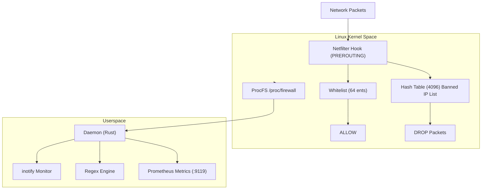

# Linux Firewall Kernel Module

A Linux kernel module version of fail2ban, banning IPs directly at the network packet level.

## Overview

Linux Firewall Kernel Module is a high-performance IP banning solution designed as an alternative to traditional fail2ban. Unlike conventional approaches that add iptables/nftables rules, this project intercepts packets directly in the kernel network stack via Netfilter Hook, providing lower latency and higher performance.

## Key Features

| Feature | Description |
|---------|-------------|
| Netfilter Hook | Direct packet interception at the kernel network stack level |
| Jail System | Multiple independent banning rules |
| Hash Table | 4096-capacity kernel hash table for efficient lookup |
| Auto-Expiry Cleanup | Background timer thread automatically cleans expired bans |
| IP Whitelist | 64-capacity whitelist to prevent banning critical IPs |
| ProcFS Interface | Management and monitoring via `/proc` filesystem |
| Regex Matching | Userspace daemon supports configurable regex for log matching |
| RCU Concurrency | Read-Copy-Update for high-concurrency safety |
| In-Memory Cache | Runtime ban tracking, lost on reboot |
| Prometheus Metrics | Built-in HTTP server exposing metrics on port 9119 |

## System Architecture



## System Requirements

| Item | Requirement |
|------|-------------|
| Kernel | Linux 5.x / 6.x |
| Architecture | x86_64 |
| Compiler | GCC 10+ |

## Dependencies

| Dependency | Purpose |
|------------|---------|
| linux-headers | Kernel module compilation |

## Quick Start

```bash
# Clone the repository
git clone https://github.com/SnowCore8/linux-firewall-kmod.git
cd linux-firewall-kmod

# Build
make

# Install
sudo make install

# Start the daemon
sudo systemctl start firewall-daemon
```
