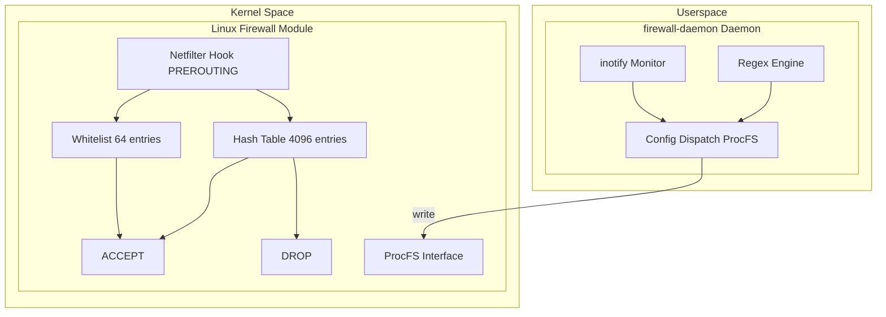
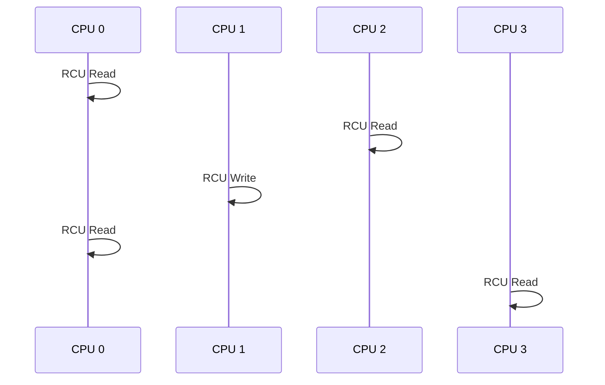

# Architecture

This section describes the overall architecture and core components of the Linux Firewall Kernel Module.

## Overall Architecture

The system consists of two main components:

## Core Design Principles

| Principle | Implementation |
|-----------|----------------|
| High Performance | Netfilter Hook direct processing, no iptables rule traversal |
| Low Latency | O(1) hash lookup, RCU lock-free reads |
| High Availability | In-memory cache, bans lost on reboot |
| Security | Whitelist protection, prevents banning critical services |
| Observability | Dual monitoring via ProcFS + Prometheus |

## Key Parameters

| Parameter | Value | Description |
|-----------|-------|-------------|
| Hash Table Capacity | 4096 | Maximum banned IP count |
| Whitelist Capacity | 64 | Maximum whitelist IP count |
| Prometheus Port | 9119 | Metrics exposure port |

## Concurrency Model

- **Read operations**: RCU protected, completely lock-free, multi-CPU parallel
- **Write operations**: RCU synchronized, ensuring consistency
- **Packet processing**: Pure read operations, extremely low latency

## Component Relationships

| Component | Space | Responsibility |
|-----------|-------|----------------|
| Kernel Module | Kernel | Packet filtering, IP ban management |
| Daemon | Userspace | Log monitoring, regex matching, config dispatch |
| ProcFS | Kernel/Userspace | Configuration interface, status queries |
| Memory Cache | Userspace | Runtime ban tracking |