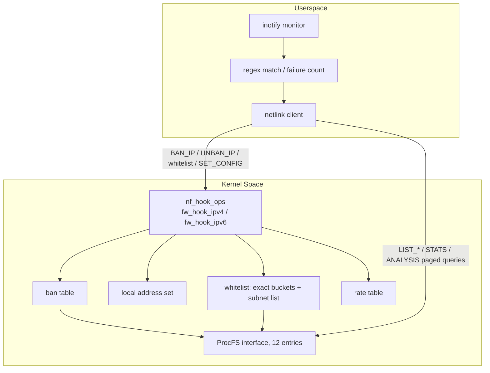

# Architecture

This section describes the overall architecture and core components of the Linux Firewall Kernel Module.

## Overall Architecture

The system has two main components: the kernel module handles per-packet verdicts and table
management; the daemon handles log monitoring, decisions, and the external interfaces. The two
communicate **only over netlink**; procfs is the user/operator interface, not the daemon's internal
channel (`src/daemon/main.rs:362`).

```mermaid
graph TB
    subgraph UserSpace["Userspace"]
        Inotify["inotify monitor"]
        Regex["regex match / failure count"]
        NL["netlink client"]
        Inotify --> Regex
        Regex --> NL
    end

    subgraph KernelSpace["Kernel Space"]
        Hook["nf_hook_ops<br/>fw_hook_ipv4 / fw_hook_ipv6"]
        Whitelist["whitelist: exact buckets + subnet list"]
        Local["local address set"]
        BanTable["ban table"]
        RateTable["rate table"]
        ProcFS["ProcFS interface, 12 entries"]

        Hook --> Whitelist
        Hook --> Local
        Hook --> BanTable
        Hook --> RateTable
        BanTable --> ProcFS
        Whitelist --> ProcFS
    end

    NL -->|"BAN_IP / UNBAN_IP / whitelist / SET_CONFIG"| Hook
    NL -->|"LIST_* / STATS / ANALYSIS paged queries"| ProcFS
```

## Core Design Principles

| Principle | Implementation |
|-----------|----------------|
| High performance | Whitelist / local address / ban table / rate decisions all inside one RCU critical section (`src/kernel-module/fw_hook.c:108-115`) |
| Low latency | Hash lookup for exact addresses; the local address set is an open-addressing hash set, not a per-packet full scan |
| Durable state | The kernel side persists `fw_state_save()` / restores `fw_state_restore()` to `state_file` (default `/var/lib/firewall/state`); bans and whitelist survive a module reload (`src/kernel-module/fw_main.c:229,310`) |
| Security | Whitelist plus the local-address set short-circuit twice, so critical services and local interface addresses are never banned |
| Observability | ProcFS plus Prometheus; `stats` flushes across CPUs before reading (`src/kernel-module/fw_procfs.c:549-552`) |

## Key Parameters

Hash bucket counts are **not** entry capacities: bucket counts come from `*_HASH_BITS`, entry caps
from module parameters (`src/kernel-module/fw_types.h:72-81`, `src/kernel-module/fw_main.c:71-74`;
the contract's mechanical check is the `limit` blocks in `contract/procfs.fwidl`).

| Parameter | Value | Description |
|-----------|-------|-------------|
| Ban table hash buckets | 4096 (`BAN_HASH_BITS` = 12) | bucket count, not a capacity |
| Ban table entry cap | `fw_max_ban_entries` (default 65535) | over the cap new adds are rejected and `ban_table_full_rejects` is bumped |
| Whitelist hash buckets | 64 (`WHITELIST_HASH_BITS` = 6) | bucket count, not a capacity; a subnet list sits alongside |
| Whitelist entry cap | `fw_max_whitelist_entries` (default 65535) | checked under the bucket lock before insertion |
| Rate table hash buckets | 65536 (`RATE_HASH_BITS` = 16) | bucket count, not a capacity |
| Rate table entry cap | `fw_max_rate_entries` (default 65536) | documented range 1024-262144 |
| Local address set | lower bound `fw_max_local_ips` (default 256), hard upper bound 2^16 | grows with the actual address count |
| Prometheus port | `metrics_port` (default 9119) | shared with the Web UI / JSON API / SSE on one listen address |

Every `fw_max_*` above is a **kernel module parameter**, taking effect only at module load or via
sysfs. The daemon's `capacity:` section currently only persists and displays these values; it is not
pushed over netlink, because the `SetConfig` message has no capacity fields
(`contract/netlink.fwidl:380-401`).

## Concurrency Model

- Read side (packet verdict) uses RCU, lock-free across CPUs.
- Write side (ban / unban / whitelist change) takes a **per-bucket spinlock**; the lock only unlinks
  and adjusts counts, and node release always goes through `call_rcu`, deferred past a grace period,
  never `timer_delete_sync()` while holding the lock (`src/kernel-module/fw_ban.c:373-387`).
- Per-packet mutable statistics land in **per-CPU** slots (`this_cpu_ptr`), with no shared writes
  (`src/kernel-module/fw_rate.c:101`).
- Expiry is driven by a **per-entry timer**, with no global cleanup thread (`cleanup_cycles` is
  always 0).

RCU does not assign read/write roles per CPU: any CPU may read, and any CPU may write under the lock.

## Component Relationships

| Component | Space | Responsibility |
|-----------|-------|----------------|
| Kernel Module | Kernel | Packet verdicts, ban/whitelist tables, rate and DDoS detection, procfs and netlink interfaces |
| Daemon | Userspace | Log monitoring, regex matching, failure counting and ban decisions, config dispatch, Web UI / API / SSE / metrics |
| ProcFS | Kernel/Userspace | Operator interface and status queries (12 entries, permissions in `contract/procfs.fwidl`) |
| netlink | Kernel/Userspace | The **only** daemon <-> kernel channel: commands, paged query responses, event pushes |
| History store | Userspace | Daemon-side time-series history and ban-history persistence (`src/daemon/history_snapshot/`) |
