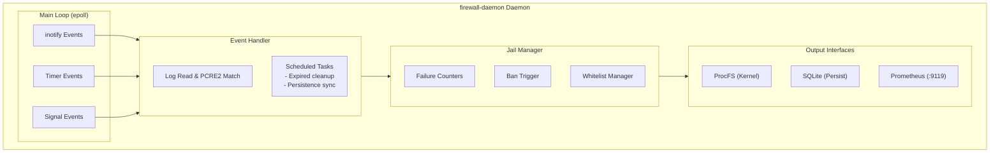
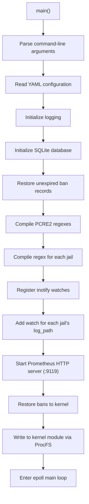
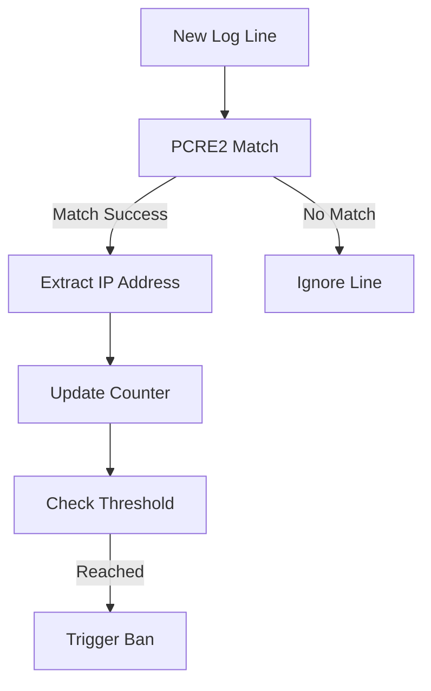
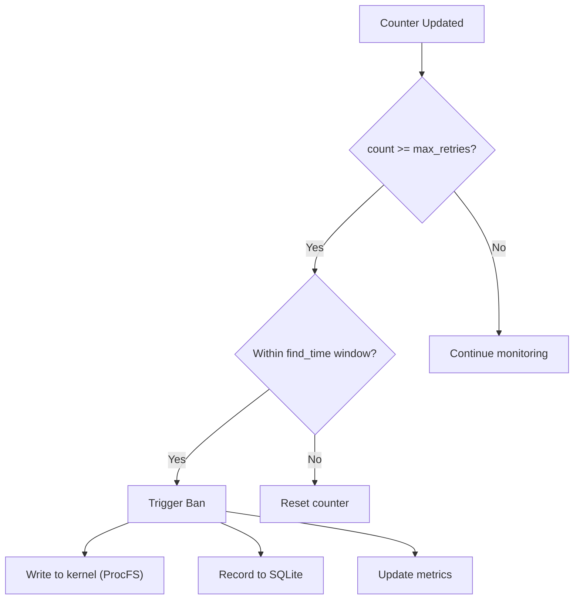
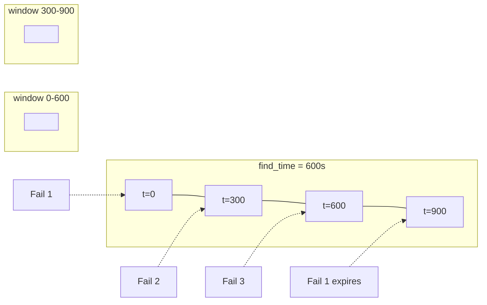
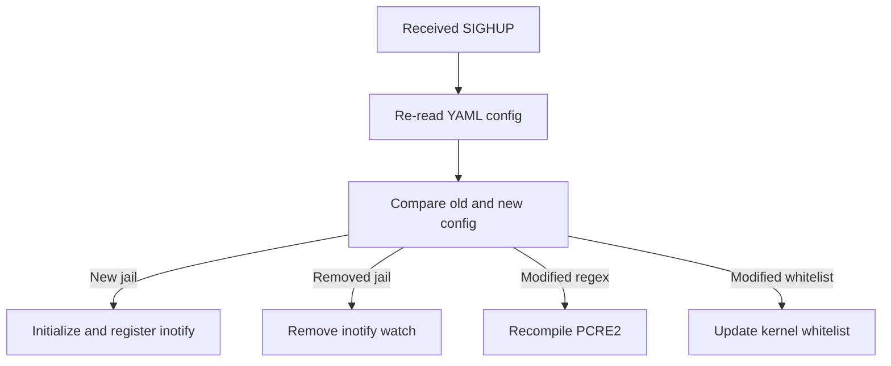

# Userspace Daemon

This document describes the design and implementation of the userspace daemon `firewall-daemon`.

## Overview

The daemon `firewall-daemon` runs in userspace and is responsible for:

- Monitoring log file changes
- Matching ban patterns using PCRE2 regex
- Counting failures and triggering bans
- Managing ban persistence
- Exposing Prometheus metrics

## Technology Stack

| Component | Purpose |
|-----------|---------|
| C Language | Primary programming language |
| libyaml | YAML configuration parsing |
| libpcre2 | Regular expression compilation and matching |
| libsqlite3 | Ban record persistent storage |
| libmicrohttpd | Prometheus HTTP metrics server |
| inotify | Linux file change monitoring |

## Architecture



## Startup Flow



## Log Monitoring

### inotify Events

```c
int fd = inotify_init();
inotify_add_watch(fd, "/var/log/auth.log", IN_MODIFY);
```

| Event | Description |
|-------|-------------|
| `IN_MODIFY` | File was modified (new log written) |
| `IN_CLOSE_WRITE` | File was closed after writing |
| `IN_MOVED_TO` | File was moved in (log rotation) |

### Log Rotation Handling

The daemon detects log rotation and re-registers inotify watches:

```c
if (event->mask & IN_IGNORED) {
    // Log file was rotated, re-watch
    inotify_add_watch(fd, log_path, IN_MODIFY);
}
```

## PCRE2 Regex Matching

### Regex Compilation

```c
pcre2_code *re = pcre2_compile(
    (PCRE2_SPTR)pattern,
    PCRE2_ZERO_TERMINATED,
    PCRE2_UTF | PCRE2_NO_UTF_CHECK,
    &error_code,
    &error_offset,
    NULL
);
```

### `<HOST>` Expansion

The `<HOST>` placeholder in configuration is replaced with an IP matching regex:

```c
#define HOST_PATTERN \
    "(?:(?:25[0-5]|2[0-4][0-9]|[01]?[0-9][0-9]?)\\.){3}" \
    "(?:25[0-5]|2[0-4][0-9]|[01]?[0-9][0-9]?)"

// Replace <HOST> with HOST_PATTERN
char *expanded = replace_all(regex, "<HOST>", HOST_PATTERN);
```

### Matching Flow



## Jail Manager

### Failure Counters

Each jail maintains an `(ip, count)` mapping:

```c
struct failure_counter {
    uint32_t ip;              // IP address
    uint32_t count;           // Current count
    time_t first_seen;        // First appearance time
    time_t last_seen;         // Last appearance time
};
```

### Ban Trigger



### find_time Window



## SQLite Persistence

### Database Schema

```sql
CREATE TABLE IF NOT EXISTS bans (
    id INTEGER PRIMARY KEY AUTOINCREMENT,
    ip TEXT NOT NULL,
    port INTEGER NOT NULL,
    protocol TEXT NOT NULL,
    jail TEXT NOT NULL,
    ban_time INTEGER NOT NULL,
    expire_time INTEGER NOT NULL,
    created_at INTEGER DEFAULT (strftime('%s', 'now'))
);

CREATE INDEX IF NOT EXISTS idx_bans_ip ON bans(ip);
CREATE INDEX IF NOT EXISTS idx_bans_expire ON bans(expire_time);
```

### Operations

| Operation | Description |
|-----------|-------------|
| Startup restore | Read records where `expire_time > now` |
| Ban record | INSERT new record |
| Unban record | DELETE expired record |
| Periodic sync | Clean expired records every 60 seconds |

## Prometheus Metrics

### Endpoint

```
http://<host>:9119/metrics
```

### Available Metrics

> The 14 metrics below are actually exposed by
> `src/daemon/http-exporter.c`. Earlier drafts listed
> `firewall_ban_events_total` / `firewall_packets_*` /
> `firewall_hash_table_*` / `firewall_jail_*` — none of which exist
> in the source — and have been removed.

#### Kernel-side

| Metric | Type | Description |
|--------|------|-------------|
| `firewall_kernel_banned_ips_current` | gauge | Currently banned IPs |
| `firewall_kernel_bans_total` | counter | Cumulative ban operations |
| `firewall_kernel_unbans_total` | counter | Cumulative unban operations |
| `firewall_kernel_whitelist_count` | gauge | Current whitelist entries |

#### Daemon-side

| Metric | Type | Description |
|--------|------|-------------|
| `firewall_daemon_uptime_seconds` | counter | Daemon uptime |
| `firewall_daemon_config_reloads_total` | counter | SIGHUP-triggered config reloads |
| `firewall_daemon_inotify_events_total` | counter | inotify events received |
| `firewall_daemon_log_rotations_total` | counter | Log rotation events |
| `firewall_daemon_lines_parsed_total` | counter | Log lines parsed |
| `firewall_daemon_lines_skipped_total` | counter | Log lines skipped (unparseable) |
| `firewall_daemon_regex_matches_total` | counter | PCRE2 regex matches |
| `firewall_daemon_ips_extracted_total` | counter | IPs extracted from logs |
| `firewall_daemon_ips_banned_total` | counter | IPs that triggered a kernel ban |
| `firewall_daemon_failed_attempts_total` | counter | Ban failures (e.g. table full) |

### Example Output

```
# HELP firewall_kernel_banned_ips_current Currently banned IPs
# TYPE firewall_kernel_banned_ips_current gauge
firewall_kernel_banned_ips_current 15

# HELP firewall_kernel_bans_total Total ban operations
# TYPE firewall_kernel_bans_total counter
firewall_kernel_bans_total 125

# HELP firewall_kernel_unbans_total Total unban operations
# TYPE firewall_kernel_unbans_total counter
firewall_kernel_unbans_total 98

# HELP firewall_daemon_lines_parsed_total Lines parsed by the daemon
# TYPE firewall_daemon_lines_parsed_total counter
firewall_daemon_lines_parsed_total 1250340
```

## Signal Handling

| Signal | Behavior |
|--------|----------|
| `SIGTERM` | Graceful exit, save state |
| `SIGINT` | Graceful exit, save state |
| `SIGHUP` | Reload configuration |
| `SIGUSR1` | Output current status to log |

## Configuration Hot-Reload

Triggered by `SIGHUP` signal:

