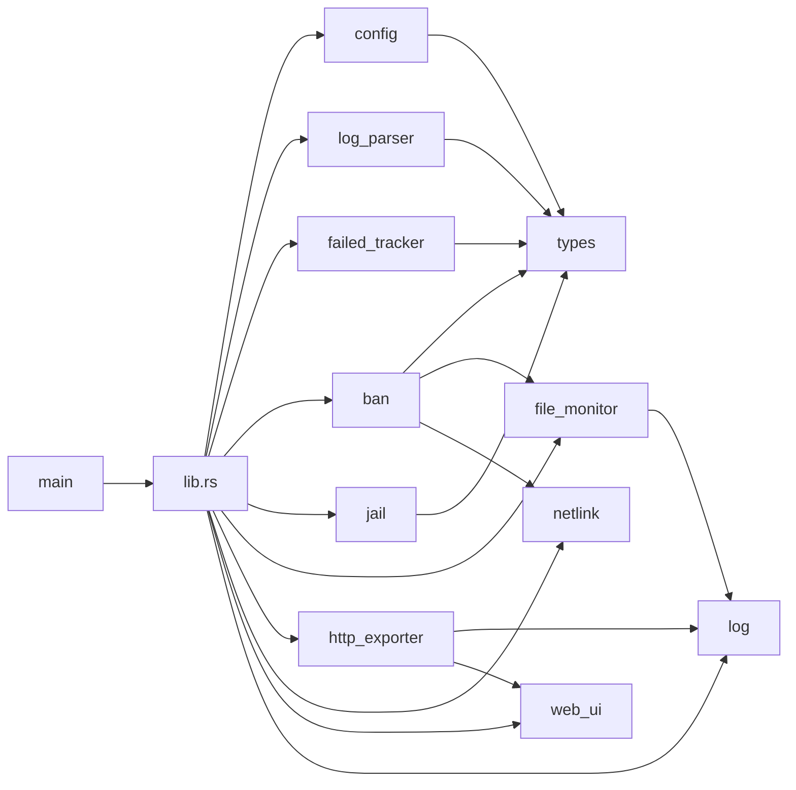
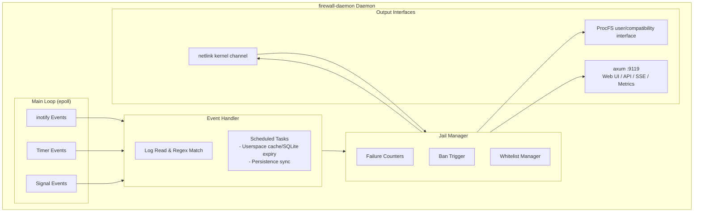
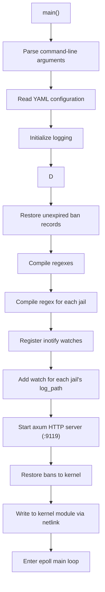
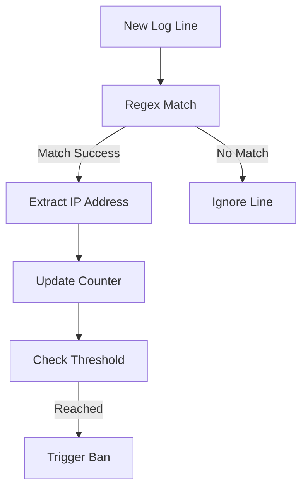
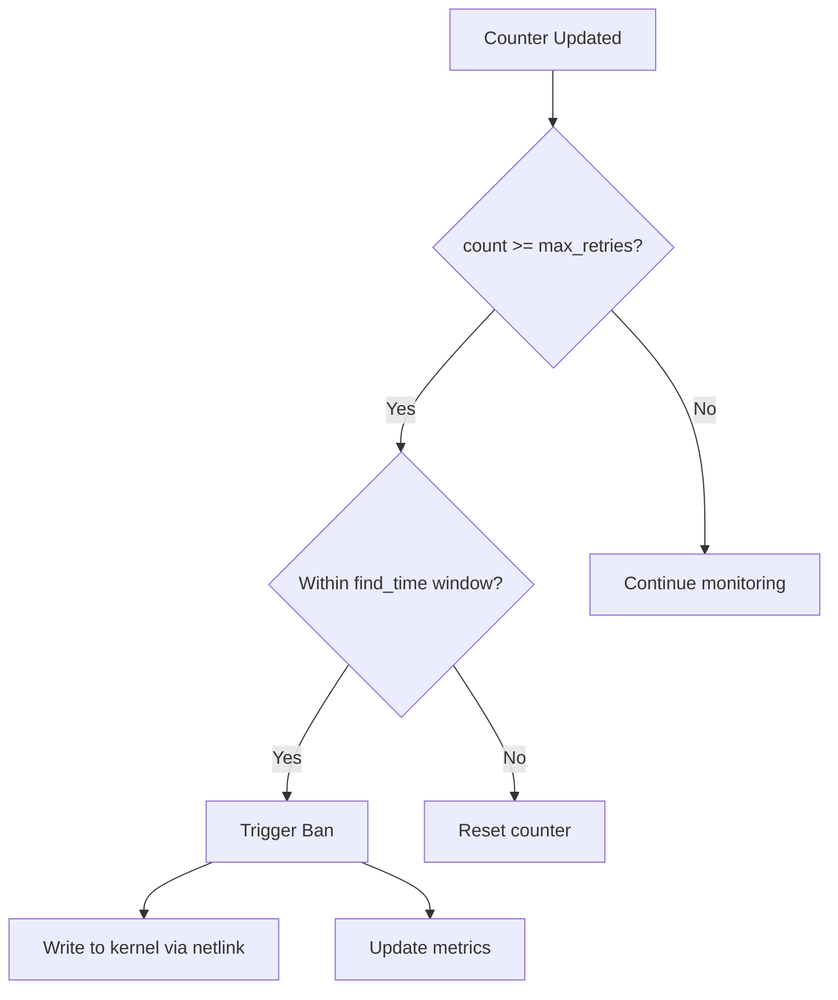
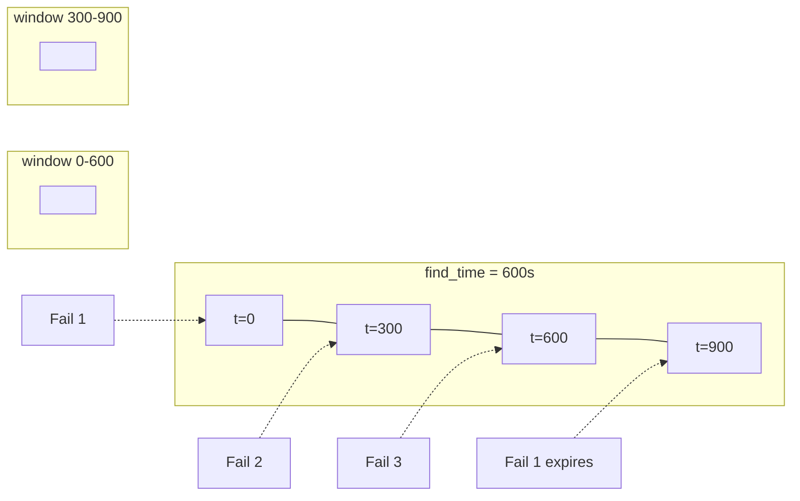
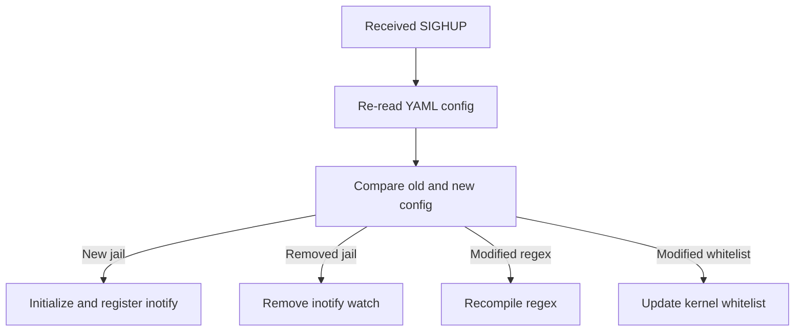

# Userspace Daemon

This document describes the design and implementation of the userspace daemon `firewall-daemon`.

## Overview

The daemon `firewall-daemon` runs in userspace and is responsible for:

- Monitoring log file changes
- Matching ban patterns using regex
- Counting failures and triggering bans
- Managing ban persistence
- Exposing Prometheus metrics

## Technology Stack

| Component | Purpose |
|-----------|---------|
| Rust | Primary programming language |
| serde_yaml / regex | YAML configuration parsing and regular-expression matching |
| axum / tokio | Web UI, JSON API, SSE, and Prometheus HTTP service (port 9119) |
| inotify | Linux file change monitoring (uses the `inotify` crate directly, not the `notify` abstraction) |
| netlink | Bidirectional kernel communication for commands, status, and DDoS events |
| rusqlite | Ban-record persistence |

## Module Structure

The daemon is organized by responsibility under `src/daemon/`. Modules are wired together via explicit `use` imports with no circular dependencies. This document deliberately avoids source-file counts, which become stale as modules are split.

| Module | Responsibility |
|--------|----------------|
| `lib.rs` | Library entry point; exposes the public API. `main.rs` is a thin wrapper that parses CLI args and calls `run_daemon()`. |
| `log` | Structured logging macros (`log_info!` / `log_warn!` / `log_error!` / `log_debug!`), filtered at runtime by the `log_level` config. |
| `types` | Shared data types: `BanRecord`, `FailureEntry`, `JailConfig`, `Protocol`, etc. |
| `config` | YAML parsing, field validation, and default merging; invalid config fails fast at startup. |
| `log_parser` | Per-line regex matching and IP extraction; wraps the `regex` crate. |
| `failed_tracker` | Per-jail sliding-window `(ip, count, first_seen, last_seen)` counters. |
| `ban` | Ban-trigger logic: `max_retries` / `findtime` / `ban_time` evaluation and netlink issuance. |
| `jail` | Jail lifecycle management: create / enable / disable, hot-reload diff merging. |
| `file_monitor` | `inotify` watches, log-rotation detection, inode re-attach. |
| `netlink` | Bidirectional channel for kernel commands, responses, statistics, and DDoS decisions. |
| `http_exporter` | axum-based metrics, health, API, SSE, and static-asset service. |
| `web_ui` | Web API domain logic and compiled frontend static assets. |
| `main` | CLI parsing, signal registration, `epoll` main loop, tokio runtime bootstrap. |



## Memory Safety

The daemon is implemented in Rust, and every `unsafe { }` block carries a `// SAFETY:` comment documenting the prerequisites. The codebase currently contains **49** `unsafe` blocks, concentrated in:

- `netlink/protocol.rs` (14) — netlink message serialization/deserialization
- `netlink/mod.rs` (13) — netlink socket operations
- `ban/procfs.rs` (11) — ProcFS file descriptor lifecycle
- `daemonizer.rs` (7) — `fork`/`setsid`/PID file management
- `file_monitor/monitor_loop.rs` (1) — `poll` syscall wrapper
- `ip_utils.rs` (1) — raw IP address manipulation
- `logger.rs` (1) — syslog integration
- `signals.rs` (1) — signal mask operations

Each `unsafe` block is annotated with two parts:

1. **Prerequisites** — what the caller must guarantee (e.g. fd is valid, buffer length is correct, C string is NUL-terminated).
2. **Invariant preservation** — which Rust safety invariants remain intact after the block returns.

`Cargo.toml` configures an ASAN runtime-detection profile (`[profile.dev-with-debug]`):

```toml
[profile.dev-with-debug]
inherits = "dev"
debug = true
# RUSTFLAGS="-Z sanitizer=address" cargo build --profile dev-with-debug
```

The CI pipeline runs `cargo test --profile dev-with-debug` to execute all unit tests under AddressSanitizer, automatically catching use-after-free, buffer-overflow, double-free, and other undefined behavior.

## Architecture



## Startup Flow



## Log Monitoring

### inotify Events

```rust
use inotify::{Inotify, WatchMask};

let mut inotify = Inotify::init()?;
inotify.watches().add("/var/log/auth.log", WatchMask::MODIFY)?;
```

| Event | Description |
|-------|-------------|
| `IN_MODIFY` | File was modified (new log written) |
| `IN_CLOSE_WRITE` | File was closed after writing |
| `IN_MOVED_TO` | File was moved in (log rotation) |

### Log Rotation Handling

The daemon detects log rotation and re-registers inotify watches:

```rust
if event.mask.contains(WatchMask::MOVED_TO) {
    // Log file was rotated, re-add watch
    inotify.watches().add(log_path, WatchMask::MODIFY)?;
}
```

## Regex Matching

### Regex Compilation

The daemon uses Rust's built-in regex crate for pattern matching.

### `<HOST>` Expansion

The `<HOST>` placeholder in configuration is replaced with an IP matching regex pattern. The daemon expands this placeholder at startup for each jail's regex pattern.

### Matching Flow



## Jail Manager

### Failure Counters

Each jail maintains an `(ip, count)` mapping:

```c
struct failure_counter {
    uint32_t ip;              // IP address
    uint32_t count;           // Current count
    time_t first_seen;        // First appearance time
    time_t last_seen;         // Last appearance time
};
```

### Ban Trigger



### find_time Window




### Database Schema

```sql
CREATE TABLE IF NOT EXISTS bans (
    id INTEGER PRIMARY KEY AUTOINCREMENT,
    ip TEXT NOT NULL,
    port INTEGER NOT NULL,
    protocol TEXT NOT NULL,
    jail TEXT NOT NULL,
    ban_time INTEGER NOT NULL,
    expire_time INTEGER NOT NULL,
    created_at INTEGER DEFAULT (strftime('%s', 'now'))
);

CREATE INDEX IF NOT EXISTS idx_bans_ip ON bans(ip);
CREATE INDEX IF NOT EXISTS idx_bans_expire ON bans(expire_time);
```

### Operations

| Operation | Description |
|-----------|-------------|
| Startup restore | Read records where `expire_time > now` |
| Ban record | INSERT new record |
| Unban record | DELETE expired record |
| Periodic sync | Clean expired records every 60 seconds |

## Prometheus Metrics

### Endpoint

```
http://<host>:9119/metrics
```

### Available Metrics

> The 24 metrics below are actually exposed by
> `src/daemon/http_exporter/metrics.rs`. Earlier drafts listed
> `firewall_ban_events_total` / `firewall_packets_*` /
> `firewall_hash_table_*` / `firewall_jail_*` — none of which exist
> in the source — and have been removed.

#### Kernel-side

| Metric | Type | Description |
|--------|------|-------------|
| `firewall_kernel_banned_ips_current` | gauge | Currently banned IPs |
| `firewall_kernel_bans_total` | counter | Cumulative ban operations |
| `firewall_kernel_unbans_total` | counter | Cumulative unban operations |
| `firewall_kernel_whitelist_count` | gauge | Current whitelist entries |

#### Daemon-side

| Metric | Type | Description |
|--------|------|-------------|
| `firewall_daemon_uptime_seconds` | counter | Daemon uptime |
| `firewall_daemon_config_reloads_total` | counter | SIGHUP-triggered config reloads |
| `firewall_daemon_inotify_events_total` | counter | inotify events received |
| `firewall_daemon_log_rotations_total` | counter | Log rotation events |
| `firewall_daemon_lines_parsed_total` | counter | Log lines parsed |
| `firewall_daemon_lines_skipped_total` | counter | Log lines skipped (unparseable) |
| `firewall_daemon_regex_matches_total` | counter | Regex matches |
| `firewall_daemon_ips_extracted_total` | counter | IPs extracted from logs |
| `firewall_daemon_ips_banned_total` | counter | IPs that triggered a kernel ban |
| `firewall_daemon_failed_attempts_total` | counter | Ban failures (e.g. table full) |

### Example Output

```
# HELP firewall_kernel_banned_ips_current Currently banned IPs
# TYPE firewall_kernel_banned_ips_current gauge
firewall_kernel_banned_ips_current 15

# HELP firewall_kernel_bans_total Total ban operations
# TYPE firewall_kernel_bans_total counter
firewall_kernel_bans_total 125

# HELP firewall_kernel_unbans_total Total unban operations
# TYPE firewall_kernel_unbans_total counter
firewall_kernel_unbans_total 98

# HELP firewall_daemon_lines_parsed_total Lines parsed by the daemon
# TYPE firewall_daemon_lines_parsed_total counter
firewall_daemon_lines_parsed_total 1250340
```

## Signal Handling

| Signal | Behavior |
|--------|----------|
| `SIGTERM` | Graceful exit, save state |
| `SIGINT` | Graceful exit, save state |
| `SIGHUP` | Reload configuration |
| `SIGUSR1` | Output current status to log |
| `SIGPIPE` | Ignored (prevents daemon exit when a Prometheus scraper disconnects) |

## Configuration Hot-Reload

Triggered by `SIGHUP` signal:

