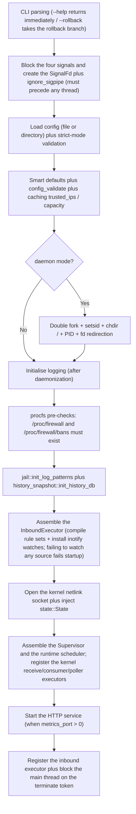

# Userspace Daemon

`firewall-daemon` is the userspace counterpart of the kernel module: it monitors logs, performs
failure counting and ban decisions, pushes commands to the kernel over netlink, and presents state to
operators and the frontend over HTTP / SSE. The kernel handles per-packet verdicts (rate, DDoS); the
daemon handles application-layer detection (for example SSH brute force) and the external
interfaces.

Two hard boundaries:

- The **only internal channel** between the daemon and the kernel is netlink; `/proc/firewall/*` is
  the user/operator interface, not the daemon's internal channel (`src/daemon/main.rs`).
- The threat model is **inbound-only defense**: no egress hook, no outbound detection, no outbound
  behaviour analysis (design document, "Decision Record").

Related documents:

- Packet decision path and the ban/unban event chain: `data-flow.md`
- Kernel internals, module parameters and hash table sizes: `kernel-module.md`
- Rewrite design (layer trade-offs, structural problems A-M, phased rollout and acceptance
  evidence): `../development/daemon-rewrite-design.md`
- Sources of truth for interfaces: `contract/netlink.fwidl`, `contract/procfs.fwidl`,
  `contract/http.fwidl`
- Configuration fields and semantics: `../configuration/yaml-config.md`

## Technology Stack

| Component | Purpose |
|-----------|---------|
| Rust | Implementation language (single crate binary, no workspace split) |
| serde / serde_yaml / regex | YAML configuration parsing, regex compilation and matching |
| axum / tokio | HTTP service: `/metrics`, `/api/v1/*`, two SSE streams, SPA static assets |
| inotify | Log file change monitoring (`inotify` crate bindings) |
| netlink | Bidirectional kernel communication: command dispatch, paged queries, event pushes |
| rusqlite | Time-series history, ban history and IP reputation persistence |
| slog + slog-json | Structured logging (JSON Lines) |
| rust-embed | Frontend build artifacts embedded into the binary (`src/daemon/web_ui/static/`) |

## Scope of This Document

This document describes the **target structure** after the Phase 2 rewrite. The rewrite proceeds as
"keep it compiling, migrate in batches", so some modules may not be wired into production yet; the
per-item landing status lives in "Fix items and their landing status" in
`development/daemon-rewrite-design.md` and in `ITERATION-PLAN.md` at the repository root. This
document does not restate progress that changes from batch to batch.

## Component Relationships

| Component | Space | Responsibility |
|-----------|-------|----------------|
| Kernel Module | Kernel | Packet verdicts, ban/whitelist tables, rate and DDoS detection, procfs and netlink interfaces |
| Daemon | Userspace | Log monitoring, line parsing, failure counting and ban decisions, config dispatch, HTTP/SSE/metrics |
| netlink | Kernel <-> Userspace | The **only** daemon <-> kernel channel: commands, paged query responses, event pushes |
| ProcFS | Kernel <-> Userspace | Operator interface (12 entries); the daemon only checks existence at startup and never uses it for internal communication |
| History store | Userspace | SQLite: time-series stats, ban history, ban events, IP reputation (`history_snapshot/`) |

## Runtime Model

The design goal is **five kinds of executor divided by data shape**, not "all-tokio-async": the main
chain has the shape "blocking IO plus CPU regex work", and putting it inside an async reactor would
let parsing block the network; HTTP/SSE is naturally async, and carrying thousands of idle long-lived
connections on threads is wasteful.

| Executor | Carries | Blocking nature |
|----------|---------|-----------------|
| `ingest` thread | inotify fd ownership, `poll`, reading new bytes, rotation detection | Blocking IO |
| `pipeline` thread | Line splitting, regex matching, IP validation, failure counting, threshold decisions | CPU plus small allocations |
| `kernel reactor` thread | Sole owner of the netlink socket: sending commands, receiving events, request-response correlation | Blocking IO |
| `scheduler` thread | Monotonic-clock timers (periodic maintenance, reconciliation, rate queries) | Timed waiting |
| tokio runtime | HTTP routing, SSE long-lived connections, auth, static assets | async (2 workers) |

Stages are connected by **bounded channels**, and every stage must state its backpressure policy
explicitly (`runtime/channel.rs`):

```
inotify --LogChunk--> parse --Failure--> decide --BanIntent--> kernel reactor --> kernel
                                                                    ^                |
                                                                    +- BanStateChange +
                                                                            |
                                                                    state hub (versioned snapshot)
                                                                            |
                                                                       SSE / REST
```

| Queue | Behaviour when full | Rationale |
|-------|---------------------|-----------|
| ingest -> parse | Block ingest (lose no bytes) | Logs are the **evidence source**; dropping lines means missing a decision |
| parse -> decide | Block parse | Same as above; `decide` is pure in-memory O(1) and will not become the bottleneck |
| BanIntent -> kernel | Bounded queue plus counters; **reject visibly** when full, never silently | Bans must not be lost, but must not grow unbounded either; rejections must drive retries |
| events -> state hub | Overwrite-style publish (latest snapshot semantics) | SSE only needs the latest state; intermediate states may be dropped |
| state hub -> persistence | Bounded queue; **block the producer** when full, never drop | History is audit data |

In the old implementation every periodic task hung off the `poll` timeout branch of
`file_monitor::monitor_loop`. While inotify events keep arriving, `poll` keeps returning non-zero and
the 60 s / 300 s / 2 s task classes are postponed indefinitely (structural problem A). The
`scheduler` drives them from a **monotonic clock** (`Instant`) instead, fully decoupled from event
throughput and immune to clock jumps (`runtime/timers.rs`: `fire_due(now)` is a pure function, so
tests can verify the absence of drift with synthetic instants).

**What actually landed**: the four segments `ingest -> parse -> decision -> pipeline` are driven
sequentially by **one** executor (`pipeline/executor.rs`), which exclusively owns the per-source
offsets, partial-line buffers and per-jail failure windows on a single thread; no queue exists
between segments, so there is no "full queue drops bytes" window to begin with. The `inotify` fd and
the `signalfd` share one `poll`, and periodic maintenance runs off that executor's own `TimerTable`.
The thread split and bounded channels in the table above are the **target** shape and have not
landed (the open question of who would own the splitter is recorded in the module documentation of
`pipeline/executor.rs`).

### Shutdown Order

The shutdown invariant is "**in-flight events may be written to the database only after netlink has
stopped**". For that to actually hold, the stop signal must not be broadcast to all executors at
once: that way upstream and downstream finish concurrently and "upstream has fully stopped" is not
established. `Supervisor::shutdown()` therefore stops **stage by stage, in reverse registration
order**: it calls `request()` on the current stage, `join`s it to completion, and only then stops the
next one (`runtime/supervisor.rs`). Registration order is dependency order (downstream registers
first).

Target order (design document, "Lifecycle"):

```
stop HTTP ingress -> stop scheduler -> stop kernel reactor (flush in-flight requests first)
  -> stop pipeline (drain queues) -> stop ingest -> flush persist -> clean up the PID file
```

The order in production after 2.I: `main` blocks on the terminate token -> stop the `runtime`
executors (the inbound executor stops first, then the kernel poller, consumer and reactor, and the
scheduler last) -> `cleanup()`: stop HTTP -> close the history database -> remove the PID file
(`src/daemon/main.rs`). `close_history_db` itself joins the writer thread and flushes everything
already queued, so "in-flight events are written only after netlink stopped" follows from that
order.

## Module Layout (by data ownership)

Every module **owns** its state; cross-module communication is messages or `Arc<immutable snapshot>`
only. `OnceLock` is allowed in exactly two places, the global logger and test fixtures; everything
else is injected at construction time.

| Module | State owned | Interface |
|--------|-------------|-----------|
| `main.rs` | None (composition root) | CLI parsing -> assembly -> start the main loop; no business logic |
| `runtime/supervisor.rs` | Executor lifecycle, shutdown tokens | `spawn()` / `shutdown(timeout)`, stopping stage by stage in reverse dependency order and joining each |
| `runtime/scheduler.rs` | Periodic task set | Base tick plus per-task gating (`stats` mirroring, expired-ban purge) |
| `runtime/timers.rs` | Monotonic-clock timer table | `fire_due(now)` (pure), periods rescheduled from the original instant |
| `runtime/channel.rs` | Bounded queue contract | `send` follows `Backpressure::{Block,Reject}`; `Reject` counts are observable |
| `runtime/shutdown.rs` | Cooperative shutdown token | `request()` / `is_shutdown()` / `wait_until(deadline)` |
| `ingest/watcher.rs` | Sole owner of the inotify fd | Event iteration; fd and read buffer are never lent out |
| `ingest/registry.rs` | `SourceId <-> (path, wd, inode)` | `resolve(wd)`; `SourceId` is a stable identity |
| `ingest/reader.rs` | Per-source fd, offset, reusable buffer | Read new bytes plus a cheap rotation check |
| `parse/splitter.rs` | Per-source partial line buffer | Bytes -> lines (the buffer is long-lived and reused across rounds) |
| `parse/rules.rs` | Per-jail compiled regexes (immutable, `Arc`) | On a match, scan capture groups backwards for the rightmost valid IP |
| `parse/extract.rs` | None (pure functions) | Recognise a valid IP in arbitrary text, returning `IpAddr` rather than `String` |
| `decision/window.rs` | Per-jail failure timestamp window | `observe(ip, ts) -> Verdict`, owned by one executor, lock-free |
| `decision/policy.rs` | None (pure functions) | Effective threshold, progressive duration, ban plan |
| `pipeline/mod.rs` | Per-jail rules/windows plus per-source splitters | `on_chunk(...)` -> `Vec<BanIntent>`; stops at the intent, does not send |
| `pipeline/executor.rs` | Inbound-chain runtime: config, source table, readers, timers | `cfg()` for composition-root assembly parameters; `run(stop, terminate)` drives the four segments on one thread |
| `signal/mod.rs` | `signalfd` (blocks the four signals) | `SignalFd::new` / `poll_read`; restores the mask on drop |
| `kernel/codec/` | None | Bytes <-> semantic types, consuming the contract generated code |
| `kernel/transport.rs` | netlink socket (single writer) | Send one payload, receive one datagram |
| `kernel/reactor.rs` | In-flight request table plus routing state machine | Route by **type + seq**; unknown, failed and unclaimed replies are all counted |
| `kernel/client.rs` | None (typed API over `Arc<Transport>`) | `ban` / `unban` / `list_*_all` / `set_config` |
| `kernel/lease.rs` | Registration lease state | Register and await the ack, renew periodically, make loss of contact visible (four states) |
| `state/bans.rs` | Active bans (sole owner) | `apply` / `snapshot` / `purge_expired(now)` |
| `state/whitelist.rs` | Whitelist (sole owner) | `apply` / `snapshot`; keys are `CidrKey` |
| `state/rates.rs` | Latest rate sample plus EWMA baseline | `apply` / `snapshot` / `baseline` |
| `state/stats.rs` | Atomic counters (typed enum, `inc` / `add` / `set_gauge`) | Reading a snapshot mutates nothing |
| `state/hub.rs` | Versioned publish point | `publish(Domain)` / `watch` subscription; holds versions and notifications, not data |
| `state/cidr.rs` | None (normalisation) | `CidrKey::new` / `CidrKey::parse`, the only construction entry point |
| `state/compose.rs` | Mirror directions and timing | **Transitional bridge** between old globals and the new state; deleted once old readers are migrated |
| `api/*` | None (thin adapter layer) | Take from snapshots, wrap in the envelope; read paths have zero side effects |
| `api/ports.rs` | Data-gap ports (narrow traits) | Four narrow trait groups: history / reputation / config / runtime plus control |
| `api/sse.rs` | Per-connection subscription and counters | Per-domain serialization, slow-consumer isolation |
| `contract.rs` | None | Mount the three contract artifacts as crate modules via `#[path]` |
| `runtime_status.rs` | None | One-shot read-only aggregation for `/health` and unit-test assertions |

## Startup Flow

The order in `main()` (`src/daemon/main.rs`):


```mermaid
graph TB
    A["CLI parsing (--help returns immediately / --rollback takes the rollback branch)"] --> B["Block the four signals and create the SignalFd plus ignore_sigpipe (must precede any thread)"]
    B --> C["Load config (file or directory) plus strict-mode validation"]
    C --> D["Smart defaults plus config_validate plus caching trusted_ips / capacity"]
    D --> E{"daemon mode?"}
    E -->|Yes| F["Double fork + setsid + chdir / + PID + fd redirection"]
    E -->|No| G["Initialise logging (after daemonization)"]
    F --> G
    G --> H["procfs pre-checks: /proc/firewall and /proc/firewall/bans must exist"]
    H --> I["jail::init_log_patterns plus history_snapshot::init_history_db"]
    I --> J["Assemble the InboundExecutor (compile rule sets + install inotify watches; failing to watch any source fails startup)"]
    J --> K["Open the kernel netlink socket plus inject state::State"]
    K --> L["Assemble the Supervisor and the runtime scheduler; register the kernel receive/consumer/poller executors"]
    L --> M["Start the HTTP service (when metrics_port > 0)"]
    M --> N["Register the inbound executor plus block the main thread on the terminate token"]
```

Ordering constraints that have explicit reasons, not habits:

- **Signals are blocked before any thread exists**: blocking is a thread property and a new thread
  inherits the creator's mask. The `SignalFd` is created before the config is loaded, so the logger,
  HTTP and every executor thread started afterwards inherit "already blocked" and signals always
  land in the fd; the daemonization `fork` does not `exec`, so fd and mask both survive it.
- **Logging is initialised after daemonization**: `fork` loses the async logging thread, so the
  `cfg.daemon` branch runs `daemonize_process()` first and `logger::init_logger(cfg.log_file)`
  afterwards.
- **Config ownership sits in the inbound executor**: it is the only thread that mutates the config
  (automatic reload / rollback / enabled-state sync) and the composition root reads assembly
  parameters through `InboundExecutor::cfg()`, so reload cannot fork a second copy.
- **The state layer is injected before the netlink receive thread starts**: bans, whitelist and
  stats query responses arriving at startup land in the new state from inside that thread, and
  injecting one step later loses that batch (comment in the `main.rs` composition root).
- **Finding no watchable log source fails startup**: a wrong config, insufficient permissions or an
  unloaded kernel module must not leave behind a process that "looks fine but never decides".
- **A failed scheduler assembly only warns, it never panics**: without it the SSE `stats` domain
  stops refreshing on its own and expired bans can only self-heal through kernel `UNBAN` events,
  while the ban main chain keeps working.
- **A missing `/proc/firewall` or `/proc/firewall/bans` fails startup**: with the kernel module not
  loaded the daemon has no working decision and dispatch path.

## Decision Semantics (Frozen Surface)

These rules are an **external commitment** and must not change in the rewrite; `decision/policy.rs`
and the old `failed_tracker` are cross-checked case by case.

- **A whitelist hit means never banned** (the kernel also short-circuits on the whitelist; the daemon
  does not re-decide that an address "may be banned").
- **Effective threshold** = `max_retries x peak hours (x1.5) x internal source (x2.0) x reputation
  factor`, then `.ceil().max(1.0)` (`decision/policy.rs`).
- **Peak hours**: UTC `9..18` (`is_peak_hours(hour_utc)`, with the time source injected by the
  caller so fixed-hour tests cover it completely).
- **Reputation factor**: `>=80 -> 1.0`, `>=50 -> 0.8`, otherwise `0.5` (consistent with the
  threshold multipliers in `ip_reputation.rs`).
- **Progressive duration**: attempt 1 `base`, attempt 2 `1800`, attempt 3 `86400`, attempt 4 onwards
  permanent; `ban_time < 0` means permanent by configuration.
- **Failure window**: only timestamps satisfying `now - findtime <= ts <= now` count; the per-IP cap
  is `MAX_TIMESTAMPS_PER_IP = 100` (FIFO eviction of the oldest), aligned with the old
  `count_recent`.

## netlink Layer

The wire format has a **single** definition, the contract-generated code: protocol `NETLINK_USERSOCK`,
magic `0x46574C4E`, a 12-byte custom common header, all multi-byte integers big-endian, all structs
`packed`. `contract.rs` mounts `contract/generated/netlink_contract.rs` as a crate module with
`#[path]`, so the implementation reads the field names and offsets from the contract and the
"hand-copied struct" source of drift is eliminated by the compiler.

The new `kernel/` layer has five levels (**in production**):

| Level | Responsibility | Key trade-off |
|-------|----------------|---------------|
| `codec` | Bytes <-> semantic types, the only escaping layer | Every multi-byte field goes through explicit `from_be` / `to_be`, never relying on the memory representation of `packed` structs; `decode_packed` converts field by field as it moves bytes, so raw bytes never leave the module |
| `transport` | Sole socket owner (single writer) | Length follows `nlmsghdr.nlmsg_len`, not the received byte count (netlink aligns datagrams to 4 bytes, so `recvmsg` can report up to 3 padding bytes more) |
| `reactor` | Receive loop plus `(type, seq)` routing | `Router` is a pure state machine and is unit-testable; the routing allowlist only covers the group that echoes the request `seq` |
| `client` | Typed request API | "Delivered" and "confirmed" are separated by type; `list_*_all` always requests the contract page size and follows pages to the end |
| `lease` | Registration lease | Registration awaits `DaemonRegisterAck`; four states `Idle` / `Held` / `Refused` / `Lost`, and a failed confirmation always moves to `Lost` |

Two semantics that are easy to get wrong, recorded here so a later implementation does not undo
them:

- **Only allowlisted types may be paired**. The kernel has **two** sequence sources:
  `DaemonRegisterAck` / `ConfigAck` / `StatsResponse` / `AnalysisResponse` / the three
  `List*Response` messages echo the request `seq`; while `DdosEvent` / `BanStateChange` /
  `WhitelistStateChange` / `ConfigChange` / `CmdResult` use a kernel-side counter. The two ranges
  necessarily collide, and pairing `CmdResult` as well would let a "ban failed" notification be
  swallowed as the reply to some LIST request.
- **The end-of-paging signal is an empty page, not `total`**. In the contract `limit == 0` means
  "the kernel default page size", not "unlimited"; the kernel returns an empty page directly when
  `offset >= total`, and `total` is read at a different moment, so it is not guaranteed to match the
  number of rows received. Continuation therefore stops only on an empty page, with an additional
  guard that stops when the page start did not advance.

Production has cut over to the new layer: `main.rs` builds `Transport`/`Reactor`/`Client`/`Lease`,
the `Reactor` enters unified shutdown through `runtime/supervisor.rs`, and receives are handled by
the `Reactor`'s `(type, seq)` routing, so the dedicated receive thread and the polling threads are
gone. The old implementation treated a successful `sendto` as successful execution, parsed and then
discarded `seq`, and read only the first page of whitelist and rate queries - precisely what the new
layer removes (structural problems I / J / K / L in the design document); the old `netlink/` was
retired with it.

## State Layer and SSE

`state/` is **single-owner plus versioned snapshots**: the write side owns the data, the read side
takes an `Arc<immutable snapshot>` and can never observe half an update (publication is "build the
complete new snapshot -> atomically replace the `Arc`"). `state/hub.rs` holds only versions and
wakeups, never data; wakeups go through `watch` (latest value only, which matches snapshot semantics
and never fails when there are no subscribers).

| Domain | Event name | Notes |
|--------|-----------|-------|
| `Stats` | `stats` | Counter snapshot; a **periodic event** (must be re-sent at `sse_push_interval` even without changes, otherwise the numbers freeze during quiet periods) |
| `Bans` | `bans` | Active bans |
| `Jails` | `jails` | Jail list and state (config face) |
| `Whitelist` | `whitelist` | Whitelist (keys are normalised `CidrKey`) |
| `Rates` | `rates` | Rates and EWMA baseline |

"An unchanged write does not advance a version" is deliberate: the kernel re-broadcasts identical
`BanStateChange` messages, reconciles the whole whitelist every 60 s and pushes rates every 1 s, and
waking SSE when nothing changed is pure waste.

### SSE Constraints (contract)

| Item | Value | Source |
|------|-------|--------|
| `/api/v1/events` connection limit | 10 | `contract/generated/http_contract.rs` |
| `/api/v1/logs/stream` connection limit | 5 | same |
| `events` event set | `connected`, `stats`, `bans`, `jails`, `whitelist`, `rates` | same |
| keepalive | 15 s | `src/daemon/api/sse.rs` |
| Per-connection send buffer | 32 (overflow disconnects, never blocks the write side) | `src/daemon/api/sse.rs` |
| Response when over the limit | `503` | `src/daemon/api/sse.rs` |

Three structural guarantees:

- **Only changed domains are serialized**. A connection holds the version set it last sent and
  computes the difference each round; only new connections receive all five domains. This removes
  the old cost of "every tick x every connection re-serializing five full payloads".
- **SSE and REST share one set of views**. All domain payloads are derived by pure functions in
  `api/views`; the SSE renderer and the routes call the same functions, so changing how a field is
  displayed has exactly one place to change.
- **A slow consumer is disconnected rather than blocking the write side**. The write side only
  advances versions and notifies in overwrite style; serialization and sending happen in each
  connection's own task, and the reason for termination is an explicit type (`ConsumerGone` /
  `SlowConsumer` / `HubClosed`).

### Whitelist CIDR Normalisation

Keys are `CidrKey` rather than `String`, and both constructors (`new` for the structural path,
`parse` for the textual path) run the same normalisation, so an unnormalised key cannot be
expressed. The rules come from the kernel rather than from convention: the kernel stores whitelist
entries as **network addresses** (`fw_addr_normalize`) and the criterion for an exact host entry is
IPv4 `/32` / IPv6 `/128`. The key form is therefore fixed to "host bits cleared plus an always
present `/prefix`": `10.0.0.5/24` is stored as `10.0.0.0/24`, and the bare address `10.0.0.1` as
`10.0.0.1/32`. Showing `10.0.0.1` as `10.0.0.1/32` in the UI is a direct consequence of that rule.

## HTTP and API

A single axum service carries everything (Web UI, REST, SSE, metrics), listening on
`metrics_bind_address:metrics_port`: the code default is `127.0.0.1:9119`
(`src/daemon/types/config.rs`), while the shipped `config/default.yaml` uses `0.0.0.0:9119` (LAN
access needs that kind of bind, and then credentials are mandatory - see below).

### Route Layering

| Group | Auth | Contents |
|-------|------|----------|
| SPA shell and static assets | None | `/`, `/dashboard`, `/bans`, `/whitelist`, `/jails`, `/ddos`, `/logs`, `/settings`, `/static/*path`, `/sw.js` |
| Probes | None | `/health`, `/healthz` (deliberately not enveloped; `is_ready()` decides 200/503) |
| Authenticated | Basic Auth | `/metrics` and `/api/v1/*` (the full route list follows `contract/`; `verify_http.py` checks it against the contract) |

### Envelope and Authentication

- **A single envelope shape**: `{code, data, message}`, with `code = 0` and an empty `message` on
  success, and `data = null` on failure; there is no `skip_serializing_if`, so both fields are
  always present in success and failure responses.
- **Business codes and HTTP status codes are two separate numberings**; `BusinessCode` carries both,
  preventing "right code, wrong status" drift.
- **Authentication**: `/metrics` and `/api/v1/*` require Basic Auth; credentials are read by the
  middleware **per request**, so SIGHUP can change them without a restart; **when no credentials are
  configured the middleware simply passes the request through** (only a loopback bind is allowed in
  that case, see the next bullet). No `WWW-Authenticate` header is emitted (that header triggers the
  browser's native dialog, which shows up as "the button spins forever after a wrong password");
  because EventSource cannot set request headers, the `?access_token=<base64(user:pass)>` form is
  also accepted.
- **Lockout**: consecutive failures beyond a threshold lock the source out for a configured period
  (contract constants).
- **Startup hard constraints**: binding to a non-loopback address with no credentials configured
  **refuses to start** the HTTP service (so the management API is never exposed to the whole
  network); configuring only one of `metrics_username` / `metrics_password` refuses startup as well.
- **Write commands do not occupy a tokio worker**: ban, unban and whitelist changes wait for kernel
  confirmation and always go through `spawn_blocking`.
- **Read paths have zero side effects**: read endpoints do not purge, do not add to statistics and do
  not rate-limit - the old `get_active_bans()` did all three, so reading once per second via SSE
  rewrote the statistics once per second.

## Configuration and Hot Reload

- **Sources**: a single file or a directory (`--config`); a missing path fails startup.
- **Strict mode**: any unknown key fails immediately (enabled by default).
- **Three-layer path safety**: `..` traversal, `%2e` / `%2f` / `%5c` encoding bypass, shell
  metacharacter injection.
- **Rollback on failure**: a mid-parse failure restores everything, leaving no half-applied config.
- **Runtime write-back**: bans, whitelist and thresholds changed in the Web UI are written back to
  the original YAML path by `persist_runtime_config()` (`set_config_target_path`), with
  `trusted_ips` and `capacity` cached at startup for that purpose.
- **SIGHUP hot reload**: re-read config -> diff -> add/remove source watches, recompile regexes,
  update the kernel whitelist; on failure the old snapshot is kept. A reload **only replaces rule
  sets and parameters and never resets failure windows** - otherwise a single SIGHUP would let an
  attacker clear accumulated failure counts.

Capacity fields (`capacity.max_ban_entries` / `max_whitelist_entries` / `max_rate_entries` /
`max_local_ip_cache`, all defaulting to 65535) are only persisted and displayed on the daemon side:
the **`SetConfig` message has no capacity fields**, and the real entry caps are the kernel module
parameters `fw_max_*` (see `kernel-module.md`).

## Persistence

`history_snapshot/` keeps four kinds of data in SQLite: time-series stats (`historical_stats`), ban
history (`ban_history`), ban events (`ban_events`) and IP reputation (`ip_reputation`), and derives
analytics data (attack prediction, coordinated detection, ban-duration recommendations) for the
analytics endpoints.

All four drop paths of the write queue are visible (`history_snapshot/mod.rs`):

| Path | Behaviour now |
|------|---------------|
| Queue full | `Backpressure::Block`: block the producer, lose nothing |
| Not assembled / already shut down | One `warn` on the rising edge |
| Writer thread already exited | One `warn` each time |
| Shutdown with items still queued | Drop the sender, `join` the writer thread to drain, **then** close the connection |

A `warn` is emitted when queue depth crosses the high-water mark and re-armed once the writer
catches up.

## Logging and Signals

**Logging**: structured logging on slog in JSON Lines format (one JSON object per line, field order
`ts -> level -> msg -> version -> others`), written to the path given by the `defaults.log_file`
configuration key; when unset or empty it falls back to `/var/log/firewall-daemon.log`. If the file
cannot be opened it falls back to stderr (using `dup` to copy fd 2, leaving the original stderr
untouched). The `log_destination` / `log_format` fields still exist in the configuration structs,
but the current logger only implements "JSON Lines to a file" and does not read them.

**Signals** (the implementation in production today, `signal/mod.rs`):

| Signal | Behaviour |
|--------|-----------|
| `SIGTERM` / `SIGINT` | The inbound executor reads it from the signalfd and sets the terminate token; the main thread wakes up and runs cleanup |
| `SIGHUP` | Triggers a config hot reload (the executor reads the new config and then rescans its watches) |
| `SIGUSR1` | Triggers a config rollback |
| `SIGPIPE` | Ignored (an HTTP client disconnecting must not kill the process) |

`SignalFd` blocks the four signals first and then creates the fd, turning signals into ordinary fds
polled together with inotify, and restores the previous mask on drop. It no longer relies on the
implicit `EINTR`-interrupts-`poll` protocol and has no global atomic flags written by a signal
handler. **Blocking is a thread property**, so `main.rs` creates the `SignalFd` before any thread
exists (the logger thread, HTTP and every executor start after it); the `fork` in daemonization
loses neither the fd nor the mask.

## Observability

### Prometheus Metrics

`/metrics` exposes the metrics defined in `src/daemon/http_exporter/metrics.rs` (counted by `# TYPE` lines):

| Metric | Type | Description |
|--------|------|-------------|
| `firewall_kernel_banned_ips_current` | gauge | Currently banned IPs |
| `firewall_kernel_bans_total` | counter | Total ban operations |
| `firewall_kernel_unbans_total` | counter | Total unban operations |
| `firewall_kernel_whitelist_count` | gauge | Current whitelist entries |
| `firewall_daemon_lines_parsed_total` | counter | Lines parsed |
| `firewall_daemon_ips_extracted_total` | counter | IPs extracted |
| `firewall_daemon_ips_banned_total` | counter | IPs actually banned |
| `firewall_daemon_failed_attempts_total` | counter | Total failed attempts |
| `firewall_daemon_config_reloads_total` | counter | Successful config reloads |
| `firewall_daemon_inotify_events_total` | counter | inotify wakeups (not the event count) |
| `firewall_daemon_log_rotations_total` | counter | Rotations detected |
| `firewall_daemon_lines_skipped_total` | counter | Lines skipped as oversized or malformed |
| `firewall_daemon_regex_matches_total` | counter | Total regex matches |
| `firewall_daemon_uptime_seconds` | gauge | Uptime |
| `firewall_ddos_events_detected_total` | counter | DDoS events detected |
| `firewall_ddos_auto_bans_total` | counter | Bans issued by the DDoS decision engine |
| `firewall_ddos_tracked_ips_current` | gauge | IPs tracked for DDoS detection |
| `firewall_netlink_messages_sent_total` | counter | netlink messages sent |
| `firewall_netlink_messages_received_total` | counter | netlink messages received |
| `firewall_netlink_send_errors_total` | counter | netlink send failures |
| `firewall_netlink_recv_errors_total` | counter | netlink receive/parse failures |
| `firewall_reputation_tracked_ips` | gauge | IPs tracked by the reputation system |
| `firewall_reputation_low_count` | gauge | IPs scoring below 80 |
| `firewall_reputation_critical_count` | gauge | IPs scoring below 50 |

The four `firewall_kernel_*` metrics come from the in-process cache rather than live procfs reads
(`/proc/firewall/*` is the user interface). Entries found in earlier documentation such as
`firewall_ban_events_total` / `firewall_packets_*` / `firewall_hash_table_*` / `firewall_jail_*`
**do not exist**.

### Health and Diagnostics

- `/health`, `/healthz`: carry a `RuntimeSnapshot` (netlink readiness, `/proc/firewall` presence,
  whether the ban cache and history are initialised, current ban count); `status` is decided solely
  by "netlink ready and procfs present", returning 200 when ready and 503 otherwise.
- `/api/v1/stats/sse-status`: reports the current connection count and limit of **each** of the two
  SSE streams (10 / 5) - inferring one stream's limit from the other was the cause of an earlier
  defect.

## Memory Safety

Every `unsafe` block in the daemon carries an explicit `// SAFETY:` comment stating the
preconditions and which invariants still hold afterwards. The count and the distribution follow the
live output of `grep -rn 'unsafe {' src/daemon`, concentrated in: netlink socket lifetime,
`signalfd` and signal registration, `fork` / `setsid` / fd redirection, `packed` struct offset
moves, `poll` wrappers and `inotify` fd ownership, raw address operations, and the `dup(2)` stderr
fallback.

`Cargo.toml` provides detection profiles such as `dev-with-debug` (release-grade optimisation with
DWARF kept, so a field crash can be traced with `addr2line`), `asan` (AddressSanitizer, needs
nightly and `build-std`), and Miri (interprets `unsafe` code to catch pointer-arithmetic UB and
aliasing violations - the class ASAN cannot see).

## Interface Change Discipline

The frozen interface shapes of the main chain must not change arbitrarily; when an interface must
change, **change the contract first and the code afterwards**, then run
`bash scripts/check_contract.sh`.
