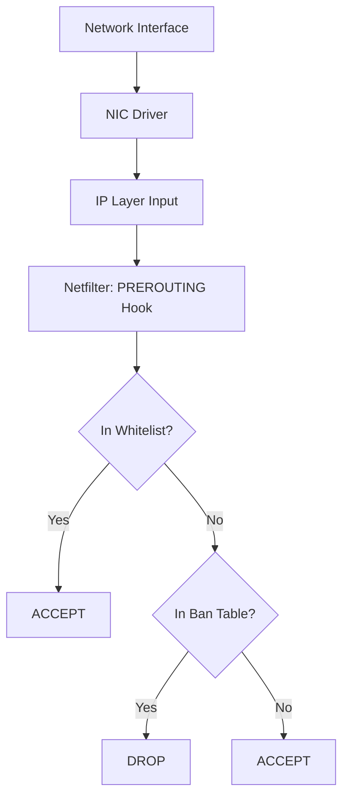
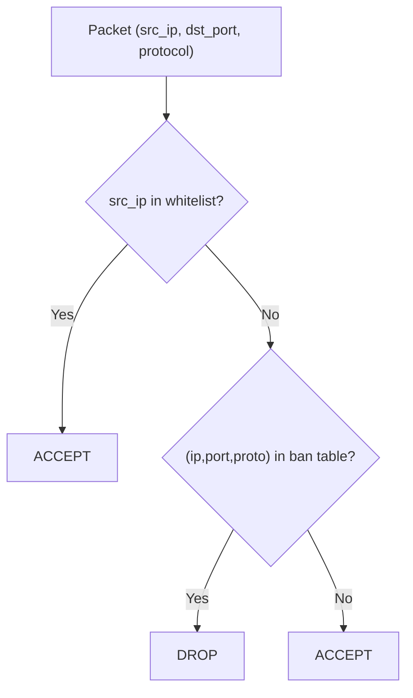
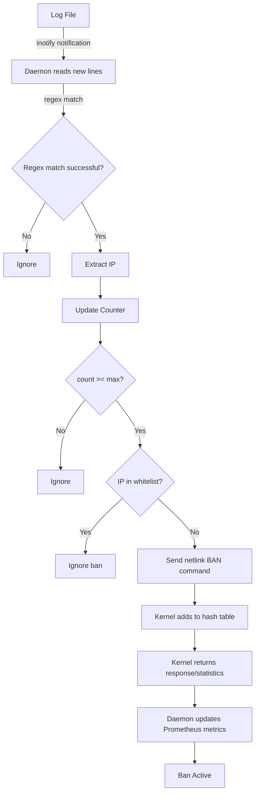
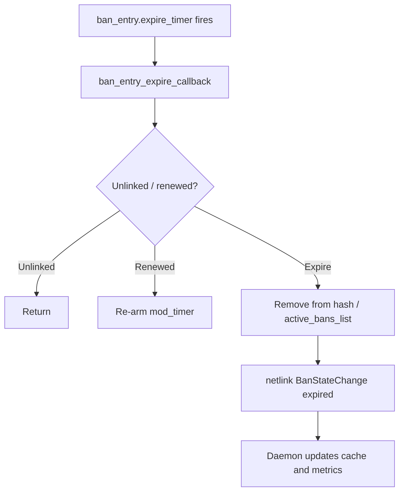
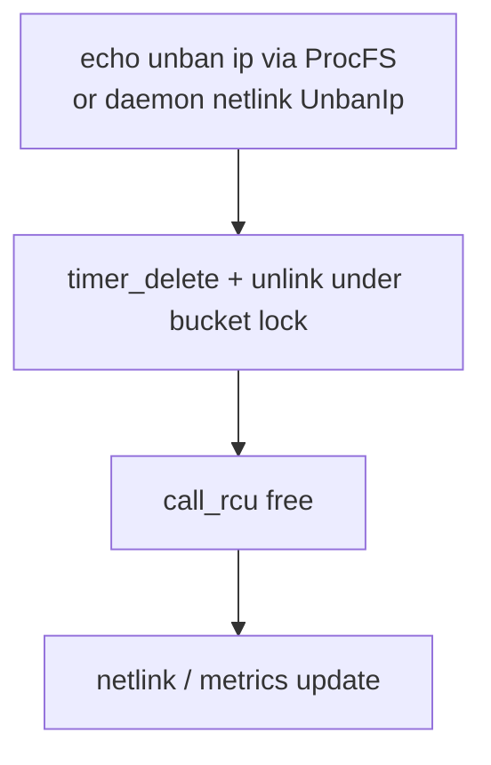
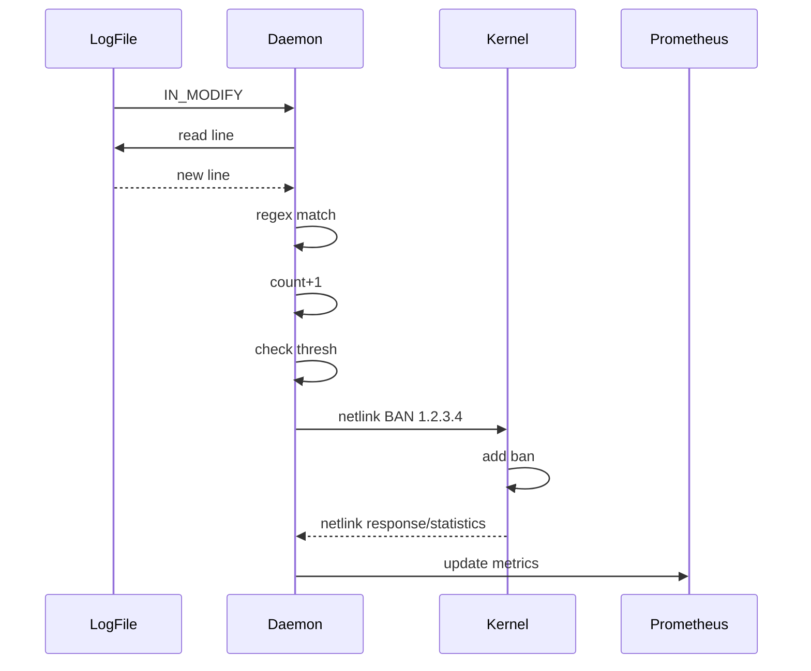
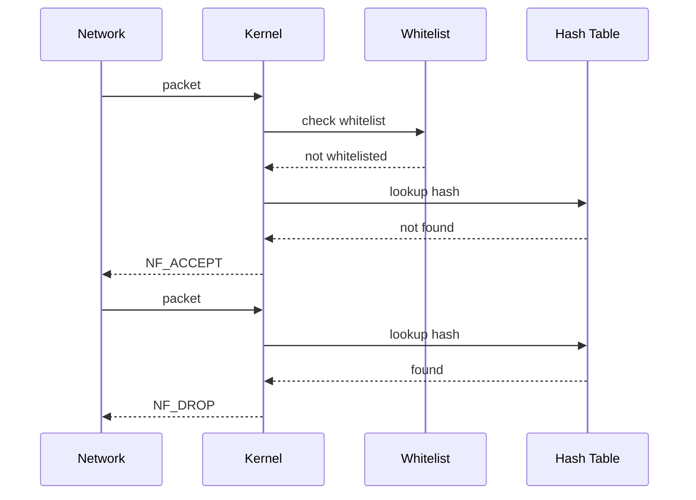

# Data Flow

This document describes the packet flow and event flow in the Linux Firewall Kernel Module.

## Packet Processing Flow

### Inbound Packet Flow

### Ban Decision Tree

## Ban Event Flow

### Complete Ban Flow

## Unban Event Flow

### Automatic Unban

### Manual Unban

## Inter-Component Communication

### Userspace -> Kernel

| Method | Interface | Purpose |
|--------|-----------|---------|
| netlink | Kernel-module protocol | Daemon bans, unbans, whitelist changes, and configuration |
| ProcFS write | `/proc/firewall/bans` | Manual user ban / unban (`unban <ip>`) |
| ProcFS write | `/proc/firewall/whitelist` | Manual user whitelist changes |

> `/proc/firewall/config` and `/proc/firewall/stats` are read-only.
> The module does not provide a "clear all" command — unban one by one
> or reload the module. Daemon-to-kernel traffic uses netlink; ProcFS
> remains available for users and compatibility.

### Kernel -> Userspace

| Method | Interface | Purpose |
|--------|-----------|---------|
| netlink | Kernel-module protocol | Command responses, statistics, state snapshots, and DDoS events |
| ProcFS read | `/proc/firewall/config` | Get ban_time, current ban/whitelist counts |
| ProcFS read | `/proc/firewall/bans` | Get banned IP list |
| ProcFS read | `/proc/firewall/whitelist` | Get whitelist |
| ProcFS read | `/proc/firewall/stats` | Get counters |

### Internal Communication

| Component | Communication | Data |
|-----------|---------------|------|
| Daemon -> HTTP clients | HTTP (axum) | Web UI, JSON API, SSE, health checks, and Prometheus metrics |
| Daemon -> Log | File I/O | Operation logs |

## Sequence Diagrams

### Ban Sequence

### Packet Processing Sequence

## Performance Characteristics

### Packet Processing Latency

| Scenario | Latency |
|----------|---------|
| Whitelist match | ~50ns |
| Hash lookup (miss) | ~100ns |
| Hash lookup (hit) | ~100ns |
| Total (normal traffic) | ~150ns |

### Throughput

| Configuration | Performance |
|---------------|-------------|
| Empty table | Line rate (10Gbps+) |
| Full table (4096) | Line rate (10Gbps+) |
| Whitelist (64) | Line rate (10Gbps+) |

### Bottleneck Analysis

| Component | Bottleneck | Optimization |
|-----------|------------|--------------|
| Netfilter Hook | None | RCU read, zero lock contention |
| Hash lookup | Hash collisions | jhash uniform distribution |
| Whitelist lookup | Linear scan | Small capacity (64), negligible impact |
