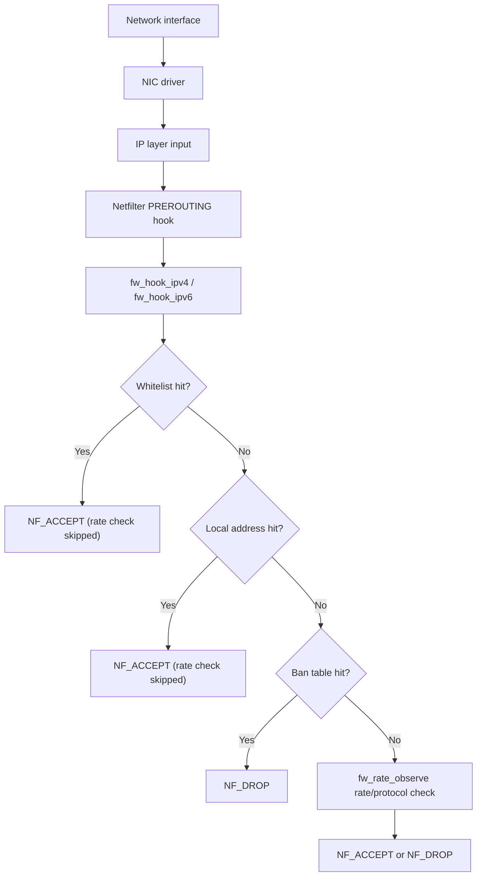
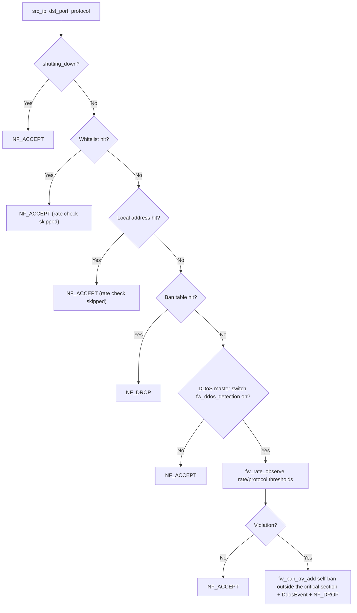
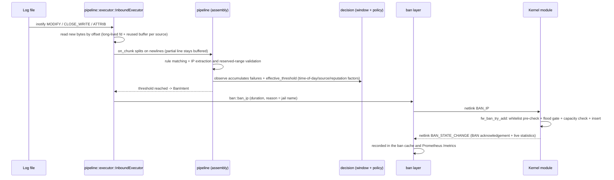
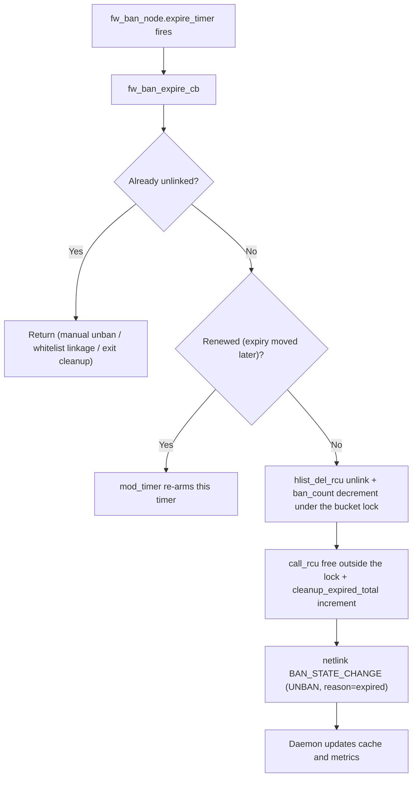
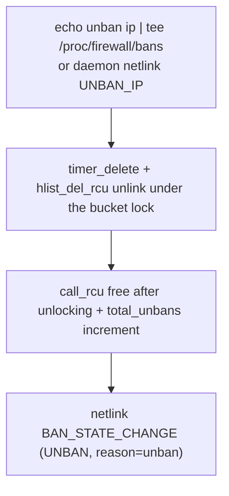
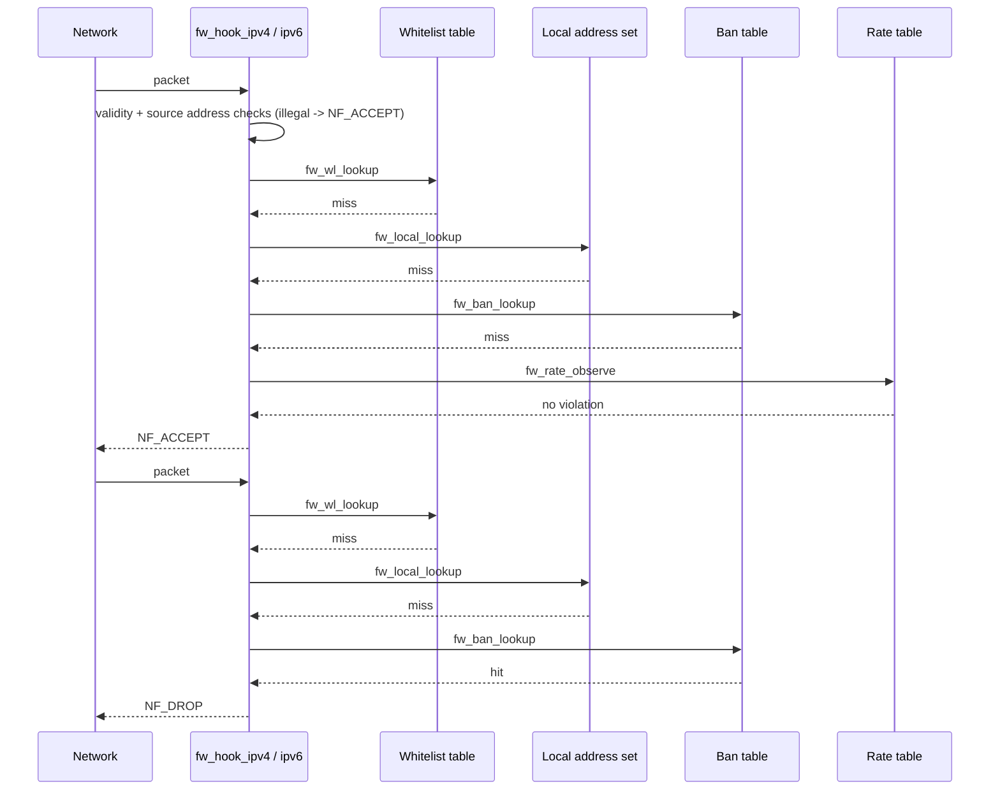

# Data Flow

This document describes the **packet decision path**, the **ban/unban event chain**, and the communication channels between the kernel module and the daemon. The kernel-side implementation lives in `src/kernel-module/` (currently the `fw_*` files); the interfaces are defined by `contract/*.fwidl`.

Related documents:

- Kernel internals, all module parameters and hash table sizes: `kernel-module.md`
- Daemon-side module layout: `daemon.md`
- procfs read/write grammar: `docs/en/configuration/procfs.md`

## Packet Processing Flow

### Inbound Packet Flow


```mermaid
graph TB
    A["Network interface"] --> B["NIC driver"]
    B --> C["IP layer input"]
    C --> D["Netfilter PREROUTING hook"]
    D --> E["fw_hook_ipv4 / fw_hook_ipv6"]
    E --> F{"Whitelist hit?"}
    F -->|Yes| G["NF_ACCEPT (rate check skipped)"]
    F -->|No| H{"Local address hit?"}
    H -->|Yes| I["NF_ACCEPT (rate check skipped)"]
    H -->|No| J{"Ban table hit?"}
    J -->|Yes| K["NF_DROP"]
    J -->|No| L["fw_rate_observe rate/protocol check"]
    L --> M["NF_ACCEPT or NF_DROP"]
```

The hooks are registered on `init_net` only, at `NF_INET_PRE_ROUTING`, with priority `NF_IP_PRI_FILTER - 1`, one for IPv4 and one for IPv6:

```c
/* src/kernel-module/fw_hook.c:71-85: netfilter hook registration table; fw_main.c
   registers and unregisters them in order during init/exit. */
struct nf_hook_ops nf_ops_ipv4 = {
  .hook = fw_hook_ipv4,
  .pf = NFPROTO_IPV4,
  .hooknum = NF_INET_PRE_ROUTING,
  .priority = NF_IP_PRI_FILTER - 1,
};

struct nf_hook_ops nf_ops_ipv6 = {
  .hook = fw_hook_ipv6,
  .pf = NFPROTO_IPV6,
  .hooknum = NF_INET_PRE_ROUTING,
  .priority = NF_IP_PRI_FILTER - 1,
};
```

### Ban Decision Tree

The decision completes inside **a single RCU critical section** in `fw_ban_check()` (the old implementation entered and left RCU in three separate places), and the order is fixed:


```mermaid
graph TB
    A["src_ip, dst_port, protocol"] --> B{"shutting_down?"}
    B -->|Yes| ACC1["NF_ACCEPT"]
    B -->|No| C{"Whitelist hit?"}
    C -->|Yes| ACC2["NF_ACCEPT (rate check skipped)"]
    C -->|No| D{"Local address hit?"}
    D -->|Yes| ACC3["NF_ACCEPT (rate check skipped)"]
    D -->|No| E{"Ban table hit?"}
    E -->|Yes| DR1["NF_DROP"]
    E -->|No| F{"DDoS master switch fw_ddos_detection on?"}
    F -->|No| ACC4["NF_ACCEPT"]
    F -->|Yes| G["fw_rate_observe rate/protocol thresholds"]
    G --> H{"Violation?"}
    H -->|No| ACC5["NF_ACCEPT"]
    H -->|Yes| DR2["fw_ban_try_add self-ban outside the critical section + DdosEvent + NF_DROP"]
```

```c
/* src/kernel-module/fw_hook.c:108-115: the four-step decision inside a single RCU
   critical section. Whitelist and local address are both "pass and skip the rate
   check" short-circuits; the local-address test must precede the ban table, or a
   local address would be dropped by its own ban entry. */
if (!fw_wl_lookup(af, src) && !fw_local_lookup(af, src)) {
  if (fw_ban_lookup(af, src)) {
    banned = true;
  } else if (likely(READ_ONCE(fw_ddos_detection))) {
    reason = fw_rate_observe(af, src, packet_len, protocol, tcp_flags, dst_port, &pps);
  }
}
```

Checks performed before entering `fw_ban_check()` (`src/kernel-module/fw_hook.c:165-187`, `:246-252`): an illegal packet length / version / header length / checksum, or an invalid source address, always yields `NF_ACCEPT` without touching any table and without counting a drop; a TCP flag anomaly (`SYN+FIN` / `SYN+RST` / all four primary flags clear) yields `NF_DROP` and is counted in `packets_dropped` and `tcp_anomaly_dropped`. The self-ban runs **outside** the RCU critical section (it takes a bucket lock, allocates memory, and pushes a netlink event).

### Whitelist Lookup: Exact Bucket -> Subnet List

The whitelist is not a linear scan: exact addresses go through a hash bucket, and only subnet entries go through prefix matching over the subnet list.

```c
/* src/kernel-module/fw_wl.c:114-131: whitelist hit test.
   1) the exact bucket (entries whose prefix length is the full length);
   2) the subnet list (prefix entries covering the address). */
bool fw_wl_lookup(u8 af, const void *ip) {
  struct fw_wl_entry *e;

  /* 1) 精确桶：地址与前缀全长的条目 */
  hlist_for_each_entry_rcu(e, fw_wl_bucket_head(af, ip), hash) {
    if (e->af != af || !fw_wl_is_full_prefix(af, e->prefix_len))
      continue;
    if (fw_addr_equal(af, &e->addr, ip))
      return true;
  }

  /* 2) 子网链：存在覆盖该地址的前缀条目 */
  list_for_each_entry_rcu(e, fw_wl_subnet_list(af), subnet_node) {
    if (fw_prefix_match(af, ip, &e->addr, e->prefix_len))
      return true;
  }

  return false;
}
```

### Table Sizes: Buckets Are Not Capacity

| Table | Structure | Buckets | Entry cap |
|-------|-----------|---------|-----------|
| Ban table | hlist + RCU + per-bucket spinlock | 4096 (`BAN_HASH_BITS` = 12) | module parameter `fw_max_ban_entries` (default 65535) |
| Whitelist | 64 exact buckets + subnet list | 64 (`WHITELIST_HASH_BITS` = 6) | module parameter `fw_max_whitelist_entries` (default 65535) |
| Rate table | hlist + RCU + per-bucket spinlock + per-CPU slots | 65536 (`RATE_HASH_BITS` = 16) | module parameter `fw_max_rate_entries` (default 65536) |
| Local address set | open-addressing hash set (linear probing) | power of two; lower bound `fw_max_local_ips` (default 256), hard upper bound 2^16 | grows with the actual address count, no entry cap |

4096 / 64 / 65536 are all **hash bucket counts** (`src/kernel-module/fw_types.h:72-81`), not entry capacities; entry caps come from module parameters (`src/kernel-module/fw_main.c:71-74`). The local address set is an O(1) probe (`src/kernel-module/fw_local.c:70-88`), not an O(N) per-packet linear scan. Per-table details and all parameters are in `kernel-module.md`.

## Ban Event Flow

The diagram below is the **currently running production path**: `main.rs` first creates the `SignalFd` (`src/daemon/main.rs:127`; the signals must be blocked before any thread is created), then assembles the inbound executor `pipeline::executor::InboundExecutor` (`src/daemon/main.rs:230`) and hands it to the `Supervisor` (`src/daemon/main.rs:420`). That executor is the single assembly point for the four segments `ingest` (inotify + per-source incremental reads) -> `parse` (line splitting and rule matching) -> `decision` (thresholds and ban plans) -> `pipeline` (the assembly); one **single** thread drives them sequentially and the signal fd is polled together with the inotify fd (`src/daemon/pipeline/executor.rs:263`). The legacy `file_monitor/`, `signals.rs`, `log_rotation.rs` and `line_processor.rs` were retired in this batch.


```mermaid
sequenceDiagram
    participant Log as Log file
    participant EX as pipeline::executor::InboundExecutor
    participant Pipe as pipeline (assembly)
    participant Win as decision (window + policy)
    participant Ban as ban layer
    participant Kernel as Kernel module

    Log->>EX: inotify MODIFY / CLOSE_WRITE / ATTRIB
    EX->>EX: read new bytes by offset (long-lived fd + reused buffer per source)
    EX->>Pipe: on_chunk splits on newlines (partial line stays buffered)
    Pipe->>Pipe: rule matching + IP extraction and reserved-range validation
    Pipe->>Win: observe accumulates failures + effective_threshold (time-of-day/source/reputation factors)
    Pipe-->>EX: threshold reached -> BanIntent
    EX->>Ban: ban::ban_ip (duration, reason = jail name)
    Ban->>Kernel: netlink BAN_IP
    Kernel->>Kernel: fw_ban_try_add: whitelist pre-check + flood gate + capacity check + insert
    Kernel-->>Ban: netlink BAN_STATE_CHANGE (BAN acknowledgement + live statistics)
    Ban->>Ban: recorded in the ban cache and Prometheus /metrics
```

Key facts:

- The watch mask is `MODIFY | ATTRIB | CLOSE_WRITE | MOVE_SELF | DELETE_SELF` (`src/daemon/ingest/watcher.rs:27`). Log content changes trigger reads (`drain_source` at `src/daemon/pipeline/executor.rs:399` via `read_new` at `src/daemon/ingest/reader.rs:111`), while `MOVE_SELF` / `DELETE_SELF` trigger rotation handling that re-attaches to the new inode (`src/daemon/pipeline/executor.rs:500`).
- A source's identity is the stable `SourceId`, no longer a `Vec<FileState>` index (`src/daemon/ingest/registry.rs`); each source holds a long-lived fd plus a reused read buffer and feeds whole batches to the decision layer.
- The effective threshold is not the raw configured `max_retries`, but the result of applying the time-of-day (peak x1.5), source (private network x2.0) and reputation-score factors (`src/daemon/decision/policy.rs:80`); the failure is recorded before the reputation score is read, and that order is part of the semantics (`src/daemon/pipeline/mod.rs:352`).
- The daemon keeps only application-layer detection (e.g. SSH brute force); network-layer DDoS detection has moved down into the kernel hook, and a kernel self-ban is pushed to the consumer as `DDOS_EVENT` (`src/daemon/inbound.rs:185`).
- Periodic maintenance lives in two places with a single owner each: on the inbound side (failure-window cleanup, watch rescan, history snapshot, data cleanup) the inbound executor's own monotonic-clock timer table drives them (`src/daemon/pipeline/executor.rs:844`), while the kernel side (counter mirroring, expired-ban purge) is driven by `runtime::spawn_periodic`.
- The kernel-side ban entry point is unified: procfs, netlink and DDoS self-ban all go through `fw_ban_try_add()` (whitelist pre-check -> flood gate -> capacity check) (`src/kernel-module/fw_ban.c:335-357`).

## Unban Event Flow

### Automatic Unban

Every ban entry carries its own per-entry timer; there is no global cleanup thread (so `cleanup_cycles` is always 0).


```mermaid
graph TB
    A["fw_ban_node.expire_timer fires"] --> B["fw_ban_expire_cb"]
    B --> C{"Already unlinked?"}
    C -->|Yes| D["Return (manual unban / whitelist linkage / exit cleanup)"]
    C -->|No| E{"Renewed (expiry moved later)?"}
    E -->|Yes| F["mod_timer re-arms this timer"]
    E -->|No| G["hlist_del_rcu unlink + ban_count decrement under the bucket lock"]
    G --> H["call_rcu free outside the lock + cleanup_expired_total increment"]
    H --> I["netlink BAN_STATE_CHANGE (UNBAN, reason=expired)"]
    I --> J["Daemon updates cache and metrics"]
```

```c
/* src/kernel-module/fw_ban.c:151-175: the whole expiry callback runs inside an RCU
   read-side critical section. Deletion uses timer_delete() (non-blocking) +
   hlist_del_rcu() + call_rcu(); the grace period cannot complete before the callback
   returns, so the callback can never touch a freed node. */
  spin_lock_bh(&fw_info.ban_locks[bkt]);

  if (hlist_unhashed(&n->hash)) {
    /* 已被手动解封 / 白名单联动 / 退出清理摘链，本回调无需再动 */
    spin_unlock_bh(&fw_info.ban_locks[bkt]);
    rcu_read_unlock();
    return;
  }
  /* 续期竞态：到期前被延长，则重武装本次定时器 */
  if (!READ_ONCE(n->is_permanent) && time_before(jiffies, READ_ONCE(n->unban_jiffies))) {
    mod_timer(&n->expire_timer, n->unban_jiffies);
    spin_unlock_bh(&fw_info.ban_locks[bkt]);
    rcu_read_unlock();
    return;
  }

  hlist_del_rcu(&n->hash);
  atomic_dec(&fw_info.ban_count);
  spin_unlock_bh(&fw_info.ban_locks[bkt]);

  rcu_read_unlock();

  fw_stat_add_expired(1);
  call_rcu(&n->rcu, fw_ban_free_rcu);
  fw_nl_send_ban_state_change(FW_BAN_ACTION_UNBAN, af, &addr, 0, "expired", NULL);
```

### Manual Unban


```mermaid
graph TB
    A["echo unban ip | tee /proc/firewall/bans<br/>or daemon netlink UNBAN_IP"] --> B["timer_delete + hlist_del_rcu unlink under the bucket lock"]
    B --> C["call_rcu free after unlocking + total_unbans increment"]
    C --> D["netlink BAN_STATE_CHANGE (UNBAN, reason=unban)"]
```

```c
/* src/kernel-module/fw_ban.c:373-387: manual unban. Under the bucket lock it only does
   "delete the timer + unlink + decrement the count"; freeing goes through call_rcu
   outside the lock, and timer_delete_sync() is never called while holding the lock. */
  spin_lock_bh(&fw_info.ban_locks[bkt]);
  n = fw_ban_find_locked(af, addr, bkt);
  if (!n) {
    spin_unlock_bh(&fw_info.ban_locks[bkt]);
    return -ENOENT;
  }
  timer_delete(&n->expire_timer);
  hlist_del_rcu(&n->hash);
  atomic_dec(&fw_info.ban_count);
  spin_unlock_bh(&fw_info.ban_locks[bkt]);

  call_rcu(&n->rcu, fw_ban_free_rcu);
  fw_stat_inc_unbans();

  if (notify)
    fw_nl_send_ban_state_change(FW_BAN_ACTION_UNBAN, af, &a, 0, "unban", NULL);
```

### Whitelist Change Linkage

After a whitelist entry is removed successfully, ban entries covered by it are lifted as well (the same path is reused by procfs and netlink):

```c
/* src/kernel-module/fw_wl.c:236-238: a whitelist removal triggers linked unbanning.
   fw_ban_del_matching walks every bucket and lifts the entries inside
   (network / prefix_len). */
  spin_unlock_bh(&fw_info.wl_lock);

  /* 白名单变更后，落在其覆盖范围内的封禁一并解除 */
  fw_ban_del_matching(af, ip, prefix_len);
```

## Inter-Component Communication

### Userspace -> Kernel

| Method | Interface | Purpose |
|--------|-----------|---------|
| netlink | `BAN_IP` / `UNBAN_IP` / `ADD_WHITELIST` / `REMOVE_WHITELIST` / `SET_CONFIG` | Daemon issues bans, unbans, whitelist changes and configuration updates |
| ProcFS write | `/proc/firewall/bans` (0600) | Manual ban / unban: `<ip>` / `<ip> <seconds>` / `<ip> 0` (permanent) / `unban <ip>` |
| ProcFS write | `/proc/firewall/whitelist` (0600) | `add <subnet>` / `<subnet>` / `remove <subnet>` |
| ProcFS write | `/proc/firewall/config` (0600) | `ban_time <seconds>`; a successful write pushes a `CONFIG_CHANGE` event |

- `/proc/firewall/config` **is writable** (`src/kernel-module/fw_procfs.c:493-534`); it is not a read-only interface. The old documentation calling it read-only was contract defect `PROC_CONFIG_DOC_SAYS_READONLY` (fixed).
- On the write side, one `write(2)` carries one command; a failure returns a **negative errno** with no textual error channel (defect `PROC_WRITE_NO_TEXT_ERROR`, intentionally retained). For the exact errno values see `docs/en/configuration/procfs.md`.
- Whitelist `remove` rejects a local interface address based on the **exact host address** only (`src/kernel-module/fw_wl.c:218`) instead of comparing subnets (defect `PROC_WHITELIST_REMOVE_SUBNET_OVERREACH`, fixed).

### Kernel -> Userspace

| Method | Interface | Purpose |
|--------|-----------|---------|
| netlink multicast (group 1) | `DDOS_EVENT` / `BAN_STATE_CHANGE` / `WHITELIST_STATE_CHANGE` / `CONFIG_CHANGE` / `CMD_RESULT` / `DAEMON_REGISTER_ACK` | Violation events, state changes, command failure acknowledgements, registration confirmation |
| netlink unicast | `LIST_BANS_RESPONSE` / `LIST_WHITELIST_RESPONSE` / `LIST_RATES_RESPONSE` / `STATS_RESPONSE` / `ANALYSIS_RESPONSE` | Query responses (lists are paged by offset/limit) |
| ProcFS read | `/proc/firewall/stats` (0400) | 13 `key value` counters (`read_format = machine`) |
| ProcFS read | `/proc/firewall/{rates,udp_ports,icmp_types,pkt_sizes,ttl_dist,ip_frags,port_scanners,service_probes}` (all 0400) | Analysis tables (`read_format = unstable`, no ordering guarantee) |

- `stats` is read after `fw_stats_snapshot()` flushes across CPUs (`src/kernel-module/fw_procfs.c:549-552`), matching the netlink `STATS_QUERY` semantics; the stale reads caused by the old implementation not flushing were contract defect `PROC_STATS_STALE_NO_FLUSH` (fixed).
- There are 12 procfs entries in total (3 writable + 9 read-only); the list and permissions are in `contract/procfs.fwidl` and `docs/en/configuration/procfs.md`.
- The module provides no native "clear all bans" command: unbans must be issued one by one, or the module reloaded.

### Internal Communication

| Component | Communication | Data |
|-----------|---------------|------|
| Daemon -> HTTP clients | HTTP (axum) | `/metrics` (Prometheus scraping), `/api/v1/*` (JSON API and `/api/v1/events` SSE), `/health` and `/healthz` |
| Daemon -> kernel | netlink | `STATS_QUERY` + `ANALYSIS_QUERY` every second, plus a `LIST_BANS_QUERY` reconciliation every 60th tick (`src/daemon/main.rs:380-399`) |
| Daemon -> log | File I/O | Operation logs |

## Packet Decision Sequence


```mermaid
sequenceDiagram
    participant Net as Network
    participant Hook as fw_hook_ipv4 / ipv6
    participant WL as Whitelist table
    participant Local as Local address set
    participant Ban as Ban table
    participant Rate as Rate table

    Net->>Hook: packet
    Hook->>Hook: validity + source address checks (illegal -> NF_ACCEPT)
    Hook->>WL: fw_wl_lookup
    WL-->>Hook: miss
    Hook->>Local: fw_local_lookup
    Local-->>Hook: miss
    Hook->>Ban: fw_ban_lookup
    Ban-->>Hook: miss
    Hook->>Rate: fw_rate_observe
    Rate-->>Hook: no violation
    Hook-->>Net: NF_ACCEPT

    Net->>Hook: packet
    Hook->>WL: fw_wl_lookup
    WL-->>Hook: miss
    Hook->>Local: fw_local_lookup
    Local-->>Hook: miss
    Hook->>Ban: fw_ban_lookup
    Ban-->>Hook: hit
    Hook-->>Net: NF_DROP
```

## Performance Characteristics

For the measured per-packet cost on the kernel hot path and how to reproduce it, see the [performance baseline](../development/perf-baseline.md); the absolute numbers vary per machine, so they are not repeated here.

Two caveats must be kept when citing numbers from that document: the numbers are reference only (they are not directly comparable across machines or across paths); and conclusions must use the counter caliber (per softirq / per packet), while `function_graph` absolute values are not costs.
