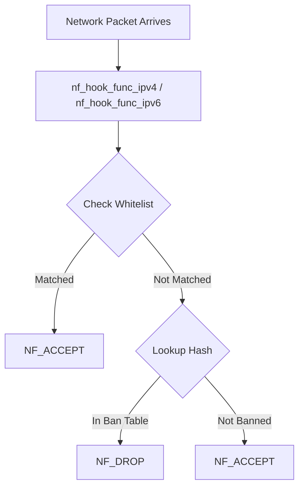
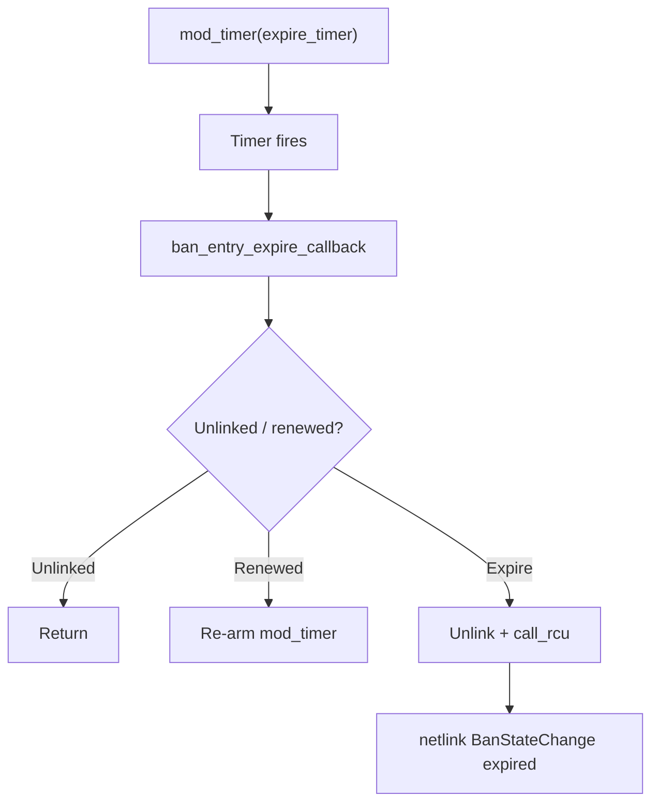
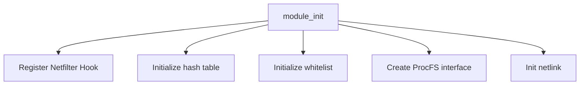
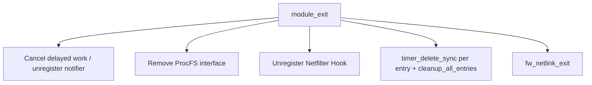

# Kernel Module

This document describes the implementation details of the Linux Firewall kernel module.

## Module Overview

The kernel module `firewall.ko` is the core of the system, responsible for intercepting and filtering packets at the network stack level.

### Module Information

| Attribute | Value |
|-----------|-------|
| Module Name | `firewall` |
| Source File | `src/kernel-module/firewall-main.c` |
| License | MIT |
| Load Path | `/lib/modules/$(uname -r)/extra/firewall.ko` |

## Netfilter Hook

### Hook Registration Point

The module registers a hook on the `NF_INET_PRE_ROUTING` chain, one of the earliest processing points after packets enter the network stack.

```c
struct nf_hook_ops nf_ops_ipv4 __read_mostly = {
    .hook     = nf_hook_func_ipv4,
    .pf       = NFPROTO_IPV4,
    .hooknum  = NF_INET_PRE_ROUTING,
    .priority = NF_IP_PRI_FIRST,
};

struct nf_hook_ops nf_ops_ipv6 __read_mostly = {
    .hook     = nf_hook_func_ipv6,
    .pf       = NFPROTO_IPV6,
    .hooknum  = NF_INET_PRE_ROUTING,
    .priority = NF_IP_PRI_FIRST,
};
```

### Hook Function Flow



### Return Values

| Return Value | Description |
|--------------|-------------|
| `NF_ACCEPT` | Allow packet to pass |
| `NF_DROP` | Drop the packet |

## Hash Table

### Data Structure

The kernel uses a hash table to store banned IP addresses with a capacity of 4096.

```c
#define HASH_TABLE_SIZE 4096

struct banned_ip {
    __be32 ip;                // IPv4 address
    u32 port;                 // Port
    u8 protocol;              // Protocol
    ktime_t ban_time;         // Ban time
    ktime_t expire_time;      // Expiration time
    char jail_name[64];       // Jail name
    struct hlist_node node;   // Hash list node
};
```

### Hash Function

```c
static inline u32 hash_ip(__be32 ip, u32 port)
{
    return jhash_2words((__force u32)ip, port, HASH_SEED) % HASH_TABLE_SIZE;
}
```

### Operation Complexity

| Operation | Complexity | Description |
|-----------|------------|-------------|
| Lookup | O(1) average | Hash lookup |
| Insert | O(1) average | Head insertion |
| Delete | O(1) average | List deletion |

## RCU Concurrency Control

### Read Operations

The packet processing path uses RCU read locks, ensuring multi-CPU concurrency safety without lock contention:

```c
rcu_read_lock();
entry = firewall_lookup(ip, port);
rcu_read_unlock();
```

### Write Operations

Adding/removing bans uses RCU write synchronization:

```c
spin_lock(&hash_lock);
hlist_add_head_rcu(&entry->node, &hash_table[hash]);
spin_unlock(&hash_lock);
synchronize_rcu();
```

### Advantages

| Feature | Description |
|---------|-------------|
| Lock-free reads | Packet processing path has no locks, extremely low latency |
| Multi-CPU | Supports all CPU cores processing in parallel |
| Safe | Guarantees readers see consistent data |

## Whitelist

### Data Structure

The whitelist uses a fixed-size array with a capacity of 64.

```c
#define WHITELIST_SIZE 64

struct whitelist_entry {
    __be32 ip;          // IP address
    __be32 mask;        // Subnet mask
    bool active;        // Whether active
};
```

### Matching Logic

Whitelist check is performed before hash table lookup, ensuring whitelisted IPs are never banned:

```c
if (is_whitelisted(ip)) {
    return NF_ACCEPT;
}
```

### CIDR Support

The whitelist supports CIDR notation, matching via subnet mask:

```c
/* Real implementation in src/kernel-module/whitelist.c */
bool is_in_whitelist(struct firewall_info *fw, u8 af, const void *ip)
{
    struct whitelist_entry *entry;
    /* Two-stage matching: exact match (O(1) hash bucket) first,
     * then walk CIDR subnets. */
    ...
}
```

## Auto-Expiry Cleanup

### Per-entry timers

Temporary bans do **not** rely on a global cleanup thread scanning the
hash table. Each non-permanent `ban_entry` owns an `expire_timer`
(`timer_list`). On expiry the softirq callback unlinks the entry and
notifies the daemon (see `src/kernel-module/ban-manager.c`;
`cleanup.c` only provides RCU `kfree` callbacks):

```c
/* Real implementation in src/kernel-module/ban-manager.c */
void ban_entry_expire_callback(struct timer_list *t)
{
    struct ban_entry *entry = container_of(t, struct ban_entry, expire_timer);
    /* Under bucket lock: return if already unlinked; re-arm if renewed */
    /* Otherwise unlink from hash / active_bans_list, call_rcu, then */
    /* fw_netlink_send_ban_state_change(..., "expired", ...) */
}
```

On successful ban:

```c
timer_setup(&entry->expire_timer, ban_entry_expire_callback, 0);
if (!is_permanent)
    mod_timer(&entry->expire_timer, unban_time);  /* absolute jiffies */
```

### Strategy

| Item | Behavior |
|------|----------|
| Trigger | Per-entry `mod_timer`; callback fires at expiry (nftables-style set timeout) |
| Permanent bans | Still `timer_setup`, but never `mod_timer` |
| Renew | Update `unban_time` then `mod_timer`; in-flight callback re-arms if not due |
| Manual unban | `timer_delete` (non-`_sync`) under bucket lock + unlink + `call_rcu` |
| Userspace | Daemon follows netlink `BanStateChange`; local cache `expires_at` purge does **not** unban in-kernel |

### Expiry flow



## ProcFS Interface

### Registration

```c
static int __init firewall_proc_init(void)
{
    proc_create("firewall/bans", 0200, NULL, &bans_fops);
    proc_create("firewall/whitelist", 0200, NULL, &whitelist_fops);
    proc_create("firewall/config", 0444, NULL, &config_fops);
    proc_create("firewall/stats", 0444, NULL, &stats_fops);
    return 0;
}
```

### File Operations

| File | Permission | Operation |
|------|------------|-----------|
| `bans` | 0200 | Write-only, ban/unban IP addresses |
| `whitelist` | 0200 | Write-only, add/remove whitelist entries |
| `config` | 0444 | Read-only, returns current configuration |
| `stats` | 0444 | Read-only, returns statistics |

## Module Lifecycle

### Initialization



### Exit



## Kernel Logging

Uses `pr_*` macros for logging:

```c
pr_info("firewall: module loaded\n");
pr_warn("firewall: hash table full\n");
pr_err("firewall: failed to register hook\n");
```

Debug level is controlled via compile-time macro:

```bash
make debug DL=2    # Enable debug level 2
```