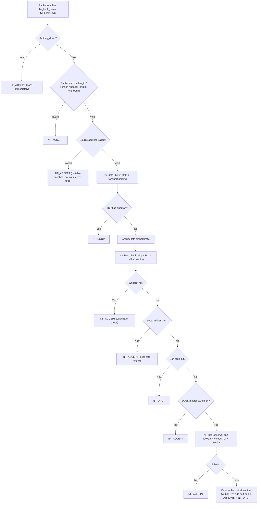
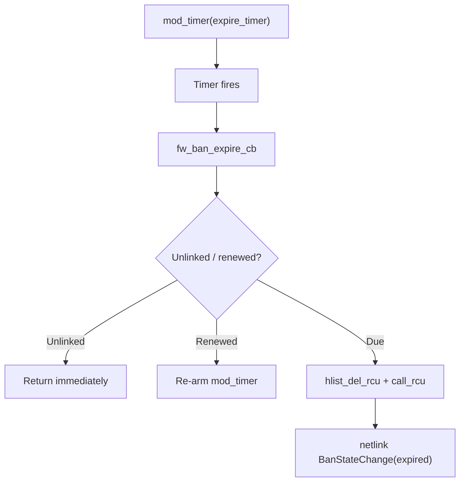
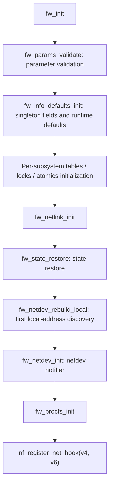
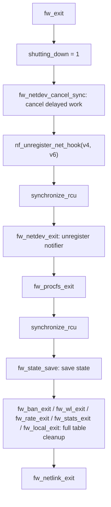

# Kernel Module

This document describes the internal structure of the Linux Firewall kernel module as currently implemented in `src/kernel-module/` (12 `fw_*` files: `fw_types.h` plus 11 `fw_*.c`, plus one private header per module).

The code is split by **data ownership**: each file owns exactly one set of data and exposes one narrow interface; cross-module calls go through the narrow interfaces declared in the owner's header. The external interfaces (the netlink wire format and the procfs text protocol) are frozen by `contract/*.fwidl`; implementations must not deviate from the generated artifacts.

Related documents:

- Interface details (read/write grammar of the 12 procfs entries, module parameters, error codes): `docs/en/configuration/procfs.md`
- Rewrite goals and design decisions: `docs/en/development/kernel-rewrite-design.md`

## Module Overview

The kernel module `firewall.ko` intercepts **inbound** packets at the network stack level: at `NF_INET_PRE_ROUTING` it evaluates the whitelist, the local-address set, the ban table, and rate violations in order, dropping the packet when the ban table matches.

### Module Information

| Attribute | Value |
|-----------|-------|
| Module Name | `firewall` |
| Entry File | `src/kernel-module/fw_main.c` (`module_init` / `module_exit`) |
| Source Files | 12 `fw_*` files under `src/kernel-module/`, plus one private header `fw_*.h` per module |
| License | Dual MIT/GPL |
| Version | `2.2` (`MODULE_VERSION` in `fw_main.c`) |
| Load Path | `/lib/modules/$(uname -r)/extra/firewall.ko` |

### Source Files and Data Ownership

| File | Data Ownership | Interface |
|------|----------------|-----------|
| `fw_types.h` | None (types, constants, hot-path `static inline` primitives) | Pulls in the contract-generated headers; internal structs; constants such as `BAN_HASH_BITS` |
| `fw_main.c` | Module lifecycle, the `fw_info` singleton | `module_param`, `fw_init` / `fw_exit`, the `shutting_down` state |
| `fw_stats.c` | Per-CPU statistics, histograms, and analysis distributions | `fw_stat_account()` (hot path), `fw_stats_flush_all()`, snapshot functions |
| `fw_local.c` | Local-address set (open-addressing hash set) | `fw_local_lookup()` (hot-path RCU read), set construction and publication |
| `fw_wl.c` | Whitelist exact buckets + subnet chain | `fw_wl_lookup()` (hot-path RCU read), `fw_wl_add` / `fw_wl_remove` |
| `fw_ban.c` | Ban table | `fw_ban_lookup()` (hot-path RCU read), `fw_ban_try_add()`, per-entry timers |
| `fw_rate.c` | Rate table, window rolling, EWMA, violation decision | `fw_rate_observe()` (hot path; one table lookup returns the verdict) |
| `fw_hook.c` | Netfilter hook registration and packet parsing | None (exposes only the `nf_ops_ipv4` / `nf_ops_ipv6` registration structs) |
| `fw_netlink.c` | Netlink socket and send/receive | `fw_netlink_init` / `fw_netlink_exit`, `fw_nl_send_*()` |
| `fw_procfs.c` | The 12 procfs entries | `fw_procfs_init` / `fw_procfs_exit` |
| `fw_state.c` | State-file read/write | `fw_state_save()`, `fw_state_restore()` |
| `fw_netdev.c` | Netdev notifier, local-address rebuild | `fw_netdev_init` / `fw_netdev_exit`, `fw_netdev_rebuild_local()` |

The hot-path primitives (`fw_addr_equal`, `fw_hash_addr`, `fw_prefix_match`, `fw_src_is_invalid_ipv4` / `_ipv6`, `fw_tcp_flag_anomaly`, `fw_is_shutting_down`, `fw_pkt_size_bucket`, `fw_ttl_bucket`) and `fw_stat_bump` are defined `static inline` in `fw_types.h` / `fw_stats.h`. The lookup functions that must traverse their own table (`fw_ban_lookup`, `fw_wl_lookup`, `fw_local_lookup`, `fw_rate_observe`, `fw_stat_account`) are ordinary functions in the owning `.c` file, declared by the corresponding header.

The module exports no symbols: the three `EXPORT_SYMBOL`s of the previous implementation (`get_fw_info()` / `is_banned()` / `is_permanently_banned()`) were removed, and the current implementation is self-contained.

## Netfilter Hook

### Hook Registration Point

The module registers two hooks at `NF_INET_PRE_ROUTING` (one IPv4, one IPv6) with priority `NF_IP_PRI_FILTER - 1`, i.e. it sees packets just before the filter table; the hooks are registered on `init_net` only.

```c
/* src/kernel-module/fw_hook.c: IPv4/IPv6 hook registration structs, registered and
 * unregistered in order by fw_main.c during init/exit */
struct nf_hook_ops nf_ops_ipv4 = {
  .hook = fw_hook_ipv4,
  .pf = NFPROTO_IPV4,
  .hooknum = NF_INET_PRE_ROUTING,
  .priority = NF_IP_PRI_FILTER - 1,
};

struct nf_hook_ops nf_ops_ipv6 = {
  .hook = fw_hook_ipv6,
  .pf = NFPROTO_IPV6,
  .hooknum = NF_INET_PRE_ROUTING,
  .priority = NF_IP_PRI_FILTER - 1,
};
```

### Hook Decision Flow


```mermaid
graph TB
    A["Packet reaches fw_hook_ipv4 / fw_hook_ipv6"] --> B{"shutting_down?"}
    B -->|Yes| ACC1["NF_ACCEPT (pass immediately)"]
    B -->|No| C{"Packet validity: length / version / header length / checksum"}
    C -->|Invalid| ACC2["NF_ACCEPT"]
    C -->|Valid| D{"Source address validity"}
    D -->|Invalid| ACC3["NF_ACCEPT (no table touched, not counted as drop)"]
    D -->|Valid| E["Per-CPU basic stats + transport parsing"]
    E --> F{"TCP flag anomaly?"}
    F -->|Yes| DR1["NF_DROP"]
    F -->|No| G["Accumulate global traffic"]
    G --> H["fw_ban_check: single RCU critical section"]
    H --> I{"Whitelist hit?"}
    I -->|Yes| ACC4["NF_ACCEPT (skips rate check)"]
    I -->|No| J{"Local address hit?"}
    J -->|Yes| ACC5["NF_ACCEPT (skips rate check)"]
    J -->|No| K{"Ban table hit?"}
    K -->|Yes| DR2["NF_DROP"]
    K -->|No| L{"DDoS master switch on?"}
    L -->|No| ACC6["NF_ACCEPT"]
    L -->|Yes| M["fw_rate_observe: one lookup + window roll + verdict"]
    M --> N{"Violation?"}
    N -->|No| ACC7["NF_ACCEPT"]
    N -->|Yes| O["Outside the critical section: fw_ban_try_add self-ban + DdosEvent + NF_DROP"]
```

### Single RCU Critical Section

`fw_ban_check()` reads all four tables (whitelist, local addresses, ban table, rate table) inside **one** RCU read-side critical section; the self-decided ban runs **outside** that section (it takes bucket locks, allocates memory, and pushes a netlink event, so the heavy work is kept out of the RCU read side).

```c
/* src/kernel-module/fw_hook.c: the decision body (excerpt). The whitelist and the
 * local-address set are both short-circuit conditions meaning "pass without rate check" */
rcu_read_lock();

/* Second check of the shutdown flag, paired with the first one at the hook entry (double check) */
if (unlikely(fw_is_shutting_down())) {
  rcu_read_unlock();
  return NF_ACCEPT;
}

if (!fw_wl_lookup(af, src) && !fw_local_lookup(af, src)) {
  if (fw_ban_lookup(af, src)) {
    banned = true;
  } else if (likely(READ_ONCE(fw_ddos_detection))) {
    reason = fw_rate_observe(af, src, packet_len, protocol, tcp_flags, dst_port, &pps);
  }
}

rcu_read_unlock();
```

The local-address check **must** precede the ban-table check: the local exemption lives in `fw_local.c` (the new design no longer writes interface addresses into the whitelist), and swapping the order would let a local address be dropped by its own ban entry.

### Return Values

| Return Value | Description |
|--------------|-------------|
| `NF_ACCEPT` | Pass: module shutting down, invalid packet or source address, whitelist hit, local-address hit, no ban-table hit and no violation |
| `NF_DROP` | Drop: TCP flag anomaly, ban-table hit, rate violation (the violating packet itself is dropped too) |

### Accounting

- Packets with an invalid source address touch no table and are not counted as drops.
- A TCP flag anomaly (`SYN+FIN` / `SYN+RST` / all four main flags clear) is counted in both `packets_dropped` and `tcp_anomaly_dropped`.
- Global traffic (`global_traffic_packets` / `global_traffic_bytes`) is accumulated after the anomaly check, so only packets that actually enter DDoS evaluation are counted.
- The IPv6 extension-header traversal depth limit is `FW_HOOK_MAX_EXT_HDR_DEPTH` (8); anything deeper is treated as malformed and dropped. ICMPv6 Echo Request is mapped to `IPPROTO_ICMP` so that protocol thresholds cover IPv6.

## Hash Structures

### Tables and Sizes

| Table | Structure | Buckets / Capacity | Capacity Limit Source |
|-------|-----------|--------------------|----------------------|
| Ban table | hlist + RCU + per-bucket spinlock | 4096 buckets (`BAN_HASH_BITS` = 12) | Module parameter `fw_max_ban_entries` (default 65535) |
| Whitelist | 64 exact buckets + subnet chain | 64 buckets (`WHITELIST_HASH_BITS` = 6) | Module parameter `fw_max_whitelist_entries` (default 65535) |
| Rate table | hlist + RCU + per-bucket spinlock + per-CPU slots | 65536 buckets (`RATE_HASH_BITS` = 16) | Module parameter `fw_max_rate_entries` (default 65536) |
| Local-address set | Open-addressing hash set (linear probing) | power of two; lower bound `fw_max_local_ips` (default 256), hard upper bound 2^16 | No entry limit: grows with the actual address count |
| UDP port analysis table | hlist + RCU | 256 buckets | `MAX_UDP_PORT_ENTRIES` (512) |
| ICMP type analysis table | hlist + RCU | 64 buckets | `MAX_ICMP_TYPE_ENTRIES` (128) |

IPv4 and IPv6 each get their own table (two each for bans, whitelist, and rates), selected by `af` through the `_ipv4` / `_ipv6` table heads. Bucket counts are not capacities: the ban table's 4096 is the number of hash buckets, while the entry limit is controlled by a module parameter.

### Hash Function

```c
/* src/kernel-module/fw_types.h: bucket index. v4 and v6 both use jhash with a
 * per-boot random seed, which defends against hash-collision attacks */
#define BAN_HASH_BITS 12
#define BAN_HASH_SIZE (1 << BAN_HASH_BITS)

static inline u32 fw_hash_addr(u8 af, const void *ip, int bits) {
  if (af == FW_AF_INET6)
    return jhash(ip, sizeof(struct in6_addr), fw_hash_seed) & ((1 << bits) - 1);
  return jhash_1word((__force u32) *(__be32 *)ip, fw_hash_seed) & ((1 << bits) - 1);
}
```

`fw_hash_seed` is filled with a per-boot random value by `fw_main.c` during init using `get_random_bytes()`, and is defined separately rather than inside `fw_info`.

### Ban Entry

```c
/* src/kernel-module/fw_types.h: the runtime ban entry.
 * The struct fw_ban_entry in the contract-generated header is the **wire format**
 * (packed, big-endian, used only when fw_netlink.c serializes); the runtime entry is
 * deliberately named fw_ban_node so it can carry timers, list nodes, and pointers. */
struct fw_ban_node {
  u8 af;
  u8 is_permanent;
  u32 duration_secs;           /* duration of this ban in seconds, 0 for permanent; updated on renewal */
  unsigned long banned_at;     /* ban start (jiffies) */
  unsigned long unban_jiffies; /* expiry point (jiffies); meaningless for permanent entries */
  union fw_addr addr;
  char jail_name[32];
  char reason[32];
  struct hlist_node hash;
  struct rcu_head rcu;
  struct timer_list expire_timer; /* per-entry expiry timer */
};
```

The ban table is stored at **IP granularity**: entries have no port or protocol fields, and no `retry_count` as in the old struct. `banned_at` uses jiffies internally and is converted to Unix seconds (`fw_ban_start_unix()`) when serialized for readers.

### Operation Complexity

| Operation | Complexity | Description |
|-----------|------------|-------------|
| Lookup | O(1) average | Hash to the bucket, then compare `(af, addr)` along the bucket list |
| Insert | O(1) average | `hlist_add_head_rcu`, completed under the bucket lock |
| Delete | O(1) average | `hlist_del_rcu` + `call_rcu` |
| Local-address lookup | O(1) average | Open addressing with linear probing; an empty slot ends the search as "absent" |
| Rate-entry lookup | O(1) average | Same as above; hot source addresses use a per-CPU slot and never touch the global table |

## RCU Concurrency Control

### Read Path

The packet path enters an RCU read-side critical section only once, inside `fw_ban_check()`, and reads all four tables there:

```c
/* src/kernel-module/fw_hook.c: the hot path is read-only and takes no spinlock at all */
rcu_read_lock();
/* fw_wl_lookup() / fw_local_lookup() / fw_ban_lookup() / fw_rate_observe() are all RCU read-only walks */
rcu_read_unlock();
```

Each lookup function walks with `hlist_for_each_entry_rcu` / `list_for_each_entry_rcu` and takes no lock.

### Write Path

All insertions and removals follow "publish or unlink first, then free after the grace period":

```c
/* src/kernel-module/fw_ban.c: the delete path (manual unban, whitelist linkage, and
 * exit cleanup are structurally identical) */
spin_lock_bh(&fw_info.ban_locks[bkt]);
timer_delete(&n->expire_timer);      /* non-waiting variant: we must not block on a running expiry callback */
hlist_del_rcu(&n->hash);
atomic_dec(&fw_info.ban_count);
spin_unlock_bh(&fw_info.ban_locks[bkt]);
call_rcu(&n->rcu, fw_ban_free_rcu);  /* kfree after the grace period ends */
```

The local-address set is rebuilt as a whole, published with `rcu_assign_pointer`, and the old set is freed with `kfree_rcu`; the exit path uses `synchronize_rcu()` + `rcu_barrier()` uniformly.

### Lock Ordering Protocol

`fw_types.h` documents the global lock order: apart from the single pair `rate_locks[bkt] → rate_slot_lock`, no two locks may be nested; when a cross-table operation is needed, release before acquiring.

| Lock | Protects | Acquisition |
|------|----------|-------------|
| `ban_locks[BAN_HASH_SIZE]` | Ban buckets, entry timers, unlinking | `spin_lock_bh` |
| `wl_lock` | Whitelist table, subnet chain, counters | `spin_lock_bh` |
| `rate_locks[RATE_HASH_SIZE]` | Rate buckets (cold path, entry creation only) | `spin_lock_bh` |
| `rate_slot_lock` | The per-CPU rate slot "probe an empty slot + publish" pair | `spin_lock_bh` (the only permitted nesting: bucket lock → slot lock) |
| `flood_lock` | Flood-protection window | `spin_lock_bh` |
| `udp_port_lock` / `icmp_type_lock` | Analysis tables (flush and lazy entry creation only) | `spin_lock_bh` |

### No Shared Cache-Line Writes

On the hot path each packet touches only memory of its own CPU: statistics and histograms land in the `alloc_percpu`'d `fw_stats_pcpu`; raw rate-window counters and the port-dedup set land in the per-CPU direct-mapped slots `fw_rate_cpu_slot`. Cross-CPU aggregation happens in exactly two places — window rolling (`fw_rate_roll()` aggregates the per-CPU slots and clears them) and the read-side flush (`fw_stats_flush_all()` aggregates synchronously with `on_each_cpu`) — neither of which is on the per-packet path.

## Whitelist

### Data Structure

The whitelist consists of two parts: **exact buckets** (64 hlist buckets) and a **subnet chain**.

```c
/* src/kernel-module/fw_types.h: whitelist entry. Exact entries go into buckets only;
 * subnet entries go into both a bucket and the subnet chain */
struct fw_wl_entry {
  u8 af;
  u8 prefix_len;
  union fw_addr addr;
  char device_name[16];
  struct hlist_node hash;       /* exact bucket node */
  struct list_head subnet_node; /* subnet chain node (used only when prefix < full length) */
  struct rcu_head rcu;
};
```

The subnet chain is a necessary design: a hit test never has to walk every bucket to compare prefixes. The table stores **normalized network addresses**; the write side runs `fw_addr_normalize()` first.

### Matching Logic

The whitelist check runs before the ban-table lookup; a hit passes the packet and skips the rate check:

```c
/* src/kernel-module/fw_wl.c: check the exact buckets first, then the subnet chain;
 * entries are immutable once published, so a whole-value comparison suffices */
bool fw_wl_lookup(u8 af, const void *ip) {
  /* 1) exact buckets: entries with a full-length prefix */
  hlist_for_each_entry_rcu(e, fw_wl_bucket_head(af, ip), hash) {
    if (e->af != af || !fw_wl_is_full_prefix(af, e->prefix_len))
      continue;
    if (fw_addr_equal(af, &e->addr, ip))
      return true;
  }

  /* 2) subnet chain: a prefix entry covering this address */
  list_for_each_entry_rcu(e, fw_wl_subnet_list(af), subnet_node) {
    if (fw_prefix_match(af, ip, &e->addr, e->prefix_len))
      return true;
  }

  return false;
}
```

### CIDR Support

Add and remove accept `<ip>` or `<ip>/<prefix>`; when the prefix is omitted, the full address-family length is used (IPv4 32, IPv6 128). Removal requires the `(af, address, prefix_len)` triple to match exactly.

| Item | Behavior |
|------|----------|
| Subnet prefix matching | `fw_prefix_match()`: IPv4 compares via a mask; IPv6 compares whole bytes first and then the remaining bits |
| Entry limit | Module parameter `fw_max_whitelist_entries` (default 65535), checked under `wl_lock`; at the limit it returns `-ENOSPC` and increments `whitelist_rejects` |
| Duplicate entries | The same `(af, normalized address, prefix_len)` is kept once; adding it again is not an error |
| Local interface addresses | Maintained automatically by `fw_netdev.c` from interface state; a manual `remove` that hits a local address returns `-EPERM` (decided on the exact host address, never by subnet comparison) |
| Change linkage | After a whitelist entry is removed, `fw_ban_del_matching()` unbans every ban entry covered by that prefix |
| Address admission | Rejects `0.0.0.0` / broadcast / multicast / loopback / link-local |

## Auto-Expiry Cleanup

### Per-Entry Timers

Temporary bans do not rely on a global cleanup thread scanning the table (that thread was replaced by per-entry timers and no longer exists). Every non-permanent `fw_ban_node` carries its own `expire_timer`, and the softirq callback unlinks the entry under the bucket lock:

```c
/* src/kernel-module/fw_ban.c: the expiry callback (structural excerpt). It holds the RCU
 * read-side critical section throughout, which makes it mutually exclusive with the
 * call_rcu frees on the delete path: the grace period cannot end before the callback returns. */
static void fw_ban_expire_cb(struct timer_list *t) {
  struct fw_ban_node *n = timer_container_of(n, t, expire_timer);

  rcu_read_lock();
  spin_lock_bh(&fw_info.ban_locks[bkt]);

  if (hlist_unhashed(&n->hash)) {           /* already unlinked by a manual unban / linkage / exit cleanup */
    spin_unlock_bh(&fw_info.ban_locks[bkt]);
    rcu_read_unlock();
    return;
  }
  if (!READ_ONCE(n->is_permanent) &&
      time_before(jiffies, READ_ONCE(n->unban_jiffies))) { /* renewal race: re-arm */
    mod_timer(&n->expire_timer, n->unban_jiffies);
    spin_unlock_bh(&fw_info.ban_locks[bkt]);
    rcu_read_unlock();
    return;
  }

  hlist_del_rcu(&n->hash);
  atomic_dec(&fw_info.ban_count);
  spin_unlock_bh(&fw_info.ban_locks[bkt]);
  rcu_read_unlock();

  fw_stat_add_expired(1);
  call_rcu(&n->rcu, fw_ban_free_rcu);
  fw_nl_send_ban_state_change(FW_BAN_ACTION_UNBAN, af, &addr, 0, "expired", NULL);
}
```

The timer is `timer_setup` at entry-allocation time, and only a temporary ban arms it with `mod_timer`:

```c
/* src/kernel-module/fw_ban.c: fw_ban_alloc() installs the callback; fw_ban_insert() decides whether to arm it */
timer_setup(&n->expire_timer, fw_ban_expire_cb, 0);
...
if (duration_secs)
  mod_timer(&n->expire_timer, n->unban_jiffies);  /* absolute jiffies expiry point */
```

### Strategy

| Item | Behavior |
|------|----------|
| Trigger | An independent `mod_timer` per entry, so the callback fires at expiry (one timer per entry) |
| Permanent bans | Still `timer_setup`, but never `mod_timer`, so they never expire |
| Renewal | Update the duration and `unban_jiffies` under the bucket lock, then `mod_timer`; if the old callback is already running, it re-compares `unban_jiffies` and re-arms when not yet due |
| Manual unban | Under the bucket lock: `timer_delete` (not `_sync`) + `hlist_del_rcu` + `call_rcu` |
| Free safety | The expiry callback holds an RCU read-side critical section, and a `call_rcu` free callback must wait for the grace period to end, so the callback can never touch a freed node; there is no need to call `timer_delete_sync()` while holding the bucket lock (that would self-deadlock) |
| Userspace | The daemon follows netlink `BanStateChange`; purging its local `expires_at` cache does **not** unban in-kernel |

### Expiry Flow


```mermaid
graph TB
    A["mod_timer(expire_timer)"] --> B["Timer fires"]
    B --> C["fw_ban_expire_cb"]
    C --> D{"Unlinked / renewed?"}
    D -->|Unlinked| E["Return immediately"]
    D -->|Renewed| F["Re-arm mod_timer"]
    D -->|Due| G["hlist_del_rcu + call_rcu"]
    G --> H["netlink BanStateChange(expired)"]
```

## ProcFS Interface

### Registration

The root directory is `/proc/firewall`, and `fw_procfs.c` creates the 12 entries under it with the contract permission bits:

```c
/* src/kernel-module/fw_procfs.c: entry names and permission bits come from the
 * contract-generated header FW_PROCFS_*_MODE */
dir = proc_mkdir("firewall", NULL);
fw_info.proc_bans      = proc_create("bans",      FW_PROCFS_BANS_MODE,      dir, &bans_fops);      /* 0600 */
fw_info.proc_config    = proc_create("config",    FW_PROCFS_CONFIG_MODE,    dir, &config_fops);    /* 0600 */
fw_info.proc_whitelist = proc_create("whitelist", FW_PROCFS_WHITELIST_MODE, dir, &whitelist_fops); /* 0600 */
fw_info.proc_stats     = proc_create("stats",     FW_PROCFS_STATS_MODE,     dir, &stats_fops);     /* 0400 */
/* rates / udp_ports / icmp_types / pkt_sizes / ttl_dist / ip_frags / port_scanners / service_probes are all 0400 */
```

`fw_procfs_exit()` removes the 12 entries in reverse order and removes the root directory last.

### File Permissions and Operations

| File | Permission | Operation |
|------|------------|-----------|
| `bans` | 0600 | Read/write: `<ip>` / `<ip> <seconds>` / `<ip> 0` / `unban <ip>` |
| `whitelist` | 0600 | Read/write: `add <subnet>` / `<subnet>` / `remove <subnet>` |
| `config` | 0600 | Read/write: `ban_time <seconds>` (**writable**, not read-only) |
| `stats` | 0400 | Read-only: 13 `key value` rows, the **only machine-readable entry** |
| `rates`, `udp_ports`, `icmp_types`, `pkt_sizes`, `ttl_dist`, `ip_frags`, `port_scanners`, `service_probes` | 0400 | Read-only: human-readable tables, marked `unstable` in the contract, with no layout stability guarantee |

The full read/write grammar, output examples, error codes, and module-parameter table for the 12 entries are in `docs/en/configuration/procfs.md`; that file is frozen by `contract/procfs.fwidl`, and this document does not duplicate its tables.

### Read-Side Discipline

- `stats` and the 5 analysis entries (`udp_ports` / `icmp_types` / `pkt_sizes` / `ttl_dist` / `ip_frags`) all take a snapshot first; the snapshot functions begin with `fw_stats_flush_all()` to aggregate across CPUs, so even at low rates a reader never sees stale per-CPU values that have not been flushed yet.
- The `current_bans` / `current_whitelist` / `recent_additions` keys of `stats` are filled in by `fw_procfs.c` via `fw_ban_count()` / `fw_wl_count()` / `fw_ban_recent_additions_stat()` — the stats module does not depend on the ban table and whitelist in reverse.
- Analysis snapshots are the same source as netlink `ANALYSIS_RESPONSE`; the number of rows displayed at once is capped by `FW_ANALYSIS_UDP_PACK_MAX` / `FW_ANALYSIS_ICMP_PACK_MAX` (both 64), while `Total entries` prints the real entry count of the analysis table.
- `cleanup_cycles` is always 0 (there is no global cleanup thread); the key is kept only so that external line-parsing scripts do not break.

### Write-Side Discipline

One command per `write(2)`, with an optional trailing newline; separators are spaces or tabs; all control characters `< 0x20` are rejected except `\t`; failures return a **negative errno** with no text error channel (the reason goes to the kernel log only). Manual ban and whitelist writes go through `fw_ban_try_add()` / `fw_wl_add()` / `fw_wl_remove()` respectively, sharing the same whitelist pre-check, flood gate, and capacity checks as kernel-decided bans.

## Module Lifecycle

### Initialization


```mermaid
graph TB
    A["fw_init"] --> B["fw_params_validate: parameter validation"]
    B --> C["fw_info_defaults_init: singleton fields and runtime defaults"]
    C --> D["Per-subsystem tables / locks / atomics initialization"]
    D --> E["fw_netlink_init"]
    E --> F["fw_state_restore: state restore"]
    F --> G["fw_netdev_rebuild_local: first local-address discovery"]
    G --> H["fw_netdev_init: netdev notifier"]
    H --> I["fw_procfs_init"]
    I --> J["nf_register_net_hook(v4, v6)"]
```

The subsystem initialization order is `fw_stats_init → fw_local_init → fw_wl_init → fw_ban_init → fw_rate_init` (stats → local → whitelist → ban → rate).

### Exit


```mermaid
graph TB
    A["fw_exit"] --> B["shutting_down = 1"]
    B --> C["fw_netdev_cancel_sync: cancel delayed work"]
    C --> D["nf_unregister_net_hook(v4, v6)"]
    D --> E["synchronize_rcu"]
    E --> F["fw_netdev_exit: unregister notifier"]
    F --> G["fw_procfs_exit"]
    G --> H["synchronize_rcu"]
    H --> I["fw_state_save: save state"]
    I --> J["fw_ban_exit / fw_wl_exit / fw_rate_exit / fw_stats_exit / fw_local_exit: full table cleanup"]
    J --> K["fw_netlink_exit"]
```

### Hard Ordering Constraints

| Constraint | Reason |
|------------|--------|
| First local-address discovery must precede hook registration | It removes the fail-open window in which an empty local-address set makes everything look non-local; when `fw_netdev_rebuild_local()` returns an error, hook registration is abandoned and the whole module refuses to load — better to not work at all than to let local addresses be treated as foreign addresses and get banned |
| State save must precede full table cleanup | `fw_state_save()` reads the ban table and the whitelist |
| netlink is destroyed last | Every earlier step may push events (for example the ban expiry callback calls `fw_nl_send_*` after `rcu_read_unlock()`) |
| `shutting_down` is double-checked | Once at the hot-path entry and once inside `fw_ban_check()`; after it is set the hot path passes packets immediately, so shutdown is not dragged out by new traffic |

### Module Parameters

The following 10 parameters can be passed at load time (visible under `/sys/module/firewall/parameters/`):

| Parameter | Default | sysfs Mode | Description |
|-----------|---------|-----------|-------------|
| `fw_ban_time` | 600 | 0400 | Default ban duration in seconds, range 1..31536000 |
| `state_file` | `/var/lib/firewall/state` | 0444 | State-file path (the internal variable is `fw_state_file`) |
| `fw_max_bans_per_second` | 200 | 0400 | Maximum ban additions per second under flood protection |
| `fw_max_rate_entries` | 65536 | 0644 | Rate-table entry limit (documented range 1024..262144) |
| `fw_max_ban_entries` | 65535 | 0644 | Ban-table entry limit; at the limit an add is rejected and counted in `ban_table_full_rejects` |
| `fw_max_whitelist_entries` | 65535 | 0644 | Whitelist entry limit; at the limit an add is rejected |
| `fw_max_local_ips` | 256 | 0644 | Lower bound of the local-address set capacity; it grows on demand when there are more addresses, so a local address is never missed for lack of capacity |
| `fw_static_threshold` | 1 | 0644 | Enables static-threshold detection |
| `fw_dynamic_threshold` | 0 | 0644 | Enables dynamic-threshold detection (effective threshold = max(static threshold, baseline × multiplier)) |
| `fw_ddos_detection` | 1 | 0644 | DDoS-detection master switch; when off, all rate detection and DDoS bans are skipped |

Parameter validation (`fw_params_validate()`) rejects an out-of-range `fw_ban_time` and any capacity parameter of 0, returning `-EINVAL` to abort the load instead of running with a broken configuration.

## Kernel Logging

The module prefixes every log line with `firewall:` via `pr_fmt(fmt) "firewall: " fmt` and picks the level by semantics:

```c
/* src/kernel-module/fw_main.c: module load and unload */
pr_info("模块初始化开始\n");
pr_info("模块初始化完成 (ban_time=%u, ddos_ban_duration=%u, max_bans/s=%u, max_ban_entries=%u)\n",
        fw_ban_time, fw_info.ddos_ban_duration, fw_max_bans_per_second, fw_max_ban_entries);
pr_info("模块清理完成\n");

/* src/kernel-module/fw_main.c: init failure paths */
pr_err("注册 IPv4 netfilter 钩子失败: %d\n", ret);

/* src/kernel-module/fw_netdev.c: notice when the local-address count exceeds the
 * parameter lower bound (printed once) */
pr_warn_once("本机地址数 %u 超过 fw_max_local_ips=%u，本机集合按实际需要扩容\n", n, want);

/* src/kernel-module/fw_netlink.c: event broadcast failure (rate-limited) */
pr_warn_ratelimited("DdosEvent 广播失败: %d\n", ret);
```

The module provides **no** debug-level switch of its own (the `make debug DL=2` target and the `DL=0..3` levels found in historical documentation do not exist). The module version is read from the module itself:

```bash
# Read the module version (declared by MODULE_VERSION)
modinfo firewall | grep '^version:'
```

To inspect startup and registration messages:

```bash
# Filter this module's output out of the kernel log (pr_fmt prefix is firewall:)
sudo dmesg | grep firewall
```
