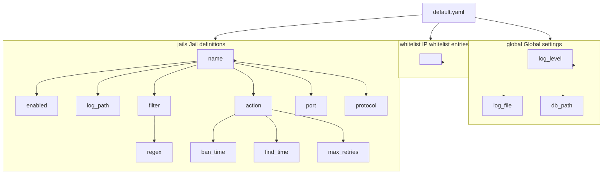

# Configuration

This section describes the configuration methods and options for the Linux Firewall Kernel Module.

## Configuration File Locations

| File | Path | Purpose |
|------|------|---------|
| Main config | `/etc/firewall/default.yaml` | Global settings and jail definitions |
| Database | `/var/lib/firewall/bans.db` | SQLite persistent ban records |
| Log file | `/var/log/firewall.log` | Daemon log |

## Configuration Hierarchy



## Configuration Loading Order

1. Reads `/etc/firewall/default.yaml` on system startup
2. Parses global configuration
3. Loads whitelist into kernel (up to 64 entries)
4. Initializes each enabled jail
5. Registers inotify watches for log files
6. Restores unexpired bans from SQLite

## Runtime Modifications

Configuration can be modified at runtime via:

| Method | Description | Persists After Restart |
|--------|-------------|----------------------|
| ProcFS interface | Write directly to `/proc/firewall/` | No |
| Edit YAML + restart | `systemctl restart firewall` | Yes |
| firewall-daemon commands | Dynamic management | Partial (depends on operation) |

## Configuration Validation

After modifying the configuration, verify it is correct:

```bash
# Check YAML syntax
cat /etc/firewall/default.yaml | python3 -c "import yaml,sys; yaml.safe_load(sys.stdin)"

# Reload and check status
sudo systemctl restart firewall
sudo systemctl status firewall
```