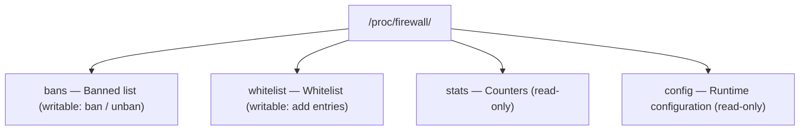

# ProcFS Interface

The Linux Firewall Kernel Module provides runtime management and monitoring through the `/proc/firewall/` directory.

## Interface Overview



> The table above reflects the real interface. Earlier drafts documented
> `status` / `clear` / `version` entries that do not exist in the source;
> `config` is also read-only — writes return `-EINVAL`. To clear all
> bans, either `unban` one by one or reload the module.

## Read Interfaces

### Runtime Configuration

```bash
cat /proc/firewall/config
```

Output:

```
Current Firewall Configuration:
--------------------------------
ban_time: 3600 seconds
Ban entries: 15
Whitelist entries: 3
```

| Field | Description |
|-------|-------------|
| `ban_time` | Default ban duration (seconds) |
| `Ban entries` | Current ban count |
| `Whitelist entries` | Current whitelist count |

### Banned IP List

```bash
cat /proc/firewall/bans
```

Output:

```
Banned IP List
==============
IP              Jail      Remaining(s)  Protocol  Port
192.168.1.100   sshd      3452          tcp       22
10.0.0.50       nginx     1200          tcp       80
172.16.0.1      postfix   5800          tcp       25
```

| Field | Description |
|-------|-------------|
| `IP` | Banned IP address |
| `Jail` | Jail that triggered the ban |
| `Remaining(s)` | Remaining ban time (seconds) |
| `Protocol` | Banned protocol |
| `Port` | Banned port |

### Whitelist

```bash
cat /proc/firewall/whitelist
```

Output:

```
Whitelist
=========
IP/Range
127.0.0.1
192.168.1.0/24
10.0.0.1
```

### Statistics

```bash
cat /proc/firewall/stats
```

Output (key-value format, one metric per line):

```
total_bans 0
total_unbans 0
whitelist_rejects 0
ban_table_full_rejects 0
alloc_failures 0
packets_dropped 0
packets_accepted 0
cleanup_cycles 0
cleanup_expired_total 0
current_bans 0
current_whitelist 19
recent_additions 0
```

| Field | Type | Description |
|-------|------|-------------|
| `total_bans` | counter | Cumulative ban operations that produced a new entry (duplicate bans of an already-valid entry are NOT counted) |
| `total_unbans` | counter | Cumulative unban operations (manual + permanent unban) |
| `whitelist_rejects` | counter | Ban attempts rejected because the IP is whitelisted (phase 1 + per-bucket recheck) |
| `ban_table_full_rejects` | counter | Ban attempts rejected because the ban table is at capacity (4096 entries) |
| `alloc_failures` | counter | kmalloc failures when allocating a ban entry |
| `packets_dropped` | counter | Packets dropped by the netfilter hook due to ban match. Fragmented packets and packets with invalid source IPs are not counted here. |
| `packets_accepted` | counter | Packets accepted by the netfilter hook after passing the ban/whitelist check. Same scope caveat as `packets_dropped`. |
| `cleanup_cycles` | counter | Legacy counter (old global cleanup cycles; unused now, usually 0) |
| `cleanup_expired_total` | counter | Entries removed by per-entry `expire_timer` callbacks |
| `current_bans` | gauge | Currently banned IP count (sum of permanent + temporary) |
| `current_whitelist` | gauge | Currently whitelisted entries |
| `recent_additions` | gauge | Ban operations within the current 1-second flood-protection window |

**Conservation law** (holds at any instant after my recent fix):

```
total_bans == current_bans + total_unbans + cleanup_expired_total
```

Duplicate ban attempts on already-valid bans and refreshes of expired entries
do not contribute to `total_bans`, ensuring this invariant holds.

### Module Version

The module does not expose a dedicated `version` file. The version is
available through the kernel module identifier and `dmesg | grep firewall`
boot log.

## Write Interfaces

`/proc/firewall/config` and `/proc/firewall/stats` are read-only. All
write operations go through `/proc/firewall/bans` and
`/proc/firewall/whitelist`.

### Add Ban

```bash
# Default duration (fw_ban_time)
echo "1.2.3.4" | sudo tee /proc/firewall/bans

# Specific duration (seconds)
echo "1.2.3.4 3600" | sudo tee /proc/firewall/bans

# Permanent ban
echo "1.2.3.4 0" | sudo tee /proc/firewall/bans
```

Format: `<ip>` or `<ip> <seconds>` (seconds, 0 = permanent)

### Remove Ban

```bash
echo "unban 1.2.3.4" | sudo tee /proc/firewall/bans
```

Format: `unban <ip>`

### Add to Whitelist

```bash
# Single IP
echo "10.0.0.1" | sudo tee /proc/firewall/whitelist

# CIDR range
echo "10.0.0.0/8" | sudo tee /proc/firewall/whitelist
```

> **Limit**: Maximum 64 whitelist entries.

### Remove from Whitelist

```bash
echo "remove 10.0.0.0/8" | sudo tee /proc/firewall/whitelist
```

Format: `remove <ip-or-cidr>`

### Clear All Bans

The kernel module does not provide a one-shot "clear" command. To
clear all bans:

```bash
# Option 1: unban one by one (loop in scripts)
while read -r ip _; do
  [ -n "$ip" ] && echo "unban $ip" | sudo tee /proc/firewall/bans >/dev/null
done < <(awk '/^[0-9]/ {print $1}' /proc/firewall/bans)

# Option 2: reload the module (resets all kernel state)
sudo rmmod firewall && sudo insmod $(modinfo -n firewall) fw_ban_time=600
```

## Permission Requirements

| Operation | Permission |
|-----------|------------|
| Read | root or `firewall` group |
| Write | root |

```bash
# Create firewall group
sudo groupadd firewall

# Add user to group
sudo usermod -aG firewall $USER

# Adjust ProcFS file permissions (requires udev rule)
```

## Debugging

### Enable Debug Log

Compile with debug level:

```bash
make debug DL=2
```

View kernel log:

```bash
sudo dmesg | grep firewall
```

### Debug Levels

| Level | Description |
|-------|-------------|
| `DL=0` | No debug output |
| `DL=1` | Critical debug info |
| `DL=2` | Verbose debug info |
| `DL=3` | All debug info |