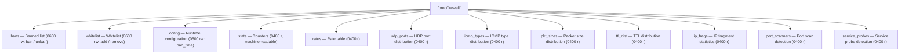

# ProcFS Interface

The Linux Firewall Kernel Module provides runtime management and monitoring through the `/proc/firewall/` directory.

This protocol is frozen by `contract/procfs.fwidl` (the single source of truth).
Permissions, entry names and read formats must match the generated
`contract/generated/procfs_uapi.h`, and `contract/verify_procfs.py` checks that
mechanically. Change the contract before changing this document.

## Interface Overview


```mermaid
graph TB
    root["/proc/firewall/"]
    root --> bans["bans — Banned list (0600 rw: ban / unban)"]
    root --> wl["whitelist — Whitelist (0600 rw: add / remove)"]
    root --> cfg["config — Runtime configuration (0600 rw: ban_time)"]
    root --> stats["stats — Counters (0400 r, machine-readable)"]
    root --> rates["rates — Rate table (0400 r)"]
    root --> udp["udp_ports — UDP port distribution (0400 r)"]
    root --> icmp["icmp_types — ICMP type distribution (0400 r)"]
    root --> pkt["pkt_sizes — Packet size distribution (0400 r)"]
    root --> ttl["ttl_dist — TTL distribution (0400 r)"]
    root --> frag["ip_frags — IP fragment statistics (0400 r)"]
    root --> scan["port_scanners — Port scan detection (0400 r)"]
    root --> probe["service_probes — Service probe detection (0400 r)"]
```

The table above is the complete, real set of entries. Earlier drafts documented
`status` / `clear` / `version` entries that do not exist in the source.

**Read-side contract strength**: only `stats` is machine-readable (`key value`
lines that tests and ops scripts parse line by line, so reordering breaks
downstream consumers). The other 9 read-only files are human-facing tables that
the contract explicitly marks `unstable` — the layout may change on rewrite, but
no consumer may rely on entry order: lists are emitted in hash-traversal order
with no sorting guarantee.

## Read Interfaces

### Runtime Configuration

```bash
cat /proc/firewall/config
```

Output:

```
Current Firewall Configuration:
--------------------------------
ban_time: 600 seconds
Ban entries: 15
Whitelist entries: 3
```

| Field | Description |
|-------|-------------|
| `ban_time` | Default ban duration (seconds), i.e. the current value of module parameter `fw_ban_time` |
| `Ban entries` | Current ban entry count (permanent + temporary) |
| `Whitelist entries` | Current whitelist entry count |

### Banned List

```bash
cat /proc/firewall/bans
```

Output:

```
Banned IP List:
-------------------
192.168.1.100                            (expires in 3452 seconds)
10.0.0.50                                (permanent)
-------------------
Total: 2 active bans (1 permanent, 1 temporary)
```

| Field | Description |
|-------|-------------|
| `<ip>` | Banned IP address, left-aligned into 40 columns |
| `(permanent)` | Permanent ban (written with `seconds` = 0) |
| `(expires in N seconds)` | Remaining ban time in seconds |

Entries that have expired but are not yet reaped (timer not run) are not shown,
so `Total` counts **active** bans only. The output carries no jail, protocol or
port information: the ban table is keyed by IP, there is no port dimension.

### Whitelist

```bash
cat /proc/firewall/whitelist
```

Output:

```
Whitelisted IPs (protected from banning):
--------------------------------------
10.0.0.0/8  on manual
127.0.0.1/32  on lo
192.168.1.0/24  on eth0
--------------------------------------
Total: 3 entries
```

| Field | Description |
|-------|-------------|
| `<ip>/<prefix>` | Whitelist entry; local interface addresses are maintained automatically by `fw_netdev.c` from interface state |
| `on <dev>` | Entry origin: entries added by hand with `echo` are always `manual`; local interface addresses use the interface name (`lo`, `eth0`, …); state-restored entries are `restored` |

There are two spaces between `<ip>/<prefix>` and `on`. Local interface addresses
are added and removed by the kernel; removing one by hand returns `-EPERM`.

### Statistics

```bash
cat /proc/firewall/stats
```

Output (key-value format, one metric per line, 13 keys):

```
total_bans 0
total_unbans 0
whitelist_rejects 0
ban_table_full_rejects 0
alloc_failures 0
packets_dropped 0
packets_accepted 0
tcp_anomaly_dropped 0
cleanup_cycles 0
cleanup_expired_total 0
current_bans 0
current_whitelist 19
recent_additions 0
```

A cross-CPU aggregation runs before reading (`fw_stats_snapshot()` calls
`fw_stats_flush_all()` internally), so a reader never sees values still sitting
in per-CPU slots at low packet rates.

| Field | Type | Description |
|-------|------|-------------|
| `total_bans` | counter | Ban operations that produced a new entry (duplicate bans of an already-banned IP and refreshes of expired entries are NOT counted) |
| `total_unbans` | counter | Cumulative unban operations (manual unban, whitelist-driven unban, DDoS revocation) |
| `whitelist_rejects` | counter | Ban attempts rejected because the IP is whitelisted (pre-check) |
| `ban_table_full_rejects` | counter | Ban attempts rejected because the ban table reached `fw_max_ban_entries` |
| `alloc_failures` | counter | Failures allocating a ban node |
| `packets_dropped` | counter | Packets dropped by the netfilter hook due to a ban match |
| `packets_accepted` | counter | Packets accepted by the netfilter hook after the ban/whitelist check |
| `tcp_anomaly_dropped` | counter | Packets dropped due to a TCP anomaly |
| `cleanup_cycles` | counter | **Always 0.** Legacy key: the global cleanup thread was replaced by per-entry timers, so there is no "cleanup cycle" concept any more; the key is kept only so line-parsing scripts do not silently misalign |
| `cleanup_expired_total` | counter | Entries removed by per-entry `expire_timer` callbacks |
| `current_bans` | gauge | Currently banned IP count (permanent + temporary) |
| `current_whitelist` | gauge | Currently whitelisted entries |
| `recent_additions` | gauge | Ban operations within the current 1-second flood-protection window |

**Counting identity** (holds at any instant while the module is loaded):

```
total_bans == current_bans + total_unbans + cleanup_expired_total
```

Duplicate bans on an already-valid entry and refreshes of expired entries
contribute to no term of the identity, so it stays consistent on every counter
increment/decrement path. Module unload (`fw_ban_exit()`) zeroes
`current_bans` directly, after which the identity no longer applies.

### Rate Table

```bash
cat /proc/firewall/rates
```

Output:

```
IP Rate Statistics (DDoS Detection):
------------------------------------
Configuration:
  rate_window_seconds: 2
  max_packets_per_second: 0
  max_bytes_per_second: 0
------------------------------------
IP Address                                  Packets        Bytes Window(s)
203.0.113.7                                   12345        891234      2s
------------------------------------
Total: 1 active rate entries
```

The `Window(s)` column prints the **configured window width**, not a per-entry
window start: the read-side row struct carries no window start, and adding a
shared field to hot-path entries for the reader is not allowed.

### Analysis Entries

The following 5 files all share one analysis snapshot (the same source used by
the netlink `AnalysisResponse`).

`udp_ports`:

```bash
cat /proc/firewall/udp_ports
```

```
UDP Port Distribution:
----------------------
Total entries: 3 / 512
----------------------
Port            Packets        Bytes  LastSeen
...
----------------------
Displayed: 3 ports
```

`icmp_types`:

```
ICMP Type Distribution:
-----------------------
Total entries: 2 / 128
-----------------------
Type   Code        Packets        Bytes  LastSeen
...
-----------------------
Displayed: 2 types
```

`Total entries` reports the real analysis-table size (denominator
`MAX_UDP_PORT_ENTRIES` / `MAX_ICMP_TYPE_ENTRIES`), while the **displayed rows** of
a single snapshot are capped by `FW_ANALYSIS_UDP_PACK_MAX` /
`FW_ANALYSIS_ICMP_PACK_MAX` (both 64).

`pkt_sizes` (5 fixed buckets) and `ttl_dist` (6 fixed buckets) print range,
packets and percentage:

```bash
cat /proc/firewall/pkt_sizes
```

```
Packet Size Distribution:
-------------------------
Size Range        Packets  Percent
-------------------------
<64B                 1000    50%
64-256B              1000    50%
...
-------------------------
Total: 2000 packets
```

`ip_frags`:

```bash
cat /proc/firewall/ip_frags
```

```
IP Fragment Statistics:
-------------------------
Total IP packets:  2000
Fragmented packets: 17
Fragment ratio:    0%
```

`port_scanners` (trigger threshold 5 unique ports):

```bash
cat /proc/firewall/port_scanners
```

```
Port Scan Detection:
Threshold: 5 unique ports
Total scans detected: 1
-------------------------
IP                     Unique Ports      Packets
-------------------------
203.0.113.7                      12         1532
```

`service_probes` (trigger threshold 3 protocol types):

```bash
cat /proc/firewall/service_probes
```

```
Service Probe Detection:
Threshold: 3 protocol types
-------------------------
IP                      Protocols      Packets
-------------------------
203.0.113.7                      4          210
```

Each detection file lists at most 20 entries (`PORT_SCAN_MAX_RESULTS` /
`SERVICE_PROBE_MAX_RESULTS`); with no hit it prints `No port scanners detected`
/ `No service probes detected`.

### Module Version

The module does not expose a dedicated `version` entry; read the version from the
module itself:

```bash
modinfo firewall | grep '^version:'
```

Startup and registration logs: `dmesg | grep firewall`.

## Write Interfaces

The writable entries are `bans`, `whitelist` and `config`. One `write(2)` handles
exactly **one** command; the trailing newline is optional.

- Success returns the number of bytes written.
- Failure returns a **negative errno** with no text channel: the reason goes to
  the kernel log only. Callers distinguish by errno, e.g. `-EINVAL` (bad syntax
  or argument), `-EPERM` (whitelisted, or a whitelist entry on a local address),
  `-ENOSPC` (table full), `-EBUSY` (rejected by the flood gate), `-ENOENT`
  (unbanning a non-existent entry), `-ENOMEM`.
- Separators are spaces or tabs; every control character below `0x20` except
  `\t` is rejected.

### Add Ban

```bash
# Default duration (module parameter fw_ban_time)
echo "1.2.3.4" | sudo tee /proc/firewall/bans

# Specific duration (seconds, 1..31536000)
echo "1.2.3.4 3600" | sudo tee /proc/firewall/bans

# Permanent ban
echo "1.2.3.4 0" | sudo tee /proc/firewall/bans
```

Format: `<ip>` or `<ip> <seconds>`. The duration accepts a plain decimal digit
string and **no sign**: the `<ip> -1` unban form advertised by earlier docs was
never reachable (the old implementation required the first character of the
duration to be a digit) and has been removed. A permanent ban is `seconds` = 0.

### Remove Ban

```bash
echo "unban 1.2.3.4" | sudo tee /proc/firewall/bans
```

Format: `unban <ip>`. No trailing token is allowed after the address.

### Add to Whitelist

```bash
# Single IP
echo "10.0.0.1" | sudo tee /proc/firewall/whitelist

# CIDR range
echo "10.0.0.0/8" | sudo tee /proc/firewall/whitelist

# Explicit verb (equivalent to the previous line)
echo "add 10.0.0.0/8" | sudo tee /proc/firewall/whitelist
```

Format: `<subnet>` or `add <subnet>`, where `<subnet>` is `<ip>` or
`<ip>/<prefix>`; an omitted prefix defaults to the full address-family length
(32 for IPv4, 128 for IPv6). The entry cap is the module parameter
`fw_max_whitelist_entries` (default 65535); at capacity the write returns
`-ENOSPC`.

`0.0.0.0` / broadcast / multicast / loopback / link-local addresses are
rejected. Local interface addresses are maintained by the kernel and do not need
to be added by hand.

### Remove from Whitelist

```bash
echo "remove 10.0.0.0/8" | sudo tee /proc/firewall/whitelist
```

Format: `remove <subnet>` (the verb is mandatory). Removal normalizes the network
address, matches by exact host address, and also unsets any ban entry falling
inside that prefix.

### Change Runtime Configuration

```bash
# Set the default ban duration to 600 seconds (range 1..31536000)
echo "ban_time 600" | sudo tee /proc/firewall/config
```

Format: `ban_time <seconds>`. An unknown parameter name returns `-EINVAL`; there
is no silent success.

### Clear All Bans

The kernel provides no one-shot "clear" command. To clear all bans:

```bash
# Option 1: unban one by one (loop in scripts)
while read -r ip _; do
  [ -n "$ip" ] && echo "unban $ip" | sudo tee /proc/firewall/bans >/dev/null
done < <(awk '/^[0-9]/ {print $1}' /proc/firewall/bans)

# Option 2: reload the module (resets all kernel state)
sudo rmmod firewall && sudo insmod $(modinfo -n firewall) fw_ban_time=600
```

## Permissions

Permission bits are declared by the contract and baked into the generated
header: writable entries are `0600` (`bans` / `whitelist` / `config`) and
read-only entries are `0400` (the remaining 9). Both are open to root only; the
module ships no group-based scheme. To let a non-root user read them, add your
own udev rule to rewrite the permissions.

```bash
ls -l /proc/firewall/
```

## Module Parameters

The following parameters can be passed at load time (also visible under
`/sys/module/firewall/parameters/`):

| Parameter | Default | Description |
|-----------|---------|-------------|
| `fw_ban_time` | 600 | Default ban duration (seconds) |
| `state_file` | `/var/lib/firewall/state` | Ban/whitelist state persistence path |
| `fw_max_bans_per_second` | 200 | Max ban additions per second under flood protection |
| `fw_max_rate_entries` | 65536 | Rate table entry cap (1024..262144) |
| `fw_max_ban_entries` | 65535 | Ban table entry cap; at capacity new bans are rejected and counted in `ban_table_full_rejects` |
| `fw_max_whitelist_entries` | 65535 | Whitelist entry cap; at capacity new entries are rejected |
| `fw_max_local_ips` | 256 | Lower bound for the local-address set (grows on demand) |
| `fw_static_threshold` | 1 | Enable static threshold detection |
| `fw_dynamic_threshold` | 0 | Enable dynamic threshold detection |
| `fw_ddos_detection` | 1 | Master switch for DDoS detection |

```bash
sudo insmod firewall.ko fw_ban_time=600 fw_max_ban_entries=10000
```

## Debugging

The module has no debug-level switch of its own (the `make debug DL=2` target
and the `DL=0..3` levels of earlier docs do not exist). Use the generic kernel
facilities when troubleshooting:

```bash
# Module startup and registration log
sudo dmesg | grep firewall
```

## Related Documents

- Contract and its verifier: `contract/procfs.fwidl`, `contract/verify_procfs.py`
- Monitoring metric mapping: `docs/en/operations/monitoring.md`
- Kernel module rewrite design: `docs/en/development/kernel-rewrite-design.md`
