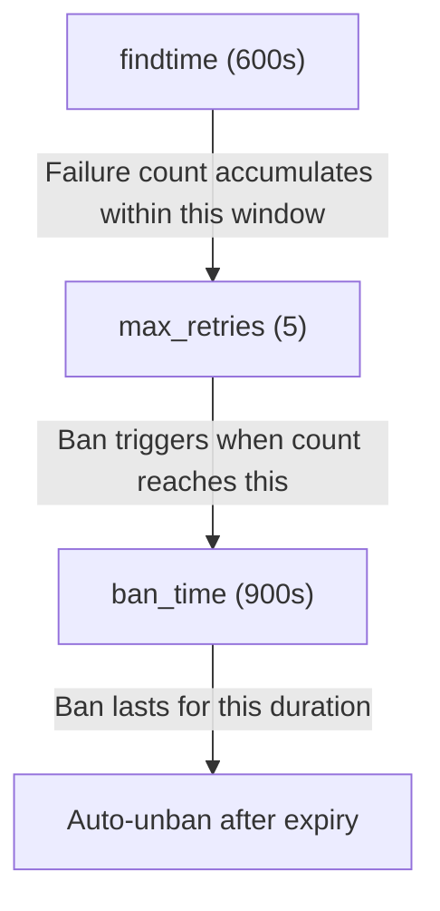
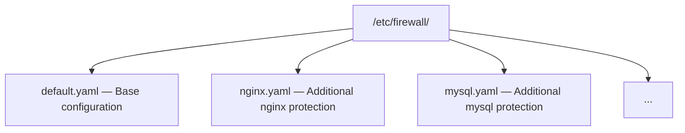

# YAML Configuration

This document details all options in the `/etc/firewall/default.yaml` configuration file.

## Configuration Overview

The current design uses **smart inference**: you only need to configure `log_files` and `regexes`; other parameters use sensible defaults.

```yaml
# Global defaults
defaults:
  max_retries: 5
  findtime: 600         # 10 minutes
  ban_time: 900         # 15 minutes
  interval: 1           # Check interval (seconds)
  metrics_port: 9119    # Prometheus metrics port
  # Permanent-ban fields MUST live under defaults:, not at the top level
  permanent_db_path: "/var/lib/firewall/bans.db"
  permanent_ban_enabled: true   # default false

# Jail definitions
jails:
  sshd:
    enabled: true
    log_files:
      - /var/log/auth.log
    max_retries: 3
    findtime: 600
    ban_time: 1800
    regexes:
      failed_password:
        pattern: "Failed password for (?:invalid user )?.+ from ([0-9]{1,3}\\.[0-9]{1,3}\\.[0-9]{1,3}\\.[0-9]{1,3})"
```

## Global Defaults (defaults)

The `defaults` block defines default behavior for all jails. Individual jails can override these values.

```yaml
defaults:
  max_retries: 5
  findtime: 600         # 10 minutes
  ban_time: 900         # 15 minutes
  interval: 1           # Check interval (seconds)
  metrics_port: 9119    # Prometheus metrics port
```

| Parameter | Type | Default | Range | Description |
|-----------|------|---------|-------|-------------|
| `max_retries` | int | `5` | 1-100 | Maximum failures before a ban is triggered |
| `findtime` | int | `600` | 1-3600 | Time window (seconds) over which failures are counted |
| `ban_time` | int | `900` | 0 or 1-86400 | Ban duration (seconds); 0 = permanent |
| `interval` | int | `1` | 1-60 | Log file check interval (seconds) |
| `metrics_port` | int | `9119` | 1024-65535 | Prometheus metrics port |

### Time Parameter Relationship



## Jail Configuration

Each jail defines an independent log monitoring and ban rule.

### Jail Structure

```yaml
jails:
  sshd:                           # Jail name (key name = name)
    enabled: true                 # Whether enabled
    log_files:                    # Log files to monitor
      - /var/log/auth.log
      - /var/log/secure
    max_retries: 3                # Override defaults
    findtime: 600                 # Override defaults
    ban_time: 1800                # Override defaults
    regexes:                      # Named regex patterns
      failed_password:
        pattern: "..."
      invalid_user:
        pattern: "..."
```

### Jail Parameters

| Parameter | Type | Required | Default | Description |
|-----------|------|----------|---------|-------------|
| `<name>` (key) | string | Yes | - | Jail name, globally unique |
| `enabled` | bool | No | `true` | Whether this jail is active |
| `log_files` | list | Yes | - | List of log file paths to monitor |
| `max_retries` | int | No | Inherited from `defaults` | Max failures before ban |
| `findtime` | int | No | Inherited from `defaults` | Time window (seconds) |
| `ban_time` | int | No | Inherited from `defaults` | Ban duration (seconds) |
| `regexes` | map | Yes | - | Named regex pattern collection |

### Regex Configuration (regexes)

```yaml
regexes:
  failed_password:                          # Pattern name
    pattern: "Failed password for (?:invalid user )?.+ from ([0-9]{1,3}\\.[0-9]{1,3}\\.[0-9]{1,3}\\.[0-9]{1,3})"
  invalid_user:
    pattern: "Invalid user [a-zA-Z0-9_.-]{1,64} from ([0-9]{1,3}\\.[0-9]{1,3}\\.[0-9]{1,3}\\.[0-9]{1,3})"
```

| Parameter | Type | Required | Description |
|-----------|------|----------|-------------|
| `<name>` (key) | string | Yes | Pattern name, used for log identification |
| `pattern` | string | Yes | PCRE2 regex; use capture group `()` to extract IP |

### PCRE2 Regex Syntax

The current version **no longer uses the `<HOST>` placeholder**. Write the full regex directly in `pattern`.

| Feature | Example | Description |
|---------|---------|-------------|
| Capture group | `([0-9]{1,3}\\.[0-9]{1,3}\\.[0-9]{1,3}\\.[0-9]{1,3})` | Extract IP address |
| Non-capture group | `(?:pattern)` | Group without capturing |
| Character class | `[a-zA-Z0-9_.-]` | Character range |
| Quantifiers | `*`, `+`, `?`, `{n,m}` | Repetition |
| Anchors | `^`, `$` | Line start/end |

> **YAML Escaping Note**: In YAML, backslashes must be doubled `\\.` instead of `\.`, or wrap the value in double quotes.

## Whitelist Configuration (whitelist)

```yaml
whitelist:
  - 127.0.0.1
  - 192.168.1.0/24
  - 10.0.0.1
  - 172.16.0.0/16
```

| Format | Example | Description |
|--------|---------|-------------|
| Single IP | `192.168.1.100` | Skip this IP when banning |
| CIDR range | `192.168.1.0/24` | Skip all IPs in this subnet |

> **Limit**: Maximum 64 whitelist entries. Excess entries are ignored with a warning.

### Built-in Whitelist

The following IP is always protected, no manual configuration needed:

- `127.0.0.1` - Loopback address

## Trusted IPs (trusted_ips)

```yaml
trusted_ips:
  - 43.100.123.123          # FRP server
  - 8.140.211.27            # Another server
  - 10.0.0.0/8              # Internal network
```

| Format | Example | Description |
|--------|---------|-------------|
| Single IP | `43.100.123.123` | Automatically adds `/32` prefix, writes to kernel whitelist |
| CIDR range | `10.0.0.0/8` | Writes directly to kernel whitelist |

**Features**:

- **Auto-write on startup**: daemon writes `trusted_ips` list to kernel whitelist (`/proc/firewall/whitelist`) on startup
- **Prevent false bans**: Ensures critical infrastructure (e.g., FRP servers, jump hosts) won't be accidentally banned by DDoS auto-ban
- **Hot reload support**: After modifying config and sending `SIGHUP`, daemon compares old/new lists and incrementally adds/removes whitelist entries
- **Difference from `whitelist`**: `whitelist` is a static kernel module whitelist (requires manual write), `trusted_ips` is managed by daemon, supports configuration and hot reload

> **Note**: IPs in `trusted_ips` are marked as `on manual`, distinguished from auto-discovered network interface whitelist entries.

## DDoS Protection (ddos)

```yaml
ddos:
  enabled: true
  per_ip_conn_rate: 50        # Max connections per IP per second
  per_ip_fail_rate: 30        # Max failed connections per IP per minute
  global_conn_rate: 10000     # Max global connections per second
  auto_ban_duration: 3600     # Auto-ban duration (seconds)
  auto_ban_threshold: 3       # Ban after exceeding threshold N times
  check_interval: 5           # Check interval (seconds)
```

| Parameter | Type | Default | Description |
|-----------|------|---------|-------------|
| `enabled` | bool | `true` | Enable DDoS detection |
| `per_ip_conn_rate` | int | `50` | Max new connections per IP per second |
| `per_ip_fail_rate` | int | `30` | Max failed connections per IP per minute |
| `global_conn_rate` | int | `10000` | Max global new connections per second |
| `auto_ban_duration` | int | `3600` | Ban duration after auto-ban triggered (seconds) |
| `auto_ban_threshold` | int | `3` | Ban after exceeding threshold N times |
| `check_interval` | int | `5` | Detection interval (seconds) |

**Detection Logic**:

1. Kernel module tracks connection rate per IP in real-time
2. Counter increments when exceeding `per_ip_conn_rate` or `per_ip_fail_rate`
3. Auto-ban triggers when counter reaches `auto_ban_threshold`, banning IP for `auto_ban_duration` seconds
4. Global alert triggers when global connection rate exceeds `global_conn_rate`

> **Recommendation**: Add critical server IPs to `trusted_ips` to prevent DDoS detection false bans.

## Web UI Configuration (webui)

```yaml
webui:
  sse_push_interval: 1        # SSE push interval (seconds)
  rate_warning_pps: 1000      # Rate warning threshold (packets/sec)
  rate_critical_pps: 10000    # Rate critical threshold (packets/sec)
  rate_warning_syn: 100       # SYN rate warning threshold (packets/sec)
  rate_critical_syn: 1000     # SYN rate critical threshold (packets/sec)
```

| Parameter | Type | Default | Description |
|-----------|------|---------|-------------|
| `sse_push_interval` | int | `1` | Server-Sent Events push interval (seconds) |
| `rate_warning_pps` | int | `1000` | Total rate warning threshold (packets/sec) |
| `rate_critical_pps` | int | `10000` | Total rate critical threshold (packets/sec) |
| `rate_warning_syn` | int | `100` | SYN packet rate warning threshold (packets/sec) |
| `rate_critical_syn` | int | `1000` | SYN packet rate critical threshold (packets/sec) |

**Features**:

- **SSE Push**: Web UI receives real-time status updates via Server-Sent Events
- **Rate Alerts**: Web UI displays warning/critical status when packet rate exceeds thresholds
- **SYN Alerts**: Dedicated alert thresholds for SYN Flood attacks

## Permanent Ban

Permanent bans (`ban_time: 0`) are kept in memory and lost on restart.
```yaml
defaults:
  # ... other fields
  permanent_db_path: "/var/lib/firewall/bans.db"
  permanent_ban_enabled: true   # default false
```

| Parameter | Type | Default | Description |
|-----------|------|---------|-------------|

## Pitfalls

The YAML schema is strict and easy to mis-author. If a setting "has no effect", check this section first.

### Fields must live under `defaults:`

All `defaults.*` fields (including `permanent_db_path`, `permanent_ban_enabled`, `log_level`, …) **must** be written inside the `defaults:` block. Same-named keys at the top level are **not allowed** — the parser only reads the `defaults:` keys and silently ignores any top-level duplicates. There is **no warning, no error**.

**Bad example** (top-level `permanent_*` — the real v2.2.1 bug):

```yaml
defaults:
  max_retries: 5
  # ... no permanent_* fields here

jails:
  sshd: ...

# Top-level fields — silently ignored by the parser
permanent_db_path: "/var/lib/firewall/bans.db"
permanent_ban_enabled: true
```

After startup, `/var/lib/firewall/bans.db` is never created and permanent bans "appear not to work", but the log shows no error.

**Good example**:

```yaml
defaults:
  max_retries: 5
  # ... other fields
  permanent_db_path: "/var/lib/firewall/bans.db"
  permanent_ban_enabled: true   # default false

jails:
  sshd: ...
```

## Logging

The `log_info!` / `log_warn!` / `log_error!` / `log_debug!` macros **no longer have rate-limited variants** (the old `log_warn_ratelimited!` and the global `RATELIMIT_STATE` mutex + 60-second throttle have been removed). Every call is emitted directly — no merging or dedup. To reduce noise, set `log_level` (`info` / `warn` / `error` / `debug`) in the config.

## Complete Configuration Example

```yaml
# /etc/firewall/default.yaml

# ============================================================
# Global defaults - applied to all jails unless overridden
# ============================================================
defaults:
  max_retries: 5
  findtime: 600         # 10 minutes
  ban_time: 900         # 15 minutes
  interval: 1           # Check interval (seconds)
  metrics_port: 9119    # Prometheus metrics port
  permanent_db_path: "/var/lib/firewall/bans.db"
  permanent_ban_enabled: true   # default false

# ============================================================
# Jail definitions - each service monitored independently
# ============================================================
jails:
  # SSH protection
  sshd:
    enabled: true
    log_files:
      - /var/log/auth.log       # Debian/Ubuntu
      - /var/log/secure         # RHEL/CentOS
    max_retries: 3
    findtime: 600               # 10 minutes
    ban_time: 1800              # 30 minutes
    regexes:
      invalid_user:
        pattern: "Invalid user [a-zA-Z0-9_.-]{1,64} from ([0-9]{1,3}\\.[0-9]{1,3}\\.[0-9]{1,3}\\.[0-9]{1,3})"
      failed_password:
        pattern: "Failed password for (?:invalid user )?[a-zA-Z0-9_.-]{1,64} from ([0-9]{1,3}\\.[0-9]{1,3}\\.[0-9]{1,3}\\.[0-9]{1,3})"
      connection_closed:
        pattern: "Connection closed by invalid user [a-zA-Z0-9_.-]{1,64} from ([0-9]{1,3}\\.[0-9]{1,3}\\.[0-9]{1,3}\\.[0-9]{1,3})"

  # Nginx auth protection
  nginx-auth:
    enabled: true
    log_files:
      - /var/log/nginx/error.log
    max_retries: 10
    findtime: 300               # 5 minutes
    ban_time: 1800              # 30 minutes
    regexes:
      no_auth:
        pattern: "no user/password was provided for basic authentication.*client: ([0-9]{1,3}\\.[0-9]{1,3}\\.[0-9]{1,3}\\.[0-9]{1,3})"
```

## Multi-Config Loading

The daemon supports `-C <dir>` to load all YAML files in a directory:

```bash
sudo firewall-daemon -C /etc/firewall
```

Loading order:

1. Files loaded in **alphabetical order**
2. Jails are **accumulated** (later configs do not overwrite earlier ones)
3. Duplicate jail names use **last-wins** strategy

Example directory structure:


