# Development Guide

This section covers how to develop, build, and test the Linux Firewall Kernel Module.

## Development Environment

### Recommended Configuration

| Item | Requirement |
|------|-------------|
| OS | Ubuntu 22.04+ / Debian 12+ |
| GCC | 12+ |
| Make | 4.0+ |
| Git | 2.30+ |

### Install Development Dependencies

```bash
# Ubuntu/Debian
sudo apt install -y \
    build-essential \
    linux-headers-$(uname -r) \
    libsqlite3-dev \
    pkg-config \
    valgrind \
    clang \
    cmake
```

## Project Structure

```mermaid
graph TD
    ROOT["linux-firewall-kmod/"]
    MAKEFILE["Makefile Main Makefile (all / kernel-module / daemon / test)"]

    subgraph SRC["src/"]
        subgraph KERNEL["kernel-module/ Kernel module source"]
            K_MAIN["firewall-main.c Module entry / netfilter hook registration"]
            K_BAN["ban-manager.c Hash-table ban management"]
            K_WL["whitelist.c Whitelist (exact + CIDR two-stage matching)"]
            K_NF["netfilter.c Packet handling and ban decision"]
            K_ND["netdev.c Network device helpers"]
            K_PF["procfs.c /proc/firewall/* interface"]
            K_SP["state-persist.c Kernel state save/restore"]
            K_CL["cleanup.c Module exit cleanup"]
            K_H["firewall.h Common header"]
        end
        subgraph DAEMON["src/ Userspace daemon (Rust)"]
            D_MAIN["main.rs Daemon entry"]
            D_CFG["config_parser.rs YAML config parsing"]
            D_MON["file_monitor.rs inotify log monitoring"]
            D_TRK["failed_tracker.rs Jail failure counter"]
            D_BAN["ban.rs Ban/unban scheduler"]
            D_MET["http_exporter.rs Prometheus exporter"]
            D_LOG["log_parser.rs Log parsing"]
            D_SQLITE["sqlite_store.rs Persistence"]
            D_JAIL["jail.rs Jail definitions"]
            D_TYPES["types.rs Type definitions"]
        end
    end

    subgraph TESTS["tests/ Tests"]
        T_RUN["run_tests.sh"]
        T_FW["test_framework.sh"]
        T_CFG["test_config.sh"]
        T_SUITES["suites/ Test suites"]
        T_RPT["reports/ Generated reports"]
    end

    DOCS["docs/ HonKit documentation"]
    CONFIG["config/ Example YAML configs"]
    SCRIPTS["scripts/ Helper scripts (build, verify, deb packaging)"]
    DEBIAN["debian/ Debian packaging metadata"]

    ROOT --> MAKEFILE
    ROOT --> SRC
    SRC --> KERNEL
    KERNEL --> K_MAIN
    KERNEL --> K_BAN
    KERNEL --> K_WL
    KERNEL --> K_NF
    KERNEL --> K_ND
    KERNEL --> K_PF
    KERNEL --> K_SP
    KERNEL --> K_CL
    KERNEL --> K_H
    SRC --> DAEMON
    DAEMON --> D_MAIN
    DAEMON --> D_CFG
    DAEMON --> D_MON
    DAEMON --> D_TRK
    DAEMON --> D_BAN
    DAEMON --> D_MET
    DAEMON --> D_H
    ROOT --> TESTS
    TESTS --> T_RUN
    TESTS --> T_FW
    TESTS --> T_CFG
    TESTS --> T_SUITES
    TESTS --> T_RPT
    ROOT --> DOCS
    ROOT --> CONFIG
    ROOT --> SCRIPTS
    ROOT --> DEBIAN
```



## Code Standards

### C Language Standards

- Use C99 standard
- 4-space indentation
- Function names use `snake_case`
- Constants use `UPPER_CASE`
- Structs use `snake_case` with `_t` suffix

### Kernel Module Standards

- Follow Linux kernel coding style
- Use `pr_*` macros for logging
- Mark init/exit functions with `__init` and `__exit`
- Avoid sleeping in atomic context

### Commit Convention

```
<type>(<scope>): <description>

[optional body]

[optional footer]
```

| Type | Description |
|------|-------------|
| `feat` | New feature |
| `fix` | Bug fix |
| `docs` | Documentation update |
| `style` | Code formatting |
| `refactor` | Refactoring |
| `perf` | Performance optimization |
| `test` | Test related |
| `chore` | Build/toolchain |

## Contribution Process

1. Fork the repository
2. Create a feature branch (`git checkout -b feat/amazing-feature`)
3. Commit changes (`git commit -m 'feat: add amazing feature'`)
4. Run tests (`make test`)
5. Push branch (`git push origin feat/amazing-feature`)
6. Create a Pull Request