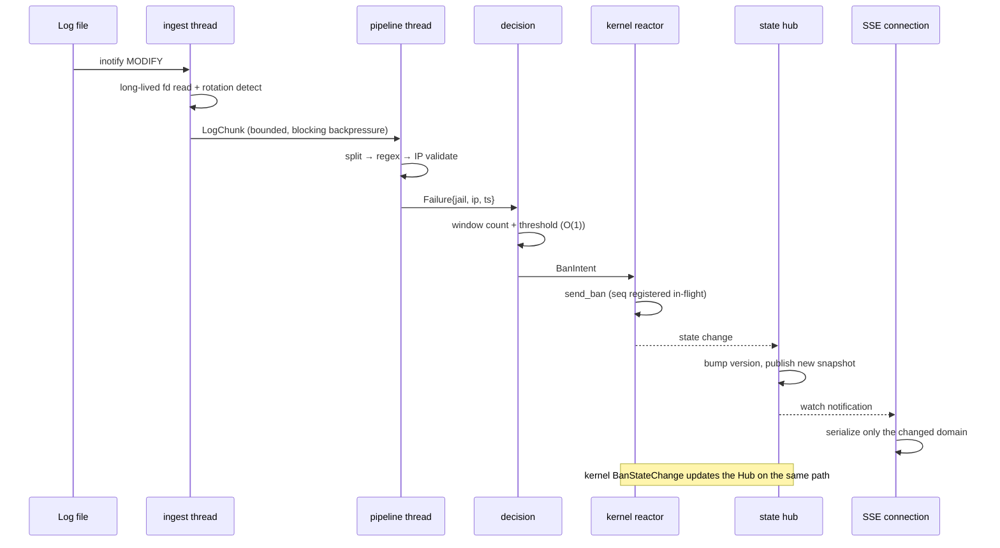

# Daemon Rewrite Design (Phase 2)

This document is the single source of truth for rewriting `src/daemon/` under the new design.
For the three-tier rewrite goals and the per-tier criteria, see
[Kernel Rewrite Design § Scope and Acceptance](kernel-rewrite-design.md#scope-and-acceptance);
for measured hot-path numbers on the kernel side, see
[Performance Baseline](perf-baseline.md). This document references them without repeating them.

## Decision Record

| Item | Decision | Rationale |
|------|----------|-----------|
| Implementation language | **Rust**, rewritten under the new design | Toolchain unchanged; the netlink/procfs/HTTP ecosystem is mature; what this round changes is **structure**, not language |
| Old code reuse | **None** | The new code reuses neither the old file layout, the old data structures, nor the old loop shape. The old implementation serves only as a source of **behavioral evidence and defect evidence** |
| Concurrency model | **Dedicated OS threads for the main chain + tokio only at the network boundary** | The main chain is "blocking IO + CPU regex"; putting it in an async reactor lets parsing block the network, while putting HTTP in bare threads means hand-rolling SSE. Split by shape of work, each on the runtime it suits |
| State ownership | **Single owner + message passing** (remove the global service locator) | Today there are 46 global `OnceLock`-class statics plus a documented 6-step lock-ordering protocol, which the repo itself already labels an "observability/testability debt" (`runtime_status.rs`, `lib.rs`) |
| Contract status | The three `contract/*.fwidl` files are the source of truth | The rewrite must not drift from the generated artifacts; to change an interface, **change the contract first, then the code**. `netlink.fwidl` may be revised this round (see [Contract Revision List](#contract-revision-list)) |
| Functional scope this round | **Main chain only**; the rest migrates in later batches | User ruling: "rewrite the main chain first, migrate the rest in batches." The main chain = log parsing → ban decision → netlink event → SSE straight to the frontend |
| Threat model | **Inbound-only defense (external)** | User ruling. No egress hooks, no outbound detection, no outbound-behavior analysis |

**Why not full tokio async**: each batch of log lines requires
open/metadata/seek/read + regex matching + sliding-window counting — all blocking or CPU-bound.
Putting that in tokio means either `spawn_blocking` (i.e. back to a thread pool, plus scheduler and
cancellation semantics) or letting regex block the reactor. HTTP/SSE, by contrast, are naturally
async: carrying thousands of idle long-lived connections on threads is wasteful. Split by shape of
work, not by technological uniformity.

## Scope and Acceptance

**Change scope**: all of `src/daemon/`, plus its four external interfaces
(netlink, procfs, HTTP/SSE, YAML config).

**Functional boundary this round** (the main chain):

| Category | Content |
|----------|---------|
| **Implemented this round** | Log collection and rotation, line splitting and regex parsing, IP extraction and validation, failure counting and threshold decision, progressive banning, netlink send/receive with request-response correlation, active ban state, SSE push, HTTP envelope and auth, config parsing and hot reload, graceful start/stop |
| **Migrating in later batches** | IP reputation, attack prediction, collaborative attack detection, periodic-attacker detection, ban-duration / threshold recommendation, SQLite history DB and snapshots, the Prometheus exporter, and the analysis-class Web UI endpoints (heatmap, packet-size distribution, TTL distribution, UDP-port / ICMP-type distribution, network distribution, recidivism) |

Modules for later batches are **not rewritten and not deleted** this round; they keep compiling as-is.
The main-chain interfaces are designed so later batches can attach (see the `analysis/` placeholder in
[New Module Layout](#new-module-layout-by-data-ownership)). This keeps the batched migration from
requiring a second pass over the main chain.

**Acceptance criteria**:

1. **Full gates** pass (as defined by the repo-root `Makefile` / `.github/workflows/ci.yml`):
   `make format-check`, `cargo fmt --check`, `cargo clippy --release --lib -- -D warnings`,
   `cargo test --release --lib`, `make frontend-typecheck`.
2. **Contract verification**: `bash scripts/check_contract.sh` is fully green; every defect in the
   `http` / `netlink` / `procfs` contracts is either fixed with the contract updated to match, or
   explicitly reclassified as "intentionally kept."
3. **Integration acceptance**: the full `tests/` pytest suite passes, and the vacuous assertions in
   [Test Debt](#test-debt) are replaced with assertions that can actually fail (no more tautologies).
4. **Main-chain latency**: an end-to-end probe in `scripts/bench/` measures the
   "log line written → matching SSE event received" latency distribution, reported as p50/p95/p99,
   and demonstrates that this latency **does not degrade as event throughput rises** (periodic
   maintenance no longer competes with event traffic for the same loop).
5. **Stability**: unbounded growth and unbounded insertion are eliminated; no "silent drop" write
   path remains; the shutdown order is provably free of in-flight writes landing on closed resources.

Acceptance is judged primarily on **kernel and daemon stability + performance** (per the user).

Where each of the three goals lands:

- **Latency** — the main-chain end-to-end latency distribution, and the invariant
  "event throughput → maintenance on-time rate"; eliminating the three structural problems of
  "parsing blocks events," "periodic tasks starved by events," and "write work inside the read path."
- **Stability** — eliminating silent drops (history-DB writes, unregistered netlink commands,
  whole-response discards), eliminating unbounded growth (failure entries, post-rotation offset
  drift), and eliminating the implicit assumption that "send succeeded == execute succeeded."
- **Consistency** — interfaces governed by the contracts and aligned across all three tiers; module
  boundaries split by data ownership; the global service locator gone; documentation no longer
  contradicting the implementation (including the rewrite of `docs/zh/architecture/daemon.md`).

## Current-State Inventory

### The four main-chain segments (pre-rewrite)

```
inotify event
  └─ process_new_lines(idx)            read new bytes (256 KB batch)
      └─ process_lines_in_buffer       split on \n
          └─ process_single_line       length check → regex/IP extraction
              └─ extract_and_validate_ip
                  └─ handle_failed_attempt_for_jail   sliding window + threshold
                      └─ ban_ip → send_ban            netlink dispatch
                          └─ kernel bans
                              └─ BanStateChange event pushed back
                                  └─ ACTIVE_BAN_CACHE update + wake_sse_clients()
                                      └─ SSE tick re-serializes 5 full payloads
```

Every step of **all four segments runs synchronously on the same main thread** (netlink event
push-back is on the receiver thread, SSE on tokio):

| Segment | Current location | Shape |
|---------|------------------|-------|
| Log parsing | `file_monitor/{processor,monitor_loop}.rs` + `line_processor.rs` + `log_parser/` | Shares one `poll` loop with event dispatch and periodic maintenance |
| Ban decision | `failed_tracker/tracking.rs` | Called synchronously from the parse path, no queue |
| netlink | `netlink/{mod,handlers,commands,responses,protocol}.rs` | Dedicated receiver thread; sends go through `&NetlinkContext` directly |
| SSE | `web_ui/sse.rs` | tokio task; re-serializes a full snapshot each interval |

### Identified structural problems (with evidence)

**A. Event traffic starves periodic maintenance.** All periodic tasks live in `handle_timeout`,
which runs only when `poll()` returns 0 (timeout) — the three-way branch in
`monitor_loop.rs:110-171`. While inotify events keep arriving, `poll` always returns > 0 and the
60 s / 300 s / 2 s task classes are all deferred. Among them the 2 s rate query and baseline push
(`monitor_loop.rs:390-406`, `send_baseline_update`) carry dynamic-threshold convergence; starving it
directly degrades ban-decision quality.

**B. A full open sequence is repeated on every event.** Each `process_new_lines` call performs
open(`O_NOFOLLOW`) + `metadata()` + `seek()` + `vec![0u8; 256*1024]`
(`processor.rs:37`, `:73-120`, `:123`). No long-lived fd, no buffer reuse. A 256 KB allocation is
repeated at event frequency under attack traffic.

**C. File identity is a `Vec` index.** `FILE_STATES` is a `Vec<FileState>`, and the `idx` passed to
`process_new_lines(idx)` is that index (`state.rs` comment: `FILE_STATES` index = `FileState.wd`);
yet a jail enable/disable change triggers `setup_inotify(cfg)`, which rebuilds the **entire** `Vec`
(`monitor_loop.rs:80-107`). After a rebuild, the index-to-watch mapping depends on rebuild order —
an implicit contract.

**D. 46 global mutable statics form a service locator.** `OnceLock|LazyLock|lazy_static` hits are
spread across 15 files; `lib.rs` documents a 6-step lock-acquisition order specifically for this and
mandates "no IO while holding a lock"; `runtime_status.rs` describes its own existence as mitigation
for "the observability/testability debt of the global `OnceLock` service locator."
The lock-ordering protocol is held by convention with no compile-time enforcement.

**E. The read path performs writes and mutates stats.** `get_active_bans()` (`ban_ops.rs:126`)
performs a throttled `purge_expired` (`PURGE_INTERVAL_SECS = 5`) inside the **read** path, and that
purge increments `DAEMON_STATS.total_unbans` and feeds `record_ban_duration`. A read endpoint has
statistics-mutating side effects.

**F. SSE re-serializes 5 full payloads every round.** `web_ui/sse.rs` refetches
`stats` / `bans` / `jails` / `whitelist` / `rates` each tick and `serde_json::to_string`s each one,
regardless of whether the data changed. With many bans the `bans` payload dominates the cost, and
every connection repeats this.

**G. The persistence queue drops silently when full.** `enqueue_db_write` uses `try_send`; when the
queue is full it logs one warn and **drops that write** (`history_snapshot/mod.rs`:
"history DB write queue busy, dropping one persistence").

**H. Two idle periodic tasks.** `write_stats_snapshot(_cfg)` is a single `debug!`
(`periodic_tasks.rs:18-27`); `check_and_handle_ddos(_cfg)` is `// intentionally empty`
(`periodic_tasks.rs:155-159`). Both still occupy a 60 s / `check_interval` timeout slot.

**I. netlink lacks a request-response correlation layer.** The receive side dispatches on
`msg_type` only and discards `seq` after parsing (`netlink/mod.rs`); the send side always sets
`nlmsghdr.nlmsg_seq = 0`; the one pagination correlation relies on a global single slot
`PendingListBans`, which two concurrent LISTs (startup one-shot + 60 s reconciliation) reset on
each other.

**J. Pagination is one-third done, and its failure direction is silent.**

| Response | Current state | Consequence |
|----------|---------------|-------------|
| `ListBansResponse` | Paginated (`offset`/`total`/continuation) | Fine |
| `ListWhitelistResponse` | Contract has no `offset`/`total`; daemon parse limit hard-coded to 64 | Kernel default page is 256; above 64 entries the **whole response is discarded** and `WHITELIST_CACHE` is not updated |
| `ListRatesResponse` | Contract has `total` but daemon never reads it; request has no `offset`/`limit` | Rate table capacity 4096, single page 256; above 256 entries **silently truncated with no awareness** |

**K. Registration state is invisible to the daemon.** `DAEMON_REGISTER` is sent once at startup;
`DAEMON_REGISTER_ACK` has **no struct and no parse branch** in the daemon (it lands in the
"unknown message type" branch). The kernel does not reply with an error when it rejects a command
(only `pr_warn`), while the daemon treats `sendto` success as success — so after a module reload or
a registration takeover, the daemon keeps "sending successfully with nobody executing," with no
detection path except BanIp's 3 s ack timeout.

**L. The baseline update bypasses the single config-dispatch entry point.** `netlink/config_sync.rs`
states it "converges 'config → kernel' into a single implementation," but `send_baseline_update`
(`monitor_loop.rs:456-462`) builds its own `ConfigUpdate` and calls `ctx.send_config_update`
directly.

**M. The whitelist CIDR key differs between the two write paths.** The LIST path always uses
`format!("{}/{}", ip, prefix_len)`; the event path omits the prefix for `/32`, `/128`, `/0`.
The same entry yields two keys, so event removal and LIST overwrite do not cancel each other.

### Global mutable state inventory (coupling to eliminate)

| Category | Representatives | Current problem |
|----------|-----------------|-----------------|
| Runtime switches | `GLOBAL_RUNNING` / `GLOBAL_RELOAD` / `GLOBAL_ROLLBACK` (`signals.rs`) | Atomic bools + an `EINTR`-driven loop exit; the deliberate absence of `SA_RESTART` is load-bearing |
| File monitoring | `FILE_STATES`, `INOTIFY_STATE` (`static`, not `OnceLock`) | Index is identity; `raw_fd` and `fd` duplicate state |
| Ban state | `ACTIVE_BAN_CACHE`, `BAN_HISTORY`, `PENDING_BAN_ACK`, `BAN_ACK_WAITERS` | ack keyed by IP string |
| Stats/caches | `DAEMON_STATS`, `JAIL_STATS`, `RATE_CACHE`, `WHITELIST_CACHE`, `RATE_HISTORY`, `ANALYSIS_CACHE` | Read side and write side share mutable globals |
| Config | `CONFIG_HISTORY`, `GLOBAL_TRUSTED_IPS`, `GLOBAL_CAPACITY`, `GLOBAL_JAILS_ENABLED`, `CONFIG_TARGET_PATH` | Global carriers for config snapshot/rollback |
| Service location | `GLOBAL_NETLINK_CTX`, `GLOBAL_JAILS`, the `get_global_*()` family | `Arc`s stored in a never-dropped `OnceLock`, making `Drop` effectively dead code |

### Thread and lifecycle inventory

There are **4** non-main spawn sites today:

| Thread | Location | Shape |
|--------|----------|-------|
| netlink receiver | `netlink/mod.rs:119` | `thread::spawn` + `poll(100ms)` |
| netlink stats poll | `main.rs:331` | 1 s `send_stats_query` + `send_analysis_query`; every 60 ticks a full `send_list_bans_query` reconciliation |
| History DB writer | `history_snapshot/mod.rs:265` | `history-db-writer` + `sync_channel` |
| HTTP | `http_exporter/lifecycle.rs:35` | tokio runtime |

The main loop is not spawned (`monitor_loop` runs on the main thread). The cleanup order carries one
hard invariant: **the history DB must be closed only after the netlink receiver has stopped and
joined**, otherwise events in the shutdown window write into an already-closed queue.

## Frozen Surface: External Behavior That Must Be Preserved Verbatim

The following is carried by the contracts and by `tests/`. It is an **external promise**, not "old code."

### netlink (`contract/netlink.fwidl`)

- Protocol number `NETLINK_USERSOCK`; magic `0x46574C4E`; message header **12 bytes**; all structs
  `packed`; all multi-byte integers **big-endian**; addresses are raw bytes.
- **23 message types**; the fixed-length constraints of each response/event and the per-page limits
  of variable-length responses (`ListBans` 696, `ListWhitelist` 1927, `ListRates` 779 entries/page)
  are unchangeable.
- Single-daemon mutual-exclusion registration; 30 s activity timeout; **commands sent by an
  unregistered instance must be rejected.**
- `ConfigFlags` 13 bits and `DynThresholdFlags` 1 bit keep their bit order.

What may be revised this round is listed in [Contract Revision List](#contract-revision-list)
(pagination parameters, `seq` correlation, `RegisterAck` parsing). Revisions follow
"change the contract → change the code → verify with `check_contract.sh`."

### procfs (`contract/procfs.fwidl`)

The daemon only reads and does not define the procfs format; it stays aligned with the kernel side's
12 entries. The daemon's startup existence checks on `/proc/firewall` and `/proc/firewall/bans` are
kept.

### HTTP / SSE (`contract/http.fwidl`)

- **Envelope**: `{code, data, message}`, success `code=0` / `message=""`, failure `data=null`;
  `skip_serializing_if` must not be used.
- **The two SSE streams have mutually independent limits**: `/api/v1/events` = 10,
  `/api/v1/logs/stream` = 5.
- `/api/v1/events` has the fixed event set `connected, stats, bans, jails, whitelist, rates`;
  keepalive 15 s.
- Auth: `/metrics` and `/api/v1/*` require Basic Auth; SPA static routes and `/health`, `/healthz`
  do not.

### YAML config

Config field names and semantics are user-visible interfaces. `WebuiConfig` / `WebuiConfigUpdate` in
`http.fwidl` already reflect the limit fields (`max_ban_entries`, `max_whitelist_entries`,
`max_rate_entries`, `max_local_ip_cache`), aligned with the new kernel module parameters.

### Decision semantics

Whitelist hit ⇒ never ban; effective threshold for `max_retries` =
`max_retries × peak_hours(1.5) × internal_ip(2.0) × reputation`; progressive durations
`0→base, 1→1800, 2→86400, ≥3→permanent`; `ban_time < 0` ⇒ permanent.

## New Architecture

### Runtime model

**Five kinds of execution entity, split by shape of data:**

| Entity | Carries | Blocking nature |
|--------|---------|-----------------|
| `ingest` thread | inotify fd ownership, `poll`, reading new bytes, rotation detection | Blocking IO |
| `pipeline` thread group | Line splitting, regex matching, IP validation, failure counting, threshold decision | CPU + small allocations |
| `kernel reactor` thread | Sole netlink socket owner: send commands, receive events, request-response correlation | Blocking IO |
| `scheduler` thread | Monotonic-clock timers (maintenance, reconciliation, rate query) | Timed waits |
| tokio runtime | HTTP routing, SSE long connections, auth, static assets | async |

**Wired by bounded channels**, each declaring its own backpressure policy:

```
inotify ──LogChunk{jail, source, bytes}──▶ parse ──Failure{jail, ip, ts}──▶ decide
                                                                              │
                                                                      BanIntent{ip, duration, reason}
                                                                              ▼
                                                     kernel reactor ──send_ban──▶ kernel
                                                              ▲                    │
                                                              └── BanStateChange ──┘
                                                                       │
                                                              state hub (versioned snapshot)
                                                                       │
                                                                  SSE / API
```

**Backpressure and drop policy** (each explicit; nothing silent):

| Queue | Behavior when full | Rationale |
|-------|--------------------|-----------|
| ingest → parse | Block ingest (never drop bytes) | Logs are the **evidence source**; dropping lines means missing bans — better to slow reads |
| parse → decide | Block parse | Same; and decide is pure in-memory O(1), so it will not be the bottleneck |
| BanIntent → kernel | Bounded queue + counter; when full, **record and refuse**, never silently | Bans must not be lost, but must not pile up unboundedly either. Refusals must be visible (counter + log) and drive retry |
| events → state hub | Overwrite-style publish (latest-snapshot semantics) | SSE only needs the latest state; intermediate states are disposable |
| state hub → persistence | Bounded queue; when full, **block the producer**, do not drop | Fixes F/G: history is audit data and must not be silently dropped |

**Periodic maintenance is no longer event-driven.** `scheduler` uses a monotonic clock (`Instant`)
rather than `SystemTime`, avoiding timer drift from clock steps; each task expires independently and
is fully decoupled from event traffic. This directly eliminates problem A.

`poll` does one thing only: wait on the inotify fd. Signals go through `signalfd` (folded into the
same `poll` fd set), no longer relying on the implicit `EINTR`-interrupts-`poll` protocol.

### New module layout (by data ownership)

Each module **exclusively owns** its state; cross-module traffic is only narrow-interface messages
or immutable snapshots.

| Module | Data ownership | Interface |
|--------|----------------|-----------|
| `main.rs` | None (composition root) | CLI parse → wire dependencies → start supervisor; holds no business logic |
| `runtime/supervisor.rs` | Execution-entity lifecycle, shutdown token | `spawn_all()` / `shutdown(timeout)`, stopping and joining in **dependency order** |
| `runtime/timers.rs` | Monotonic-clock timer table | `Timer::every(Duration, Job)`, `Timer::at(Instant, Job)` |
| `ingest/watcher.rs` | inotify fd | `events()` iterator (does not `Drop` the fd, does not lend out the handle) |
| `ingest/registry.rs` | `SourceId ↔ (path, inode, wd)` mapping | `resolve(wd) -> SourceId`; `SourceId` is the **stable identifier** (fixes problem C) |
| `ingest/reader.rs` | Per-source fd, offset, reusable buffer | `read_new(SourceId) -> Option<Chunk>`; long-lived fd + reusable buffer (fixes B) |
| `parse/splitter.rs` | Per-source partial-line buffer | `lines(&[u8]) -> impl Iterator<Item = &str>` |
| `parse/rules.rs` | Per-jail compiled regex (immutable, `Arc`) | `match_rule(&str) -> Option<IpAddr>`; compiled once, read-only on the hot path |
| `parse/extract.rs` | None | `extract_ip(&str) -> Option<IpAddr>` (pure function) |
| `decision/window.rs` | Per (jail, ip) failure-timestamp window | `observe(ip, ts) -> Verdict`; single owner, no cross-module locks |
| `decision/policy.rs` | None (pure functions) | `effective_threshold(...)`, `progressive_duration(...)` |
| `kernel/codec.rs` | None | Consumes `contract/generated/netlink_contract.rs` directly (fixes "hand-copied structs") |
| `kernel/transport.rs` | netlink socket (sole owner) | `send(Frame)`; single writer, no send lock needed |
| `kernel/reactor.rs` | In-flight request table (`seq → pending`) | `dispatch(msg)`; routes by **type + seq** (fixes I/K) |
| `kernel/client.rs` | None (typed API over `Arc<Transport>`) | `ban()` / `unban()` / `list_bans()` / `list_whitelist()` / `list_rates()` / `set_config()` |
| `kernel/lease.rs` | Registration lease state | `register()` → await Ack; periodic renewal; visible loss of contact (fixes K) |
| `state/bans.rs` | Active bans (sole owner) | `apply(Event)` / `snapshot() -> Arc<BanSnapshot>` |
| `state/whitelist.rs` | Whitelist (sole owner) | `apply(Event)` / `snapshot()`; a **single CIDR normalization function** (fixes M) |
| `state/rates.rs` | Rates and EWMA baseline | `apply(Response)` / `snapshot()` / `baseline()` |
| `state/stats.rs` | Counters (atomics, increment-only) | `inc(Counter)` / `snapshot()` |
| `state/hub.rs` | Versioned snapshot publication | `publish(Domain)` / `subscribe() -> watch::Receiver`; SSE only subscribes to changes (fixes F) |
| `api/routes/*.rs` | None (thin adapter layer) | Reads from `snapshot()` and applies the envelope; **zero side effects on the read path** (fixes E) |
| `api/sse.rs` | Per-connection subscription | Subscribes to the hub, serializes only when the version changes |
| `api/auth.rs` | Credentials (injected at startup) | `check(headers) -> Result<Principal>` |
| `persist/mod.rs` | SQLite connection (sole owner) | Bounded queue + backpressure; stop netlink before flushing on shutdown (fixes G) |
| `config/mod.rs` | Config + validation | `load()` / `validate()`; hot reload produces a new immutable snapshot |
| `config/reload.rs` | Reload and rollback transaction | `apply(new_snapshot)`; keep the old snapshot on failure |
| `signal/mod.rs` | `signalfd` | `Signal::next()`; no more atomic bools + `EINTR` |
| `log/mod.rs` | Log sink (async, bounded) | `Logger::log(Record)` |
| `analysis/` | **Placeholder** | Attachment point for later batches (reputation/prediction/collaborative detection); not implemented this round, but the interface is reserved here |

**Files not kept**: `file_monitor/` (split into `ingest/` + `parse/`), `failed_tracker/`
(split into `decision/`), `netlink/` (split into `kernel/`), `web_ui/` (split into `api/` + `state/`),
and the procfs side effects in `ban/mod.rs` (moved out of the read path). Old files are broken up and
recombined by responsibility; new files reuse none of their contents.

### State ownership

**Remove every service locator.** `OnceLock` is permitted in exactly two places: the `log` global
logger (logging is a cross-cutting concern for every module, and it writes but never reads business
state), and test fixtures. All other state is **injected at construction**: `main.rs` creates each
module in dependency order and passes `Arc` handles to whoever needs them.

**The lock-ordering protocol is no longer needed.** Each module exclusively owns its state, and
cross-module traffic is **messages** or `Arc<immutable snapshot>`. This removes from the root the
"6-step lock order" class of convention-held implicit contract.

**Snapshot semantics**: the write side (`state/*`) is a single owner; the read side (`api/*`, SSE)
gets an `Arc<Snapshot>`. A reader never sees a half-applied update, because publication is
"construct a complete new snapshot → atomically swap the `Arc`."

**Lifecycle**: `supervisor` explicitly owns each entity's join handle and shutdown token.
The shutdown order is the **reverse of the dependency order**, and each step awaits completion:

```
stop HTTP ingress (no new requests)
  → stop scheduler
  → stop kernel reactor (flush in-flight requests first)
  → stop pipeline (drain queues)
  → stop ingest
  → flush persist (no new events can arrive now)
  → PID file cleanup
```

The invariant "in-flight events may write to the DB only after the netlink receiver stops" is
guaranteed by **ordering**, not by a comment.

### Main-chain data flow (new)



### SSE redesign

- **Subscription, not polling**: `state/hub.rs` is the versioned publication point; an SSE connection
  holds a `watch::Receiver` and builds events only when the version changes.
- **Per-domain serialization**: `stats` / `bans` / `jails` / `whitelist` / `rates` each carry a
  version; only changed domains are re-`serde_json::to_string`ed (fixes F).
- **Limits and counters**: separate counters for the two streams, matching the contract;
  `sse-status` reports **both** streams (fixes `HTTP_SSE_STATUS_INCOMPLETE`).
- **Backpressure**: one slow consumer neither blocks other connections nor the write side
  (independent task per connection + bounded send buffer; slow consumers are disconnected rather
  than allowed to slow down the whole).

### netlink redesign

- **Model**: `Transport` (sole socket owner, single writer) + `Reactor` (receive + route) + `Client`
  (typed API) + `Lease` (registration/renewal).
- **Request-response correlation**: `seq` is allocated monotonically by `Transport` and registered in
  the in-flight table; responses route by **type + seq**. Pagination state for list requests hangs off
  **that request**, not a global single slot (fixes I).
- **All pagination**: `list_whitelist` / `list_rates` gain `offset`/`limit` parameters and a
  continuation loop, matching `list_bans`; per-page limits come from the contract (fixes J).
- **Registration visibility**: `Lease` parses `DAEMON_REGISTER_ACK` and renews periodically;
  loss of contact (timeout / takeover) produces an **explicit state** visible in the API and logs
  (fixes K).
- **Send-result semantics**: a successful `sendto` means only "delivered to the kernel." Commands
  needing execution confirmation (ban) await an ack; `Client`'s return type distinguishes
  "delivered" from "confirmed," forbidding the former to be read as the latter (fixes K).
- **Single config-dispatch entry point**: `client.set_config()` is the only path, including the
  baseline update (fixes L).
- **codec**: include `contract/generated/netlink_contract.rs` directly and delete the hand-copied
  structs, letting the compiler guarantee contract/implementation consistency (fixes the
  "hand-copied copy" defect).

## Contract Revision List

The rewrite may change contracts, but must **change the contract before the code** and go through the
`contract/` verification. This round needs the following revisions:

| Contract location | Revision | Reason |
|-------------------|----------|--------|
| `netlink.fwidl` `ListWhitelistQuery` | Add `offset` / `limit` fields | No pagination parameters today; the kernel always returns the first page. Needed to paginate (fixes J) |
| `netlink.fwidl` `ListWhitelistResponse` | Add `offset` / `total` | Today only `count` + `tail`; the daemon cannot detect truncation (fixes J) |
| `netlink.fwidl` `ListRatesQuery` | Add `offset` / `limit` fields | Same as above (fixes J) |
| `netlink.fwidl` `seq` semantics | Define explicitly as "request/response correlation sequence number," and require unmatched responses to be diagnosable | Today the field is decorative; correlation relies on a global single slot, and concurrent LISTs reset each other (fixes I) |
| `netlink.fwidl` `DaemonRegisterAck` | Define an observable contract for "registration refused" (the daemon must parse it and expose the state) | Today the daemon does not parse it at all and loss of contact is invisible (fixes K) |
| `http.fwidl` `/api/v1/stats/sse-status` | Add the log stream's limit and current value to the payload | Fixes `HTTP_SSE_STATUS_INCOMPLETE` (the two stream limits are independent; the diagnostic endpoint reflects only one) |
| `http.fwidl` `HTTP_BANS_DUAL_SHAPE` | Choose one: unify to a single shape, or explicitly define the trigger condition for each shape | Today "data is always an object" is broken by the raw-array vs paginated-object shapes |
| `http.fwidl` `HTTP_RECIDIVISM_RATE_UNIT` | Unify the unit (0–100 or 0–1) | The same-named field has two units |
| `http.fwidl` `HTTP_TODAY_BANS_EQUALS_TOTAL` | Define `today_bans`'s counting basis | It equals `total_bans`; the semantics are undefined |
| `http.fwidl` `HTTP_THRESHOLD_RECOMMENDATION_ZERO_AMBIGUOUS` | Define what 0 means (no recommendation vs recommendation 0) | Ambiguous today |
| `http.fwidl` `HTTP_SERVICE_PROBE_NO_TOTAL` | Add `total` | Truncation is undetectable |
| `http.fwidl` `HTTP_HEALTH_NOT_ENVELOPED` | Convert to the envelope, or explicitly record it as "intentional exception" | The only endpoint where the HTTP status carries semantics; the frontend special-cases it via `getRawJson` |
| `http.fwidl` `HTTP_LOG_SSE_LIMIT_DOC_DRIFT` | Fix the comment to match the implementation | The comment says "shared" while the implementation uses two independent counters |
| `http.fwidl` `HTTP_BAN_SORT_DOC_INCOMPLETE` | Complete the sort-field documentation | Sort semantics are undocumented |

Endpoints for later batches (prediction / collaborative / heatmap / distribution classes) are not
changed this round; they are handled when their own batches migrate.

## Defect Disposition

Defects in the contracts are **part of the contract** and must be updated alongside. This round covers
existing defects in `netlink.fwidl` and `http.fwidl`, plus daemon-side stability problems found now.

### Fixed

| Defect | Fix |
|--------|-----|
| `HTTP_BANS_DUAL_SHAPE` (high) | Unify the shape per the contract revision; sync all three tiers |
| `HTTP_SSE_STATUS_INCOMPLETE` (medium) | `sse-status` reports both streams (see [SSE redesign](#sse-redesign)) |
| `HTTP_RECIDIVISM_RATE_UNIT` (medium) | Unify the unit and sync frontend formatting |
| Whitelist parse limit 64 conflicts with kernel page 256 | Remove the hard-coded limit, use the contract's page limit; complete pagination (fixes J) |
| Rate response silently truncated | Add pagination + read `total` + make truncation visible (fixes J) |
| History-DB queue drops silently when full | Switch to backpressure blocking (fixes G) |
| Registration loss invisible | Introduce `Lease` + parse `RegisterAck` (fixes K) |
| Two baseline/config dispatch paths | Converge on `client.set_config()` (fixes L) |
| Whitelist CIDR key inconsistency | Single normalization function (fixes M) |
| Read-path side effects (purge + stats) | Move purge to a dedicated `scheduler` task; the read path only reads (fixes E) |
| Two idle periodic tasks | Delete `write_stats_snapshot`; decide `check_and_handle_ddos`'s fate with DDoS ownership (the kernel self-decides today, so the daemon has no duty) |
| `protocol.rs` comment "20 bytes" | Disappears when codec switches to the generated artifact |

### Intentionally kept

| Item | Rationale |
|------|-----------|
| Signals exposed via atomic bools | Keep the "minimal handler, decision in the main loop" pattern, but switch to `signalfd` folded into `poll` so it no longer relies on `EINTR` |
| `HTTP_HEALTH_NOT_ENVELOPED` | If the bare status code is kept (probe semantics), the contract must explicitly mark it an intentional exception rather than a defect |

## Test Debt

Today's `tests/` contain several **tautological assertions** that cannot serve as acceptance and must be
replaced this round:

| Location | Problem |
|----------|---------|
| `tests/config.py` | `MAX_BAN_CAPACITY = 4096`, `MAX_WHITELIST_CAPACITY = 64` are old-implementation constants |
| `tests/test_11_resource_mgmt.py:49-55` | Writes 200 entries then asserts `<= 4096` — a tautology |
| `tests/test_04_whitelist.py:107-108` | Writes 50 subnets then asserts `<= 64` — a tautology |
| `tests/test_19_netlink_comm.py` | Uses `WEBUI_PORT = 8080` and the non-versioned path `POST /api/bans`; every assertion is `>= 0` or skip-guarded |
| `tests/test_18_log_rotation.py` | Hard-codes `/etc/firewall/default.yaml` and `/var/log/firewall-test` |
| `tests/test_10_daemon_logparse.py` | Mostly `pytest.skip` |

Replacement principle: assertions must be able to fail. Capacity assertions become "fill to the new
limit and verify entry N+1 is refused"; path assertions read from config; netlink assertions assert
actual event fields.

## Phased Implementation and Acceptance

Each phase is independently testable, independently committable, and independently revertible.
Prerequisite dependency is 0 (it can run in parallel with the Phase 1 kernel rewrite).

| Phase | Content | Acceptance |
|-------|---------|------------|
| **2.A** | Contract revisions (netlink pagination params + `seq` semantics + `RegisterAck`; http sse-status and defect entries) | `bash scripts/check_contract.sh` fully green; gates green |
| **2.B** | Runtime skeleton: `runtime/supervisor` + `signal` (`signalfd`) + `scheduler` (monotonic clock) + bounded-channel contract + shutdown order | Gates green; shutdown order has a test (stop netlink before flushing the DB); timers do not drift with event throughput (with a test) |
| **2.C** | Main-chain rewrite: `ingest` + `parse` + `decision` | Problems A/B/C eliminated (with tests); `decision` semantics match the old implementation case-by-case (comparison test) |
| **2.D** | `kernel` layer rewrite: `codec` (using the generated artifact) + `transport` + `reactor` (type+seq routing) + `client` + `lease`; all pagination | Problems I/J/K/L eliminated; a >1-page test case; registration loss visible |
| **2.E** | `state` layer: single owner + snapshot hub; `api` thin adapter + zero read-path side effects | Problems E/F/M eliminated; SSE serializes per domain; a slow consumer does not slow the whole |
| **2.F** | `persist` backpressure rework + test-debt replacement | Problem G eliminated (backpressure tested); every tautological assertion replaced with one that can fail |
| **2.G** | Documentation rewrite: `docs/{zh,en}/architecture/daemon.md` fully rewritten to the new implementation; `docs/{zh,en}/architecture/data-flow.md` stale numbers corrected | Documentation matches the code item by item |

`docs/zh/architecture/daemon.md` currently diverges badly from the implementation; 2.G must handle:
the port is written as `9119`; the module table lists the no-longer-existing `ban/procfs.rs`; the
failure counter is written as `FailureCounter { ip, count, first_seen, last_seen }`; rotation is
written as `IN_MOVED_TO`; it contains a non-existent `<HOST>` substitution description and an old
SQLite `bans` table schema; the metric count is written as "24"; the main loop is written as `epoll`.
`docs/*/architecture/data-flow.md` is stale too ("full table (4096)", "whitelist (64)",
"linear scan", "~50ns/~100ns", and the old function name `nf_hook_func_ipv4`).

## Implementation Progress

| Phase | Status |
|-------|--------|
| 2.A Contract revisions | Done |
| 2.B–2.G | Not started |

### What 2.A Landed

The netlink wire format landed on all three sides (contract / kernel / daemon) in one step, with the
layout cross-checked by `verify_layout.py`:

| Struct | Change | Layout |
|--------|--------|--------|
| `ListWhitelistQuery` | `+ offset` `+ limit` | 12 → 20 |
| `ListRatesQuery` | `+ offset` `+ limit` | 12 → 20 |
| `ListWhitelistResponse` | `+ total` `+ offset` | fixed 16 → 24 (single-page cap 1927 → 1926) |
| `ListRatesResponse` | `+ offset` | fixed 36 → 40 |
| `MsgHdr.seq` / `DaemonRegisterAck` | pairing semantics and "a refusal must be observable" written as contract obligations | none (comments only) |

- Kernel: page responses now fill in `total` / `offset`; the `LIST_WHITELIST_QUERY` /
  `LIST_RATES_QUERY` cases parse `offset` / `limit` (previously hard-coded to `0, 0`).
- Daemon: the four structs are synced; `new_page` / `send_*_query_page` entry points added; the
  whitelist parse cap moved from "table capacity 64" to "single-page cap 1926".
- HTTP: all 9 defects carry a `resolution` (disposition locked), while `status` stays `open` —
  `verify_http.py`'s mechanical assertions are ratchets, so a fix must land in the same step as the
  code; the sse-status payload is therefore deferred to 2.E.
- Gate evidence: `make build`, `make format-check`, `cargo clippy --release --lib -- -D warnings`,
  `cargo test --release --lib` (81 passed), `make frontend-typecheck`, `bash scripts/check_contract.sh`,
  `bash scripts/verify_project.sh` all green.
- Outstanding: `make format-check` still exits 0 when clang-format fails (`exit 1` sits in a subshell
  and the recipe's last command is an `echo`); to be fixed in 2.B.

## Judging Discipline

- Latency conclusions must give an **end-to-end latency distribution** (p50/p95/p99) and the
  measurement method; single-point numbers are not accepted.
- "Maintenance tasks are no longer starved" must be proven by the **timer on-time rate under high
  event throughput**, not by reading code.
- Each phase must end with a reviewable increment: gate output + contract verification result +
  comparison tests for that phase's structural problems.
- Before a later batch migrates, the frozen main-chain interface shapes must not be changed.
