# Testing

This document covers the test framework and test suites for the Linux
Firewall project.

## Architecture

```mermaid
graph TD
    ROOT["tests/"]
    RUN["run_tests.sh unified entry point"]
    FW["test_framework.sh assertion functions, color output, reports"]
    CFG["test_config.sh path/parameter variables (KERNEL_MODULE_PATH, ...)"]

    subgraph SUITES["suites/ numbered suites (executed in 01-21 order, 05/06 skipped, 19 suites)"]
        S01["01_module_basic.sh"]
        S02["02_procfs_interface.sh"]
        S03["03_ban_unban.sh"]
        S04["04_whitelist.sh"]
        S07["07_concurrency.sh"]
        S08["08_stress_perf.sh"]
        S09["09_daemon_config.sh"]
        S10["10_daemon_logparse.sh"]
        S11["11_resource_mgmt.sh"]
        S12["12_permanent_ban.sh"]
        S13["13_frp_jail.sh"]
        S14["14_ban_netfilter.sh"]
        S15["15_ddos_detection.sh"]
        S16["16_webui_api.sh"]
        S17["17_config_reload.sh"]
        S18["18_log_rotation.sh"]
        S19["19_netlink_comm.sh"]
        S20["20_daemon_lifecycle.sh"]
        S21["21_multi_jail.sh"]
    end

    subgraph REPORTS["reports/ generated reports (after running)"]
    end

    ROOT --> RUN
    ROOT --> FW
    ROOT --> CFG
    ROOT --> SUITES
    SUITES --> S01
    SUITES --> S02
    SUITES --> S03
    SUITES --> S04
    SUITES --> S07
    SUITES --> S08
    SUITES --> S09
    SUITES --> S10
    SUITES --> S11
    SUITES --> S12
    ROOT --> REPORTS
```



> Earlier versions split tests into `tests/{unit,integration,stress}/`.
> Since v1.5 they have been reorganized into numbered suites sharing a
> single framework to remove duplication.

## Unit Tests (Rust)

The daemon (since v2.2.0) has been ported to Rust; unit tests run via
`cargo test`:

```bash
# All unit tests + doctests
cargo test

# Only doctests
cargo test --doc

# A specific module
cargo test config::
```

Current count: **88 unit tests + 6 doctests** (doctests actually
execute — they are not `no_run`).

`cargo test` exercises the `#[cfg(test)]` modules inside the daemon
crate; the 16-suite shell-driven integration test in
`tests/run_tests.sh` complements it — unit tests verify logic at the
source level, integration tests verify end-to-end behavior at the
shell level.

## Integration Tests

### Running Tests

```bash
# After building, run all suites
make test
# Underlying command: sudo ./tests/run_tests.sh
```

```bash
# Call run_tests.sh directly
./tests/run_tests.sh                    # run all suites
./tests/run_tests.sh --suite 03         # only 03_ban_unban
./tests/run_tests.sh --category security   # filter by category
./tests/run_tests.sh --report           # write report to tests/reports/
./tests/run_tests.sh --help             # help
```

The entry point is `tests/run_tests.sh`, which dispatches the numbered
suites in `suites/`. Current count: 19 suites / **115** assertions.

### Running under sudo

`make test` internally runs `sudo ./tests/run_tests.sh`. The test
runner fixes up `cargo`'s PATH at entry, before invoking `make daemon`:

```bash
# tests/run_tests.sh internal (~line 134-139)
if [[ -f "$HOME/.cargo/env" ]]; then
    source "$HOME/.cargo/env"
fi
export PATH="$HOME/.cargo/bin:$PATH"
```

This is necessary because `sudo`'s default `secure_path` does NOT
include `~/.cargo/bin` (the standard location when Rust is installed
via rustup), so a bare `sudo make daemon` will fail:

```
sudo make daemon
make: cargo: Command not found
make: *** [Makefile:101: daemon] Error 127
```

Going through `make test` is fine, but if you run
`sudo ./tests/run_tests.sh` manually and `cargo` is missing for the
same reason, the symptom is `make: cargo: Command not found` — fix by
`source ~/.cargo/env` before sudo.

### Filters and Output

| Flag | Purpose |
|------|---------|
| `--suite NN` | Run only suite `NN` (`01`..`15`) |
| `--category X` | Filter by category (`security` / `performance` / `daemon` / `module`) |
| `--report` | Generate a Markdown report under `tests/reports/` |
| `--parallel` | Run suites in parallel (default: serial, to avoid shared-state races) |
| `--help` | Full help |

Each case prints a `pass` / `fail` / `warn` marker; at the end of each
suite the runner prints a summary:

```
Suite 03_ban_unban: passed 12, failed 0, warned 0, skipped 0
Suite 09_daemon_config: passed 8, failed 0, warned 0, skipped 0
...

Total: passed 113, failed 0, warned 2, skipped 0
```

With `--report`, results are written to
`tests/reports/<timestamp>.md` (one entry per assertion, with output
and elapsed time) and uploaded as a CI artifact.

## Test Suites

| # | File | Coverage |
|---|------|----------|
| 01 | `01_module_basic.sh` | Module load/unload, parameter load, sysfs readable |
| 02 | `02_procfs_interface.sh` | `/proc/firewall/{bans,whitelist,config,stats}` R/W |
| 03 | `03_ban_unban.sh` | Ban, unban, temporary/permanent, expiry cleanup |
| 04 | `04_whitelist.sh` | Exact match, CIDR subnet match, capacity limit |
| 07 | `07_concurrency.sh` | Multi-process R/W, RCU correctness |
| 08 | `08_stress_perf.sh` | Full 4096-entry table operations, latency |
| 09 | `09_daemon_config.sh` | YAML loading, strict-mode validation, jail parsing |
| 10 | `10_daemon_logparse.sh` | inotify monitoring, regex matching, jail trigger |
| 11 | `11_resource_mgmt.sh` | Memory, fds, procfs resource lifecycle |
| 12 | `12_permanent_ban.sh` | Permanent ban (in-memory) |
| 13 | `13_frp_jail.sh` | FRP (Fail2ban-Recover-Pattern) jail config loading and trigger |
| 14 | `14_ban_netfilter.sh` | Blacklist netfilter chain entry format and function (real routable IP) |
| 15 | `15_ddos_detection.sh` | DDoS detection configuration, rate thresholds, statistics |
| 16 | `16_webui_api.sh` | Web UI API endpoints, SSE, HTTP response validation |
| 17 | `17_config_reload.sh` | SIGHUP hot-reload, configuration modification, error tolerance |
| 18 | `18_log_rotation.sh` | Log rotation detection, inotify monitoring, copytruncate support |

> Numbering skips 05/06: those slots were used by old suites that have
> since been merged into the ones above. Current count: 19 suites
> totaling **115** integration-test assertions.

## Framework Assertions

Suites use helpers from `tests/test_framework.sh`:

| Function | Purpose |
|----------|---------|
| `fw_test_header` | Print suite title |
| `fw_subsection` | Print subsection title |
| `fw_pass` / `fw_fail` | Mark a single case as passed/failed |
| `assert_success <cmd> <msg>` | Assert command exits 0 |
| `assert_true <expr> <msg>` | Assert expression is true |
| `assert_file_exists <path>` | Assert file exists |
| `assert_dir_exists <path>` | Assert directory exists |
| `warn_test <msg>` | Soft warning (not counted as failure) |

## Module-Loading Constraints

Several suites need the kernel module to be loadable. On GitHub Actions
Azure VMs the running kernel frequently does not match the installed
headers, so module loading can fail while functional tests still pass.
The CI runner automatically skips module-dependent suites when this
happens (see [ci.yml](../../../../.github/workflows/ci.yml)).

## Memory-Safety Detection (ASAN / Miri)

The daemon (Rust) contains 49 `unsafe { }` blocks across 8 files
(`netlink/protocol.rs`, `netlink/mod.rs`, `ban/procfs.rs`,
`daemonizer.rs`, `file_monitor/monitor_loop.rs`, `ip_utils.rs`,
`logger.rs`, `signals.rs`), and every one of them carries a
`// SAFETY:` comment documenting the invariants and reasoning.
The CI runs three layers of checks in a matrix:

### AddressSanitizer

`make asan` selects the `[profile.asan]` profile (requires the
nightly toolchain):

```bash
# One-time install of nightly (skip if already installed)
rustup install nightly

# Build + run
make asan
sudo ./build/daemon/firewall-daemon-asan
```

Any `ERROR:` line in the ASan output is a memory defect.
`build/daemon/firewall-daemon-asan` is the `make asan`-copied
artifact (it includes the ASAN runtime, so it is larger than the
stripped release binary).

### Valgrind

Useful for "same binary, swap the analyzer" workflows (e.g.
comparing against a baseline):

```bash
cargo build --profile dev-with-debug   # 32MB with DWARF
sudo valgrind --leak-check=full --show-leak-kinds=all \
    ./target/dev-with-debug/firewall-daemon -c config/default.yaml
```

> The `dev-with-debug` profile is ideal for Valgrind / `addr2line` /
> `perf`: full symbols retained while keeping release-equivalent
> optimization.

### Miri (UB detection)

The Rust interpreter; catches undefined behavior (pointer aliasing,
alignment violations, etc.):

```bash
cargo +nightly miri test
```

Miri interprets the code, so it does not require a rebuilt std
toolchain. CI runs it as a nightly opt-in (sharing the same nightly
toolchain as ASAN).

### Unsafe-block inventory

`grep -rn "unsafe {" src/daemon/` lists all 49 blocks; each sits
next to a `// SAFETY:` comment explaining the invariants. **Any new
`unsafe` block MUST come with a `// SAFETY:` comment**, otherwise
the tightened `cargo clippy` rules (configured in the repo's
`clippy.toml`) will block the merge.

## Writing a New Suite

Place new tests in `tests/suites/` with the file name `NN_description.sh`
(NN being the next available number). Each suite `source`s the framework
and config, then uses the assertions above:

```bash
#!/bin/bash
# 13_my_feature.sh - new feature tests

source ../test_framework.sh
source ../test_config.sh

fw_test_header "New feature tests"

fw_subsection "Basic behavior"
assert_true "[[ 1 -eq 1 ]]" "trivial equality holds"

fw_subsection "Boundary"
assert_true "[[ -n \"$KERNEL_MODULE_PATH\" ]]" "KERNEL_MODULE_PATH is set"
```

## CI Integration

`.github/workflows/ci.yml` defines **3 jobs**, all of which must pass
before a merge:

| Job | Checks | Failure → merge |
|-----|--------|-----------------|
| `lint` | rustfmt + clippy (`--all-targets --all-features`) + yamllint + kernel-module clang-format | blocks merge |
| `build` | Kernel module (`make kernel-module`) + daemon (`make daemon`) | blocks merge |
| `test` | `sudo ./tests/run_tests.sh --report`, currently **115** assertions | any fail blocks merge |

`test` job orchestration details:

1. Reuses artifacts from the `build` job (`build/kernel-module/firewall.ko` + `build/daemon/firewall-daemon`)
2. Runs `sudo ./tests/run_tests.sh --report` on the runner
3. Auto-skips module-dependent suites if the kernel module cannot load (Azure VM environment limitation)
4. Uploads the report as a CI artifact (kept for 14 days)

> `lint` failures usually mean a missing `// SAFETY:` comment, a
> formatting drift, or an unjustified `unsafe` block. Fix and re-run.
