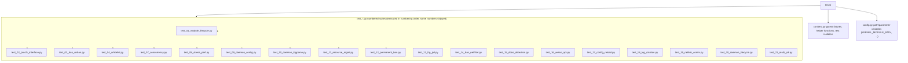

# Testing

This document covers the test framework and test suites for the Linux
Firewall project.

## Architecture


```mermaid
graph TD
    ROOT["tests/"]
    CONF["conftest.py pytest fixtures, helper functions, test isolation"]
    CFG["config.py path/parameter variables (KERNEL_MODULE_PATH, ...)"]

    subgraph SUITES["test_*.py numbered suites (executed in numbering order, some numbers skipped)"]
        S01["test_01_module_lifecycle.py"]
        S02["test_02_procfs_interface.py"]
        S03["test_03_ban_unban.py"]
        S04["test_04_whitelist.py"]
        S07["test_07_concurrency.py"]
        S08["test_08_stress_perf.py"]
        S09["test_09_daemon_config.py"]
        S10["test_10_daemon_logparse.py"]
        S11["test_11_resource_mgmt.py"]
        S12["test_12_permanent_ban.py"]
        S13["test_13_frp_jail.py"]
        S14["test_14_ban_netfilter.py"]
        S15["test_15_ddos_detection.py"]
        S16["test_16_webui_api.py"]
        S17["test_17_config_reload.py"]
        S18["test_18_log_rotation.py"]
        S19["test_19_netlink_comm.py"]
        S20["test_20_daemon_lifecycle.py"]
        S21["test_21_multi_jail.py"]
    end

    ROOT --> CONF
    ROOT --> CFG
    ROOT --> SUITES
    SUITES --> S01
    SUITES --> S02
    SUITES --> S03
    SUITES --> S04
    SUITES --> S07
    SUITES --> S08
    SUITES --> S09
    SUITES --> S10
    SUITES --> S11
    SUITES --> S12
```

> Earlier versions split tests into `tests/{unit,integration,stress}/`.
> Since v1.5 they have been reorganized into numbered suites sharing a
> single Bash framework; since v2.x they have been migrated to Python
> pytest for better assertions, reporting, and filtering.

## Unit Tests (Rust)

The daemon (since v2.2.0) has been ported to Rust; unit tests run via
`cargo test`:

```bash
# All unit tests + doctests
cargo test

# Only doctests
cargo test --doc

# A specific module
cargo test config::
```

Unit tests and doctests both actually execute (doctests are not
`no_run`); for the current count, read the `cargo test` output.

`cargo test` exercises the `#[cfg(test)]` modules inside the daemon
crate; the pytest integration suite in `tests/` complements it —
unit tests verify logic at the source level, integration tests verify
end-to-end behavior in Python.

## Integration Tests

### Running Tests

```bash
# After building, run all suites
make test
# Underlying command: sudo python3 -m pytest tests/ -v
```

```bash
# Call pytest directly
sudo python3 -m pytest tests/ -v                    # run all suites
sudo python3 -m pytest tests/test_03_ban_unban.py -v  # only test_03_ban_unban
sudo python3 -m pytest tests/ -k "daemon" -v        # filter by keyword (matches function/class names)
sudo python3 -m pytest tests/ --tb=short            # short traceback output
sudo python3 -m pytest tests/ --html=report.html    # generate HTML report (requires pytest-html plugin)
sudo python3 -m pytest tests/ --collect-only        # list all tests without executing
```

The test framework is Python pytest, with entry points at `tests/conftest.py`
(fixtures and helper functions) and `tests/config.py` (paths and parameter
configuration).

### Running under sudo

`make test` internally runs `sudo python3 -m pytest tests/ -v`. Tests
require root privileges for kernel module operations (insmod/rmmod)
and procfs writes.

`sudo`'s default `secure_path` does NOT include `~/.cargo/bin`
(the standard location when Rust is installed via rustup), so a bare
`sudo make daemon` will fail:

```
sudo make daemon
make: cargo: Command not found
make: *** [Makefile:101: daemon] Error 127
```

Going through `make test` is fine, but if you run
`sudo python3 -m pytest tests/ -v` manually and `cargo` is missing for
the same reason, the symptom is `make: cargo: Command not found` — fix
by `source ~/.cargo/env` before sudo.

### Filters and Output

| Flag | Purpose |
|------|---------|
| `tests/test_03_ban_unban.py` | Run only the specified test file |
| `-k "keyword"` | Filter by keyword (matches function/class names), e.g. `-k "daemon"` |
| `-m "mark"` | Filter by pytest marker (e.g. custom markers) |
| `--tb=short` | Short traceback output |
| `--html=report.html` | Generate HTML report (requires `pip install pytest-html`) |
| `--collect-only` | List all tests without executing |
| `-x` | Stop on first failure |
| `-v` | Verbose output (show each test name) |

Example pytest output:

```
tests/test_03_ban_unban.py::TestBanUnban::test_basic_ban PASSED
tests/test_03_ban_unban.py::TestBanUnban::test_unban PASSED
tests/test_09_daemon_config.py::TestDaemonConfig::test_yaml_load PASSED
...

========================= all passed in 45.32s =========================
```

With `--html=report.html`, an HTML report is generated with pass/fail
status, output, and elapsed time for each test, uploaded as a CI artifact.

## Test Suites

| # | File | Coverage |
|---|------|----------|
| 01 | `test_01_module_lifecycle.py` | Module load/unload, parameter load, sysfs readable |
| 02 | `test_02_procfs_interface.py` | `/proc/firewall/{bans,whitelist,config,stats}` R/W |
| 03 | `test_03_ban_unban.py` | Ban, unban, temporary/permanent, expiry cleanup |
| 04 | `test_04_whitelist.py` | Exact match, CIDR subnet match, capacity limit |
| 07 | `test_07_concurrency.py` | Multi-process R/W, RCU correctness |
| 08 | `test_08_stress_perf.py` | Full-table operations, latency |
| 09 | `test_09_daemon_config.py` | YAML loading, strict-mode validation, jail parsing |
| 10 | `test_10_daemon_logparse.py` | inotify monitoring, regex matching, jail trigger |
| 11 | `test_11_resource_mgmt.py` | Memory, fds, procfs resource lifecycle |
| 12 | `test_12_permanent_ban.py` | Permanent ban (in-memory) |
| 13 | `test_13_frp_jail.py` | FRP (Fail2ban-Recover-Pattern) jail config loading and trigger |
| 14 | `test_14_ban_netfilter.py` | Blacklist netfilter chain entry format and function (real routable IP) |
| 15 | `test_15_ddos_detection.py` | DDoS detection configuration, rate thresholds, statistics |
| 16 | `test_16_webui_api.py` | Web UI API endpoints, SSE, HTTP response validation |
| 17 | `test_17_config_reload.py` | SIGHUP hot-reload, configuration modification, error tolerance |
| 18 | `test_18_log_rotation.py` | Log rotation detection, inotify monitoring, copytruncate support |
| 19 | `test_19_netlink_comm.py` | Netlink kernel↔daemon communication |
| 20 | `test_20_daemon_lifecycle.py` | Daemon start/stop/restart lifecycle |
| 21 | `test_21_multi_jail.py` | Multi-jail concurrency, independent logs, isolation |

> Numbering skips 05/06: those slots were used by old suites that have
> since been merged into the ones above.

## Framework Helper Functions

Tests use fixtures and helpers from `tests/conftest.py`:

| Function / Fixture | Purpose |
|----------|---------|
| `ban_ip(ip)` | Ban an IP address |
| `ban_ip_with_time(ip, seconds)` | Ban an IP with duration |
| `ban_ip_permanent(ip)` | Permanently ban an IP |
| `unban_ip(ip)` | Unban an IP address |
| `ip_is_banned(ip)` | Check if IP is in the ban list |
| `whitelist_add(subnet)` | Add a whitelist entry |
| `whitelist_remove(subnet)` | Remove a whitelist entry |
| `get_stat(name)` | Get a procfs statistic value |
| `count_bans()` | Get the ban list line count |
| `count_whitelist()` | Get the whitelist line count |
| `reset_all_data()` | Reset all test data |
| `load_module()` / `unload_module()` | Load/unload kernel module |
| `session_setup` (fixture) | Session-level setup: ensure module is loaded |
| `test_isolation` (fixture) | Data isolation before/after each test |
| `clean_bans` (fixture) | Ensure ban list is empty |
| `daemon_binary` (fixture) | Ensure daemon binary exists |
| `tmp_config` (fixture) | Create a temporary config directory |

## Module-Loading Constraints

Several suites need the kernel module to be loadable. On GitHub Actions
Azure VMs the running kernel frequently does not match the installed
headers, so module loading can fail while functional tests still pass.
The CI runner automatically skips module-dependent suites when this
happens (see [ci.yml](../../../../.github/workflows/ci.yml)).

## Memory-Safety Detection (ASAN / Miri)

The daemon (Rust) keeps its `unsafe { }` blocks in a handful of areas —
kernel transport, signal handling, daemonization, wire-format pointers,
syslog, IP helpers, and inotify/poll — and every one carries a
`// SAFETY:` comment documenting the invariants and reasoning (list
them with `grep -rn 'unsafe {' src/daemon/`). The checks below are run
manually (CI does not wire them in at present):

### AddressSanitizer

`make asan` selects the `[profile.asan]` profile (requires the
nightly toolchain):

```bash
# One-time install of nightly (skip if already installed)
rustup install nightly

# Build + run
make asan
sudo ./build/daemon/firewall-daemon-asan
```

Any `ERROR:` line in the ASan output is a memory defect.
`build/daemon/firewall-daemon-asan` is the `make asan`-copied
artifact (it includes the ASAN runtime, so it is larger than the
stripped release binary).

### Valgrind

Useful for "same binary, swap the analyzer" workflows (e.g.
comparing against a baseline):

```bash
cargo build --profile dev-with-debug   # with DWARF
sudo valgrind --leak-check=full --show-leak-kinds=all \
    ./target/dev-with-debug/firewall-daemon -c config/default.yaml
```

> The `dev-with-debug` profile is ideal for Valgrind / `addr2line` /
> `perf`: full symbols retained while keeping release-equivalent
> optimization.

### Miri (UB detection)

The Rust interpreter; catches undefined behavior (pointer aliasing,
alignment violations, etc.):

```bash
cargo +nightly miri test
```

Miri interprets the code, so it does not require a rebuilt std
toolchain.

### Unsafe-block inventory

`grep -rn "unsafe {" src/daemon/` lists every `unsafe` block; each sits
next to a `// SAFETY:` comment explaining the invariants. **Any new
`unsafe` block MUST come with a `// SAFETY:` comment**, otherwise
the tightened `cargo clippy` rules (configured in the repo's
`clippy.toml`) will block the merge.

## Writing a New Test

Place new tests in the `tests/` directory with the file name
`test_NN_description.py` (NN being the next available number). Use the
fixtures and helper functions from conftest.py:

```python
# test_22_my_feature.py - new feature tests

from .conftest import ban_ip, ban_ip_with_time, unban_ip, ip_is_banned, get_stat


class TestMyFeature:
    """New feature tests"""

    def test_basic_behavior(self, clean_bans):
        """Basic behavior"""
        ban_ip("203.0.113.1")
        assert ip_is_banned("203.0.113.1")

    def test_boundary_condition(self, clean_bans):
        """Boundary condition"""
        ban_ip_with_time("203.0.113.2", 1)
        assert ip_is_banned("203.0.113.2")
```

## CI Integration

`.github/workflows/ci.yml` jobs must all pass before a merge:

| Job | Checks | Failure → merge |
|-----|--------|-----------------|
| `lint` | rustfmt + clippy (`--all-targets --all-features`) + yamllint + kernel-module clang-format | blocks merge |
| `frontend` | Frontend type check (`tsc --noEmit`) + vite build + build-artifact / PWA manifest / Service Worker validation | blocks merge |
| `build` | Kernel module (`make kernel-module`) + daemon (`make daemon`) | blocks merge |
| `test` | `sudo python3 -m pytest tests/ -v` | any fail blocks merge |

`test` job orchestration details:

1. Reuses artifacts from the `build` job (`build/kernel-module/firewall.ko` + `build/daemon/firewall-daemon`)
2. Runs `sudo python3 -m pytest tests/ -v` on the runner
3. conftest.py's `session_setup` fixture auto-skips module-dependent tests if the kernel module cannot load (Azure VM environment limitation)
4. Uploads the report as a CI artifact (kept for 14 days)

> `lint` failures usually mean a missing `// SAFETY:` comment, a
> formatting drift, or an unjustified `unsafe` block. Fix and re-run.
