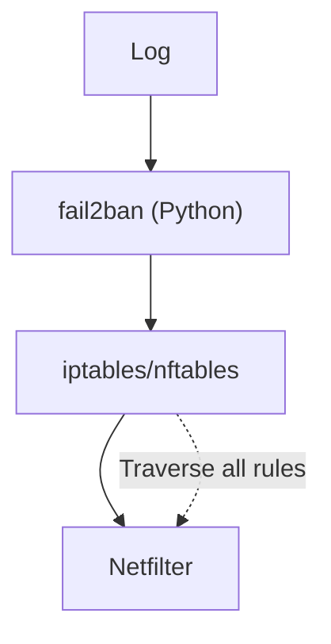
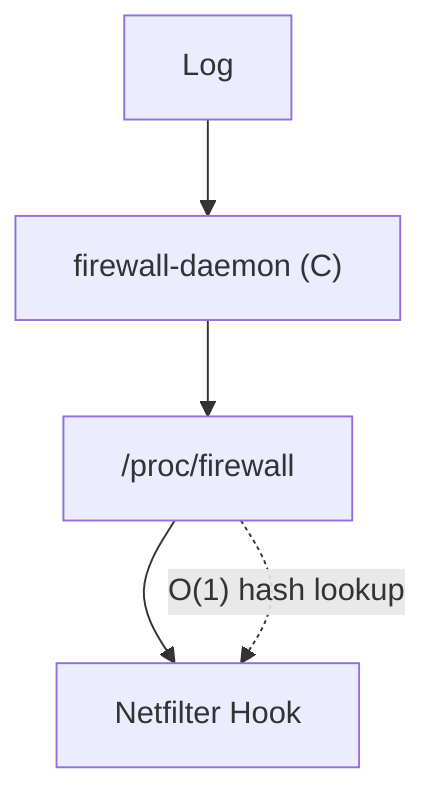

# Migrating from fail2ban

This document guides you through migrating existing fail2ban configurations to the Linux Firewall Kernel Module.

## Comparison Overview

| Feature | fail2ban | Linux Firewall |
|---------|----------|----------------|
| Ban Method | iptables/nftables rules | Netfilter Hook kernel interception |
| Performance | Slower with more rules | O(1) hash lookup, constant performance |
| Regex Engine | Python re | Rust regex (PCRE-equivalent syntax) |
| Config Format | INI format | YAML format |
| Persistence | None (in-memory only) | None (in-memory only) |
| Monitoring | None built-in | Prometheus metrics |
| Language | Python | C (kernel + userspace) |

## Architecture Differences

### fail2ban Architecture



### Linux Firewall Architecture



## Configuration Mapping

### Jail Configuration Mapping

| fail2ban (jail.local) | Linux Firewall (default.yaml) |
|----------------------|-------------------------------|
| `[sshd]` | `- name: sshd` |
| `enabled = true` | `enabled: true` |
| `filter = sshd` | `filter:\n  regex: '...'` |
| `logpath = /var/log/auth.log` | `log_path: /var/log/auth.log` |
| `maxretry = 5` | `action:\n  max_retries: 5` |
| `findtime = 600` | `action:\n  find_time: 600` |
| `bantime = 3600` | `action:\n  ban_time: 3600` |
| `port = ssh` | `port: 22` |
| `protocol = tcp` | `protocol: tcp` |

### Filter Configuration Mapping

| fail2ban (filter.d/sshd.conf) | Linux Firewall |
|-------------------------------|----------------|
| `failregex = ^%(__prefix_line)sFailed password...` | `regex: 'Failed password for .* from <HOST>'` |
| `<HOST>` auto-matching | `<HOST>` placeholder (same) |
| `ignoreregex` | Handled in daemon |

## Migration Steps

### 1. Backup Existing Configuration

```bash
# Backup fail2ban configuration
sudo cp -r /etc/fail2ban /etc/fail2ban.backup

# Export current banned list
sudo fail2ban-client status | grep "IP list" > /tmp/f2b-banned.txt
```

### 2. Install Linux Firewall

```bash
git clone https://github.com/SnowCore8/linux-firewall-kmod.git
cd linux-firewall-kmod
make
sudo make install
```

### 3. Convert Configuration

#### Original fail2ban Configuration

```ini
# /etc/fail2ban/jail.local

[DEFAULT]
bantime = 3600
findtime = 600
maxretry = 5
ignoreip = 127.0.0.1/8 192.168.1.0/24

[sshd]
enabled = true
port = ssh
filter = sshd
logpath = /var/log/auth.log
maxretry = 3

[nginx-http-auth]
enabled = true
port = http,https
filter = nginx-http-auth
logpath = /var/log/nginx/error.log
maxretry = 5
```

#### Converted Linux Firewall Configuration

```yaml
# /etc/firewall/default.yaml

global:
  log_level: info
  log_file: /var/log/firewall.log
  db_path: /var/lib/firewall/bans.db

whitelist:
  - 127.0.0.1/8
  - 192.168.1.0/24

jails:
  - name: sshd
    enabled: true
    log_path: /var/log/auth.log
    filter:
      regex: 'Failed password for (?:invalid user )?.+ from <HOST>'
    action:
      ban_time: 3600
      find_time: 600
      max_retries: 3
    port: 22
    protocol: tcp

  - name: nginx-http-auth
    enabled: true
    log_path: /var/log/nginx/error.log
    filter:
      regex: 'no user/password was provided for basic authentication.*client: <HOST>'
    action:
      ban_time: 3600
      find_time: 600
      max_retries: 5
    port: 80
    protocol: tcp
```

### 4. Convert Filters

#### fail2ban Filter

```ini
# /etc/fail2ban/filter.d/sshd.conf

[Definition]
failregex = ^%(__prefix_line)sFailed password for (?:illegal user )?\S+ from <HOST> port \d+ ssh2$
            ^%(__prefix_line)sFailed password for <HOST>
```

#### Linux Firewall Regex

```yaml
filter:
  regex: 'Failed password for (?:illegal user )?\S+ from <HOST>'
```

> **Note**: Remove fail2ban-specific `%(__prefix_line)s` prefix and simplify the regex.

### 5. Migrate Whitelist

```bash
# Extract whitelist from fail2ban
grep -oP 'ignoreip\s*=\s*\K.*' /etc/fail2ban/jail.local | \
    tr ' ' '\n' | \
    sed 's/^/  - /' >> /etc/firewall/default.yaml
```

### 6. Restore Ban State (Optional)

```bash
# Export banned IPs from fail2ban
sudo fail2ban-client status sshd | \
    grep -oP '\d+\.\d+\.\d+\.\d+' | \
    while read ip; do
        echo "$ip 3600" | sudo tee /proc/firewall/bans >/dev/null
    done
```

### 7. Stop fail2ban

```bash
sudo systemctl stop fail2ban
sudo systemctl disable fail2ban
```

### 8. Start Linux Firewall

```bash
sudo modprobe firewall
sudo systemctl enable firewall
sudo systemctl start firewall
```

### 9. Verify

```bash
# Check status
cat /proc/firewall/config

# View banned list
cat /proc/firewall/bans

# Test ban
echo "1.2.3.4 60" | sudo tee /proc/firewall/bans
cat /proc/firewall/bans
echo "unban 1.2.3.4" | sudo tee /proc/firewall/bans
```

## Known Differences

### Unsupported Features

| fail2ban Feature | Linux Firewall | Alternative |
|-----------------|----------------|-------------|
| Multiple actions | Single ban | Via Netfilter Hook |
| mail whois | None | Via Prometheus + AlertManager |
| DNS banning | None | IP-only banning |
| Custom banaction | None | Fixed Netfilter Hook |
| Python action scripts | None | Kernel-only banning |

### Behavior Differences

| Scenario | fail2ban | Linux Firewall |
|----------|----------|----------------|
| Permanent ban | `bantime = -1` | `ban_time: 0` |
| IPv6 support | Supported | Not yet supported |
| Dynamic ports | Supported | Requires explicit port config |
| Protocol detection | Automatic | Requires explicit config |

## Rollback Plan

If issues arise, you can quickly rollback to fail2ban:

```bash
# Stop Linux Firewall
sudo systemctl stop firewall
sudo systemctl disable firewall
sudo rmmod firewall

# Restore fail2ban
sudo systemctl enable fail2ban
sudo systemctl start fail2ban

# Restore configuration
sudo rm -rf /etc/fail2ban
sudo mv /etc/fail2ban.backup /etc/fail2ban
sudo systemctl restart fail2ban
```

## Performance Comparison

### Benchmarks

| Metric | fail2ban | Linux Firewall |
|--------|----------|----------------|
| 100 rules latency | ~5μs | ~0.15μs |
| 1000 rules latency | ~50μs | ~0.15μs |
| CPU usage | 2-5% | <1% |
| Memory usage | ~50MB | ~10MB |

### Large Scale Scenarios

| Scenario | fail2ban | Linux Firewall |
|----------|----------|----------------|
| 1000 banned IPs | Noticeably slower | No impact |
| 10000 banned IPs | Unusable | Not supported (max 4096) |

## Frequently Asked Questions

### Q: Do I need to run both simultaneously?

No. After migration, stop fail2ban to avoid conflicts.

### Q: Can I migrate jails partially?

Yes. You can migrate some jails first, verify everything works, then migrate the rest.

### Q: Can I reuse fail2ban's database?

Not directly. Ban records need to be re-triggered.

### Q: How do I monitor post-migration effects?

Use Prometheus metrics to compare ban rates and performance before and after migration.