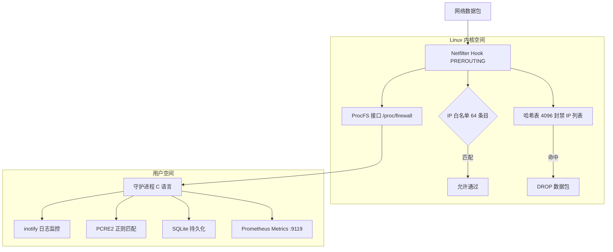

# Linux Firewall 内核模块

Linux 内核模块版本的 fail2ban，在内核网络数据包层面直接封禁 IP。

## 概述

Linux Firewall 内核模块是一个高性能的 IP 封禁解决方案，作为传统 fail2ban 的替代方案。与传统方案在 iptables/nftables 层面添加规则不同，本项目通过 Netfilter Hook 在内核网络栈中直接拦截数据包，提供更低的延迟和更高的性能。

## 核心特性

| 特性 | 描述 |
|------|------|
| Netfilter Hook | 在内核网络栈层面直接拦截数据包 |
| Jail 系统 | 支持多个独立的封禁规则 |
| 哈希表 | 4096 容量的内核哈希表，高效查找 |
| 自动过期清理 | 后台定时任务自动清理过期封禁 |
| IP 白名单 | 64 容量的白名单，防止误封关键 IP |
| ProcFS 接口 | 通过 `/proc` 文件系统进行管理和监控 |
| PCRE2 正则 | 用户态守护进程支持 PCRE2 正则表达式匹配日志 |
| RCU 并发 | 使用 Read-Copy-Update 实现高并发安全 |
| SQLite 持久化 | 封禁记录持久化存储，重启不丢失 |
| Prometheus 指标 | 内置 HTTP 服务器，端口 9119 暴露指标 |

## 系统架构



## 系统要求

| 项目 | 要求 |
|------|------|
| 内核 | Linux 5.x / 6.x |
| 架构 | x86_64 |
| 编译器 | GCC 10+ |

## 依赖

| 依赖 | 用途 |
|------|------|
| linux-headers | 内核模块编译 |
| libyaml | YAML 配置文件解析 |
| libsqlite3 | 封禁记录持久化 |
| libmicrohttpd | Prometheus HTTP 服务器 |
| libpcre2 | 正则表达式匹配 |

## 快速开始

```bash
# 克隆仓库
git clone https://github.com/SnowCore8/linux-firewall-kmod.git
cd linux-firewall-kmod

# 编译
make

# 安装
sudo make install

# 启动守护进程
sudo systemctl start firewall-daemon
```
