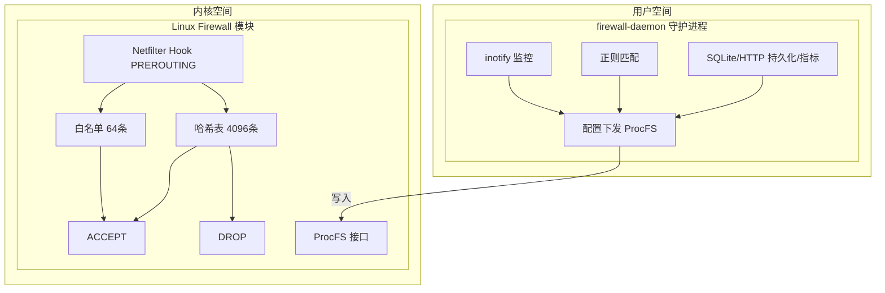

# 架构设计

本章节介绍 Linux Firewall 内核模块的整体架构和核心组件。

## 整体架构

系统由两个主要组件构成：

## 核心设计原则

| 原则 | 实现 |
|------|------|
| 高性能 | Netfilter Hook 直接处理，无 iptables 规则遍历 |
| 低延迟 | O(1) 哈希查找，RCU 无锁读 |
| 高可用 | SQLite 持久化，重启恢复封禁状态 |
| 安全性 | 白名单保护，防止误封关键服务 |
| 可观测性 | ProcFS + Prometheus 双重监控 |

## 关键参数

| 参数 | 值 | 说明 |
|------|-----|------|
| 哈希表容量 | 4096 | 最大封禁 IP 数量 |
| 白名单容量 | 64 | 最大白名单 IP 数量 |
| Prometheus 端口 | 9119 | 指标暴露端口 |

## 并发模型

| CPU | 操作类型 | 说明 |
|-----|---------|------|
| CPU 0 | RCU Read | 数据包处理路径，无锁并行 |
| CPU 1 | RCU Write | 封禁/解封写入，RCU 同步 |
| CPU 2 | RCU Read | 数据包处理路径，无锁并行 |
| CPU 3 | RCU Read | 数据包处理路径，无锁并行 |

- **读操作**：RCU 保护，完全无锁，多 CPU 并行
- **写操作**：RCU 同步，保证一致性
- **数据包处理**：纯读操作，极低延迟

## 组件关系

| 组件 | 空间 | 职责 |
|------|------|------|
| 内核模块 | 内核 | 数据包过滤、IP 封禁管理 |
| 守护进程 | 用户 | 日志监控、正则匹配、配置下发 |
| ProcFS | 内核/用户 | 配置接口、状态查询 |
| SQLite | 用户 | 封禁记录持久化 |