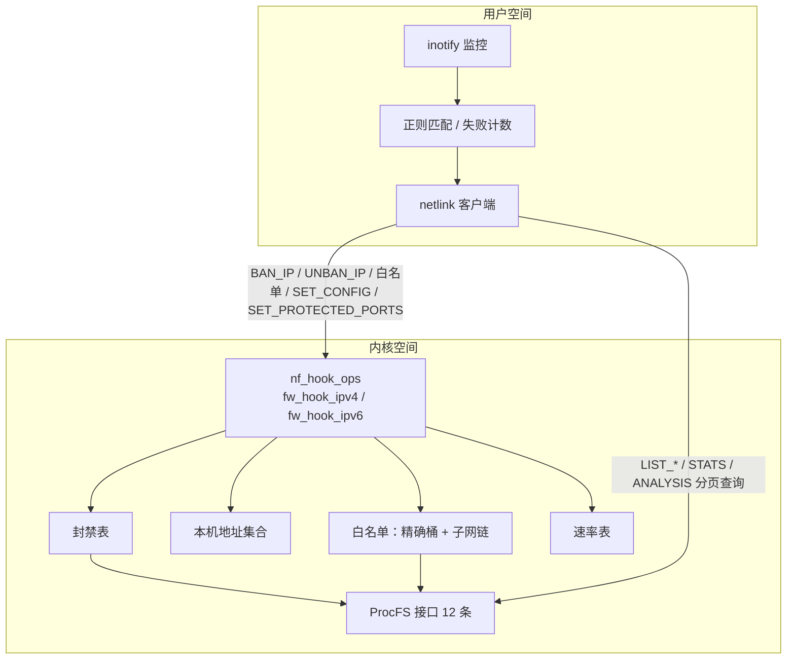

# 架构设计

本章节介绍 Linux Firewall 内核模块的整体架构和核心组件。

## 整体架构

系统由两个主要组件构成：内核模块负责报文判定与表管理，守护进程负责日志监控、决策与对外接口。
两者之间**必须走 netlink**；procfs 是给用户/运维的接口，不是 daemon 的内部通道
（`src/daemon/main.rs:362`）。（procfs 是给用户/运维的接口，不是 daemon 的内部通道）

```mermaid
graph TB
    subgraph UserSpace["用户空间"]
        Inotify["inotify 监控"]
        Regex["正则匹配 / 失败计数"]
        NL["netlink 客户端"]
        Inotify --> Regex
        Regex --> NL
    end

    subgraph KernelSpace["内核空间"]
        Hook["nf_hook_ops<br/>fw_hook_ipv4 / fw_hook_ipv6"]
        Whitelist["白名单：精确桶 + 子网链"]
        Local["本机地址集合"]
        BanTable["封禁表"]
        RateTable["速率表"]
        ProcFS["ProcFS 接口 12 条"]

        Hook --> Whitelist
        Hook --> Local
        Hook --> BanTable
        Hook --> RateTable
        BanTable --> ProcFS
        Whitelist --> ProcFS
    end

    NL -->|"BAN_IP / UNBAN_IP / 白名单 / SET_CONFIG / SET_PROTECTED_PORTS"| Hook
    NL -->|"LIST_* / STATS / ANALYSIS 分页查询"| ProcFS
```

## 核心设计原则

| 原则 | 实现 |
|------|------|
| 高性能 | 单次 RCU 临界区完成白名单 / 本机地址 / 封禁表 / 速率四步判定（`src/kernel-module/fw_hook.c:108-115`） |
| 低延迟 | 精确地址哈希查找；本机地址集合用开放寻址哈希集，非每包全表扫描 |
| 状态持久 | 内核侧 `fw_state_save()` / `fw_state_restore()` 落盘到 `state_file`（默认 `/var/lib/firewall/state`），模块重载后封禁与白名单恢复（`src/kernel-module/fw_main.c:229,310`） |
| 安全性 | 白名单与「本机地址集合」双重短路，防止误封关键服务与本机接口地址 |
| 可观测性 | ProcFS + Prometheus 双重监控；`stats` 读前跨 CPU flush（`src/kernel-module/fw_procfs.c:549-552`） |

## 关键参数

哈希桶数**不是**条目容量：桶数由 `*_HASH_BITS` 决定，条目上限由模块参数决定
（`src/kernel-module/fw_types.h:72-81`、`src/kernel-module/fw_main.c:71-74`；
契约侧的机械核对见 `contract/procfs.fwidl` 的 `limit` 块）。

| 参数 | 值 | 说明 |
|------|-----|------|
| 封禁表哈希桶 | 4096（`BAN_HASH_BITS` = 12） | 桶数，不是容量 |
| 封禁表条目上限 | `fw_max_ban_entries`（默认 65535） | 到限拒绝新增并计 `ban_table_full_rejects` |
| 白名单哈希桶 | 64（`WHITELIST_HASH_BITS` = 6） | 桶数，不是容量；另有子网链 |
| 白名单条目上限 | `fw_max_whitelist_entries`（默认 65535） | 插入前在桶锁内检查 |
| 速率表哈希桶 | 65536（`RATE_HASH_BITS` = 16） | 桶数，不是容量 |
| 速率表条目上限 | `fw_max_rate_entries`（默认 65536） | 文档化范围 1024–262144 |
| 本机地址集合 | 下界 `fw_max_local_ips`（默认 256），硬上界 2^16 | 按实际地址数扩容 |
| Prometheus 端口 | `metrics_port`（默认 9119） | 与 Web UI / JSON API / SSE 共用同一监听地址 |

以上 `fw_max_*` 都是**内核模块参数**，只在加载模块或写 sysfs 时生效。daemon 配置里的
`capacity:` 段目前只做持久化与展示，不经 netlink 下发——`SetConfig` 消息没有容量字段
（`contract/netlink.fwidl:380-401`）。

## 并发模型

- 读侧（报文判定）走 RCU，多核并行无锁；
- 写侧（封禁 / 解封 / 白名单变更）持 **per-bucket 自旋锁**，锁内只做摘链与计数，节点释放一律
  用 `call_rcu` 延后到宽限期之后，不在持锁时 `timer_delete_sync()`（`src/kernel-module/fw_ban.c:373-387`）；
- 每包可变统计落在 **per-CPU** 槽（`this_cpu_ptr`），不共享写（`src/kernel-module/fw_rate.c:101`）；
- 到期由 **per-entry 定时器**驱动，没有全局清理线程（`cleanup_cycles` 恒为 0）。

RCU 不按 CPU 分配读写角色：任意 CPU 都可读、都可在锁内写。

## 组件关系

| 组件 | 空间 | 职责 |
|------|------|------|
| 内核模块 | 内核 | 报文判定、封禁/白名单表、速率与 DDoS 检测、procfs 与 netlink 接口 |
| 守护进程 | 用户 | 日志监控、正则匹配、失败计数与封禁决策、配置下发、Web UI / API / SSE / 指标 |
| Web 前端 | 浏览器 | 独立 SPA：视图与实时推送消费；由守护进程内嵌静态资源托管（见 [`frontend.md`](frontend.md)） |
| ProcFS | 内核/用户 | 用户操作接口与状态查询（12 条，权限见 `contract/procfs.fwidl`） |
| netlink | 内核/用户 | daemon ↔ 内核的**唯一**内部通道：命令、分页查询响应与事件推送 |
| 历史库 | 用户 | daemon 侧时序历史与封禁历史持久化（`src/daemon/history_snapshot/`） |
