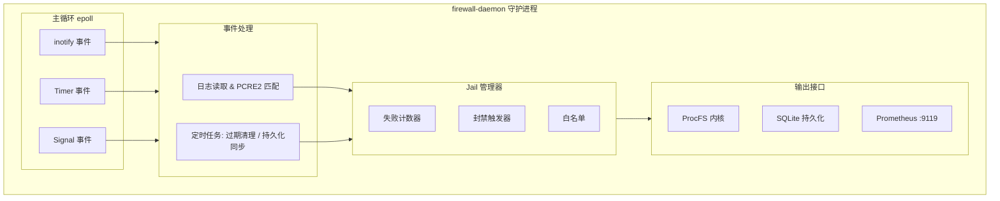
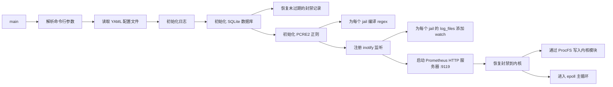
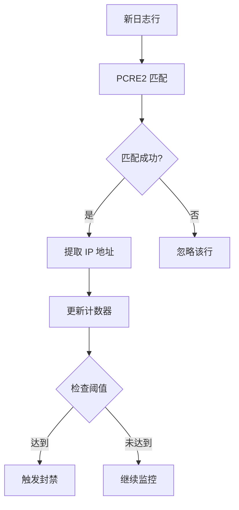
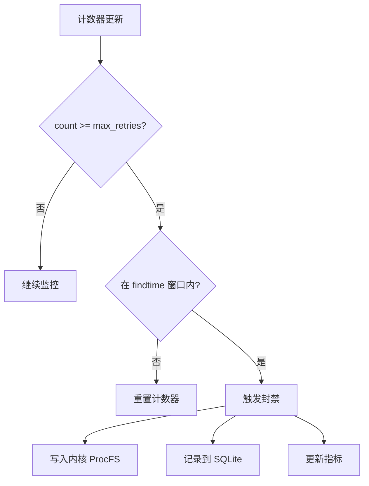
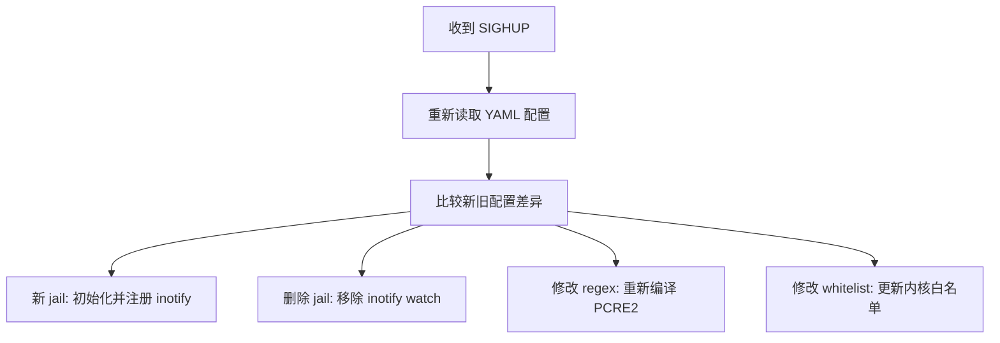

# 用户态守护进程

本文档介绍用户态守护进程 `firewall-daemon` 的设计和实现。

## 概述

守护进程 `firewall-daemon` 运行在用户空间，负责：

- 监控日志文件变化
- 使用 PCRE2 正则匹配封禁模式
- 统计失败次数并触发封禁
- 管理封禁持久化
- 暴露 Prometheus 指标

## 技术栈

| 组件 | 用途 |
|------|------|
| C 语言 | 主要编程语言 |
| libyaml | YAML 配置文件解析 |
| libpcre2 | 正则表达式编译和匹配 |
| libsqlite3 | 封禁记录持久化存储 |
| libmicrohttpd | Prometheus HTTP 指标服务器 |
| inotify | Linux 文件变化监控 |

## 架构



## 启动流程



## 日志监控

### inotify 事件

```c
int fd = inotify_init();
inotify_add_watch(fd, "/var/log/auth.log", IN_MODIFY);
```

| 事件 | 说明 |
|------|------|
| `IN_MODIFY` | 文件被修改（新日志写入） |
| `IN_CLOSE_WRITE` | 文件写入后关闭 |
| `IN_MOVED_TO` | 文件被移入（日志轮转） |

### 日志轮转处理

守护进程检测日志轮转并重新注册 inotify watch：

```c
if (event->mask & IN_IGNORED) {
    // 日志文件被轮转，重新 watch
    inotify_add_watch(fd, log_path, IN_MODIFY);
}
```

## PCRE2 正则匹配

### 正则编译

```c
pcre2_code *re = pcre2_compile(
    (PCRE2_SPTR)pattern,
    PCRE2_ZERO_TERMINATED,
    PCRE2_UTF | PCRE2_NO_UTF_CHECK,
    &error_code,
    &error_offset,
    NULL
);
```

### `<HOST>` 替换

配置中的 `<HOST>` 占位符被替换为 IP 匹配正则：

```c
#define HOST_PATTERN \
    "(?:(?:25[0-5]|2[0-4][0-9]|[01]?[0-9][0-9]?)\\.){3}" \
    "(?:25[0-5]|2[0-4][0-9]|[01]?[0-9][0-9]?)"

// 替换 <HOST> 为 HOST_PATTERN
char *expanded = replace_all(regex, "<HOST>", HOST_PATTERN);
```

### 匹配流程



## Jail 管理器

### 失败计数器

每个 jail 维护一个 `(ip, count)` 映射：

```c
struct failure_counter {
    uint32_t ip;              // IP 地址
    uint32_t count;           // 当前计数
    time_t first_seen;        // 首次出现时间
    time_t last_seen;         // 最后出现时间
};
```

### 封禁触发



### find_time 窗口

```
find_time = 600s

t=0          t=300        t=600        t=900
│            │            │            │
├──── window ─────────────┤
             ├──────────── window ─────┤

失败 1 ───► 失败 2 ───► 失败 3 ──► 失败 1 过期
```

## SQLite 持久化

### 数据库 Schema

```sql
CREATE TABLE IF NOT EXISTS bans (
    id INTEGER PRIMARY KEY AUTOINCREMENT,
    ip TEXT NOT NULL,
    port INTEGER NOT NULL,
    protocol TEXT NOT NULL,
    jail TEXT NOT NULL,
    ban_time INTEGER NOT NULL,
    expire_time INTEGER NOT NULL,
    created_at INTEGER DEFAULT (strftime('%s', 'now'))
);

CREATE INDEX IF NOT EXISTS idx_bans_ip ON bans(ip);
CREATE INDEX IF NOT EXISTS idx_bans_expire ON bans(expire_time);
```

### 操作流程

| 操作 | 说明 |
|------|------|
| 启动恢复 | 读取 `expire_time > now` 的记录 |
| 封禁记录 | INSERT 新记录 |
| 解封记录 | DELETE 过期记录 |
| 定期同步 | 每 60 秒清理过期记录 |

## Prometheus 指标

### 暴露地址

```
http://<host>:9119/metrics
```

### 指标列表

> 实际由 `src/daemon/http-exporter.c` 暴露的 14 个指标。
> 早期文档中 `firewall_ban_events_total` / `firewall_packets_*` /
> `firewall_hash_table_*` / `firewall_jail_*` 等条目均不存在。

#### 内核侧

| 指标 | 类型 | 说明 |
|------|------|------|
| `firewall_kernel_banned_ips_current` | gauge | 当前封禁 IP 数 |
| `firewall_kernel_bans_total` | counter | 累计封禁操作数 |
| `firewall_kernel_unbans_total` | counter | 累计解封操作数 |
| `firewall_kernel_whitelist_count` | gauge | 当前白名单条目数 |

#### 守护进程侧

| 指标 | 类型 | 说明 |
|------|------|------|
| `firewall_daemon_uptime_seconds` | counter | 守护进程运行时长 |
| `firewall_daemon_config_reloads_total` | counter | SIGHUP 触发的配置重载次数 |
| `firewall_daemon_inotify_events_total` | counter | inotify 事件总数 |
| `firewall_daemon_log_rotations_total` | counter | 日志轮转次数 |
| `firewall_daemon_lines_parsed_total` | counter | 已解析日志行数 |
| `firewall_daemon_lines_skipped_total` | counter | 跳过的日志行数 |
| `firewall_daemon_regex_matches_total` | counter | PCRE2 匹配命中数 |
| `firewall_daemon_ips_extracted_total` | counter | 提取出的 IP 数 |
| `firewall_daemon_ips_banned_total` | counter | 实际触发内核封禁的 IP 数 |
| `firewall_daemon_failed_attempts_total` | counter | 封禁失败次数 |

### 示例输出

```
# HELP firewall_kernel_banned_ips_current Currently banned IPs
# TYPE firewall_kernel_banned_ips_current gauge
firewall_kernel_banned_ips_current 15

# HELP firewall_kernel_bans_total Total ban operations
# TYPE firewall_kernel_bans_total counter
firewall_kernel_bans_total 125

# HELP firewall_kernel_unbans_total Total unban operations
# TYPE firewall_kernel_unbans_total counter
firewall_kernel_unbans_total 98

# HELP firewall_daemon_lines_parsed_total Lines parsed by the daemon
# TYPE firewall_daemon_lines_parsed_total counter
firewall_daemon_lines_parsed_total 1250340
```

## 信号处理

| 信号 | 行为 |
|------|------|
| `SIGTERM` | 优雅退出，保存状态 |
| `SIGINT` | 优雅退出，保存状态 |
| `SIGHUP` | 重新加载配置 |
| `SIGUSR1` | 输出当前状态到日志 |

## 配置热重载

通过 `SIGHUP` 信号触发热重载：

