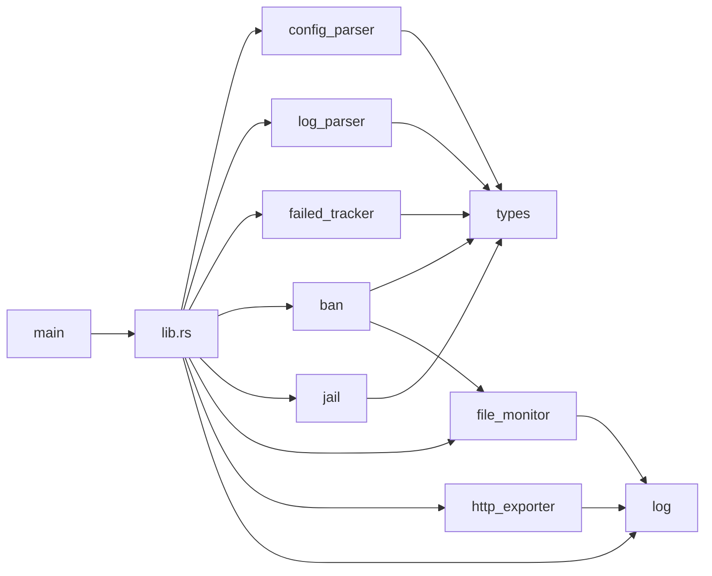
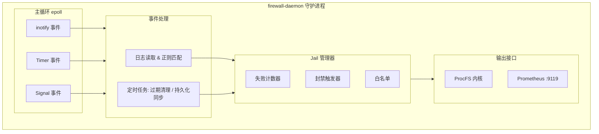
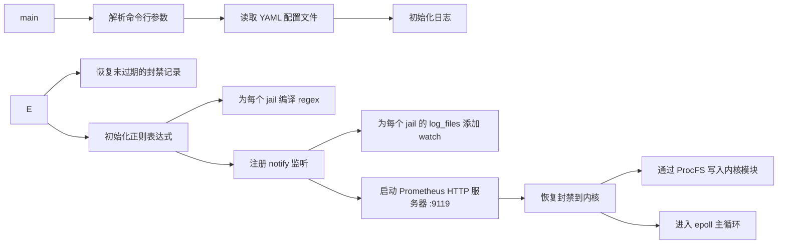
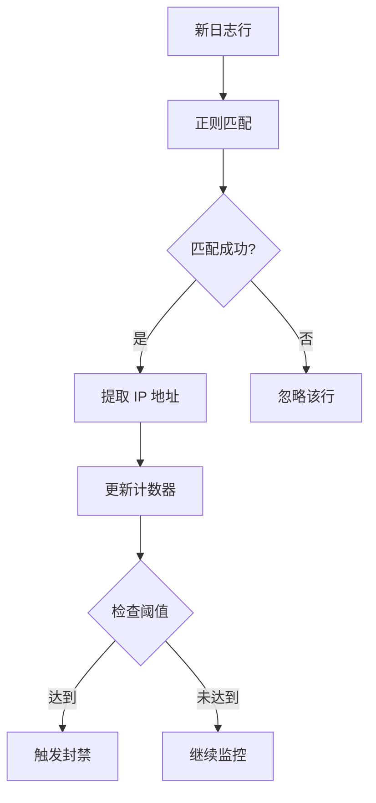
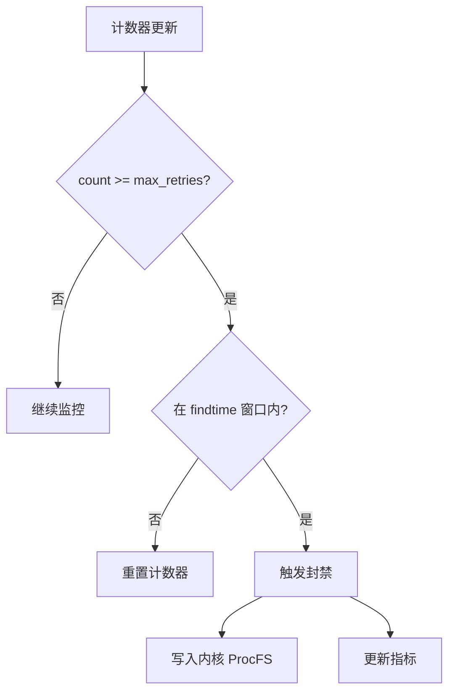
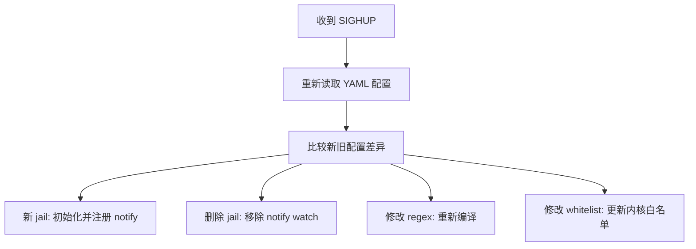

# 用户态守护进程

本文档介绍用户态守护进程 `firewall-daemon` 的设计和实现。

## 概述

守护进程 `firewall-daemon` 运行在用户空间，负责：

- 监控日志文件变化
- 使用正则表达式匹配封禁模式
- 统计失败次数并触发封禁
- 管理封禁持久化
- 暴露 Prometheus 指标

## 技术栈

| 组件 | 用途 |
|------|------|
| Rust | 主要编程语言（12 个模块，约 7000 行） |
| regex | 正则表达式编译和匹配（PCRE2 语法） |
| tiny_http | Prometheus HTTP 指标服务器（端口 9119） |
| inotify | Linux 文件变化监控（直接使用 `inotify` crate 绑定，未通过 `notify` 抽象层） |

## 模块结构

守护进程在 `daemon/` 子目录中按职责划分为 12 个 Rust 模块（含 `lib.rs`）。模块间通过显式 `use` 导入，避免循环依赖。

| 模块 | 职责 |
|------|------|
| `lib.rs` | 库入口，导出公共 API；`main.rs` 仅做 CLI 解析后调用 `run_daemon()` |
| `log` | 结构化日志宏（`log_info!` / `log_warn!` / `log_error!` / `log_debug!`），通过 `log_level` 配置过滤 |
| `types` | 公共数据类型：`BanRecord`、`FailureEntry`、`JailConfig`、`Protocol` 等 |
| `config_parser` | YAML 配置解析、字段校验、默认合并；非法配置启动期即失败 |
| `log_parser` | 单行日志正则匹配、IP 提取；封装 `regex` crate |
| `failed_tracker` | 每个 jail 的 `(ip, count, first_seen, last_seen)` 滑动窗口计数器 |
| `ban` | 封禁触发逻辑：`max_retries` / `findtime` / `ban_time` 判定，调用 ProcFS 下发 |
| `jail` | jail 生命周期管理：创建 / 启停 / 热重载差异合并 |
| `file_monitor` | `inotify` 监听 + 日志轮转检测 + inode 重连 |
| `http_exporter` | `tiny_http` HTTP 服务，14 个 Prometheus 指标（10 daemon + 4 kernel） |
| `main` | CLI 解析、信号注册、`epoll` 主循环、tokio runtime 启动 |



## 内存安全

守护进程使用 Rust 实现，所有 `unsafe { }` 块均显式标注 `// SAFETY:` 注释，说明前置条件。当前代码库共有 **19 处** `unsafe` 块，主要集中在：

- `libc` 系统调用封装（`read` / `write` / `ioctl` / `fcntl`）
- `inotify` 原始 fd 操作
- C 字符串与 Rust `&str` 互转（带长度校验）
- ProcFS 文件路径构造

每一处 `unsafe` 块都包含两段注释：

1. **前置条件** — 哪些外部状态必须由调用方保证（如 fd 有效、缓冲区长度正确、C 字符串 NUL 终止）
2. **不变量保持** — 该块执行后哪些 Rust 安全不变量仍然成立

`Cargo.toml` 配置了 ASAN 运行时检测 profile（`[profile.dev-with-debug]`）：

```toml
[profile.dev-with-debug]
inherits = "dev"
debug = true
# RUSTFLAGS="-Z sanitizer=address" cargo build --profile dev-with-debug
```

CI 流水线在 `cargo test --profile dev-with-debug` 阶段对所有单元测试运行 AddressSanitizer，自动捕获 use-after-free、buffer-overflow、double-free 等未定义行为。

## 架构



## 启动流程



## 日志监控

### notify 事件

```rust
use notify::{Watcher, RecursiveMode, recommended_watcher, Event};
```

| 事件 | 说明 |
|------|------|
| `Modify` | 文件被修改（新日志写入） |
| `CloseWrite` | 文件写入后关闭 |
| `RenamedTo` | 文件被移入（日志轮转） |

### 日志轮转处理

守护进程检测日志轮转并重新注册 notify watch：

```rust
if event.kind.contains(notify::event::Kind::Remove) {
    // 日志文件被轮转，重新 watch
    watcher.watch(log_path, RecursiveMode::NonRecursive)?;
}
```

## 正则匹配

### 正则编译

```rust
use regex::Regex;
let re = Regex::new(pattern).expect("invalid regex");
```

### `<HOST>` 替换

配置中的 `<HOST>` 占位符被替换为 IP 匹配正则：

```rust
const HOST_PATTERN: &str =
    r"(?:(?:25[0-5]|2[0-4][0-9]|[01]?[0-9][0-9]?)\.){3}"
    r"(?:25[0-5]|2[0-4][0-9]|[01]?[0-9][0-9]?)";

// 替换 <HOST> 为 HOST_PATTERN
let expanded = pattern.replace("<HOST>", HOST_PATTERN);
```

### 匹配流程



## Jail 管理器

### 失败计数器

每个 jail 维护一个 `(ip, count)` 映射：

```rust
struct FailureCounter {
    ip: u32,              // IP 地址
    count: u32,           // 当前计数
    first_seen: SystemTime, // 首次出现时间
    last_seen: SystemTime,  // 最后出现时间
}
```

### 封禁触发



### find_time 窗口

```mermaid
graph LR
    subgraph "find_time = 600s"
        T0["t=0"] --> T300["t=300"] --> T600["t=600"] --> T900["t=900"]
    end

    subgraph "窗口 1"
        W1["失败 1"] -. "窗口覆盖 0→600" .-> W2["失败 2"]
        W2 -. .-> W3["失败 3"]
    end

    subgraph "窗口 2"
        W2b["失败 2"] -. "窗口覆盖 300→900" .-> W3b["失败 3"]
        W3b -. .-> W4["失败 1 过期"]
    end

    T0 ~~~ W1
    T300 ~~~ W2
    T600 ~~~ W3
    T900 ~~~ W4
```


### 数据库 Schema

```sql
CREATE TABLE IF NOT EXISTS bans (
    id INTEGER PRIMARY KEY AUTOINCREMENT,
    ip TEXT NOT NULL,
    port INTEGER NOT NULL,
    protocol TEXT NOT NULL,
    jail TEXT NOT NULL,
    ban_time INTEGER NOT NULL,
    expire_time INTEGER NOT NULL,
    created_at INTEGER DEFAULT (strftime('%s', 'now'))
);

CREATE INDEX IF NOT EXISTS idx_bans_ip ON bans(ip);
CREATE INDEX IF NOT EXISTS idx_bans_expire ON bans(expire_time);
```

### 操作流程

| 操作 | 说明 |
|------|------|
| 启动恢复 | 读取 `expire_time > now` 的记录 |
| 封禁记录 | INSERT 新记录 |
| 解封记录 | DELETE 过期记录 |
| 定期同步 | 每 60 秒清理过期记录 |

## Prometheus 指标

### 暴露地址

```
http://<host>:9119/metrics
```

### 指标列表

> 实际由 `src/http_exporter.rs` 暴露的 14 个指标。
> 早期文档中 `firewall_ban_events_total` / `firewall_packets_*` /
> `firewall_hash_table_*` / `firewall_jail_*` 等条目均不存在。

#### 内核侧

| 指标 | 类型 | 说明 |
|------|------|------|
| `firewall_kernel_banned_ips_current` | gauge | 当前封禁 IP 数 |
| `firewall_kernel_bans_total` | counter | 累计封禁操作数 |
| `firewall_kernel_unbans_total` | counter | 累计解封操作数 |
| `firewall_kernel_whitelist_count` | gauge | 当前白名单条目数 |

#### 守护进程侧

| 指标 | 类型 | 说明 |
|------|------|------|
| `firewall_daemon_uptime_seconds` | counter | 守护进程运行时长 |
| `firewall_daemon_config_reloads_total` | counter | SIGHUP 触发的配置重载次数 |
| `firewall_daemon_inotify_events_total` | counter | inotify 事件总数 |
| `firewall_daemon_log_rotations_total` | counter | 日志轮转次数 |
| `firewall_daemon_lines_parsed_total` | counter | 已解析日志行数 |
| `firewall_daemon_lines_skipped_total` | counter | 跳过的日志行数 |
| `firewall_daemon_regex_matches_total` | counter | 正则匹配命中数 |
| `firewall_daemon_ips_extracted_total` | counter | 提取出的 IP 数 |
| `firewall_daemon_ips_banned_total` | counter | 实际触发内核封禁的 IP 数 |
| `firewall_daemon_failed_attempts_total` | counter | 封禁失败次数 |

### 示例输出

```
# HELP firewall_kernel_banned_ips_current Currently banned IPs
# TYPE firewall_kernel_banned_ips_current gauge
firewall_kernel_banned_ips_current 15

# HELP firewall_kernel_bans_total Total ban operations
# TYPE firewall_kernel_bans_total counter
firewall_kernel_bans_total 125

# HELP firewall_kernel_unbans_total Total unban operations
# TYPE firewall_kernel_unbans_total counter
firewall_kernel_unbans_total 98

# HELP firewall_daemon_lines_parsed_total Lines parsed by the daemon
# TYPE firewall_daemon_lines_parsed_total counter
firewall_daemon_lines_parsed_total 1250340
```

## 信号处理

| 信号 | 行为 |
|------|------|
| `SIGTERM` | 优雅退出，保存状态 |
| `SIGINT` | 优雅退出，保存状态 |
| `SIGHUP` | 重新加载配置 |
| `SIGUSR1` | 输出当前状态到日志 |
| `SIGPIPE` | 忽略（Prometheus 抓取端断开时不致进程退出） |

## 配置热重载

通过 `SIGHUP` 信号触发热重载：

