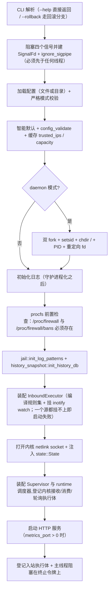

# 用户态守护进程

`firewall-daemon` 是内核模块的用户态对手侧：监控日志、做失败计数与封禁判定、经 netlink
把指令下发给内核，并把状态经 HTTP / SSE 呈现给运维与前端。内核负责报文级判定（速率、DDoS），
daemon 负责应用层检测（如 SSH 暴力破解）与对外接口。

两条硬边界：

- daemon 与内核之间的**内部通道只有 netlink**；`/proc/firewall/*` 是给用户/运维的接口，
  不是 daemon 的内部通道（`src/daemon/main.rs`）。
- 威胁模型是**入站单向防守**：不引入出站钩子、外发检测或外联行为分析（设计文档「决策记录」）。

相关文档：

- 报文判定路径、封禁/解封事件链：`data-flow.md`
- 内核侧内部结构、模块参数与哈希表规模：`kernel-module.md`
- 重写设计（分层取舍、结构问题编号 A–M、分阶段落地与验收证据）：`../development/daemon-rewrite-design.md`
- 接口真相源：`contract/netlink.fwidl`、`contract/procfs.fwidl`、`contract/http.fwidl`
- 配置字段与语义：`../configuration/yaml-config.md`

## 技术栈

| 组件 | 用途 |
|------|------|
| Go module `src/daemon`（组合根 `cmd/firewall-daemon/main.go` + `internal/*`） | 实现语言；v2.2.0 起由 Rust 迁移，见 README「快速开始」与 [构建](../development/building.md)。组合根只负责装配与生命周期，业务判定在 `internal/*`（bans / config / jail / kernel / logger / runtime） |
| golang.org/x/sys (unix) + yaml.v3 | netlink unix socket、procfs 读写、YAML 配置解析（字段名必须与 Go module 内 YamlConfig 一致，多一个 key 即启动失败） |
| **尚未移植**：HTTP / SSE / `/metrics` / 历史快照 / Web UI 权威启用状态 | 这些能力在 Go 侧未装配：启动时只记录一条 warn，绝不伪装成已完成；清单以 `cmd/firewall-daemon/main.go` 中「未装配」标注为准（见下表与下文） |
| unix socket + syscall netlink | 与内核双向通信：命令下发、分页查询、事件推送 |
| log/syslog + stdlib os/inotify 替代实现 | 结构化日志（JSON Lines，整行单次写入；文件打开失败回退 syslog-only）与日志文件变更监控 |
| go:embed（`src/daemon/web_ui/static/assets.go`）+ vite | SPA 面板携带进二进制：vite 产物直接输出到 `src/daemon/web_ui/static/`，文件名固定后由 `assets.go` 的 `//go:embed .` 按名取走 |

## 本文档的口径

**上半部分（技术栈、组件关系）描述 Go module `src/daemon` 当前的实际结构**：组合根是
`cmd/firewall-daemon/main.go`，只负责 CLI 解析、装配与生命周期；以「未装配」标注的子系统
（HTTP / SSE / `/metrics` / 历史快照 / Web UI 权威启用状态）尚未移植到 Go 侧——它们运行时只记录
一条 warn，绝不伪装成已完成。

**下半部分（「组件关系」表以下的各节）是 v2.2.0 **冻结语义与已退役实现的内部结构说明**，路径为
历史 Rust 文件（如 `src/daemon/*.rs`），工作区磁盘上已不存在；这些语义被原样搬到 Go 侧后不再改动，
逐项落地状态见 [daemon-rewrite-design.md](../development/daemon-rewrite-design.md)（「修复项与落地状态」），
本文档不复述会随批次变动的进度。

## 组件关系

| 组件 | 空间 | 职责 |
|------|------|------|
| 内核模块 | 内核 | 报文判定、封禁/白名单表、速率与 DDoS 检测、procfs 与 netlink 接口 |
| 守护进程 | 用户 | 日志监控、行解析、失败计数与封禁判定、配置下发；**HTTP/SSE/指标尚未移植**（见「技术栈」表与文末范围说明） |
| netlink | 内核 ↔ 用户 | daemon 与内核的**唯一**内部通道：命令、分页查询响应、事件推送 |
| ProcFS | 内核 ↔ 用户 | 运维接口（12 条），daemon 只做启动期存在性检查，不用它做内部通信 |

## 运行时模型

Go module `src/daemon` 当前是**单执行体驱动四段**：组合根不创建任何业务 goroutine，只装配一个
`InboundExecutor`；其主链路 `executor.Run()` 在一个 goroutine 内顺序走「读字节 → 行分割 → 正则判
定 → 封禁下发」，段与段之间没有队列、也就不存在「满时丢弃」。信号层先于该 goroutine 建立
（见下一节），`inotify fd` 与 `signalfd` 并入同一个 `poll`，周期任务走执行体自己的单调时钟
定时器表；内核侧交互经 `kernel.Client`（syscall netlink + unix socket），发/收都在同一段阻塞 IO
上等待确认。没有独立的 scheduler、netlink-receive、SSE-worker goroutine。

| 承担者 | 职责 | 形态 |
|--------|------|------|
| `pipeline` goroutine（InboundExecutor.Run） | 四段顺序驱动：读字节、行分割、正则判定、封禁下发；单线程独占每源偏移、半行缓冲与失败窗口，故段间无队列、不存在「满时丢弃」 | 阻塞 IO + CPU 正则 |
| `signals`（NewSignalSource） | 先于任何 goroutine 建立 SignalFd；inotify fd 与 signalfd 同一池 poll | 阻塞 IO |
| kernel reactor / scheduler / SSE worker | —— | **尚未移植**（见文末「范围说明」） |

有界 channel、逐段背压策略与「状态 hub 覆盖式发布」是**设计目标形态**（见
[daemon-rewrite-design.md](../development/daemon-rewrite-design.md)，当前 Go 侧尚未实现）。
旧实现的全部周期任务都挂在 `file_monitor::monitor_loop` 的 `poll` 超时分支上，持续有 inotify
事件时 `poll` 恒返回非 0，60 s / 300 s / 2 s 三类任务随之被无限期延后（结构问题 A）。
`scheduler` 改用**单调时钟**（`Instant`）驱动，与事件吞吐完全解耦，且不受时钟回拨影响
（`runtime/timers.rs`：`fire_due(now)` 是纯函数，测试可用合成时刻精确验证不漂移）。

**当前落地形态**：`ingest → parse → decision → pipeline` 四段由**一个**执行体
（`pipeline/executor.rs`）顺序驱动——单线程独占每源偏移、半行缓冲与每 jail 失败窗口，故段与段
之间不存在队列，「满时丢弃」的窗口无从产生；`inotify` fd 与 `signalfd` 并进同一个 `poll`，
周期维护走该执行体自己的 `TimerTable`。上表的线程拆分与有界 channel 是**目标**形态，尚未落地
（拆分后谁拥有分片器等归属问题记录在 `pipeline/executor.rs` 的模块文档里）。

### 关停顺序

关停不变量是「**netlink 停止后才能在途事件写库**」。要让它真正成立，就不能一次性把停止信号
广播给所有执行体——那样上下游同时收尾，「上游已完全停止」不成立。故 `Supervisor::shutdown()`
按**登记逆序逐段串行**停止：对当前段 `request()` 后 `join` 到结束，才停下一段
（`runtime/supervisor.rs`）。登记顺序即依赖顺序（下游先登记）。

目标顺序（设计文档「生命周期」）：

```
停 HTTP 接入 → 停 scheduler → 停 kernel reactor（先 flush 在途请求）
  → 停 pipeline（排空队列）→ 停 ingest → flush persist → 写 PID 文件清理
```

当前生产的实际顺序（2.I 之后）：`main` 阻塞在终止令牌上 → 停 `runtime` 执行体（入站执行体
最先停，随后内核轮询体、消费体、接收执行体，最后是调度器）→ `cleanup()`：停 HTTP → 关历史库
→ 删 PID 文件（`src/daemon/main.rs`）。`close_history_db` 自身会 join 写线程并把已入队的持久化
落盘，故「netlink 停止后在途事件写库」由这个顺序保证。

## 模块划分（按数据所有权）

每个模块**独占**自己的状态，跨模块只传消息或 `Arc<不可变快照>`；`OnceLock` 只允许出现在
日志全局与测试夹具两处，其余一律构造期注入。

| 模块（Go 路径） | 数据所有权 | 对外接口 |
|------|-----------|---------|
| `cmd/firewall-daemon/main.go` | 装配状态 | CLI 解析 → 严格校验配置 → checkProcfs → 按登记顺序 Spawn → 逆序关停；所有未移植能力在这里显式标注为「未装配」，只 warn 不假装完成 |
| `internal/config/`（args / parser / loader / types） | 配置对象与字段语义 | `ParseConfigArgs` / `Default` / `LoadConfigFile|Directory` / `Validate`；`parser.rs` 的 YamlConfig 带 deny_unknown_fields，多一个 key 即启动失败 |
| `internal/logger/`（logger + file + json + syslog） | 日志目的地与整行不变量 | `Init(cfg)` 返回 slog Logger：JSON Lines、自定义 drain 整行单次写入；文件不可写时回退 stderr / syslog-only |
| `internal/runtime/`（supervisor + executor + pipeline + shutdown + signals + timers） | 执行体生命周期 | `NewSignalSource`（早于任何 goroutine）、`Spawn`/`Shutdown`、`InboundExecutor.Run`（阻塞 IO + CPU 正则的主链路口径）、周期维护与单调时钟定时器 |
| `internal/jail/`（jail + compile + service） | jail 状态与规则集 | 智能默认 + `Validate` + 编译各 regex；Web UI 权威启用状态**尚未移植** |
| `internal/bans/`（ban + cache + endian） | 活跃封禁集合 | Ban 的入参编码/解码与活跃缓存、镜像插入、撤销路径 |
| `internal/logparse/`（splitter + rule + ip） | 日志行缓冲与规则 | 行分割、命名捕获组提取 IP（返回 `IpAddr` 而非 `String`）、超时判定 |
| `internal/kernel/`（transport + reactor + router + client + codec） | netlink socket 与在途请求 | unix socket 单写者、按 `(type, seq)` 路由未知即计数、类型化 Ban/Unban/List/SetConfig；租约续期见 `runtime/supervisor` |
| `internal/kernel/client.go` | 类型化客户端 API | `Ban(addr, prefixLen, durationSecs, reason)` / `Unban` / 分页 `List*All` / `SetConfig` / `SetProtectedPorts` |
| `internal/runtime/executor.go` | 入站主链路装配态 | `Deps.Logger/Facts/Sink/Stats/Hooks/Reloader/Enabled`：未移植能力一律 nil（如 Hooks=历史快照、Reloader=配置热重载、Enabled=Web UI 权威状态），组合根读 `cfg()` 装配参数 |
| `internal/runtime/timers.go` + `shutdown.go` | 定时器表与关停令牌 | 周期任务按原定时刻重排；Shutdown 只有 Request/IsShutdown，完成通道由调用方自备 |

**尚未移植的能力**（以 `main.go` 的「未装配」标注为准）：HTTP / `/health` / `/metrics` API、两条 SSE 流、Prometheus exporter、SQLite 历史快照与数据清理、配置热重载。它们运行时只记录一条 warn。

## 启动流程

`main()` 的顺序（`src/daemon/main.rs`）：


```mermaid
graph TB
    A["CLI 解析（--help 直接返回 / --rollback 走回滚分支）"] --> B["阻塞四个信号并建 SignalFd + ignore_sigpipe（必须先于任何线程）"]
    B --> C["加载配置（文件或目录）+ 严格模式校验"]
    C --> D["智能默认 + config_validate + 缓存 trusted_ips / capacity"]
    D --> E{"daemon 模式?"}
    E -->|是| F["双 fork + setsid + chdir / + PID + 重定向 fd"]
    E -->|否| G["初始化日志（守护进程化之后）"]
    F --> G
    G --> H["procfs 前置检查：/proc/firewall 与 /proc/firewall/bans 必须存在"]
    H --> I["jail::init_log_patterns + history_snapshot::init_history_db"]
    I --> J["装配 InboundExecutor（编译规则集 + 挂 inotify watch；一个源都挂不上即启动失败）"]
    J --> K["打开内核 netlink socket + 注入 state::State"]
    K --> L["装配 Supervisor 与 runtime 调度器,登记内核接收/消费/轮询执行体"]
    L --> M["启动 HTTP 服务（metrics_port > 0 时）"]
    M --> N["登记入站执行体 + 主线程阻塞在终止令牌上"]
```

关键顺序约束（都有明确理由，不是习惯）：

- **信号在任何线程创建之前阻塞**：阻塞是线程属性，新线程继承创建者的掩码。`SignalFd` 在
  配置加载前建好，其后启动的日志 / HTTP / 各执行体线程都继承「已阻塞」，信号一律投进 fd；
  守护进程化的 fork 不 exec，fd 与掩码都随 fork 继承。
- **日志在守护进程化之后初始化**：`fork` 会丢掉异步日志线程，故 `cfg.daemon` 分支先
  `daemonize_process()`，再 `logger::init_logger(cfg.log_file)`。
- **配置所有权在入站执行体**：它是唯一改配置的线程（自动重载 / 回滚 / 启用状态同步），
  组合根经 `InboundExecutor::cfg()` 读装配参数，避免重载后两份配置分叉。
- **状态层注入早于 netlink 接收线程**：启动期的封禁/白名单/统计查询响应会在接收线程里落进
  新状态，注入晚一步那批数据就丢（`main.rs` 组合根注释）。
- **找不到可监视的日志源即启动失败**：配置错 / 权限不足 / 内核模块未加载时不该留一个
  「界面正常但永不算」的进程。
- **调度器装配失败只降级告警、不 panic**：缺席时 SSE 的 `stats` 域不再自动刷新、过期封禁只能
  靠内核 `UNBAN` 事件自愈，但封禁主链路照常工作。
- **`/proc/firewall` 与 `/proc/firewall/bans` 缺失直接启动失败**：内核模块未加载时 daemon
  不具有可工作的判定与下发通道。

## 判定语义（冻结面）

这条判据是**对外承诺**，重写不得改变；`decision/policy.rs` 与旧 `failed_tracker` 的对照测试
逐案断言相等。

- **白名单命中 ⇒ 永不封禁**（内核侧还有一道白名单短路，daemon 侧不重复判定为「可封」）。
- **有效阈值** = `max_retries × 高峰期(×1.5) × 内网来源(×2.0) × 信誉系数`，再 `.ceil().max(1.0)`
  （`decision/policy.rs`）。
- **高峰时段**：UTC `9..18`（`is_peak_hours(hour_utc)`，时间源由调用方注入，便于用固定小时测试）。
- **信誉系数**：`≥80 → 1.0`、`≥50 → 0.8`、否则 `0.5`（与 `ip_reputation.rs` 的阈值乘数一致）。
- **渐进式时长**：第 1 次 `base`、第 2 次 `1800`、第 3 次 `86400`、第 4 次起永久；
  `ban_time < 0` 即配置级永久。
- **失败窗口**：只统计 `now - findtime <= ts <= now` 的时间戳；单 IP 时间戳上限
  `MAX_TIMESTAMPS_PER_IP = 100`（FIFO 淘汰最旧），与旧 `count_recent` 对齐。

## netlink 层

线格式以契约生成物为**唯一**定义：协议号 `NETLINK_USERSOCK`、魔数 `0x46574C4E`、自定义公共头
12 字节、全部多字节整数大端、全部结构 `packed`。`contract.rs` 用 `#[path]` 把
`contract/generated/netlink_contract.rs` 挂成本 crate 模块，实现侧读的是契约里的字段名与偏移，
「手抄结构体」这一漂移来源被编译器消除。

新 `kernel/` 五层：

| 层 | 职责 | 关键取舍 |
|----|------|---------|
| `codec` | 字节 ↔ 语义类型，唯一的转义层 | 每个多字节字段显式 `from_be` / `to_be`，不依赖 `packed` 的内存表示；`decode_packed` 搬完即逐字段转宿主序，原始字节不流出本模块 |
| `transport` | socket 唯一所有者（单写者） | 长度以 `nlmsghdr.nlmsg_len` 为准而非收包字节数（netlink 按 4 字节对齐，收包数可能多出至多 3 字节填充） |
| `reactor` | 接收回路 + `(type, seq)` 路由 | `Router` 是纯状态机可单测；路由白名单只收「回显请求 seq」的那一组 |
| `client` | 类型化请求 API | 「已投递」与「已确认」用类型分开；`list_*_all` 一律请求契约单页上限并续页到底 |
| `lease` | 注册租约 | 注册等 `DaemonRegisterAck`；四态 `Idle` / `Held` / `Refused` / `Lost`，确认失败一律转 `Lost` |

两条容易踩错的语义，写在这里以免被后来的实现改回去：

- **配对只允许白名单内的类型**。内核里有**两套**序号来源：`DaemonRegisterAck` /
  `ConfigAck` / `StatsResponse` / `AnalysisResponse` / 三个 `List*Response` 回显请求 `seq`；
  而 `DdosEvent` / `BanStateChange` / `WhitelistStateChange` / `ConfigChange` /
  `CmdResult` 用内核自增序号。两组取值必然碰撞，若把 `CmdResult` 也拿去配对，一条「封禁失败」
  通知会被误认成某次 LIST 的回复而被吞掉。
- **分页的收尾信号是空页，不是 `total`**。契约里 `limit == 0` 表示「内核默认页大小」而非
  「不限量」；内核在 `offset >= total` 时直接回空页，且 `total` 是另一时刻取的值，与已收条数
  不保证一致。故续页以空页为唯一可靠收尾，另加「本页起点未推进即停」的防死循环判据。

生产已切到新层：`main.rs` 构造 `Transport`/`Reactor`/`Client`/`Lease`，`Reactor` 经
`runtime/supervisor.rs` 纳入统一关停，接收由 `Reactor` 的 `(type, seq)` 路由承担，不再有独立接收
线程与轮询线程。旧实现曾把 `sendto` 成功当作执行成功、`seq` 解析后丢弃、白名单与速率查询只取
第一页——这些正是新层要消除的问题（设计文档结构问题 I / J / K / L），旧 `netlink/` 已随之退役。

## 状态层与 SSE

`state/` 是**单所有者 + 版本化快照**：写侧独占数据，读侧拿 `Arc<不可变快照>`，永远看不到半个
更新（发布是「构造完整新快照 → 原子替换 `Arc`」）。`state/hub.rs` 只管版本与唤醒，不持数据；
唤醒走 `watch`（只保留最新值，与快照语义吻合，且无订阅者时也不失败）。

| 域 | 事件名 | 说明 |
|----|-------|------|
| `Stats` | `stats` | 计数器快照；**周期事件**（无变化也要按 `sse_push_interval` 重发，否则安静时段数字冻住） |
| `Bans` | `bans` | 活跃封禁 |
| `Jails` | `jails` | Jail 列表与状态（**派生域**，无 `state/jails.rs` 所有者；见下） |
| `Whitelist` | `whitelist` | 白名单（键是规范化 `CidrKey`） |
| `Rates` | `rates` | 速率与 EWMA 基线 |

「无变化的写入不推进版本」是刻意的：内核会重复广播同一条 `BanStateChange`、每 60 s 全量对账
一次白名单、每 1 s 推一次速率，数值没变时惊动 SSE 只是浪费。

**每个域都必须有生产者**——推送只发「版本变化过」的域，没有生产者的域收完首帧就永远不再
更新。除 `Jails` 外都是所有者模块在内容变更时自行 `publish`；`Jails` 是**派生域**（载荷在
渲染时现读 `http_exporter::GLOBAL_JAILS` 与封禁表的 `ban_count`，没有内容比对可用），故由
知道派生输入变了的三个写入点显式推进：封禁集合变更（`state/bans.rs::invalidate_and_publish`）、
jail 启用/禁用（`web_ui/api.rs::update_jail_enabled`）、峰值时段翻转（`runtime/scheduler.rs`）。
`verify_http.py` 的 `check_sse_events` 会断言契约声明的每个域事件在生产代码里都有发布者。

### SSE 约束（契约）

| 项 | 值 | 出处 |
|----|-----|------|
| `/api/v1/events` 连接上限 | 10 | `contract/generated/http_contract.rs` |
| `/api/v1/logs/stream` 连接上限 | 5 | 同上 |
| `events` 事件集 | `connected`、`stats`、`bans`、`jails`、`whitelist`、`rates` | 同上 |
| keepalive | 15 s | `src/daemon/api/sse.rs` |
| 每连接发送缓冲 | 32（溢出即断开，不阻塞写侧） | `src/daemon/api/sse.rs` |
| 超限响应 | `503` | `src/daemon/api/sse.rs` |

三条结构性保证：

- **只序列化变化的域**。连接持有上一次发出的版本集合，每轮与当前版本求差集；只有新连接才发
  全部五域。这直接消除旧实现「每个 tick × 每条连接全量重序列化 5 份载荷」的成本。
- **SSE 与 REST 共用同一份视图**。域载荷全部由 `api/views` 的纯函数派生，SSE 渲染器与路由调
  的是同一批函数——想改一个字段的显示方式，只有一处可改。
- **慢消费者被断开，而不是让写侧等待**。写侧只做「推进版本 + 覆盖式通知」；序列化与发送在每
  条连接自己的任务里，结束原因是显式类型（`ConsumerGone` / `SlowConsumer` / `HubClosed`）。

### 白名单 CIDR 规范化

键是 `CidrKey` 而不是 `String`，两个构造入口（`new` 走结构路径、`parse` 走文本路径）都过同一套
规范化，外部无法塞入未规范化的键。规则取自内核而不是自拟：内核把白名单存成**网络地址**
（`fw_addr_normalize`），精确主机条目的判据是 IPv4 `/32` / IPv6 `/128`。故键的形态固定为
「主机位清零 + 恒带 `/prefix`」：`10.0.0.5/24` 存为 `10.0.0.0/24`，裸地址 `10.0.0.1` 存为
`10.0.0.1/32`。界面上从 `10.0.0.1` 显示为 `10.0.0.1/32` 是这一规则的直接结果。

## HTTP 与 API

单个 axum 服务承载全部内容（Web UI、REST、SSE、指标），监听 `metrics_bind_address:metrics_port`：
代码默认 `127.0.0.1:9119`（`src/daemon/types/config.rs`），随包 `config/default.yaml` 给的是
`0.0.0.0:9119`（要局域网访问需后者那种绑定，且必须配凭据，见下）。

### 路由分层

| 组 | 认证 | 内容 |
|----|------|------|
| SPA 外壳与静态资源 | 无 | 一组**固定的**页面路径 + `/static/*path` + `/sw.js`；Go module 当前不实现 HTTP 服务，SPA
路由清单以 `web_ui/static/assets.go` 的 `//go:embed .` 声明的目录内容为准。页面语义（哪个页面做什么、
数据从哪来）见 [Web 前端](frontend.md) |
| 探针 | 无 | `/health`、`/healthz`（有意不套信封，由 `is_ready()` 决定 200/503） |
| 需认证 | Basic Auth | `/metrics` 与 `/api/v1/*`（完整路由清单以 `contract/` 为准；`verify_http.py` 会对照契约核对） |

> 新增页面路径必须同时加进 `security_headers_middleware` 的 `is_webui` 判定，否则外壳会以
> `default-src 'none'` 下发——页面能打开但样式与脚本全被拦掉。

### 信封与认证

- **信封单一形状**：`{code, data, message}`，成功 `code = 0` 且 `message` 为空串，失败
  `data = null`；不使用 `skip_serializing_if`，故成功与失败响应里两个字段都必然存在。
- **业务码与 HTTP 状态码是两套编号**，`BusinessCode` 同时携带两者，避免「码对了状态码错了」。
- **认证**：`/metrics` 与 `/api/v1/*` 需 Basic Auth；凭据由中间件**每请求读取**，故 SIGHUP 改
  凭据无需重启；**未配置凭据时中间件直接放行**（此时只允许回环绑定，见下条）。不发
  `WWW-Authenticate`（该头会触发浏览器原生对话框，表现为「输错密码按钮永久转圈」）；
  EventSource 无法自定义请求头，故额外接受 `?access_token=<base64(user:pass)>`。
- **失败锁定**：连续失败达阈值后锁定一段时间（契约常量）。
- **启动期硬约束**：非回环地址绑定且完全未配置凭据 → **拒绝启动** HTTP 服务（避免管理 API 对
  全网开放）；`metrics_username` / `metrics_password` 只配一项 → 同样拒绝启动。
- **写指令不占 tokio worker**：封禁/解封/白名单增删要等内核确认，一律 `spawn_blocking`。
- **读路径零副作用**：读端点不清理、不累加统计、不限流——旧 `get_active_bans()` 三项全占，SSE
  每秒读一次就每秒改写统计。

## 配置与热重载

- **来源**：单个文件或目录（`--config`），文件不存在直接启动失败。
- **严格模式**：任何未知 key 直接报错退出（默认开启）。
- **路径安全 3 重检查**：`..` 遍历、`%2e` / `%2f` / `%5c` 编码绕过、shell 元字符注入。
- **失败回滚**：解析中途失败时整体恢复，不留下半份配置。
- **运行期回写**：Web UI 改动的封禁/白名单/阈值经 `persist_runtime_config()` 回写到原始 YAML
  路径（`set_config_target_path`）；目标为**目录**时写同目录下的 `_overrides.yaml`，该文件在
  目录加载时**最后合并**，因此它只承载运行期状态（开关、阈值），不复制别处已声明的 jail 定义。
  `trusted_ips` 与 `capacity` 在启动期缓存供回写使用。
- **SIGHUP 热重载**：重读配置 → 比较差异 → 新增/移除源的 watch、重编译正则、更新内核白名单；
  失败保留旧快照。**重载只替换规则集与参数，不重置失败窗口**——否则一次 SIGHUP 就能帮攻击者
  清零已积累的失败计数。

容量字段（`capacity.max_ban_entries` / `max_whitelist_entries` / `max_rate_entries` /
`max_local_ip_cache`，默认均为 65535）在 daemon 侧只做持久化与展示：**`SetConfig` 消息没有
容量字段**，真正的条目上限是内核模块参数 `fw_max_*`（见 `kernel-module.md`）。

## 持久化

`history_snapshot/` 用 SQLite 保存四类数据：时序统计（`historical_stats`）、封禁历史
（`ban_history`）、封禁事件（`ban_events`）、IP 信誉分（`ip_reputation`），并派生攻击预测、
协同检测、封禁时长推荐等分析数据（供分析类端点使用）。

写入队列的四条丢弃路径全部可见（`history_snapshot/mod.rs`）：

| 路径 | 现行为 |
|------|-------|
| 队列满 | `Backpressure::Block`：阻塞生产者，一条不丢 |
| 未装配 / 已关停 | 升沿打一次 `warn` |
| 写线程已退出 | 每次打一条 `warn` |
| 关停时队列仍有在途项 | 丢弃发送端 → join 写线程排空 → **再**关连接 |

队列深度越过高水位时打一条 `warn`，写库追上后重新武装。

## 日志与信号

**日志**：基于 slog 的结构化日志，JSON Lines 格式（每行一条 JSON 对象，字段顺序
`ts → level → msg → version → 其他`），写入配置文件 `defaults.log_file` 指定的路径；未指定或
为空时用默认路径 `/var/log/firewall-daemon.log`。日志由自定义 drain 同步写出，**整行（含换行）
合并为单次 `write()`**——这保证多个写者（例如重启期间新旧进程短暂并存）追加同一文件时每行
仍是独立合法 JSON。文件打开失败回退 stderr（用 `dup` 复制 fd 2，不接管原始 stderr）。
`log_destination` / `log_format` 字段仍存在于配置结构中，但当前 logger 只实现
「JSON Lines → 文件」，不读这两个字段。

**按大小轮转**：独立日志文件支持按 `log_max_size_mb`（默认 10MB）切片，超过上限时
当前文件改名为 `.1`、旧切片（`.1` → `.2` …）依次顺移，保留片数由 `log_max_files`
（默认 10，含当前片）控制，超出则删最旧的一片。`log_max_size_mb=0` 关闭轮转；
`log_max_files=1` 表示只保留当前片（轮转时直接截断）。轮转与写入共享同一把 `Sink`
锁——改名、开新文件、重置字节计数都在锁内完成，避免并发写者看到中途的 inode
或把一条记录切到两片里。`log_max_*` 不随 SIGHUP 热切换，需要重启 daemon 才生效。

**信号**（当前生产实现，`signal/mod.rs`）：

| 信号 | 行为 |
|------|------|
| `SIGTERM` / `SIGINT` | 入站执行体从 signalfd 收到后置位终止令牌，主线程醒来走清理流程 |
| `SIGHUP` | 触发配置热重载（执行体读入新配置后重扫 watch） |
| `SIGUSR1` | 触发配置回滚 |
| `SIGPIPE` | 忽略（HTTP 客户端断开不应杀死进程） |

`SignalFd` 先阻塞四个信号再建 fd，把信号变成与 inotify 同池 `poll` 的普通 fd，析构时恢复
原掩码；不依赖 `EINTR` 打断 `poll` 的隐式协议，也没有信号处理函数写的全局原子标志。
**阻塞是线程属性**，故 `main.rs` 在任何线程创建之前就建好 `SignalFd`（日志线程、HTTP、各
执行体都在其后启动），守护进程化的 fork 不会丢失该 fd 与掩码。

## 可观测性

### Prometheus 指标

`/metrics` **尚未移植**，Go module 当前不实现 HTTP 服务；下列指标清单是设计冻结面，取自
`src/daemon/http_exporter/metrics.rs`（历史 Rust 实现），逐项落地状态见 [范围说明](#范围说明)。

| 指标 | 类型 | 说明 |
|------|------|------|
| `firewall_kernel_banned_ips_current` | gauge | 当前封禁 IP 数 |
| `firewall_kernel_bans_total` | counter | 累计封禁操作数 |
| `firewall_kernel_unbans_total` | counter | 累计解封操作数 |
| `firewall_kernel_whitelist_count` | gauge | 当前白名单条目数 |
| `firewall_daemon_lines_parsed_total` | counter | 已解析日志行数 |
| `firewall_daemon_ips_extracted_total` | counter | 提取出的 IP 数 |
| `firewall_daemon_ips_banned_total` | counter | 实际发起封禁的 IP 数 |
| `firewall_daemon_failed_attempts_total` | counter | 失败尝试总数 |
| `firewall_daemon_config_reloads_total` | counter | 配置重载成功次数 |
| `firewall_daemon_inotify_events_total` | counter | inotify 唤醒次数（非事件数） |
| `firewall_daemon_log_rotations_total` | counter | 轮转检测次数 |
| `firewall_daemon_lines_skipped_total` | counter | 因超长/异常跳过的行数 |
| `firewall_daemon_regex_matches_total` | counter | 正则命中总数 |
| `firewall_daemon_uptime_seconds` | gauge | 运行时长 |
| `firewall_ddos_events_detected_total` | counter | 检出的 DDoS 事件数 |
| `firewall_ddos_auto_bans_total` | counter | DDoS 决策引擎发起的封禁数 |
| `firewall_ddos_tracked_ips_current` | gauge | DDoS 检测跟踪的 IP 数 |
| `firewall_netlink_messages_sent_total` | counter | netlink 发送报文数 |
| `firewall_netlink_messages_received_total` | counter | netlink 接收报文数 |
| `firewall_netlink_send_errors_total` | counter | netlink 发送失败数 |
| `firewall_netlink_recv_errors_total` | counter | netlink 接收/解析失败数 |
| `firewall_reputation_tracked_ips` | gauge | 信誉分系统跟踪的 IP 数 |
| `firewall_reputation_low_count` | gauge | 分数 < 80 的 IP 数 |
| `firewall_reputation_critical_count` | gauge | 分数 < 50 的 IP 数 |

四个 `firewall_kernel_*` 取自程序内存缓存而非实时读 procfs（`/proc/firewall/*` 是用户接口）。
早期文档中的 `firewall_ban_events_total` / `firewall_packets_*` / `firewall_hash_table_*` /
`firewall_jail_*` 等条目**不存在**。

### 健康与诊断

- `/health`、`/healthz`：套 `RuntimeSnapshot`（netlink 就绪、`/proc/firewall` 存在、封禁缓存与
  历史是否初始化、当前封禁数），`status` 只由「netlink 就绪 ∧ procfs 存在」决定，就绪返回 200、
  否则 503。
- `/api/v1/stats/sse-status`：分别上报两条 SSE 流的当前连接数与上限（10 / 5）——用一条流的上限
  推断另一条是曾经的缺陷成因。

## 内存安全

守护进程全部 `unsafe` 块都显式标注 `// SAFETY:`，说明前置条件与「该块执行后哪些不变量仍成立」。
数量与分布以 `grep -rn 'unsafe {' src/daemon` 的实时输出为准，集中在：netlink socket 生命周期、
`signalfd` 与信号注册、`fork` / `setsid` / fd 重定向、`packed` 结构偏移搬运、`poll` 封装与
`inotify` fd 所有权、地址原始操作、`dup(2)` 回退 stderr。

`Cargo.toml` 提供 `dev-with-debug`（与 release 同等优化但保留 DWARF，现场 crash 可用
`addr2line` 反推）、`asan`（AddressSanitizer，需 nightly 与 `build-std`）、Miri（解释执行
`unsafe`，抓指针算术 UB 与别名违规——ASAN 抓不到的那类）等检测 profile。

## 范围说明

- **当前 Go module `src/daemon`（可在磁盘与二进制中核对）**：技术栈表、组件关系表上半、模块划分
  表（`cmd/*` + `internal/*`）、启动流程的关键顺序约束（信号先于 goroutine、日志在守护进程化之后、
  `/proc/firewall` 缺失直接退出）、netlink/procfs 接口的存在性检查、以及「**尚未移植能力**」的口径——
  HTTP / SSE / `/metrics` / 历史快照 / Web UI 权威启用状态，运行时只 warn。
- **设计留档（v2.2.0 Rust 实现的内部结构，路径为 `src/daemon/*.rs`，磁盘上不存在）**：本文件下半节
  的 netlink 五层、state/SSE 派生域、HTTP 路由分层与信封认证、配置热重载与持久化队列四条丢弃路径、指标清单。
  它们被当作**冻结语义**搬进 Go 侧，落地状态以 [`daemon-rewrite-design.md`](../development/daemon-rewrite-design.md)
  「修复项与落地状态」为准，本文档不复述会随批次变动的进度。
