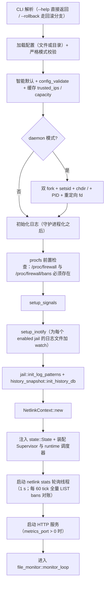

# 用户态守护进程

`firewall-daemon` 是内核模块的用户态对手侧：监控日志、做失败计数与封禁判定、经 netlink
把指令下发给内核，并把状态经 HTTP / SSE 呈现给运维与前端。内核负责报文级判定（速率、DDoS），
daemon 负责应用层检测（如 SSH 暴力破解）与对外接口。

两条硬边界：

- daemon 与内核之间的**内部通道只有 netlink**；`/proc/firewall/*` 是给用户/运维的接口，
  不是 daemon 的内部通道（`src/daemon/main.rs`）。
- 威胁模型是**入站单向防守**：不引入出站钩子、外发检测或外联行为分析（设计文档「决策记录」）。

相关文档：

- 报文判定路径、封禁/解封事件链：`data-flow.md`
- 内核侧内部结构、模块参数与哈希表规模：`kernel-module.md`
- 重写设计（分层取舍、结构问题编号 A–M、分阶段落地与验收证据）：`../development/daemon-rewrite-design.md`
- 接口真相源：`contract/netlink.fwidl`、`contract/procfs.fwidl`、`contract/http.fwidl`
- 配置字段与语义：`../configuration/yaml-config.md`

## 技术栈

| 组件 | 用途 |
|------|------|
| Rust | 实现语言（单 crate binary，无 workspace 拆分） |
| serde / serde_yaml / regex | YAML 配置解析、正则编译与匹配 |
| axum / tokio | HTTP 服务：`/metrics`、`/api/v1/*`、两条 SSE 流、SPA 静态资源 |
| inotify | 日志文件变更监控（`inotify` crate 绑定） |
| netlink | 与内核双向通信：命令下发、分页查询、事件推送 |
| rusqlite | 时序历史、封禁历史、IP 信誉分持久化 |
| slog + slog-json | 结构化日志（JSON Lines） |
| rust-embed | 前端构建产物嵌入二进制（`src/daemon/web_ui/static/`） |

## 当前实现状态

Phase 2 重写按「保留编译，分批迁入」推进，因此仓库里同时存在两代实现。本文档如实区分：

| 层 | 状态 | 说明 |
|----|------|------|
| `runtime/`（supervisor、单调时钟调度器、有界 channel） | **已接入生产** | `main.rs` 启动期装配，周期维护不再挂在 `poll` 超时上 |
| `state/`（`bans` / `whitelist` / `rates` / `stats` + 版本化 `hub`） | **已接入生产** | 由组合根构造并注入，新 `api` 路由从它取数 |
| `api/` | **部分接入** | 18 条路由已挂载；23 条分析/日志类路由仍在 `http_exporter/handler.rs` |
| `history_snapshot/` 写入队列 | **已改造** | 满时阻塞生产者，不再静默丢弃 |
| `ingest/`、`parse/`、`decision/`、`pipeline/` | 已就位、**未接入** | 无生产调用点，主链路仍走 `file_monitor` + `line_processor` + `failed_tracker` |
| `kernel/`（codec / transport / reactor / client / lease） | 已就位、**未接入** | 生产仍走旧 `crate::netlink` |
| `signal/`（`signalfd`） | 已就位、**未接入** | 生产仍走 `signals.rs` 的 `sigaction` + 原子布尔 |

判定算式（有效阈值、渐进式时长）已在 `decision/policy.rs` 以**纯函数**实现，并与旧实现做过
逐案对照测试；但生产路径仍由旧 `failed_tracker/tracking.rs` 承载。未接入清单与「与实现的差距」
见文末。

## 组件关系

| 组件 | 空间 | 职责 |
|------|------|------|
| 内核模块 | 内核 | 报文判定、封禁/白名单表、速率与 DDoS 检测、procfs 与 netlink 接口 |
| 守护进程 | 用户 | 日志监控、行解析、失败计数与封禁判定、配置下发、HTTP/SSE/指标 |
| netlink | 内核 ↔ 用户 | daemon 与内核的**唯一**内部通道：命令、分页查询响应、事件推送 |
| ProcFS | 内核 ↔ 用户 | 运维接口（12 条），daemon 只做启动期存在性检查，不用它做内部通信 |
| 历史库 | 用户 | SQLite：时序统计、封禁历史、封禁事件、IP 信誉分（`history_snapshot/`） |

## 运行时模型

设计目标是**五类执行体按数据形态分工**，而不是「全部 tokio 异步」：主链路是「阻塞 IO + CPU
正则」的形态，放进 async reactor 会让解析阻塞网络；HTTP/SSE 天然是 async 的，用线程承载
几千条空闲长连接是浪费。

| 执行体 | 承载 | 阻塞性质 | 落地状态 |
|--------|------|---------|---------|
| `ingest` 线程 | inotify fd 所有权、`poll`、读新增字节、轮转检测 | 阻塞 IO | 模块已就位，未接入 |
| `pipeline` 线程 | 行分割、正则匹配、IP 校验、失败计数、阈值判定 | CPU + 少量分配 | 模块已就位，未接入 |
| `kernel reactor` 线程 | netlink socket 唯一所有者：发命令、收事件、请求-响应关联 | 阻塞 IO | 模块已就位，未接入 |
| `scheduler` 线程 | 单调时钟定时器（周期维护、对账、速率查询） | 定时等待 | **已接入** |
| tokio runtime | HTTP 路由、SSE 长连接、认证、静态资源 | async | **已接入**（2 个 worker） |

串联方式为**有界 channel**，每段必须显式声明背压策略（`runtime/channel.rs`）：

```
inotify ──LogChunk──▶ parse ──Failure──▶ decide ──BanIntent──▶ kernel reactor ──▶ 内核
                                                                    ▲                │
                                                                    └─ BanStateChange ┘
                                                                            │
                                                                    state hub（版本化快照）
                                                                            │
                                                                       SSE / REST
```

| 队列 | 满时行为 | 理由 |
|------|---------|------|
| ingest → parse | 阻塞 ingest（不丢字节） | 日志是**证据源**，丢行等于漏判 |
| parse → decide | 阻塞 parse | 同上；decide 是纯内存 O(1)，不会成为瓶颈 |
| BanIntent → kernel | 有界队列 + 计数；满时**拒绝并可见**（不静默） | 封禁不能丢，但也不能无界堆积；拒绝要驱动重试 |
| 事件 → state hub | 覆盖式发布（最新快照语义） | SSE 只要最新状态，中间态可丢 |
| state hub → 持久化 | 有界队列；满时**阻塞生产者**，不丢弃 | 历史是审计数据 |

旧实现的全部周期任务都挂在 `file_monitor::monitor_loop` 的 `poll` 超时分支上，持续有 inotify
事件时 `poll` 恒返回非 0，60 s / 300 s / 2 s 三类任务随之被无限期延后（结构问题 A）。
`scheduler` 改用**单调时钟**（`Instant`）驱动，与事件吞吐完全解耦，且不受时钟回拨影响
（`runtime/timers.rs`：`fire_due(now)` 是纯函数，测试可用合成时刻精确验证不漂移）。

### 关停顺序

关停不变量是「**netlink 停止后才能在途事件写库**」。要让它真正成立，就不能一次性把停止信号
广播给所有执行体——那样上下游同时收尾，「上游已完全停止」不成立。故 `Supervisor::shutdown()`
按**登记逆序逐段串行**停止：对当前段 `request()` 后 `join` 到结束，才停下一段
（`runtime/supervisor.rs`）。登记顺序即依赖顺序（下游先登记）。

目标顺序（设计文档「生命周期」）：

```
停 HTTP 接入 → 停 scheduler → 停 kernel reactor（先 flush 在途请求）
  → 停 pipeline（排空队列）→ 停 ingest → flush persist → 写 PID 文件清理
```

当前生产的实际顺序（执行体尚未全部接入）：停 `runtime` 执行体（现只有调度器）
→ `cleanup()`：停 HTTP → 停 netlink 接收线程 → 关 inotify → 关历史库 → 删 PID
（`src/daemon/main.rs`）。

## 模块划分（按数据所有权）

每个模块**独占**自己的状态，跨模块只传消息或 `Arc<不可变快照>`；`OnceLock` 只允许出现在
日志全局与测试夹具两处，其余一律构造期注入。

| 模块 | 数据所有权 | 对外接口 |
|------|-----------|---------|
| `main.rs` | 无（组合根） | CLI 解析 → 装配 → 启动主循环；不再承载业务逻辑 |
| `runtime/supervisor.rs` | 执行体生命周期、关停令牌 | `spawn()` / `shutdown(timeout)`，按依赖逆序逐段停并 join |
| `runtime/scheduler.rs` | 周期任务集合 | 基础节拍 + 子周期门控（`stats` 镜像、过期封禁清理） |
| `runtime/timers.rs` | 单调时钟定时器表 | `fire_due(now)`（纯函数）、周期按原定时刻重排 |
| `runtime/channel.rs` | 有界队列契约 | `send` 按 `Backpressure::{Block,Reject}` 行事；`Reject` 计数可见 |
| `runtime/shutdown.rs` | 协作式关停令牌 | `request()` / `is_shutdown()` / `wait_until(deadline)` |
| `ingest/watcher.rs` | inotify fd 唯一所有者 | 事件迭代；fd 与读缓冲不借出 |
| `ingest/registry.rs` | `SourceId ↔ (path, wd, inode)` | `resolve(wd)`；`SourceId` 是稳定身份 |
| `ingest/reader.rs` | 每源 fd、offset、复用缓冲 | 读新增字节 + 廉价的轮转判定 |
| `parse/splitter.rs` | 每源 partial 行缓冲 | 字节流 → 行（缓冲长驻，跨轮复用） |
| `parse/rules.rs` | 每 jail 的编译正则（不可变，`Arc`） | 命中后从后往前扫捕获组取最右合法 IP |
| `parse/extract.rs` | 无（纯函数） | 从任意文本认出合法 IP，返回 `IpAddr` 而非 `String` |
| `decision/window.rs` | 每 jail 的失败时间戳窗口 | `observe(ip, ts) -> Verdict`，执行体独占、无锁 |
| `decision/policy.rs` | 无（纯函数） | 有效阈值、渐进式时长、封禁计划 |
| `pipeline/mod.rs` | 每 jail 规则/窗口 + 每源分割器 | `on_chunk(...)` → `Vec<BanIntent>`；止于意图，不下发 |
| `kernel/codec/` | 无 | 字节 ↔ 语义类型；直接消费契约生成物 |
| `kernel/transport.rs` | netlink socket（单写者） | 发一段载荷、收一条报文 |
| `kernel/reactor.rs` | 在途请求表 + 路由状态机 | 按 **type + seq** 路由；未知/失败/无主一律计数 |
| `kernel/client.rs` | 无（`Arc<Transport>` 上的类型化 API） | `ban` / `unban` / `list_*_all` / `set_config` |
| `kernel/lease.rs` | 注册租约状态 | 注册等确认、周期续约、失联可见（四态） |
| `state/bans.rs` | 活跃封禁（唯一所有者） | `apply` / `snapshot` / `purge_expired(now)` |
| `state/whitelist.rs` | 白名单（唯一所有者） | `apply` / `snapshot`；键是 `CidrKey` |
| `state/rates.rs` | 最新速率样本 + EWMA 基线 | `apply` / `snapshot` / `baseline` |
| `state/stats.rs` | 原子计数器（按类型枚举，`inc` / `add` / `set_gauge`） | 读快照不改值 |
| `state/hub.rs` | 版本化发布点 | `publish(Domain)` / 订阅 `watch`；只管版本与通知，不持数据 |
| `state/cidr.rs` | 无（规范化实现） | `CidrKey::new` / `CidrKey::parse`，是唯一构造入口 |
| `state/compose.rs` | 镜像方向与时机 | **过渡桥**，旧全局 ↔ 新状态；旧读者迁完后整体删除 |
| `api/*` | 无（薄适配层） | 从快照取数套信封；读路径零副作用 |
| `api/ports.rs` | 数据缺口端口（窄 trait） | 历史/信誉/配置/运行时/控制面四类窄接口 |
| `api/sse.rs` | 每条连接的订阅与计数 | 按域序列化、慢消费者隔离 |
| `contract.rs` | 无 | 用 `#[path]` 把三份契约生成物挂成本 crate 模块 |
| `runtime_status.rs` | 无 | 一次性只读聚合，供 `/health` 与单测断言 |

### 仍由旧实现承载（本轮未迁入）

| 模块 | 现状职责 | 去向 |
|------|---------|------|
| `file_monitor/` | inotify watch、`poll` 主循环、按 offset 读新增字节、轮转重挂 | 拆入 `ingest/` + `parse/` |
| `line_processor.rs` | 按 `\n` 切行、partial 缓冲、单行长度校验与统计 | 拆入 `parse/` |
| `log_parser/` | 正则匹配 + 字符串回退 + IP 提取校验 | 拆入 `parse/` |
| `failed_tracker/` | `Jail.failed_hash` 滑动窗口计数与阈值触发 | 拆入 `decision/` |
| `ban/` | 封禁/解封入口、IP 校验（含 procfs 兼容路径） | 移出读路径；下发归 `kernel/client` |
| `netlink/` | 收发线程、协议编解码、分页响应处理、DDoS 决策引擎 | 拆入 `kernel/` |
| `jail/` | 服务名智能匹配、默认参数推断、ReDoS 防护、正则编译 | 配置面 owner |
| `config/` | YAML 解析（严格模式 key 白名单 + 路径安全 3 重检查 + 失败回滚）+ CLI | 保留，产出不可变快照 |
| `config_reloader.rs` | SIGHUP 热重载、差异合并、失败回滚、运行期配置回写 | 保留 |
| `history_snapshot/` | SQLite 写入（已改背压）+ 分析类派生数据 | 后续批次 |
| `ip_reputation.rs` | 信誉分 store（分数、阈值乘数） | 后续批次 |
| `log_rotation.rs` | 轮转检测的旧实现（与 `file_monitor` 配套） | 拆入 `ingest/reader` |
| `web_ui/` | 静态资源嵌入、日志查看与分页、分析类端点、旧载荷类型 | 拆入 `api/` + 前端直连 `api` |
| `http_exporter/` | 未迁入的 23 条路由、`/metrics`、Basic Auth 与锁定、安全头中间件 | 逐批迁入 `api/` |
| `types/` | 跨模块数据结构与全局原子统计（`Jail` / `Config` / `DAEMON_STATS`） | 数据面迁入后逐步退役 |
| `signals.rs` | `sigaction` + 全局原子布尔 + 依赖 `EINTR` 的主循环退出协议 | 由 `signal/`（`signalfd`）取代 |

## 启动流程

`main()` 的顺序（`src/daemon/main.rs`）：


```mermaid
graph TB
    A["CLI 解析（--help 直接返回 / --rollback 走回滚分支）"] --> B["加载配置（文件或目录）+ 严格模式校验"]
    B --> C["智能默认 + config_validate + 缓存 trusted_ips / capacity"]
    C --> D{"daemon 模式?"}
    D -->|是| E["双 fork + setsid + chdir / + PID + 重定向 fd"]
    D -->|否| F["初始化日志（守护进程化之后）"]
    E --> F
    F --> G["procfs 前置检查：/proc/firewall 与 /proc/firewall/bans 必须存在"]
    G --> H["setup_signals"]
    H --> I["setup_inotify（为每个 enabled jail 的日志文件加 watch）"]
    I --> J["jail::init_log_patterns + history_snapshot::init_history_db"]
    J --> K["NetlinkContext::new"]
    K --> L["注入 state::State + 装配 Supervisor 与 runtime 调度器"]
    L --> M["启动 netlink stats 轮询线程（1 s；每 60 tick 全量 LIST bans 对账）"]
    M --> N["启动 HTTP 服务（metrics_port > 0 时）"]
    N --> O["进入 file_monitor::monitor_loop"]
```

关键顺序约束（都有明确理由，不是习惯）：

- **日志在守护进程化之后初始化**：`fork` 会丢掉异步日志线程，故 `cfg.daemon` 分支先
  `daemonize_process()`，再 `logger::init_logger(cfg.log_file)`。
- **状态层注入早于 netlink 接收线程**：启动期的封禁/白名单/统计查询响应会在接收线程里落进
  新状态，注入晚一步那批数据就丢（`main.rs` 组合根注释）。
- **调度器装配失败只降级告警、不 panic**：缺席时 SSE 的 `stats` 域不再自动刷新、过期封禁只能
  靠内核 `UNBAN` 事件自愈，但封禁主链路照常工作。
- **`/proc/firewall` 与 `/proc/firewall/bans` 缺失直接启动失败**：内核模块未加载时 daemon
  不具有可工作的判定与下发通道。

## 判定语义（冻结面）

这条判据是**对外承诺**，重写不得改变；`decision/policy.rs` 与旧 `failed_tracker` 的对照测试
逐案断言相等。

- **白名单命中 ⇒ 永不封禁**（内核侧还有一道白名单短路，daemon 侧不重复判定为「可封」）。
- **有效阈值** = `max_retries × 高峰期(×1.5) × 内网来源(×2.0) × 信誉系数`，再 `.ceil().max(1.0)`
  （`decision/policy.rs`）。
- **高峰时段**：UTC `9..18`（`is_peak_hours(hour_utc)`，时间源由调用方注入，便于用固定小时测试）。
- **信誉系数**：`≥80 → 1.0`、`≥50 → 0.8`、否则 `0.5`（与 `ip_reputation.rs` 的阈值乘数一致）。
- **渐进式时长**：第 1 次 `base`、第 2 次 `1800`、第 3 次 `86400`、第 4 次起永久；
  `ban_time < 0` 即配置级永久。
- **失败窗口**：只统计 `now - findtime <= ts <= now` 的时间戳；单 IP 时间戳上限
  `MAX_TIMESTAMPS_PER_IP = 100`（FIFO 淘汰最旧），与旧 `count_recent` 对齐。

## netlink 层

线格式以契约生成物为**唯一**定义：协议号 `NETLINK_USERSOCK`、魔数 `0x46574C4E`、自定义公共头
12 字节、全部多字节整数大端、全部结构 `packed`。`contract.rs` 用 `#[path]` 把
`contract/generated/netlink_contract.rs` 挂成本 crate 模块，实现侧读的是契约里的字段名与偏移，
「手抄结构体」这一漂移来源被编译器消除。

新 `kernel/` 五层（已就位、未接入生产）：

| 层 | 职责 | 关键取舍 |
|----|------|---------|
| `codec` | 字节 ↔ 语义类型，唯一的转义层 | 每个多字节字段显式 `from_be` / `to_be`，不依赖 `packed` 的内存表示；`decode_packed` 搬完即逐字段转宿主序，原始字节不流出本模块 |
| `transport` | socket 唯一所有者（单写者） | 长度以 `nlmsghdr.nlmsg_len` 为准而非收包字节数（netlink 按 4 字节对齐，收包数可能多出至多 3 字节填充） |
| `reactor` | 接收回路 + `(type, seq)` 路由 | `Router` 是纯状态机可单测；路由白名单只收「回显请求 seq」的那一组 |
| `client` | 类型化请求 API | 「已投递」与「已确认」用类型分开；`list_*_all` 一律请求契约单页上限并续页到底 |
| `lease` | 注册租约 | 注册等 `DaemonRegisterAck`；四态 `Idle` / `Held` / `Refused` / `Lost`，确认失败一律转 `Lost` |

两条容易踩错的语义，写在这里以免被后来的实现改回去：

- **配对只允许白名单内的类型**。内核里有**两套**序号来源：`DaemonRegisterAck` /
  `ConfigAck` / `StatsResponse` / `AnalysisResponse` / 三个 `List*Response` 回显请求 `seq`；
  而 `DdosEvent` / `BanStateChange` / `WhitelistStateChange` / `ConfigChange` /
  `CmdResult` 用内核自增序号。两组取值必然碰撞，若把 `CmdResult` 也拿去配对，一条「封禁失败」
  通知会被误认成某次 LIST 的回复而被吞掉。
- **分页的收尾信号是空页，不是 `total`**。契约里 `limit == 0` 表示「内核默认页大小」而非
  「不限量」；内核在 `offset >= total` 时直接回空页，且 `total` 是另一时刻取的值，与已收条数
  不保证一致。故续页以空页为唯一可靠收尾，另加「本页起点未推进即停」的防死循环判据。

当前生产仍走旧 `crate::netlink`：独立接收线程（100 ms `poll`）+ 主循环侧 `sendto` 直调，附加
一个 1 s 的 stats/analysis 轮询线程与每 60 tick 一次的全量 `LIST_BANS` 对账。旧实现把
`sendto` 成功当作执行成功、`seq` 解析后丢弃、白名单与速率查询只取第一页——这些正是新层要
消除的问题（设计文档结构问题 I / J / K / L）。

## 状态层与 SSE

`state/` 是**单所有者 + 版本化快照**：写侧独占数据，读侧拿 `Arc<不可变快照>`，永远看不到半个
更新（发布是「构造完整新快照 → 原子替换 `Arc`」）。`state/hub.rs` 只管版本与唤醒，不持数据；
唤醒走 `watch`（只保留最新值，与快照语义吻合，且无订阅者时也不失败）。

| 域 | 事件名 | 说明 |
|----|-------|------|
| `Stats` | `stats` | 计数器快照；**周期事件**（无变化也要按 `sse_push_interval` 重发，否则安静时段数字冻住） |
| `Bans` | `bans` | 活跃封禁 |
| `Jails` | `jails` | Jail 列表与状态（配置面） |
| `Whitelist` | `whitelist` | 白名单（键是规范化 `CidrKey`） |
| `Rates` | `rates` | 速率与 EWMA 基线 |

「无变化的写入不推进版本」是刻意的：内核会重复广播同一条 `BanStateChange`、每 60 s 全量对账
一次白名单、每 1 s 推一次速率，数值没变时惊动 SSE 只是浪费。

### SSE 约束（契约）

| 项 | 值 | 出处 |
|----|-----|------|
| `/api/v1/events` 连接上限 | 10 | `contract/generated/http_contract.rs` |
| `/api/v1/logs/stream` 连接上限 | 5 | 同上 |
| `events` 事件集 | `connected`、`stats`、`bans`、`jails`、`whitelist`、`rates` | 同上 |
| keepalive | 15 s | `src/daemon/api/sse.rs` |
| 每连接发送缓冲 | 32（溢出即断开，不阻塞写侧） | `src/daemon/api/sse.rs` |
| 超限响应 | `503` | `src/daemon/api/sse.rs` |

三条结构性保证：

- **只序列化变化的域**。连接持有上一次发出的版本集合，每轮与当前版本求差集；只有新连接才发
  全部五域。这直接消除旧实现「每个 tick × 每条连接全量重序列化 5 份载荷」的成本。
- **SSE 与 REST 共用同一份视图**。域载荷全部由 `api/views` 的纯函数派生，SSE 渲染器与路由调
  的是同一批函数——想改一个字段的显示方式，只有一处可改。
- **慢消费者被断开，而不是让写侧等待**。写侧只做「推进版本 + 覆盖式通知」；序列化与发送在每
  条连接自己的任务里，结束原因是显式类型（`ConsumerGone` / `SlowConsumer` / `HubClosed`）。

### 白名单 CIDR 规范化

键是 `CidrKey` 而不是 `String`，两个构造入口（`new` 走结构路径、`parse` 走文本路径）都过同一套
规范化，外部无法塞入未规范化的键。规则取自内核而不是自拟：内核把白名单存成**网络地址**
（`fw_addr_normalize`），精确主机条目的判据是 IPv4 `/32` / IPv6 `/128`。故键的形态固定为
「主机位清零 + 恒带 `/prefix`」：`10.0.0.5/24` 存为 `10.0.0.0/24`，裸地址 `10.0.0.1` 存为
`10.0.0.1/32`。界面上从 `10.0.0.1` 显示为 `10.0.0.1/32` 是这一规则的直接结果。

## HTTP 与 API

单个 axum 服务承载全部内容（Web UI、REST、SSE、指标），监听 `metrics_bind_address:metrics_port`：
代码默认 `127.0.0.1:9119`（`src/daemon/types/config.rs`），随包 `config/default.yaml` 给的是
`0.0.0.0:9119`（要局域网访问需后者那种绑定，且必须配凭据，见下）。

### 路由分层

| 组 | 认证 | 内容 |
|----|------|------|
| SPA 外壳与静态资源 | 无 | `/`、`/dashboard`、`/bans`、`/whitelist`、`/jails`、`/ddos`、`/logs`、`/settings`、`/static/*path`、`/sw.js` |
| 探针 | 无 | `/health`、`/healthz`（有意不套信封，由 `is_ready()` 决定 200/503） |
| 已迁入 `api` 层 | Basic Auth | 18 条：`/metrics`、`/api/v1/events`、`/api/v1/stats`、`/api/v1/bans`（GET/POST）、`/api/v1/bans/:ip`、`/api/v1/bans/:ip/detail`、`/api/v1/bans/unban-temporary`、`/api/v1/bans/batch`、`/api/v1/jails`、`/api/v1/jails/:name`、`/api/v1/config`（GET/PUT）、`/api/v1/whitelist`（GET/POST）、`/api/v1/whitelist/:cidr`、`/api/v1/rates/current`、`/api/v1/stats/sse-status` |
| 未迁入（`http_exporter/handler.rs`） | Basic Auth | 23 条：分析类 `/api/v1/stats/*`、`/api/v1/rates/history`、`/api/v1/rates/windows`、`/api/v1/whitelist/recommendations`、`/api/v1/logs`、`/api/v1/logs/stream` 等 |

18 + 23 = 41 条需认证路由；另有 10 条公开（SPA 外壳与静态资源）+ 2 条探针 = 12 条无认证，合计
53 条，与契约一致；两个清单由 `verify_http.py` 同时读两个文件核对（源码里的「35 条」注释曾是陈旧
计数，已随本文一并更正）。

### 信封与认证

- **信封单一形状**：`{code, data, message}`，成功 `code = 0` 且 `message` 为空串，失败
  `data = null`；不使用 `skip_serializing_if`，故成功与失败响应里两个字段都必然存在。
- **业务码与 HTTP 状态码是两套编号**，`BusinessCode` 同时携带两者，避免「码对了状态码错了」。
- **认证**：`/metrics` 与 `/api/v1/*` 需 Basic Auth；凭据由中间件**每请求读取**，故 SIGHUP 改
  凭据无需重启；**未配置凭据时中间件直接放行**（此时只允许回环绑定，见下条）。不发
  `WWW-Authenticate`（该头会触发浏览器原生对话框，表现为「输错密码按钮永久转圈」）；
  EventSource 无法自定义请求头，故额外接受 `?access_token=<base64(user:pass)>`。
- **失败锁定**：连续失败达阈值后锁定一段时间（契约常量）。
- **启动期硬约束**：非回环地址绑定且完全未配置凭据 → **拒绝启动** HTTP 服务（避免管理 API 对
  全网开放）；`metrics_username` / `metrics_password` 只配一项 → 同样拒绝启动。
- **写指令不占 tokio worker**：封禁/解封/白名单增删要等内核确认，一律 `spawn_blocking`。
- **读路径零副作用**：读端点不清理、不累加统计、不限流——旧 `get_active_bans()` 三项全占，SSE
  每秒读一次就每秒改写统计。

## 配置与热重载

- **来源**：单个文件或目录（`--config`），文件不存在直接启动失败。
- **严格模式**：任何未知 key 直接报错退出（默认开启）。
- **路径安全 3 重检查**：`..` 遍历、`%2e` / `%2f` / `%5c` 编码绕过、shell 元字符注入。
- **失败回滚**：解析中途失败时整体恢复，不留下半份配置。
- **运行期回写**：Web UI 改动的封禁/白名单/阈值经 `persist_runtime_config()` 回写到原始 YAML
  路径（`set_config_target_path`），`trusted_ips` 与 `capacity` 在启动期缓存供回写使用。
- **SIGHUP 热重载**：重读配置 → 比较差异 → 新增/移除源的 watch、重编译正则、更新内核白名单；
  失败保留旧快照。**重载只替换规则集与参数，不重置失败窗口**——否则一次 SIGHUP 就能帮攻击者
  清零已积累的失败计数。

容量字段（`capacity.max_ban_entries` / `max_whitelist_entries` / `max_rate_entries` /
`max_local_ip_cache`，默认均为 65535）在 daemon 侧只做持久化与展示：**`SetConfig` 消息没有
容量字段**，真正的条目上限是内核模块参数 `fw_max_*`（见 `kernel-module.md`）。

## 持久化

`history_snapshot/` 用 SQLite 保存四类数据：时序统计（`historical_stats`）、封禁历史
（`ban_history`）、封禁事件（`ban_events`）、IP 信誉分（`ip_reputation`），并派生攻击预测、
协同检测、封禁时长推荐等分析数据（供未迁入的分析类端点使用）。

写入队列的行为在本轮被改造过，四条丢弃路径全部可见（`history_snapshot/mod.rs`）：

| 路径 | 现行为 |
|------|-------|
| 队列满 | `Backpressure::Block`：阻塞生产者，一条不丢 |
| 未装配 / 已关停 | 升沿打一次 `warn` |
| 写线程已退出 | 每次打一条 `warn` |
| 关停时队列仍有在途项 | 丢弃发送端 → join 写线程排空 → **再**关连接 |

队列深度越过高水位时打一条 `warn`，写库追上后重新武装。

## 日志与信号

**日志**：基于 slog 的结构化日志，JSON Lines 格式（每行一条 JSON 对象，字段顺序
`ts → level → msg → version → 其他`），写入配置文件 `defaults.log_file` 指定的路径；未指定或
为空时用默认路径 `/var/log/firewall-daemon.log`。文件打开失败回退 stderr（用 `dup` 复制 fd 2，
不接管原始 stderr）。`log_destination` / `log_format` 字段仍存在于配置结构中，但当前 logger 只
实现「JSON Lines → 文件」，不读这两个字段。

**信号**（当前生产实现，`signals.rs`）：

| 信号 | 行为 |
|------|------|
| `SIGTERM` / `SIGINT` | 置退出标志，主循环优雅退出并清理 |
| `SIGHUP` | 置重载标志，主循环触发配置热重载 |
| `SIGUSR1` | 输出当前状态到日志 |
| `SIGPIPE` | 忽略（HTTP 客户端断开不应杀死进程） |

旧实现故意不使用 `SA_RESTART`，依赖 `EINTR` 打断 `poll` 把控制权交回主循环——这是隐式协议。
新 `signal/`（`signalfd`）把信号变成与 inotify 同池 `poll` 的普通 fd，`SignalFd` 阻塞四个信号并
在析构时恢复掩码；该模块**已就位但未接入生产**。

## 可观测性

### Prometheus 指标

`/metrics` 暴露 **24 个**指标（`src/daemon/http_exporter/metrics.rs`，按 `# TYPE` 计数）：

| 指标 | 类型 | 说明 |
|------|------|------|
| `firewall_kernel_banned_ips_current` | gauge | 当前封禁 IP 数 |
| `firewall_kernel_bans_total` | counter | 累计封禁操作数 |
| `firewall_kernel_unbans_total` | counter | 累计解封操作数 |
| `firewall_kernel_whitelist_count` | gauge | 当前白名单条目数 |
| `firewall_daemon_lines_parsed_total` | counter | 已解析日志行数 |
| `firewall_daemon_ips_extracted_total` | counter | 提取出的 IP 数 |
| `firewall_daemon_ips_banned_total` | counter | 实际发起封禁的 IP 数 |
| `firewall_daemon_failed_attempts_total` | counter | 失败尝试总数 |
| `firewall_daemon_config_reloads_total` | counter | 配置重载成功次数 |
| `firewall_daemon_inotify_events_total` | counter | inotify 唤醒次数（非事件数） |
| `firewall_daemon_log_rotations_total` | counter | 轮转检测次数 |
| `firewall_daemon_lines_skipped_total` | counter | 因超长/异常跳过的行数 |
| `firewall_daemon_regex_matches_total` | counter | 正则命中总数 |
| `firewall_daemon_uptime_seconds` | gauge | 运行时长 |
| `firewall_ddos_events_detected_total` | counter | 检出的 DDoS 事件数 |
| `firewall_ddos_auto_bans_total` | counter | DDoS 决策引擎发起的封禁数 |
| `firewall_ddos_tracked_ips_current` | gauge | DDoS 检测跟踪的 IP 数 |
| `firewall_netlink_messages_sent_total` | counter | netlink 发送报文数 |
| `firewall_netlink_messages_received_total` | counter | netlink 接收报文数 |
| `firewall_netlink_send_errors_total` | counter | netlink 发送失败数 |
| `firewall_netlink_recv_errors_total` | counter | netlink 接收/解析失败数 |
| `firewall_reputation_tracked_ips` | gauge | 信誉分系统跟踪的 IP 数 |
| `firewall_reputation_low_count` | gauge | 分数 < 80 的 IP 数 |
| `firewall_reputation_critical_count` | gauge | 分数 < 50 的 IP 数 |

四个 `firewall_kernel_*` 取自程序内存缓存而非实时读 procfs（`/proc/firewall/*` 是用户接口）。
早期文档中的 `firewall_ban_events_total` / `firewall_packets_*` / `firewall_hash_table_*` /
`firewall_jail_*` 等条目**不存在**。

### 健康与诊断

- `/health`、`/healthz`：套 `RuntimeSnapshot`（netlink 就绪、`/proc/firewall` 存在、封禁缓存与
  历史是否初始化、当前封禁数），`status` 只由「netlink 就绪 ∧ procfs 存在」决定，就绪返回 200、
  否则 503。
- `/api/v1/stats/sse-status`：分别上报两条 SSE 流的当前连接数与上限（10 / 5）——用一条流的上限
  推断另一条是曾经的缺陷成因。

## 内存安全

守护进程全部 `unsafe` 块都显式标注 `// SAFETY:`，说明前置条件与「该块执行后哪些不变量仍成立」。
当前共 **73 处** `unsafe { }`（按块计数），分布：

| 文件 | 块数 | 用途 |
|------|------|------|
| `netlink/responses.rs` | 15 | 分页响应按字节搬运 `packed` 结构 |
| `netlink/mod.rs` | 15 | netlink socket 操作与报文切分 |
| `kernel/transport.rs` | 12 | socket 创建/绑定/收发 |
| `signal/mod.rs` | 9 | `signalfd` 与信号掩码 |
| `netlink/protocol.rs` | 7 | 线格式编解码 |
| `daemonizer.rs` | 7 | `fork` / `setsid` / PID 文件 / 重定向 fd |
| `kernel/codec/mod.rs` | 2 | `packed` 结构偏移搬运 |
| `signals.rs` | 1 | `sigaction` 注册 |
| `netlink/commands.rs` | 1 | 命令编码 |
| `logger.rs` | 1 | `dup(2)` 回退 stderr |
| `ip_utils.rs` | 1 | 地址原始操作 |
| `ingest/watcher.rs` | 1 | `inotify` fd 所有权 |
| `file_monitor/monitor_loop.rs` | 1 | `poll` 系统调用封装 |

`Cargo.toml` 提供三个检测 profile：`dev-with-debug`（与 release 同等优化但保留 DWARF，现场
crash 可用 `addr2line` 反推）、`asan`（AddressSanitizer，需 nightly 与 `build-std`）、Miri
（解释执行 `unsafe`，抓指针算术 UB 与别名违规——ASAN 抓不到的那类）。

## 与实现的差距

以下是「已就位、未接入」的准确边界，目的是让读者不会把设计当成现状（逐项证据见设计文档
「修复项与落地状态」）：

| 项 | 现状 |
|----|------|
| 主链路（`ingest` → `parse` → `decision` → `pipeline`） | `pipeline` 止于 `BanIntent`，无生产调用点；生产仍由 `file_monitor` + `line_processor` + `failed_tracker` 驱动 |
| `kernel/` 层 | 无生产引用；生产走旧 `crate::netlink`。故 `Lease` 的注册可见性、`client.set_config` 的唯一入口、CIDR 单一规范化都尚未在生产生效 |
| `signal/`（`signalfd`） | 无生产引用；生产走 `signals.rs` |
| 周期维护 | 已由 `runtime/scheduler.rs` 接管（过期封禁清理 + 计数器镜像），节拍 1 s，子任务各自门控 |
| `api` 路由 | 18 / 41 需认证路由已迁入（契约合计 53 条，其中 12 条无认证）；23 条分析类与日志类仍在 `http_exporter/handler.rs` |
| 旧模块删除 | `web_ui/`、`netlink/`、`failed_tracker/`、`file_monitor/`、`line_processor.rs`、`log_rotation.rs` 仍按原样编译保留，待后续批次迁入后退役 |

后续批次迁入前，主链路已冻结的接口形状不得改动；接口需要变更时**先改契约再改代码**，并跑
`bash scripts/check_contract.sh`。
