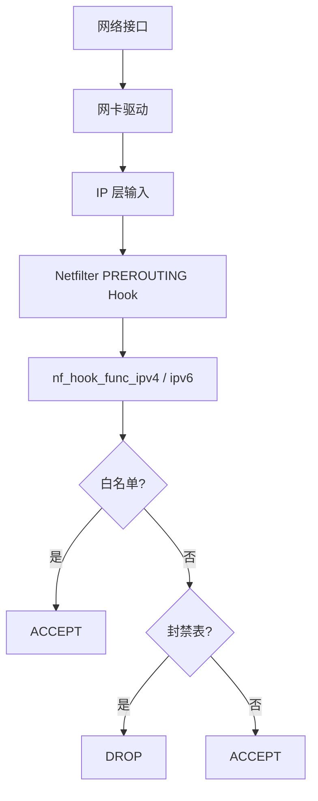
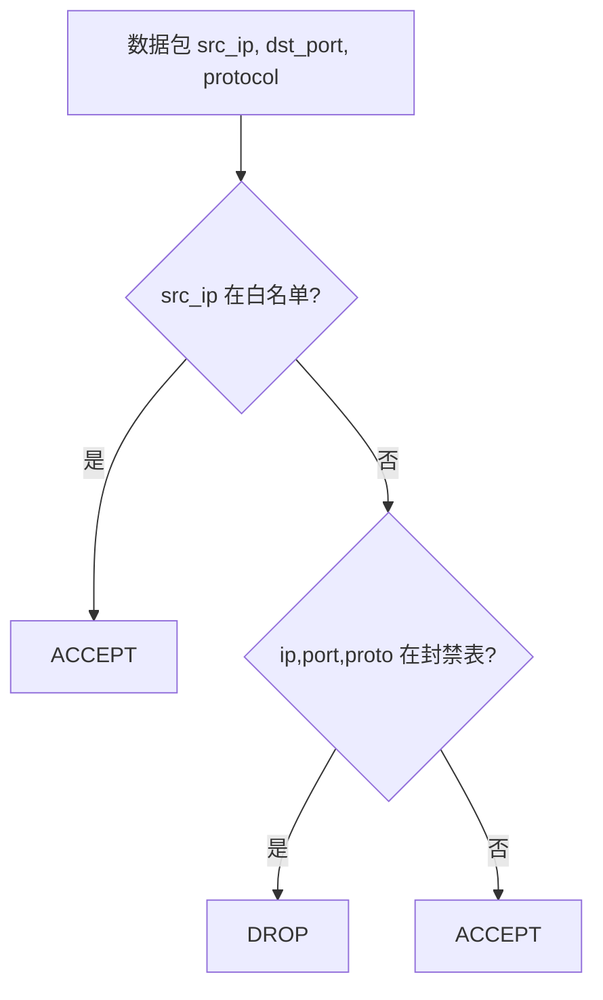
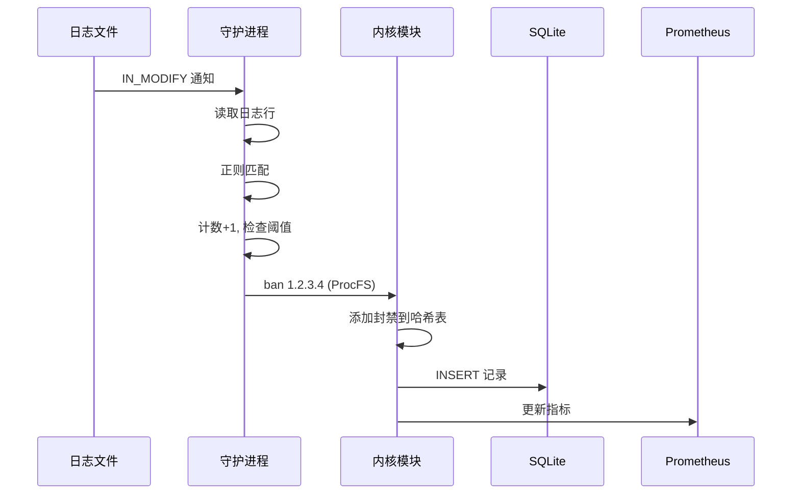
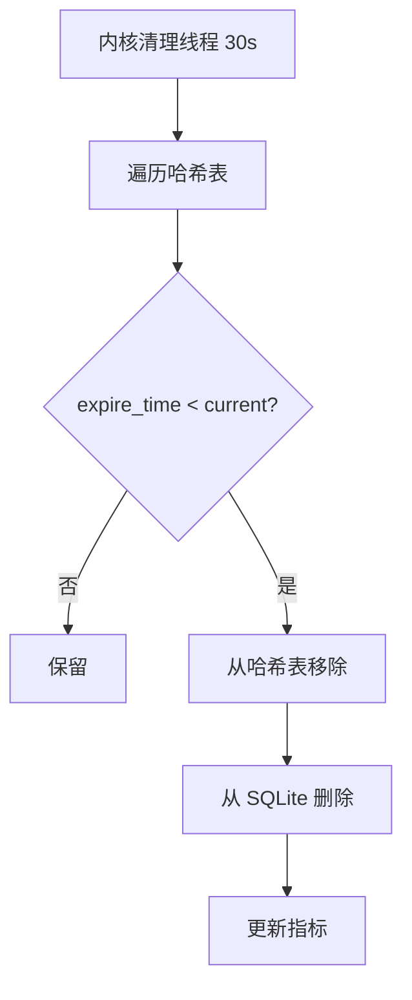
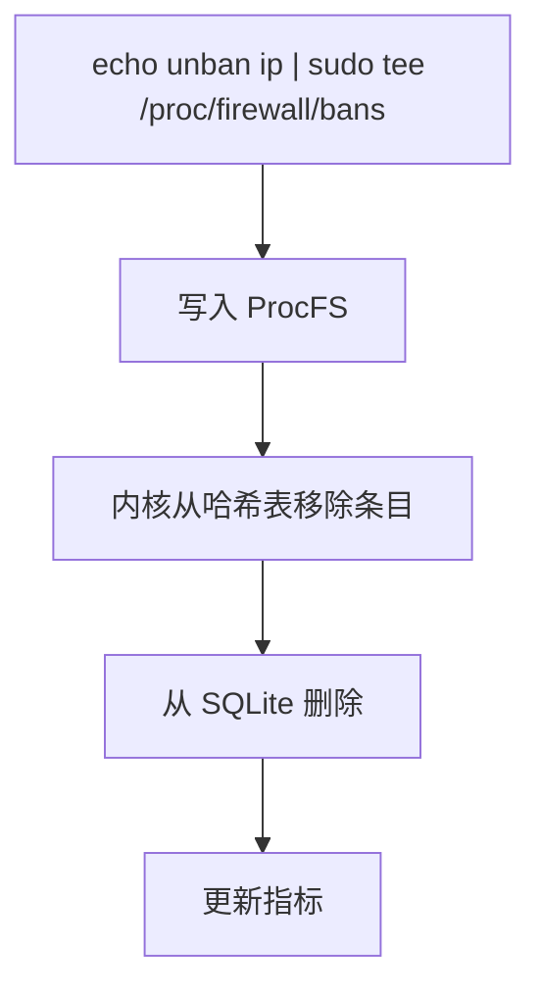
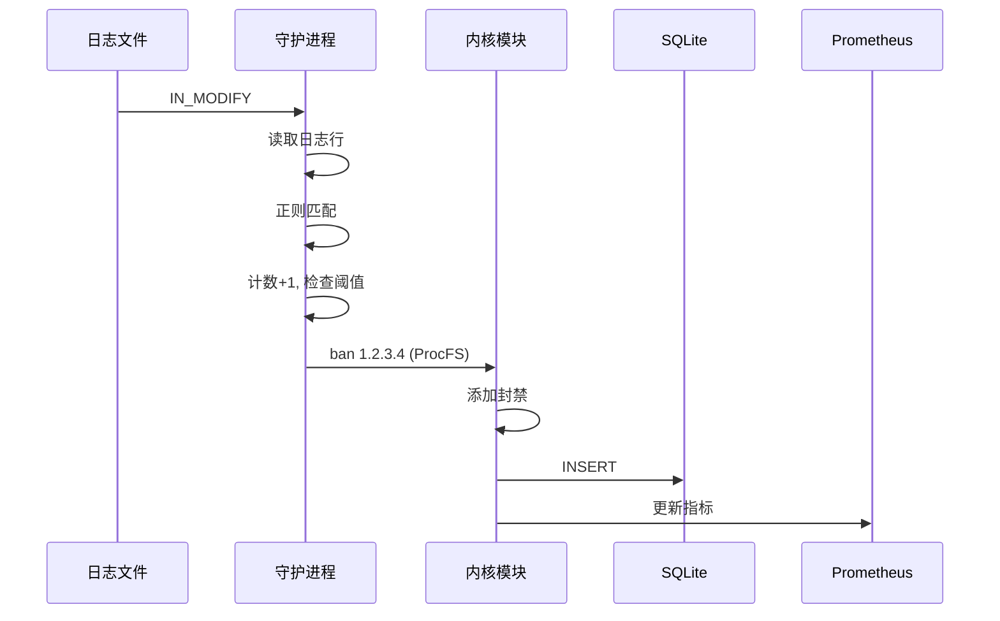
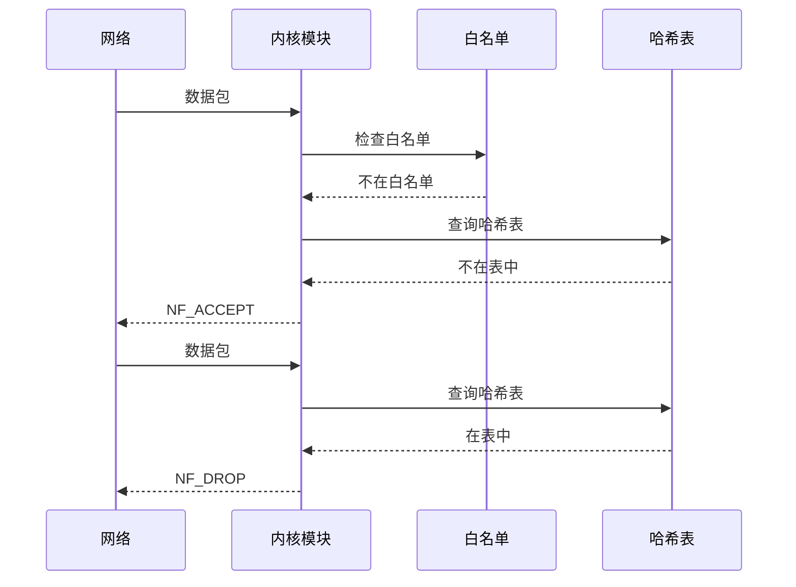

# 数据流

本文档描述 Linux Firewall 内核模块中的数据包流和事件流。

## 数据包处理流

### 入站数据包流程

### 封禁决策树

## 封禁事件流

### 完整封禁流程

## 解封事件流

### 自动解封

### 手动解封

## 组件间通信

### 用户态 → 内核态

| 方式 | 路径 | 用途 |
|------|------|------|
| ProcFS 写入 | `/proc/firewall/bans` | 封禁 / 解封（`unban <ip>`） |
| ProcFS 写入 | `/proc/firewall/whitelist` | 添加 / 移除白名单 |

> `/proc/firewall/config` 与 `/proc/firewall/stats` 为只读；模块不
> 提供“清空”原生命令，需逐条 `unban` 或重载模块。

### 内核态 → 用户态

| 方式 | 路径 | 用途 |
|------|------|------|
| ProcFS 读取 | `/proc/firewall/config` | 获取 ban_time、当前封禁/白名单数 |
| ProcFS 读取 | `/proc/firewall/bans` | 获取封禁 IP 列表 |
| ProcFS 读取 | `/proc/firewall/whitelist` | 获取白名单 |
| ProcFS 读取 | `/proc/firewall/stats` | 获取计数器 |

### 内部通信

| 组件 | 通信方式 | 数据 |
|------|----------|------|
| 守护进程 → SQLite | 文件 I/O | 封禁记录 |
| 守护进程 → Prometheus | HTTP (tiny_http) | 指标数据 |
| 守护进程 → 日志 | 文件 I/O | 运行日志 |

## 时序图

### 封禁时序

### 数据包处理时序

## 性能特征

### 数据包处理延迟

| 场景 | 延迟 |
|------|------|
| 白名单匹配 | ~50ns |
| 哈希查找（未命中） | ~100ns |
| 哈希查找（命中） | ~100ns |
| 总计（正常流量） | ~150ns |

### 吞吐量

| 配置 | 性能 |
|------|------|
| 空表 | 线速（10Gbps+） |
| 满表（4096） | 线速（10Gbps+） |
| 白名单（64） | 线速（10Gbps+） |

### 瓶颈分析

| 组件 | 瓶颈 | 优化 |
|------|------|------|
| Netfilter Hook | 无 | RCU 读，零锁竞争 |
| 哈希查找 | 哈希冲突 | jhash 均匀分布 |
| 白名单查找 | 线性扫描 | 容量小（64），影响可忽略 |