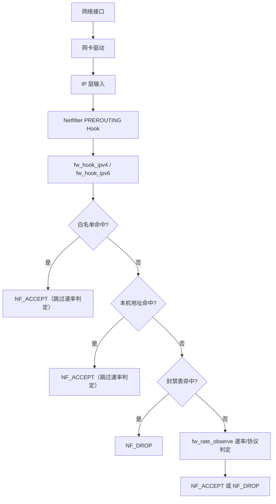
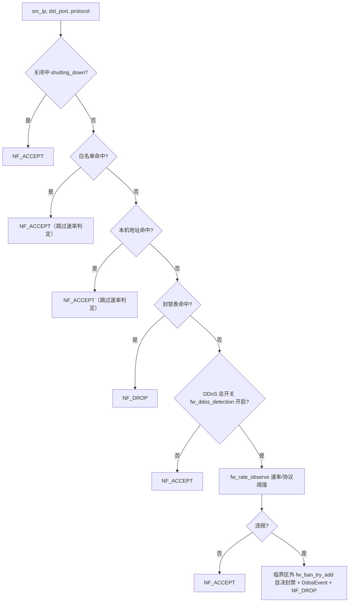
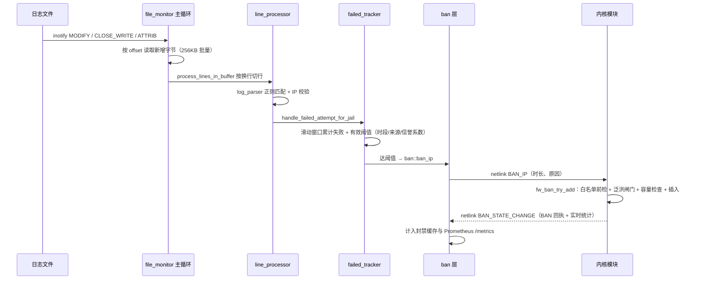
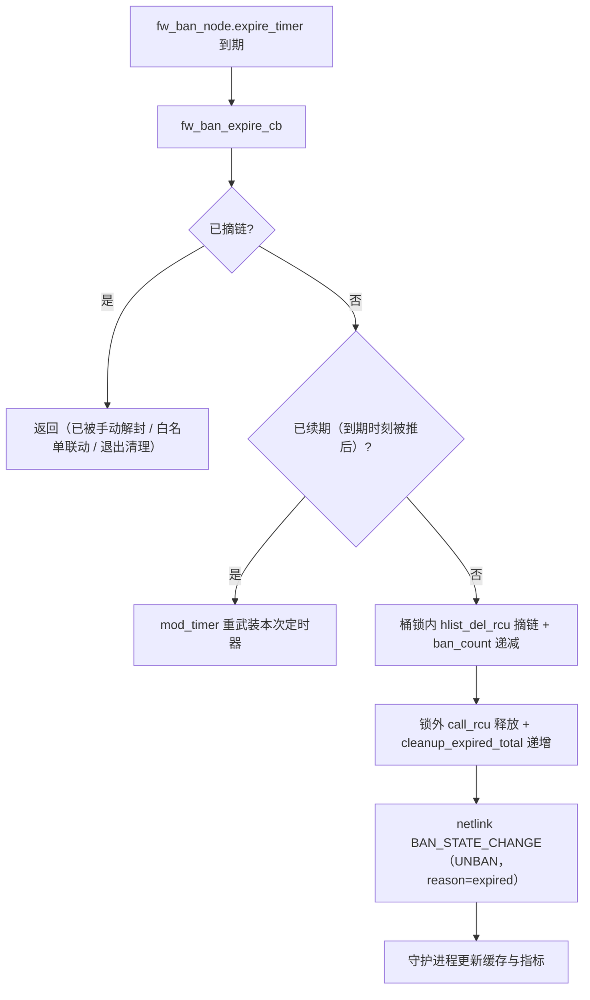
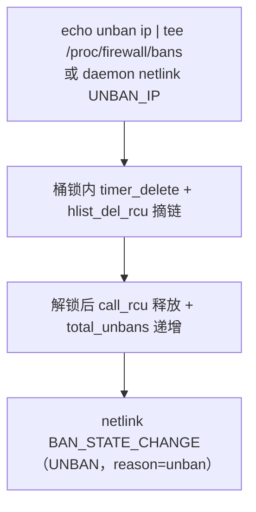
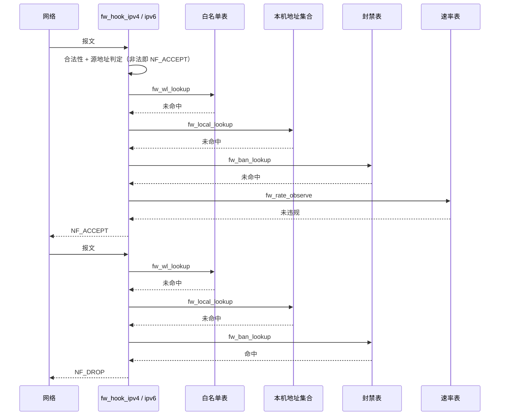

# 数据流

本文档描述 Linux Firewall 内核模块的**报文判定路径**、**封禁/解封事件链**，以及内核与守护进程之间的通信通道。内核侧实现见 `src/kernel-module/`（当前为 `fw_*` 文件），接口以 `contract/*.fwidl` 为准。

相关文档：

- 内核内部结构、全部模块参数与哈希表规模：`kernel-module.md`
- 守护进程侧模块划分：`daemon.md`
- procfs 读写文法：`docs/zh/configuration/procfs.md`

## 数据包处理流

### 入站数据包流程


```mermaid
graph TB
    A["网络接口"] --> B["网卡驱动"]
    B --> C["IP 层输入"]
    C --> D["Netfilter PREROUTING Hook"]
    D --> E["fw_hook_ipv4 / fw_hook_ipv6"]
    E --> F{"白名单命中?"}
    F -->|是| G["NF_ACCEPT（跳过速率判定）"]
    F -->|否| H{"本机地址命中?"}
    H -->|是| I["NF_ACCEPT（跳过速率判定）"]
    H -->|否| J{"封禁表命中?"}
    J -->|是| K["NF_DROP"]
    J -->|否| L["fw_rate_observe 速率/协议判定"]
    L --> M["NF_ACCEPT 或 NF_DROP"]
```

钩子只注册在 `init_net` 的 `NF_INET_PRE_ROUTING`，优先级 `NF_IP_PRI_FILTER - 1`，IPv4 / IPv6 各一个：

```c
/* src/kernel-module/fw_hook.c:71-85：netfilter 钩子注册表，由 fw_main.c 在 init/exit 中按序注册与注销 */
struct nf_hook_ops nf_ops_ipv4 = {
  .hook = fw_hook_ipv4,
  .pf = NFPROTO_IPV4,
  .hooknum = NF_INET_PRE_ROUTING,
  .priority = NF_IP_PRI_FILTER - 1,
};

struct nf_hook_ops nf_ops_ipv6 = {
  .hook = fw_hook_ipv6,
  .pf = NFPROTO_IPV6,
  .hooknum = NF_INET_PRE_ROUTING,
  .priority = NF_IP_PRI_FILTER - 1,
};
```

### 封禁决策树

判定在 `fw_ban_check()` 的**单次 RCU 临界区**内完成（旧实现分三处进出 RCU），顺序固定：


```mermaid
graph TB
    A["src_ip, dst_port, protocol"] --> B{"关闭中 shutting_down?"}
    B -->|是| ACC1["NF_ACCEPT"]
    B -->|否| C{"白名单命中?"}
    C -->|是| ACC2["NF_ACCEPT（跳过速率判定）"]
    C -->|否| D{"本机地址命中?"}
    D -->|是| ACC3["NF_ACCEPT（跳过速率判定）"]
    D -->|否| E{"封禁表命中?"}
    E -->|是| DR1["NF_DROP"]
    E -->|否| F{"DDoS 总开关 fw_ddos_detection 开启?"}
    F -->|否| ACC4["NF_ACCEPT"]
    F -->|是| G["fw_rate_observe 速率/协议阈值"]
    G --> H{"违规?"}
    H -->|否| ACC5["NF_ACCEPT"]
    H -->|是| DR2["临界区外 fw_ban_try_add 自决封禁 + DdosEvent + NF_DROP"]
```

```c
/* src/kernel-module/fw_hook.c:108-115：单次 RCU 临界区内的四步判定。
   白名单与本机地址同为「放行且不做速率判定」的短路条件；本机地址必须排在
   封禁表之前，顺序颠倒会让本机地址被自己的封禁条目丢弃。 */
if (!fw_wl_lookup(af, src) && !fw_local_lookup(af, src)) {
  if (fw_ban_lookup(af, src)) {
    banned = true;
  } else if (likely(READ_ONCE(fw_ddos_detection))) {
    reason = fw_rate_observe(af, src, packet_len, protocol, tcp_flags, dst_port, &pps);
  }
}
```

进入 `fw_ban_check()` 之前的前置判定（`src/kernel-module/fw_hook.c:165-187`、`:246-252`）：报文长度 / 版本 / 头长 / 校验和不合法，或源地址不合法，一律 `NF_ACCEPT` 且不进任何表、不计丢弃；TCP 标志异常（`SYN+FIN` / `SYN+RST` / 四个主要标志位全零）直接 `NF_DROP` 并计入 `packets_dropped` 与 `tcp_anomaly_dropped`。自决封禁在 RCU 临界区**外**执行（要取桶锁、分配内存、推 netlink 事件）。

### 白名单查找：精确桶 → 子网链

白名单不是线性扫描：精确地址走哈希桶，只有子网条目走子网链的前缀匹配。

```c
/* src/kernel-module/fw_wl.c:114-131：白名单命中判定。
   1) 精确桶（前后缀全长的条目）；2) 子网链（覆盖该地址的前缀条目）。 */
bool fw_wl_lookup(u8 af, const void *ip) {
  struct fw_wl_entry *e;

  /* 1) 精确桶：地址与前缀全长的条目 */
  hlist_for_each_entry_rcu(e, fw_wl_bucket_head(af, ip), hash) {
    if (e->af != af || !fw_wl_is_full_prefix(af, e->prefix_len))
      continue;
    if (fw_addr_equal(af, &e->addr, ip))
      return true;
  }

  /* 2) 子网链：存在覆盖该地址的前缀条目 */
  list_for_each_entry_rcu(e, fw_wl_subnet_list(af), subnet_node) {
    if (fw_prefix_match(af, ip, &e->addr, e->prefix_len))
      return true;
  }

  return false;
}
```

### 表规模：桶数不是容量

| 表 | 结构 | 桶数 | 条目上限 |
|----|------|------|----------|
| 封禁表 | hlist + RCU + per-bucket 自旋锁 | 4096（`BAN_HASH_BITS` = 12） | 模块参数 `fw_max_ban_entries`（默认 65535） |
| 白名单 | 64 精确桶 + 子网链 | 64（`WHITELIST_HASH_BITS` = 6） | 模块参数 `fw_max_whitelist_entries`（默认 65535） |
| 速率表 | hlist + RCU + per-bucket 自旋锁 + per-CPU 槽 | 65536（`RATE_HASH_BITS` = 16） | 模块参数 `fw_max_rate_entries`（默认 65536） |
| 本机地址集合 | 开放寻址哈希集（线性探测） | 2 的幂；下界 `fw_max_local_ips`（默认 256），硬上界 2^16 | 按实际地址数扩容，无条目上限 |

4096 / 64 / 65536 都是**哈希桶数**（`src/kernel-module/fw_types.h:72-81`），不是条目容量；条目上限一律由模块参数给出（`src/kernel-module/fw_main.c:71-74`）。本机地址集合是 O(1) 探测（`src/kernel-module/fw_local.c:70-88`），不是每包 O(N) 线性扫描。逐表细节与全部参数见 `kernel-module.md`。

## 封禁事件流

下图是**当前生产路径**：守护进程由 `file_monitor` 主循环驱动（`setup_inotify` 在 `src/daemon/main.rs:193` 启动，主循环 `monitor_loop` 在 `src/daemon/main.rs:429` 调用、定义于 `src/daemon/file_monitor/monitor_loop.rs:77`）。`ingest/`（inotify 监视与按源增量读取）、`parse/`（行切分与规则匹配）、`decision/`（阈值与封禁意图）、`pipeline/`（把三层接起来，止于 `BanIntent`）已就位但**未接入**：`pipeline` 在 `lib.rs` 中声明后没有生产调用点，组合根尚未装配 `pipeline → kernel`（`src/daemon/pipeline/mod.rs:7-8`）。


```mermaid
sequenceDiagram
    participant Log as 日志文件
    participant FM as file_monitor 主循环
    participant LP as line_processor
    participant FT as failed_tracker
    participant Ban as ban 层
    participant Kernel as 内核模块

    Log->>FM: inotify MODIFY / CLOSE_WRITE / ATTRIB
    FM->>FM: 按 offset 读取新增字节（256KB 批量）
    FM->>LP: process_lines_in_buffer 按换行切行
    LP->>LP: log_parser 正则匹配 + IP 校验
    LP->>FT: handle_failed_attempt_for_jail
    FT->>FT: 滑动窗口累计失败 + 有效阈值（时段/来源/信誉系数）
    FT->>Ban: 达阈值 → ban::ban_ip
    Ban->>Kernel: netlink BAN_IP（时长、原因）
    Kernel->>Kernel: fw_ban_try_add：白名单前检 + 泛洪闸门 + 容量检查 + 插入
    Kernel-->>Ban: netlink BAN_STATE_CHANGE（BAN 回执 + 实时统计）
    Ban->>Ban: 计入封禁缓存与 Prometheus /metrics
```

关键事实：

- 监听掩码是 `MODIFY | ATTRIB | CLOSE_WRITE | MOVE_SELF | DELETE_SELF`（`src/daemon/file_monitor/watch_mask.rs:10-16`）。日志内容变更由前三者触发读取（`src/daemon/file_monitor/monitor_loop.rs:263-267`），`MOVE_SELF` / `DELETE_SELF` 触发轮转后重挂新 inode（`src/daemon/file_monitor/monitor_loop.rs:276-281`）。
- 有效阈值不是配置里的 `max_retries` 原值，而是叠加时段（高峰 ×1.5）、来源（内网 ×2.0）与信誉分系数后的结果（`src/daemon/failed_tracker/tracking.rs:183-196`）。
- 守护进程只保留应用层检测（如 SSH 暴力破解）；网络层 DDoS 检测已下沉到内核钩子（`src/daemon/line_processor.rs:71-72`），内核自决封禁后经 `DDOS_EVENT` 推送。
- 内核侧封禁入口统一：procfs、netlink、DDoS 自决三条路径都走 `fw_ban_try_add()`（白名单前检 → 泛洪闸门 → 容量检查）（`src/kernel-module/fw_ban.c:335-357`）。

## 解封事件流

### 自动解封

封禁条目自带 per-entry 定时器，没有全局清理线程（因此 `cleanup_cycles` 恒为 0）。


```mermaid
graph TB
    A["fw_ban_node.expire_timer 到期"] --> B["fw_ban_expire_cb"]
    B --> C{"已摘链?"}
    C -->|是| D["返回（已被手动解封 / 白名单联动 / 退出清理）"]
    C -->|否| E{"已续期（到期时刻被推后）?"}
    E -->|是| F["mod_timer 重武装本次定时器"]
    E -->|否| G["桶锁内 hlist_del_rcu 摘链 + ban_count 递减"]
    G --> H["锁外 call_rcu 释放 + cleanup_expired_total 递增"]
    H --> I["netlink BAN_STATE_CHANGE（UNBAN，reason=expired）"]
    I --> J["守护进程更新缓存与指标"]
```

```c
/* src/kernel-module/fw_ban.c:151-175：到期回调整体包在 RCU 读侧临界区里。
   删除路径用 timer_delete()（非等待）+ hlist_del_rcu() + call_rcu() 释放；
   宽限期不会在回调结束前完成，故回调不可能访问到已释放节点。 */
  spin_lock_bh(&fw_info.ban_locks[bkt]);

  if (hlist_unhashed(&n->hash)) {
    /* 已被手动解封 / 白名单联动 / 退出清理摘链，本回调无需再动 */
    spin_unlock_bh(&fw_info.ban_locks[bkt]);
    rcu_read_unlock();
    return;
  }
  /* 续期竞态：到期前被延长，则重武装本次定时器 */
  if (!READ_ONCE(n->is_permanent) && time_before(jiffies, READ_ONCE(n->unban_jiffies))) {
    mod_timer(&n->expire_timer, n->unban_jiffies);
    spin_unlock_bh(&fw_info.ban_locks[bkt]);
    rcu_read_unlock();
    return;
  }

  hlist_del_rcu(&n->hash);
  atomic_dec(&fw_info.ban_count);
  spin_unlock_bh(&fw_info.ban_locks[bkt]);

  rcu_read_unlock();

  fw_stat_add_expired(1);
  call_rcu(&n->rcu, fw_ban_free_rcu);
  fw_nl_send_ban_state_change(FW_BAN_ACTION_UNBAN, af, &addr, 0, "expired", NULL);
```

### 手动解封


```mermaid
graph TB
    A["echo unban ip | tee /proc/firewall/bans<br/>或 daemon netlink UNBAN_IP"] --> B["桶锁内 timer_delete + hlist_del_rcu 摘链"]
    B --> C["解锁后 call_rcu 释放 + total_unbans 递增"]
    C --> D["netlink BAN_STATE_CHANGE（UNBAN，reason=unban）"]
```

```c
/* src/kernel-module/fw_ban.c:373-387：手动解封。桶锁内只做「删定时器 + 摘链 +
   计数递减」；释放走锁外的 call_rcu，不在持锁时调用 timer_delete_sync()。 */
  spin_lock_bh(&fw_info.ban_locks[bkt]);
  n = fw_ban_find_locked(af, addr, bkt);
  if (!n) {
    spin_unlock_bh(&fw_info.ban_locks[bkt]);
    return -ENOENT;
  }
  timer_delete(&n->expire_timer);
  hlist_del_rcu(&n->hash);
  atomic_dec(&fw_info.ban_count);
  spin_unlock_bh(&fw_info.ban_locks[bkt]);

  call_rcu(&n->rcu, fw_ban_free_rcu);
  fw_stat_inc_unbans();

  if (notify)
    fw_nl_send_ban_state_change(FW_BAN_ACTION_UNBAN, af, &a, 0, "unban", NULL);
```

### 白名单变更联动

成功移除一条白名单后，落在其覆盖范围内的封禁条目一并解除（同一条路径被 procfs 与 netlink 复用）：

```c
/* src/kernel-module/fw_wl.c:236-238：白名单移除后触发封禁联动解封。
   fw_ban_del_matching 遍历各桶，解除落在 (network / prefix_len) 内的条目。 */
  spin_unlock_bh(&fw_info.wl_lock);

  /* 白名单变更后，落在其覆盖范围内的封禁一并解除 */
  fw_ban_del_matching(af, ip, prefix_len);
```

## 组件间通信

### 用户态 → 内核态

| 方式 | 接口 | 用途 |
|------|------|------|
| netlink | `BAN_IP` / `UNBAN_IP` / `ADD_WHITELIST` / `REMOVE_WHITELIST` / `SET_CONFIG` | 守护进程下发封禁、解封、白名单变更与配置更新 |
| ProcFS 写入 | `/proc/firewall/bans`（0600） | 手动封禁 / 解封：`<ip>` / `<ip> <seconds>` / `<ip> 0`（永久）/ `unban <ip>` |
| ProcFS 写入 | `/proc/firewall/whitelist`（0600） | `add <subnet>` / `<subnet>` / `remove <subnet>` |
| ProcFS 写入 | `/proc/firewall/config`（0600） | `ban_time <seconds>`；写成功推 `CONFIG_CHANGE` 事件 |

- `/proc/firewall/config` **可写**（`src/kernel-module/fw_procfs.c:493-534`），不是只读接口。旧文档称其只读属契约缺陷 `PROC_CONFIG_DOC_SAYS_READONLY`（已修）。
- 写侧一次 `write(2)` 一条命令，失败返回**负 errno**、无文本错误通道（缺陷 `PROC_WRITE_NO_TEXT_ERROR`，有意保留）；具体 errno 见 `docs/zh/configuration/procfs.md`。
- 白名单 `remove` 只按**精确主机地址**判定「本机接口地址」并拒绝（`src/kernel-module/fw_wl.c:218`），不再用子网比较（缺陷 `PROC_WHITELIST_REMOVE_SUBNET_OVERREACH`，已修）。

### 内核态 → 用户态

| 方式 | 接口 | 用途 |
|------|------|------|
| netlink 多播（组 1） | `DDOS_EVENT` / `BAN_STATE_CHANGE` / `WHITELIST_STATE_CHANGE` / `CONFIG_CHANGE` / `CMD_RESULT` / `DAEMON_REGISTER_ACK` | 违规事件、状态变更、命令失败回执、注册确认 |
| netlink 单播 | `LIST_BANS_RESPONSE` / `LIST_WHITELIST_RESPONSE` / `LIST_RATES_RESPONSE` / `STATS_RESPONSE` / `ANALYSIS_RESPONSE` | 查询响应（列表按 offset/limit 分页） |
| ProcFS 读取 | `/proc/firewall/stats`（0400） | 13 个 `key value` 计数（`read_format = machine`） |
| ProcFS 读取 | `/proc/firewall/{rates,udp_ports,icmp_types,pkt_sizes,ttl_dist,ip_frags,port_scanners,service_probes}`（均 0400） | 分析类表格（`read_format = unstable`，无排序保证） |

- `stats` 读前先经 `fw_stats_snapshot()` 跨 CPU flush（`src/kernel-module/fw_procfs.c:549-552`），与 netlink `STATS_QUERY` 同口径；旧实现不刷新导致的陈旧读数属契约缺陷 `PROC_STATS_STALE_NO_FLUSH`（已修）。
- 总共 12 个 procfs 条目（3 个可写 + 9 个只读），清单与权限见 `contract/procfs.fwidl` 与 `docs/zh/configuration/procfs.md`。
- 模块不提供「清空全部封禁」原生命令：只能逐条 `unban` 或重新加载模块。

### 内部通信

| 组件 | 通信方式 | 数据 |
|------|----------|------|
| 守护进程 → HTTP 客户端 | HTTP (axum) | `/metrics`（Prometheus 抓取）、`/api/v1/*`（JSON API 与 `/api/v1/events` SSE）、`/health` 与 `/healthz` |
| 守护进程 → 内核 | netlink | 每秒 `STATS_QUERY` + `ANALYSIS_QUERY`，每 60 次追加一次 `LIST_BANS_QUERY` 对账（`src/daemon/main.rs:380-399`） |
| 守护进程 → 日志 | 文件 I/O | 运行日志 |

## 报文判定时序


```mermaid
sequenceDiagram
    participant Net as 网络
    participant Hook as fw_hook_ipv4 / ipv6
    participant WL as 白名单表
    participant Local as 本机地址集合
    participant Ban as 封禁表
    participant Rate as 速率表

    Net->>Hook: 报文
    Hook->>Hook: 合法性 + 源地址判定（非法即 NF_ACCEPT）
    Hook->>WL: fw_wl_lookup
    WL-->>Hook: 未命中
    Hook->>Local: fw_local_lookup
    Local-->>Hook: 未命中
    Hook->>Ban: fw_ban_lookup
    Ban-->>Hook: 未命中
    Hook->>Rate: fw_rate_observe
    Rate-->>Hook: 未违规
    Hook-->>Net: NF_ACCEPT

    Net->>Hook: 报文
    Hook->>WL: fw_wl_lookup
    WL-->>Hook: 未命中
    Hook->>Local: fw_local_lookup
    Local-->>Hook: 未命中
    Hook->>Ban: fw_ban_lookup
    Ban-->>Hook: 命中
    Hook-->>Net: NF_DROP
```

## 性能特征

内核热路径的实测每包开销与复现方法见[性能基线](../development/perf-baseline.md)；绝对数字随机器变化，本文不重复。

引用该文档的数字时两条口径必须保留：数字只作参照（跨机器、跨通路数不可直接比较）；结论以计数器口径（softirq/包）为准，`function_graph` 的绝对值不能当成本。
