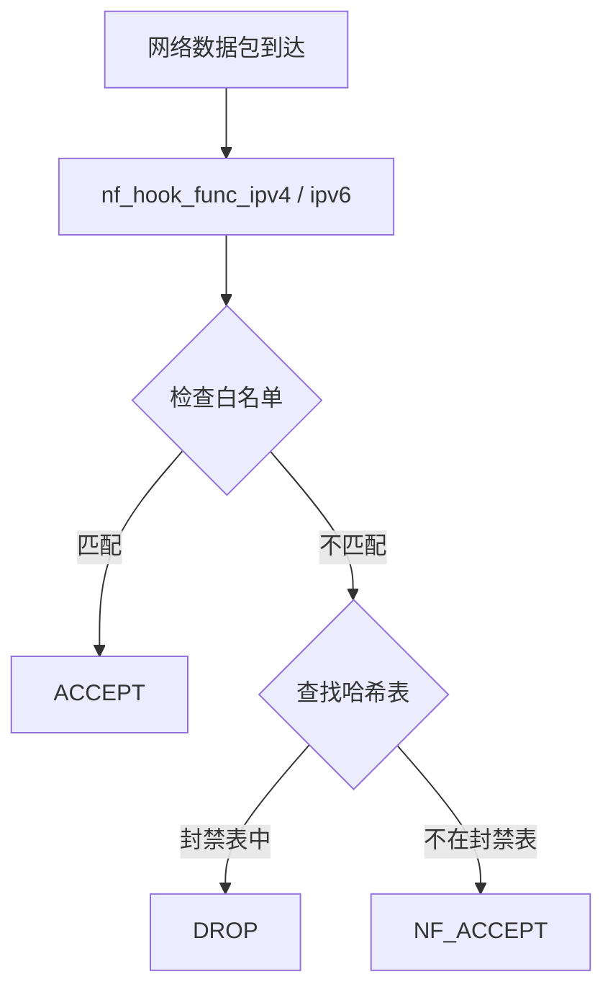
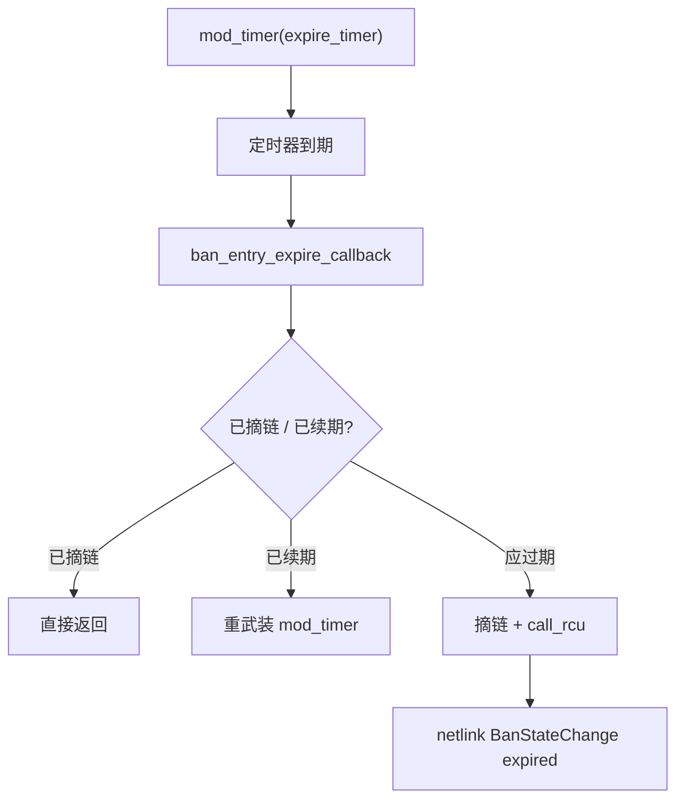
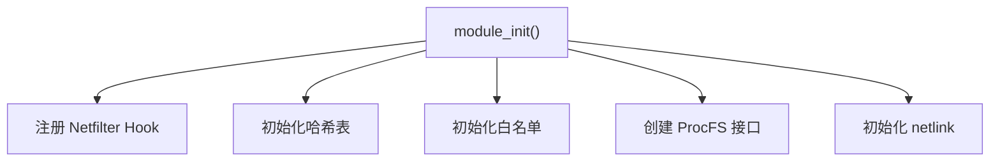
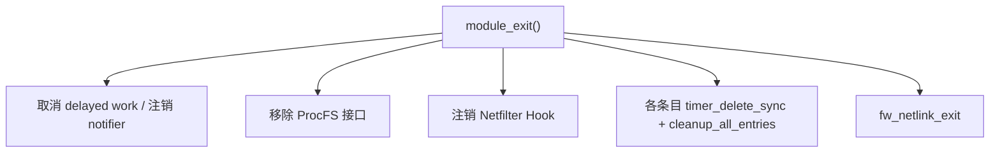

# 内核模块

本文档介绍 Linux Firewall 内核模块的实现细节。

## 模块概览

内核模块 `firewall.ko` 是整个系统的核心，负责在网络栈层面拦截和过滤数据包。

### 模块信息

| 属性 | 值 |
|------|-----|
| 模块名称 | `firewall` |
| 源文件 | `src/kernel-module/firewall-main.c` |
| 许可证 | MIT |
| 加载路径 | `/lib/modules/$(uname -r)/extra/firewall.ko` |

## Netfilter Hook

### Hook 注册点

模块在 `NF_INET_PRE_ROUTING` 链上注册 Hook，这是数据包进入网络栈后的最早处理点之一。

```c
struct nf_hook_ops nf_ops_ipv4 __read_mostly = {
    .hook     = nf_hook_func_ipv4,
    .pf       = NFPROTO_IPV4,
    .hooknum  = NF_INET_PRE_ROUTING,
    .priority = NF_IP_PRI_FIRST,
};

struct nf_hook_ops nf_ops_ipv6 __read_mostly = {
    .hook     = nf_hook_func_ipv6,
    .pf       = NFPROTO_IPV6,
    .hooknum  = NF_INET_PRE_ROUTING,
    .priority = NF_IP_PRI_FIRST,
};
```

### Hook 函数流程



### 返回值

| 返回值 | 说明 |
|--------|------|
| `NF_ACCEPT` | 允许数据包通过 |
| `NF_DROP` | 丢弃数据包 |

## 哈希表

### 数据结构

内核使用哈希表存储被封禁的 IP 地址，容量为 4096。

```c
#define HASH_TABLE_SIZE 4096

struct banned_ip {
    __be32 ip;                // IPv4 地址
    u32 port;                 // 端口
    u8 protocol;              // 协议
    ktime_t ban_time;         // 封禁时间
    ktime_t expire_time;      // 过期时间
    char jail_name[64];       // Jail 名称
    struct hlist_node node;   // 哈希链表节点
};
```

### 哈希函数

```c
static inline u32 hash_ip(__be32 ip, u32 port)
{
    return jhash_2words((__force u32)ip, port, HASH_SEED) % HASH_TABLE_SIZE;
}
```

### 操作复杂度

| 操作 | 复杂度 | 说明 |
|------|--------|------|
| 查找 | O(1) 平均 | 哈希查找 |
| 插入 | O(1) 平均 | 头插法 |
| 删除 | O(1) 平均 | 链表删除 |

## RCU 并发控制

### 读操作

数据包处理路径使用 RCU 读锁，确保多 CPU 并发安全且无锁竞争：

```c
rcu_read_lock();
entry = firewall_lookup(ip, port);
rcu_read_unlock();
```

### 写操作

添加/删除封禁时使用 RCU 写同步：

```c
spin_lock(&hash_lock);
hlist_add_head_rcu(&entry->node, &hash_table[hash]);
spin_unlock(&hash_lock);
synchronize_rcu();
```

### 优势

| 特性 | 说明 |
|------|------|
| 读无锁 | 数据包处理路径无锁，极低延迟 |
| 多 CPU | 支持所有 CPU 核心并行处理 |
| 安全 | 保证读者看到一致的数据 |

## 白名单

### 数据结构

白名单使用固定大小数组，容量为 64。

```c
#define WHITELIST_SIZE 64

struct whitelist_entry {
    __be32 ip;          // IP 地址
    __be32 mask;        // 子网掩码
    bool active;        // 是否激活
};
```

### 匹配逻辑

白名单检查在哈希表查找之前执行，确保白名单 IP 永远不会被封禁：

```c
if (is_whitelisted(ip)) {
    return NF_ACCEPT;
}
```

### CIDR 支持

白名单支持 CIDR 表示法，通过子网掩码匹配：

```c
/* 真实实现见 src/kernel-module/whitelist.c */
bool is_in_whitelist(struct firewall_info *fw, u8 af, const void *ip)
{
    struct whitelist_entry *entry;
    /* 两阶段匹配：先精确匹配（O(1) 哈希桶），再遍历 CIDR 子网 */
    ...
}
```

## 自动过期清理

### Per-entry 定时器

临时封禁**不靠全局清理线程扫表**。每个非永久 `ban_entry` 自带
`expire_timer`（`timer_list`），到期由内核软中断回调摘链并通知守护进程
（实现见 `src/kernel-module/ban-manager.c`；`cleanup.c` 仅提供 RCU
`kfree` 回调）：

```c
/* 真实实现见 src/kernel-module/ban-manager.c */
void ban_entry_expire_callback(struct timer_list *t)
{
    struct ban_entry *entry = container_of(t, struct ban_entry, expire_timer);
    /* 持桶锁：若已手动解封则退出；若已续期则重武装定时器 */
    /* 否则从哈希表 / active_bans_list 摘链，call_rcu 释放 */
    /* 再 fw_netlink_send_ban_state_change(..., "expired", ...) */
}
```

封禁成功时：

```c
timer_setup(&entry->expire_timer, ban_entry_expire_callback, 0);
if (!is_permanent)
    mod_timer(&entry->expire_timer, unban_time);  /* jiffies 绝对到期点 */
```

### 策略要点

| 项 | 行为 |
|----|------|
| 触发方式 | 每条目独立 `mod_timer`，到期即回调（类似 nftables set timeout） |
| 永久封禁 | 仍 `timer_setup`，但不 `mod_timer`，不会自动解封 |
| 续期 | 更新 `unban_time` 后 `mod_timer`；若旧回调已在跑，见 `unban_time` 未到则重武装 |
| 手动解封 | 桶锁内 `timer_delete`（非 `_sync`）+ 摘链 + `call_rcu` |
| 用户态 | 守护进程靠 netlink `BanStateChange`；缓存另有本地 `expires_at` 清理，**不负责**内核解封 |

### 过期流程



## ProcFS 接口

### 注册

```c
static int __init firewall_proc_init(void)
{
    struct firewall_info *fw = get_fw_info();
    struct proc_dir_entry *entry;

    fw->proc_dir = proc_mkdir("firewall", NULL);
    if (!fw->proc_dir)
        return -ENOMEM;

    entry = proc_create("bans", 0600, fw->proc_dir, &bans_fops);
    entry = proc_create("config", 0600, fw->proc_dir, &config_fops);
    entry = proc_create("whitelist", 0600, fw->proc_dir, &whitelist_fops);
    entry = proc_create("stats", 0400, fw->proc_dir, &stats_fops);

    return 0;
}
```

### 文件权限与操作

| 文件 | 权限 | 操作 |
|------|------|------|
| `bans` | 0600 | 读写，封禁/解封操作 |
| `config` | 0600 | 只读，运行时配置信息 |
| `whitelist` | 0600 | 读写，白名单管理 |
| `stats` | 0400 | 只读，统计计数器 |

> **注意**：早期文档中提到的 `status` / `clear` / `version` 文件不存在。
> `config` 和 `stats` 为只读；所有写入操作通过 `bans` 和 `whitelist`。

## 模块生命周期

### 初始化



### 退出



## 内核日志

使用 `pr_*` 宏输出日志：

```c
pr_info("firewall: module loaded\n");
pr_warn("firewall: hash table full\n");
pr_err("firewall: failed to register hook\n");
```

调试级别通过编译时宏控制：

```bash
make debug DL=2    # 启用调试级别 2
```