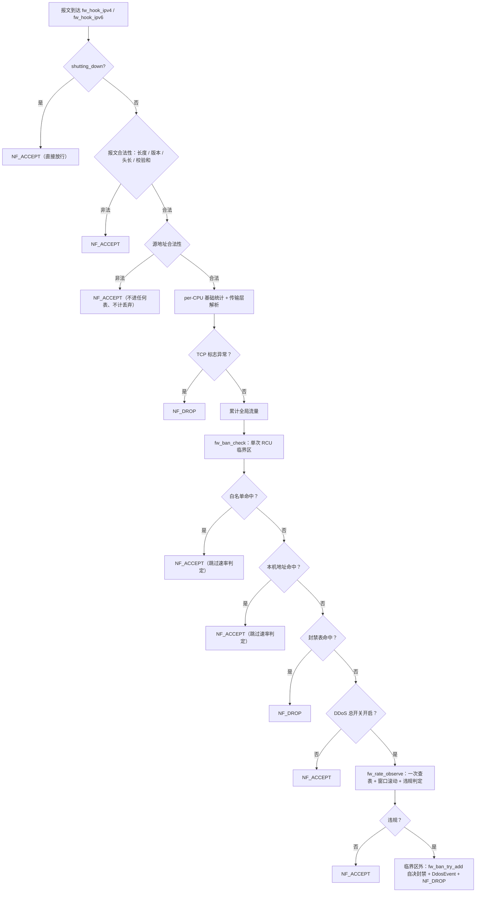
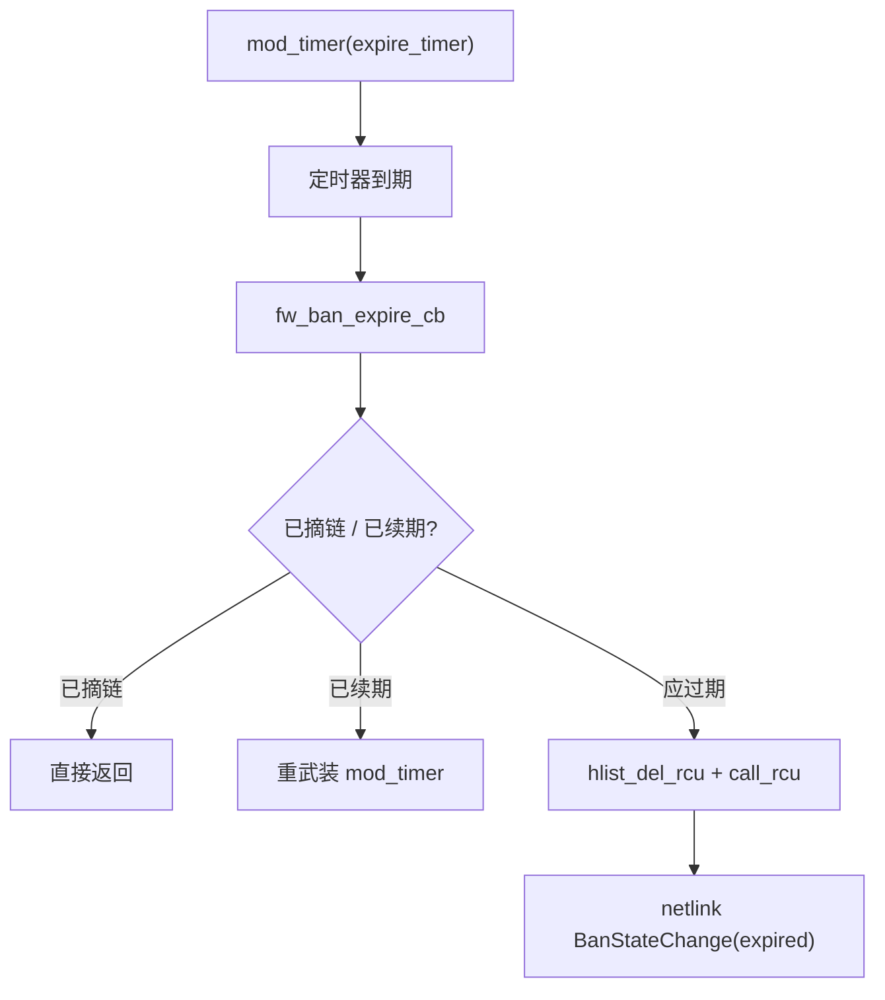
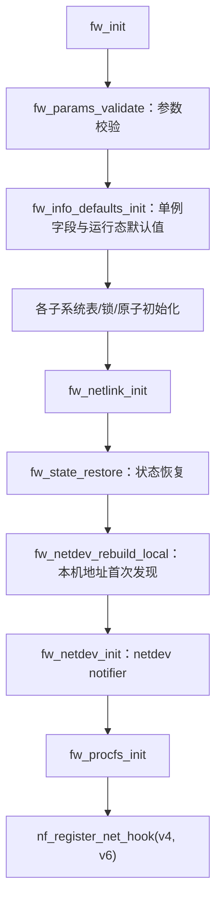
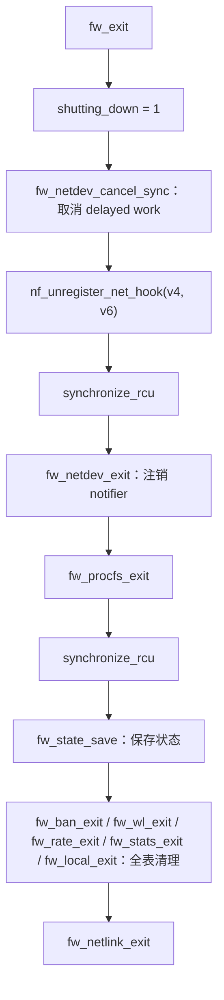

# 内核模块

本文档按 `src/kernel-module/` 的当前实现（12 个 `fw_*` 文件：`fw_types.h` + 11 个 `fw_*.c`，另有各模块私有头）描述 Linux Firewall 内核模块的内部结构。

模块代码按**数据所有权**切分：每个文件只拥有一组数据、只暴露一个窄接口，跨模块调用走对方头文件声明的窄接口。对外接口（netlink 线格式与 procfs 文本协议）由 `contract/*.fwidl` 冻结，实现不得偏离生成物。

相关文档：

- 接口细节（12 个 procfs 条目的读写文法、模块参数、错误码）：`docs/zh/configuration/procfs.md`
- 重写目标与设计决策：`docs/zh/development/kernel-rewrite-design.md`

## 模块概览

内核模块 `firewall.ko` 在网络栈层面拦截**入站**报文：在 `NF_INET_PRE_ROUTING` 处依次判定白名单、本机地址、封禁表与速率违规，命中封禁表即丢包。

### 模块信息

| 属性 | 值 |
|------|-----|
| 模块名称 | `firewall` |
| 模块入口 | `src/kernel-module/fw_main.c`（`module_init` / `module_exit`） |
| 源文件 | `src/kernel-module/` 下 12 个 `fw_*` 文件，另有各模块私有头 `fw_*.h` |
| 许可证 | Dual MIT/GPL |
| 版本 | `2.2`（`fw_main.c` 的 `MODULE_VERSION`） |
| 加载路径 | `/lib/modules/$(uname -r)/extra/firewall.ko` |

### 源文件与数据所有权

| 文件 | 数据所有权 | 对外接口 |
|------|-----------|---------|
| `fw_types.h` | 无（类型、常量、热路径 `static inline` 原语） | 引入契约生成头、内部结构体、`BAN_HASH_BITS` 等常量 |
| `fw_main.c` | 模块生命周期、`fw_info` 单例 | `module_param`、`fw_init` / `fw_exit`、`shutting_down` 状态 |
| `fw_stats.c` | per-CPU 统计、直方图与分析分布 | `fw_stat_account()`（热路径）、`fw_stats_flush_all()`、快照函数 |
| `fw_local.c` | 本机地址集合（开放寻址哈希集） | `fw_local_lookup()`（热路径 RCU 读）、集合构建与发布 |
| `fw_wl.c` | 白名单精确桶 + 子网链 | `fw_wl_lookup()`（热路径 RCU 读）、`fw_wl_add` / `fw_wl_remove` |
| `fw_ban.c` | 封禁表 | `fw_ban_lookup()`（热路径 RCU 读）、`fw_ban_try_add()`、per-entry 定时器 |
| `fw_rate.c` | 速率表、窗口滚动、EWMA、违规判定 | `fw_rate_observe()`（热路径，一次查表返回判定） |
| `fw_hook.c` | netfilter 钩子注册与报文解析 | 无（只暴露 `nf_ops_ipv4` / `nf_ops_ipv6` 注册表） |
| `fw_netlink.c` | netlink socket 与收发 | `fw_netlink_init` / `fw_netlink_exit`、`fw_nl_send_*()` |
| `fw_procfs.c` | 12 个 procfs 条目 | `fw_procfs_init` / `fw_procfs_exit` |
| `fw_state.c` | 状态文件读写 | `fw_state_save()`、`fw_state_restore()` |
| `fw_netdev.c` | netdev notifier、本机地址重建 | `fw_netdev_init` / `fw_netdev_exit`、`fw_netdev_rebuild_local()` |

热路径原语（`fw_addr_equal`、`fw_hash_addr`、`fw_prefix_match`、`fw_src_is_invalid_ipv4` / `_ipv6`、`fw_tcp_flag_anomaly`、`fw_is_shutting_down`、`fw_pkt_size_bucket`、`fw_ttl_bucket`）以及 `fw_stat_bump` 以 `static inline` 定义在 `fw_types.h` / `fw_stats.h`；需要遍历各自表的查询函数（`fw_ban_lookup`、`fw_wl_lookup`、`fw_local_lookup`、`fw_rate_observe`、`fw_stat_account`）是各模块 `.c` 中的普通函数，由对应头文件声明。

模块不导出任何符号：旧实现的 `get_fw_info()` / `is_banned()` / `is_permanently_banned()` 三个 `EXPORT_SYMBOL` 已删除，新实现模块内自足。

## Netfilter Hook

### Hook 注册点

模块在 `NF_INET_PRE_ROUTING` 注册两个钩子（IPv4 / IPv6 各一个），优先级为 `NF_IP_PRI_FILTER - 1`，即在 filter 表之前看到报文；钩子只挂在 `init_net` 上。

```c
/* src/kernel-module/fw_hook.c：IPv4/IPv6 钩子注册表，由 fw_main.c 在 init/exit 中按序注册与注销 */
struct nf_hook_ops nf_ops_ipv4 = {
  .hook = fw_hook_ipv4,
  .pf = NFPROTO_IPV4,
  .hooknum = NF_INET_PRE_ROUTING,
  .priority = NF_IP_PRI_FILTER - 1,
};

struct nf_hook_ops nf_ops_ipv6 = {
  .hook = fw_hook_ipv6,
  .pf = NFPROTO_IPV6,
  .hooknum = NF_INET_PRE_ROUTING,
  .priority = NF_IP_PRI_FILTER - 1,
};
```

### Hook 判定流程


```mermaid
graph TB
    A["报文到达 fw_hook_ipv4 / fw_hook_ipv6"] --> B{"shutting_down?"}
    B -->|是| ACC1["NF_ACCEPT（直接放行）"]
    B -->|否| C{"报文合法性：长度 / 版本 / 头长 / 校验和"}
    C -->|非法| ACC2["NF_ACCEPT"]
    C -->|合法| D{"源地址合法性"}
    D -->|非法| ACC3["NF_ACCEPT（不进任何表、不计丢弃）"]
    D -->|合法| E["per-CPU 基础统计 + 传输层解析"]
    E --> F{"TCP 标志异常？"}
    F -->|是| DR1["NF_DROP"]
    F -->|否| G["累计全局流量"]
    G --> H["fw_ban_check：单次 RCU 临界区"]
    H --> I{"白名单命中？"}
    I -->|是| ACC4["NF_ACCEPT（跳过速率判定）"]
    I -->|否| J{"本机地址命中？"}
    J -->|是| ACC5["NF_ACCEPT（跳过速率判定）"]
    J -->|否| K{"封禁表命中？"}
    K -->|是| DR2["NF_DROP"]
    K -->|否| L{"DDoS 总开关开启？"}
    L -->|否| ACC6["NF_ACCEPT"]
    L -->|是| M["fw_rate_observe：一次查表 + 窗口滚动 + 违规判定"]
    M --> N{"违规？"}
    N -->|否| ACC7["NF_ACCEPT"]
    N -->|是| O["临界区外：fw_ban_try_add 自决封禁 + DdosEvent + NF_DROP"]
```

### 单次 RCU 临界区

`fw_ban_check()` 在**同一个 RCU 读侧临界区**里读完白名单、本机地址、封禁表与速率四张表；自决封禁在临界区**外**执行（要取桶锁、分配内存、推 netlink 事件，不在 RCU 读侧做重活）。

```c
/* src/kernel-module/fw_hook.c：判定主体（节选）。白名单与本机地址同为「放行且不做速率判定」的短路条件 */
rcu_read_lock();

/* 关闭中的第二道判断：与钩子入口的第一道配对（双检） */
if (unlikely(fw_is_shutting_down())) {
  rcu_read_unlock();
  return NF_ACCEPT;
}

if (!fw_wl_lookup(af, src) && !fw_local_lookup(af, src)) {
  if (fw_ban_lookup(af, src)) {
    banned = true;
  } else if (likely(READ_ONCE(fw_ddos_detection))) {
    reason = fw_rate_observe(af, src, packet_len, protocol, tcp_flags, dst_port, &pps);
  }
}

rcu_read_unlock();
```

本机地址判定**必须**先于封禁表判定：本机豁免由 `fw_local.c` 承担（新设计不再把接口地址写进白名单），顺序颠倒会让本机地址被自己的封禁条目丢弃。

### 返回值

| 返回值 | 说明 |
|--------|------|
| `NF_ACCEPT` | 放行：模块关闭中、报文或源地址非法、白名单命中、本机地址命中、未命中封禁表且未违规 |
| `NF_DROP` | 丢弃：TCP 标志异常、封禁表命中、速率违规（触发违规的报文本身也丢） |

### 记账口径

- 源地址非法的报文不进任何表、也不计入丢弃统计。
- TCP 标志异常（`SYN+FIN` / `SYN+RST` / 四个主要标志位全零）同时计入 `packets_dropped` 与 `tcp_anomaly_dropped`。
- 全局流量（`global_traffic_packets` / `global_traffic_bytes`）在异常判定之后累加，因此只统计真正进入 DDoS 判定的报文。
- IPv6 扩展头遍历深度上限为 `FW_HOOK_MAX_EXT_HDR_DEPTH`（8），超限视为畸变报文直接丢弃；ICMPv6 Echo Request 映射为 `IPPROTO_ICMP`，使协议阈值覆盖 IPv6。

## 哈希结构

### 表与规模

| 表 | 结构 | 桶数 / 容量 | 条目上限来源 |
|----|------|------------|-------------|
| 封禁表 | hlist + RCU + per-bucket 自旋锁 | 4096 桶（`BAN_HASH_BITS` = 12） | 模块参数 `fw_max_ban_entries`（默认 65535） |
| 白名单 | 64 精确桶 + 子网链表 | 64 桶（`WHITELIST_HASH_BITS` = 6） | 模块参数 `fw_max_whitelist_entries`（默认 65535） |
| 速率表 | hlist + RCU + per-bucket 自旋锁 + per-CPU 槽 | 65536 桶（`RATE_HASH_BITS` = 16） | 模块参数 `fw_max_rate_entries`（默认 65536） |
| 本机地址集合 | 开放寻址哈希集（线性探测） | 2 的幂；下界 `fw_max_local_ips`（默认 256），硬上界 2^16 | 无条目上限：按实际地址数扩容 |
| UDP 端口分析表 | hlist + RCU | 256 桶 | `MAX_UDP_PORT_ENTRIES`（512） |
| ICMP 类型分析表 | hlist + RCU | 64 桶 | `MAX_ICMP_TYPE_ENTRIES`（128） |

IPv4 与 IPv6 各用一张表（封禁 / 白名单 / 速率各两张），由 `af` 选择 `_ipv4` / `_ipv6` 表头。桶数不等于容量：封禁表的 4096 是哈希桶数，条目上限由模块参数控制。

### 哈希函数

```c
/* src/kernel-module/fw_types.h：桶索引。v4/v6 统一走 jhash + 每引导随机种子，防哈希碰撞攻击 */
#define BAN_HASH_BITS 12
#define BAN_HASH_SIZE (1 << BAN_HASH_BITS)

static inline u32 fw_hash_addr(u8 af, const void *ip, int bits) {
  if (af == FW_AF_INET6)
    return jhash(ip, sizeof(struct in6_addr), fw_hash_seed) & ((1 << bits) - 1);
  return jhash_1word((__force u32) *(__be32 *)ip, fw_hash_seed) & ((1 << bits) - 1);
}
```

`fw_hash_seed` 由 `fw_main.c` 在 init 时用 `get_random_bytes()` 取每引导随机值，放在 `fw_info` 之外单独定义。

### 封禁条目

```c
/* src/kernel-module/fw_types.h：运行期封禁条目。
 * 契约生成头里的 struct fw_ban_entry 是**线格式**（packed、大端，只在 fw_netlink.c 序列化时使用），
 * 运行期条目另名 fw_ban_node，允许带定时器、链表节点、指针等无法上线的东西。 */
struct fw_ban_node {
  u8 af;
  u8 is_permanent;
  u32 duration_secs;           /* 本次封禁时长（秒），永久为 0；续期时更新 */
  unsigned long banned_at;     /* 封禁起点（jiffies） */
  unsigned long unban_jiffies; /* 到期点（jiffies）；永久条目无意义 */
  union fw_addr addr;
  char jail_name[32];
  char reason[32];
  struct hlist_node hash;
  struct rcu_head rcu;
  struct timer_list expire_timer; /* per-entry 到期定时器 */
};
```

封禁表按 **IP 粒度**存储：条目里没有端口与协议字段，也没有旧结构里的 `retry_count`。`banned_at` 内部用 jiffies，读侧序列化时换算为 Unix 秒（`fw_ban_start_unix()`）。

### 操作复杂度

| 操作 | 复杂度 | 说明 |
|------|--------|------|
| 查找 | O(1) 平均 | 哈希定位桶，桶内链表比较 `(af, addr)` |
| 插入 | O(1) 平均 | `hlist_add_head_rcu`，桶锁内完成 |
| 删除 | O(1) 平均 | `hlist_del_rcu` + `call_rcu` |
| 本机地址查找 | O(1) 平均 | 开放寻址线性探测，探测到空槽即判定不存在 |
| 速率条目查找 | O(1) 平均 | 同上；热点源地址走 per-CPU 槽，不查全局表 |

## RCU 并发控制

### 读操作

报文路径只在 `fw_ban_check()` 里进一次 RCU 读侧临界区，在其中读完四张表：

```c
/* src/kernel-module/fw_hook.c：热路径只读，全流程不取任何自旋锁 */
rcu_read_lock();
/* fw_wl_lookup() / fw_local_lookup() / fw_ban_lookup() / fw_rate_observe() 均为 RCU 只读遍历 */
rcu_read_unlock();
```

各查询函数内部用 `hlist_for_each_entry_rcu` / `list_for_each_entry_rcu` 遍历，不加锁。

### 写操作

增删一律「先发布或摘链、再等宽限期释放」：

```c
/* src/kernel-module/fw_ban.c：删除路径（手动解封、白名单联动、退出清理同构） */
spin_lock_bh(&fw_info.ban_locks[bkt]);
timer_delete(&n->expire_timer);      /* 非等待版：不阻塞在可能正在跑的到期回调上 */
hlist_del_rcu(&n->hash);
atomic_dec(&fw_info.ban_count);
spin_unlock_bh(&fw_info.ban_locks[bkt]);
call_rcu(&n->rcu, fw_ban_free_rcu);  /* 宽限期结束后 kfree */
```

本机地址集合整张重建后由 `rcu_assign_pointer` 发布、旧表交 `kfree_rcu`；退出路径统一 `synchronize_rcu()` + `rcu_barrier()`。

### 锁顺序协议

`fw_types.h` 文档化了全局锁顺序，除 `rate_locks[bkt] → rate_slot_lock` 这一对之外，任意两把锁**不得嵌套**；需要跨表操作时先释放再取。

| 锁 | 保护 | 获取方式 |
|----|------|---------|
| `ban_locks[BAN_HASH_SIZE]` | 封禁桶、条目定时器、摘链 | `spin_lock_bh` |
| `wl_lock` | 白名单表、子网链、计数 | `spin_lock_bh` |
| `rate_locks[RATE_HASH_SIZE]` | 速率桶（仅建条目的冷路径） | `spin_lock_bh` |
| `rate_slot_lock` | per-CPU 速率槽「探测空槽 + 发布」这一对操作 | `spin_lock_bh`（唯一允许的嵌套：桶锁 → 槽锁） |
| `flood_lock` | 泛洪保护窗口 | `spin_lock_bh` |
| `udp_port_lock` / `icmp_type_lock` | 分析表（仅 flush 与惰性建条目） | `spin_lock_bh` |

### 无共享 cache line 写

热路径每包只碰本 CPU 内存：统计与直方图落在 `alloc_percpu` 的 `fw_stats_pcpu` 上；速率窗口原始计数与端口去重集合落在 per-CPU 直接映射槽 `fw_rate_cpu_slot` 上。跨 CPU 汇总只发生在两处——窗口滚动（`fw_rate_roll()` 汇总各 CPU 槽并清零）与读侧 flush（`fw_stats_flush_all()` 用 `on_each_cpu` 同步汇总），都不在每包路径上。

## 白名单

### 数据结构

白名单由两部分组成：**精确桶**（64 个 hlist 桶）与**子网链表**。

```c
/* src/kernel-module/fw_types.h：白名单条目。精确条目只入桶；子网条目同时入桶与子网链 */
struct fw_wl_entry {
  u8 af;
  u8 prefix_len;
  union fw_addr addr;
  char device_name[16];
  struct hlist_node hash;       /* 精确桶节点 */
  struct list_head subnet_node; /* 子网链节点（仅前缀 < 全长时使用） */
  struct rcu_head rcu;
};
```

子网链表是必要设计：命中判定无需为前缀比较遍历全部桶。表内存储的是**归一化后的 network 地址**，写侧先过 `fw_addr_normalize()`。

### 匹配逻辑

白名单检查在封禁表查找之前执行，命中即放行且跳过速率判定：

```c
/* src/kernel-module/fw_wl.c：先查精确桶，再查子网链；条目发布后不再修改，整体比较即可 */
bool fw_wl_lookup(u8 af, const void *ip) {
  /* 1) 精确桶：前缀全长的条目 */
  hlist_for_each_entry_rcu(e, fw_wl_bucket_head(af, ip), hash) {
    if (e->af != af || !fw_wl_is_full_prefix(af, e->prefix_len))
      continue;
    if (fw_addr_equal(af, &e->addr, ip))
      return true;
  }

  /* 2) 子网链：存在覆盖该地址的前缀条目 */
  list_for_each_entry_rcu(e, fw_wl_subnet_list(af), subnet_node) {
    if (fw_prefix_match(af, ip, &e->addr, e->prefix_len))
      return true;
  }

  return false;
}
```

### CIDR 支持

添加与移除接受 `<ip>` 或 `<ip>/<prefix>`；省略前缀时按地址族全长（IPv4 32、IPv6 128）。移除要求 `(af, 地址, prefix_len)` 三元组完全一致。

| 项 | 行为 |
|----|------|
| 子网前缀匹配 | `fw_prefix_match()`：IPv4 用掩码比较，IPv6 先比整字节再比余位 |
| 条目上限 | 模块参数 `fw_max_whitelist_entries`（默认 65535），`wl_lock` 内检查，到限返回 `-ENOSPC` 并递增 `whitelist_rejects` |
| 重复条目 | 同一 `(af, 归一化地址, prefix_len)` 只保留一条，重复添加不报错 |
| 本机接口地址 | 由 `fw_netdev.c` 依据接口状态自动维护；手工 `remove` 命中本机地址返回 `-EPERM`（按精确主机地址判定，不做子网比较） |
| 变更联动 | 移除白名单条目后调 `fw_ban_del_matching()`，解封落在该前缀覆盖范围内的封禁条目 |
| 地址准入 | 拒绝 `0.0.0.0` / 广播 / 组播 / 回环 / 链路本地 |

## 自动过期清理

### Per-entry 定时器

临时封禁不靠全局清理线程扫表（该线程已改为 per-entry 定时器，不再存在）。每个非永久 `fw_ban_node` 自带 `expire_timer`，到期由软中断回调持桶锁摘链：

```c
/* src/kernel-module/fw_ban.c：到期回调（结构节选）。整体持 RCU 读侧临界区，
 * 保证与删除路径的 call_rcu 释放互斥——宽限期不会在回调结束前完成。 */
static void fw_ban_expire_cb(struct timer_list *t) {
  struct fw_ban_node *n = timer_container_of(n, t, expire_timer);

  rcu_read_lock();
  spin_lock_bh(&fw_info.ban_locks[bkt]);

  if (hlist_unhashed(&n->hash)) {           /* 已被手动解封 / 联动 / 退出清理摘链 */
    spin_unlock_bh(&fw_info.ban_locks[bkt]);
    rcu_read_unlock();
    return;
  }
  if (!READ_ONCE(n->is_permanent) &&
      time_before(jiffies, READ_ONCE(n->unban_jiffies))) { /* 续期竞态：重武装 */
    mod_timer(&n->expire_timer, n->unban_jiffies);
    spin_unlock_bh(&fw_info.ban_locks[bkt]);
    rcu_read_unlock();
    return;
  }

  hlist_del_rcu(&n->hash);
  atomic_dec(&fw_info.ban_count);
  spin_unlock_bh(&fw_info.ban_locks[bkt]);
  rcu_read_unlock();

  fw_stat_add_expired(1);
  call_rcu(&n->rcu, fw_ban_free_rcu);
  fw_nl_send_ban_state_change(FW_BAN_ACTION_UNBAN, af, &addr, 0, "expired", NULL);
}
```

定时器在条目分配时就 `timer_setup`，只有临时封禁才 `mod_timer` 武装：

```c
/* src/kernel-module/fw_ban.c：fw_ban_alloc() 建立回调；fw_ban_insert() 决定是否武装 */
timer_setup(&n->expire_timer, fw_ban_expire_cb, 0);
...
if (duration_secs)
  mod_timer(&n->expire_timer, n->unban_jiffies);  /* jiffies 绝对到期点 */
```

### 策略要点

| 项 | 行为 |
|----|------|
| 触发方式 | 每条目独立 `mod_timer`，到期即回调（每个条目一把定时器） |
| 永久封禁 | 仍 `timer_setup`，但不 `mod_timer`，永不到期 |
| 续期 | 桶锁内更新时长与 `unban_jiffies` 后 `mod_timer`；若旧回调已在跑，回调内重新比较 `unban_jiffies`，未到则重武装 |
| 手动解封 | 桶锁内 `timer_delete`（非 `_sync`）+ `hlist_del_rcu` + `call_rcu` |
| 释放安全 | 到期回调持 RCU 读侧临界区，`call_rcu` 的释放回调必须等宽限期结束，故回调不可能访问已释放节点；不需要在持桶锁时调 `timer_delete_sync()`（会自锁死） |
| 用户态 | 守护进程靠 netlink `BanStateChange` 感知；其本地缓存 `expires_at` 清理**不负责**内核解封 |

### 过期流程


```mermaid
graph TB
    A["mod_timer(expire_timer)"] --> B["定时器到期"]
    B --> C["fw_ban_expire_cb"]
    C --> D{"已摘链 / 已续期?"}
    D -->|已摘链| E["直接返回"]
    D -->|已续期| F["重武装 mod_timer"]
    D -->|应过期| G["hlist_del_rcu + call_rcu"]
    G --> H["netlink BanStateChange(expired)"]
```

## ProcFS 接口

### 注册

根目录为 `/proc/firewall`，其下 12 个条目由 `fw_procfs.c` 按契约权限位创建：

```c
/* src/kernel-module/fw_procfs.c：条目名与权限位取自契约生成头 FW_PROCFS_*_MODE */
dir = proc_mkdir("firewall", NULL);
fw_info.proc_bans      = proc_create("bans",      FW_PROCFS_BANS_MODE,      dir, &bans_fops);      /* 0600 */
fw_info.proc_config    = proc_create("config",    FW_PROCFS_CONFIG_MODE,    dir, &config_fops);    /* 0600 */
fw_info.proc_whitelist = proc_create("whitelist", FW_PROCFS_WHITELIST_MODE, dir, &whitelist_fops); /* 0600 */
fw_info.proc_stats     = proc_create("stats",     FW_PROCFS_STATS_MODE,     dir, &stats_fops);     /* 0400 */
/* rates / udp_ports / icmp_types / pkt_sizes / ttl_dist / ip_frags / port_scanners / service_probes 均为 0400 */
```

`fw_procfs_exit()` 逆序移除 12 个条目，最后移除根目录。

### 文件权限与操作

| 文件 | 权限 | 操作 |
|------|------|------|
| `bans` | 0600 | 读写：`<ip>` / `<ip> <seconds>` / `<ip> 0` / `unban <ip>` |
| `whitelist` | 0600 | 读写：`add <subnet>` / `<subnet>` / `remove <subnet>` |
| `config` | 0600 | 读写：`ban_time <seconds>`（**可写**，不是只读） |
| `stats` | 0400 | 只读：13 个 `key value` 行，**唯一机器可读条目** |
| `rates`、`udp_ports`、`icmp_types`、`pkt_sizes`、`ttl_dist`、`ip_frags`、`port_scanners`、`service_probes` | 0400 | 只读：人类可读表格，契约标注 `unstable`，无排版稳定性承诺 |

12 个条目的完整读写文法、输出示例、错误码与模块参数表见 `docs/zh/configuration/procfs.md`；该文件由 `contract/procfs.fwidl` 冻结，本文档不重复其表格。

### 读侧纪律

- `stats` 与 5 个分析条目（`udp_ports` / `icmp_types` / `pkt_sizes` / `ttl_dist` / `ip_frags`）都先取快照；快照函数内部先 `fw_stats_flush_all()` 做跨 CPU 汇总，因此低速率下也不会读到各 CPU 尚未汇出的陈旧值。
- `stats` 的 `current_bans` / `current_whitelist` / `recent_additions` 由 `fw_procfs.c` 分别用 `fw_ban_count()` / `fw_wl_count()` / `fw_ban_recent_additions_stat()` 补齐——统计模块不反向依赖封禁表与白名单。
- 分析快照与 netlink `ANALYSIS_RESPONSE` 同源；单次展示行数受 `FW_ANALYSIS_UDP_PACK_MAX` / `FW_ANALYSIS_ICMP_PACK_MAX`（均为 64）限制，而 `Total entries` 打印的是分析表的真实条目数。
- `cleanup_cycles` 恒为 0（无全局清理线程），保留键位只为不破坏外部按行解析的脚本。

### 写侧纪律

一次 `write(2)` 一条命令，末尾换行可选；分隔符为空格或制表符；除 `\t` 外所有 `< 0x20` 控制字符一律拒绝；失败返回**负 errno**，无文本错误通道（原因只进内核日志）。封禁与白名单的手工写入分别经 `fw_ban_try_add()` / `fw_wl_add()` / `fw_wl_remove()`，与内核自决封禁共用同一套白名单前检、泛洪闸门与容量检查。

## 模块生命周期

### 初始化


```mermaid
graph TB
    A["fw_init"] --> B["fw_params_validate：参数校验"]
    B --> C["fw_info_defaults_init：单例字段与运行态默认值"]
    C --> D["各子系统表/锁/原子初始化"]
    D --> E["fw_netlink_init"]
    E --> F["fw_state_restore：状态恢复"]
    F --> G["fw_netdev_rebuild_local：本机地址首次发现"]
    G --> H["fw_netdev_init：netdev notifier"]
    H --> I["fw_procfs_init"]
    I --> J["nf_register_net_hook(v4, v6)"]
```

子系统初始化顺序为 `fw_stats_init → fw_local_init → fw_wl_init → fw_ban_init → fw_rate_init`（统计 → 本机 → 白名单 → 封禁 → 速率）。

### 退出


```mermaid
graph TB
    A["fw_exit"] --> B["shutting_down = 1"]
    B --> C["fw_netdev_cancel_sync：取消 delayed work"]
    C --> D["nf_unregister_net_hook(v4, v6)"]
    D --> E["synchronize_rcu"]
    E --> F["fw_netdev_exit：注销 notifier"]
    F --> G["fw_procfs_exit"]
    G --> H["synchronize_rcu"]
    H --> I["fw_state_save：保存状态"]
    I --> J["fw_ban_exit / fw_wl_exit / fw_rate_exit / fw_stats_exit / fw_local_exit：全表清理"]
    J --> K["fw_netlink_exit"]
```

### 顺序上的硬约束

| 约束 | 原因 |
|------|------|
| 本机地址首次发现必须在注册钩子之前 | 消除「本机地址集合为空即判定非本机」的失败开放窗口；`fw_netdev_rebuild_local()` 返回负值时放弃注册钩子、整个模块放弃加载——宁可不工作，也不让本机地址被当成外来地址参与封禁 |
| 状态保存必须在全表清理之前 | `fw_state_save()` 要读封禁表与白名单表 |
| netlink 最后销毁 | 前面每一步都可能推送事件（例如 ban 到期回调在 `rcu_read_unlock()` 之后调 `fw_nl_send_*`） |
| `shutting_down` 双检 | 热路径入口与 `fw_ban_check()` 内各判一次，置位后热路径直接放行，退出不被新流量拖住 |

### 模块参数

模块加载时可传入以下 10 个参数（`/sys/module/firewall/parameters/` 可查看）：

| 参数 | 默认值 | sysfs 权限 | 说明 |
|------|--------|-----------|------|
| `fw_ban_time` | 600 | 0400 | 默认封禁时长（秒），范围 1..31536000 |
| `state_file` | `/var/lib/firewall/state` | 0444 | 状态文件路径（内部变量名是 `fw_state_file`） |
| `fw_max_bans_per_second` | 200 | 0400 | 泛洪保护下每秒最大封禁添加次数 |
| `fw_max_rate_entries` | 65536 | 0644 | 速率表条目上限（文档化范围 1024..262144） |
| `fw_max_ban_entries` | 65535 | 0644 | 封禁表条目上限，到限拒绝并计入 `ban_table_full_rejects` |
| `fw_max_whitelist_entries` | 65535 | 0644 | 白名单条目上限，到限拒绝 |
| `fw_max_local_ips` | 256 | 0644 | 本机地址集合容量**下界**；实际地址更多时按需扩容，绝不因容量不足而漏掉本机地址 |
| `fw_static_threshold` | 1 | 0644 | 启用静态阈值检测 |
| `fw_dynamic_threshold` | 0 | 0644 | 启用动态阈值检测（实际阈值 = max(静态阈值, 基线 × 倍数)） |
| `fw_ddos_detection` | 1 | 0644 | DDoS 检测总开关；关闭后跳过所有速率检测与 DDoS 封禁 |

参数校验（`fw_params_validate()`）拒绝 `fw_ban_time` 越界与任一容量参数为 0，返回 `-EINVAL` 中止加载，不带着坏配置运行。

## 内核日志

模块用 `pr_fmt(fmt) "firewall: " fmt` 给所有日志加 `firewall:` 前缀，并按语义选择级别：

```c
/* src/kernel-module/fw_main.c：模块加载与卸载 */
pr_info("模块初始化开始\n");
pr_info("模块初始化完成 (ban_time=%u, ddos_ban_duration=%u, max_bans/s=%u, max_ban_entries=%u)\n",
        fw_ban_time, fw_info.ddos_ban_duration, fw_max_bans_per_second, fw_max_ban_entries);
pr_info("模块清理完成\n");

/* src/kernel-module/fw_main.c：初始化失败路径 */
pr_err("注册 IPv4 netfilter 钩子失败: %d\n", ret);

/* src/kernel-module/fw_netdev.c：本机地址数超过参数下界时提示（只提示一次） */
pr_warn_once("本机地址数 %u 超过 fw_max_local_ips=%u，本机集合按实际需要扩容\n", n, want);

/* src/kernel-module/fw_netlink.c：事件广播失败（限速打印） */
pr_warn_ratelimited("DdosEvent 广播失败: %d\n", ret);
```

模块**不提供**自有的调试级别开关（历史文档中的 `make debug DL=2` 与 `DL=0..3` 分级不存在）。模块版本从模块本身读取：

```bash
# 读取模块版本（由 MODULE_VERSION 声明）
modinfo firewall | grep '^version:'
```

查看启动与注册日志：

```bash
# 过滤内核日志中本模块的输出（pr_fmt 前缀为 firewall:）
sudo dmesg | grep firewall
```
