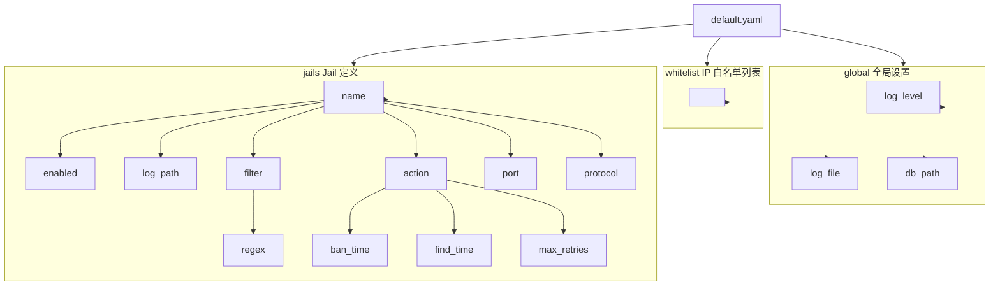

# 配置指南

本章节介绍 Linux Firewall 内核模块的配置方法和选项。

## 配置文件位置

| 文件 | 路径 | 用途 |
|------|------|------|
| 主配置文件 | `/etc/firewall/default.yaml` | 全局配置和 jail 定义 |
| 日志文件 | `/var/log/firewall.log` | 守护进程独立日志（与 syslog 并行） |

## 配置层次结构



## 全局配置详解

### `log_file`（独立日志文件）

- **类型**：字符串路径
- **默认值**：`/var/log/firewall.log`（debian 包预创建）
- **说明**：守护进程在保留 syslog 输出（journald 友好）的同时，将日志 tee 到此文件。文件使用 `O_APPEND` 模式以原子追加，每次写后立即 `fflush`。
- **典型用法**：`grep Banned /var/log/firewall.log | tail -10` 分析封禁记录
- **留空**：仅写 syslog，不创建文件
- **路径限制**：必须位于 `/var/log`、`/etc`、`/home`、`/srv` 之一（安全白名单）
- **运行时热切换**：通过 `kill -HUP $(pidof firewall-daemon)` 重载配置时如 `log_file` 变化，会自动关闭旧文件 + 打开新文件

### `log_level`（运行时日志级别）

- **类型**：整数（0..4）
- **默认值**：`3` (INFO)
- **说明**：运行时过滤阈值，等级高于此值的日志被丢弃
- **可选值**：
  - `0` = NONE（关闭所有日志）
  - `1` = ERR（仅错误）
  - `2` = WARN（错误 + 警告）
  - `3` = INFO（默认，日常操作）
  - `4` = DEBUG（所有级别，含开发调试）
- **运行时热切换**：通过 SIGHUP reload 时如 `log_level` 变化，立即生效

### 配置示例

```yaml
defaults:
  # ... 其他默认值 ...
  log_file: /var/log/firewall.log
  log_level: 3
```

## 配置加载顺序

1. 系统启动时读取 `/etc/firewall/default.yaml`
2. 解析全局配置
3. 加载白名单到内核（最多 64 条）
4. 初始化每个启用的 jail
5. 注册 inotify 监听日志文件

## 运行时修改

配置可通过以下方式在运行时修改：

| 方式 | 说明 | 重启后保留 |
|------|------|------------|
| ProcFS 接口 | 直接写入 `/proc/firewall/` | 否 |
| 编辑 YAML + 重启 | `systemctl restart firewall` | 是 |
| firewall-daemon 命令 | 动态管理 | 部分（取决于操作） |

## 配置验证

修改配置后，验证配置是否正确：

```bash
# 检查 YAML 语法
cat /etc/firewall/default.yaml | python3 -c "import yaml,sys; yaml.safe_load(sys.stdin)"

# 重新加载并检查状态
sudo systemctl restart firewall
sudo systemctl status firewall
```