# ProcFS 接口

Linux Firewall 内核模块通过 `/proc/firewall/` 目录提供运行时管理和监控接口。

本文件描述的协议由 `contract/procfs.fwidl` 冻结（单一真相源），权限、条目名
与读取格式都要与生成物 `contract/generated/procfs_uapi.h` 一致，并由
`contract/verify_procfs.py` 机械核对。修改本文件前请先改契约。

## 接口总览

```mermaid
graph TB
    root["/proc/firewall/"]
    root --> bans["bans — 封禁列表（0600 rw：ban / unban）"]
    root --> wl["whitelist — 白名单（0600 rw：add / remove）"]
    root --> cfg["config — 运行时配置（0600 rw：ban_time）"]
    root --> stats["stats — 计数器（0400 r，机器可读）"]
    root --> rates["rates — 速率表（0400 r）"]
    root --> udp["udp_ports — UDP 端口分布（0400 r）"]
    root --> icmp["icmp_types — ICMP 类型分布（0400 r）"]
    root --> pkt["pkt_sizes — 包大小分布（0400 r）"]
    root --> ttl["ttl_dist — TTL 分布（0400 r）"]
    root --> frag["ip_frags — IP 分片统计（0400 r）"]
    root --> scan["port_scanners — 端口扫描检测（0400 r）"]
    root --> probe["service_probes — 服务探测检测（0400 r）"]
    root --> prot["protected_ports — 受保护端口（0400 r）"]
```



上表即全部真实条目。早期文档中曾出现 `status` / `clear` / `version` 等条目，
源码中并不存在。

**读侧契约强度**：只有 `stats` 是机器可读格式（`key value` 行，测试与运维脚本
按行取值，重排会破坏下游）；其余 10 个只读条目是给人看的表格，契约显式标注为
`unstable`，排版允许重写改变，但不得依赖条目顺序——列表按哈希遍历顺序输出，
无排序保证。

## 读取接口

### 运行时配置

```bash
cat /proc/firewall/config
```

输出：

```
Current Firewall Configuration:
--------------------------------
ban_time: 600 seconds
Ban entries: 15
Whitelist entries: 3
```

| 字段 | 说明 |
|------|------|
| `ban_time` | 默认封禁时长（秒），即模块参数 `fw_ban_time` 的当前值 |
| `Ban entries` | 当前封禁条目数（永久 + 临时） |
| `Whitelist entries` | 当前白名单条目数 |

### 封禁列表

```bash
cat /proc/firewall/bans
```

输出：

```
Banned IP List:
-------------------
192.168.1.100                            (expires in 3452 seconds)
10.0.0.50                                (permanent)
-------------------
Total: 2 active bans (1 permanent, 1 temporary)
```

| 字段 | 说明 |
|------|------|
| `<ip>` | 被封禁的 IP 地址；按 40 列左对齐填充 |
| `(permanent)` | 永久封禁（写入时 `seconds` 为 0） |
| `(expires in N seconds)` | 剩余封禁时间（秒） |

已过期待摘链的条目（定时器尚未回收）不会显示，因此 `Total` 统计的是**有效**
封禁数。输出不含 Jail / 协议 / 端口信息：封禁表按 IP 粒度存储，不存在端口维度。

### 白名单列表

```bash
cat /proc/firewall/whitelist
```

输出：

```
Whitelisted IPs (protected from banning):
--------------------------------------
10.0.0.0/8  on manual
127.0.0.1/32  on lo
192.168.1.0/24  on eth0
--------------------------------------
Total: 3 entries
```

| 字段 | 说明 |
|------|------|
| `<ip>/<prefix>` | 白名单条目；本机接口地址由 `fw_netdev.c` 按接口状态自动维护 |
| `on <dev>` | 条目来源：手工 `echo` 添加的固定为 `manual`；本机接口地址为接口名（如 `lo` / `eth0`），状态恢复的条目为 `restored` |

`<ip>/<prefix>` 与 `on` 之间是两个空格。本机接口地址由内核自动增删，手工
`remove` 它会返回 `-EPERM`。

### 统计信息

```bash
cat /proc/firewall/stats
```

输出（key-value 格式，每行一个指标，共 13 个键）：

```
total_bans 0
total_unbans 0
whitelist_rejects 0
ban_table_full_rejects 0
alloc_failures 0
packets_dropped 0
packets_accepted 0
tcp_anomaly_dropped 0
cleanup_cycles 0
cleanup_expired_total 0
current_bans 0
current_whitelist 19
recent_additions 0
```

读取前会先做一次跨 CPU 汇总（`fw_stats_snapshot()` 内部调用
`fw_stats_flush_all()`），因此低速率下也不会读到各 CPU 尚未汇出的陈旧值。

| 字段 | 类型 | 说明 |
|------|------|------|
| `total_bans` | counter | 累计产生新条目的封禁操作数（对已封禁 IP 的重复封禁、对过期条目的续期**不计入**） |
| `total_unbans` | counter | 累计解封操作数（手工解封、白名单联动解封、DDoS 撤销） |
| `whitelist_rejects` | counter | 因命中白名单而被拒绝的封禁请求（白名单前检） |
| `ban_table_full_rejects` | counter | 因封禁表达到 `fw_max_ban_entries` 而被拒绝的封禁请求 |
| `alloc_failures` | counter | 申请封禁节点内存失败的次数 |
| `packets_dropped` | counter | netfilter 钩子因命中封禁而丢弃的数据包 |
| `packets_accepted` | counter | netfilter 钩子经白名单/封禁检查后放行的数据包 |
| `tcp_anomaly_dropped` | counter | 因 TCP 异常被丢弃的数据包 |
| `cleanup_cycles` | counter | **恒为 0**。历史遗留键：全局清理线程已改为 per-entry 定时器，不再有「清理周期」概念；保留键位只为不破坏外部按行解析的脚本 |
| `cleanup_expired_total` | counter | per-entry `expire_timer` 回调累计移除的过期条目数 |
| `current_bans` | gauge | 当前封禁条目数（永久 + 临时） |
| `current_whitelist` | gauge | 当前白名单条目数 |
| `recent_additions` | gauge | 当前 1 秒泛洪保护窗口内的封禁操作数 |

**计数口径**（模块加载期间任一时刻成立）：

```
total_bans == current_bans + total_unbans + cleanup_expired_total
```

对已有效封禁的重复 ban、对过期条目的续期刷新均不计入等式任何一项，保证该式
在计数器递增/递减的每条路径上自洽。模块卸载（`fw_ban_exit()`）会直接清零
`current_bans`，此式不再适用。

### 速率表

```bash
cat /proc/firewall/rates
```

输出：

```
IP Rate Statistics (DDoS Detection):
------------------------------------
Configuration:
  rate_window_seconds: 2
  max_packets_per_second: 0
  max_bytes_per_second: 0
------------------------------------
IP Address                                  Packets        Bytes Window(s)
203.0.113.7                                   12345        891234      2s
------------------------------------
Total: 1 active rate entries
```

`Window(s)` 列打印的是**配置的窗口宽度**，不是每条记录各自的窗口起点：读侧行
结构不带窗口起点，而为读侧给热路径条目加共享字段是不允许的。

### 分析类条目

以下 5 个文件共用同一份分析快照（与 netlink `AnalysisResponse` 同源）。

`udp_ports`：

```bash
cat /proc/firewall/udp_ports
```

```
UDP Port Distribution:
----------------------
Total entries: 3 / 512
----------------------
Port            Packets        Bytes  LastSeen
...
----------------------
Displayed: 3 ports
```

`icmp_types`：

```
ICMP Type Distribution:
-----------------------
Total entries: 2 / 128
-----------------------
Type   Code        Packets        Bytes  LastSeen
...
-----------------------
Displayed: 2 types
```

`Total entries` 打印的是分析表的真实条目数（分母为
`MAX_UDP_PORT_ENTRIES` / `MAX_ICMP_TYPE_ENTRIES`），而单次快照的**展示行数**
受 `FW_ANALYSIS_UDP_PACK_MAX` / `FW_ANALYSIS_ICMP_PACK_MAX`（均为 64）限制。

`pkt_sizes`（5 个固定区间）与 `ttl_dist`（6 个固定区间）输出区间、包数、百分比：

```bash
cat /proc/firewall/pkt_sizes
```

```
Packet Size Distribution:
-------------------------
Size Range        Packets  Percent
-------------------------
<64B                 1000    50%
64-256B              1000    50%
...
-------------------------
Total: 2000 packets
```

`ip_frags`：

```bash
cat /proc/firewall/ip_frags
```

```
IP Fragment Statistics:
-------------------------
Total IP packets:  2000
Fragmented packets: 17
Fragment ratio:    0%
```

`port_scanners`（触发阈值为 5 个唯一端口）：

```bash
cat /proc/firewall/port_scanners
```

```
Port Scan Detection:
Threshold: 5 unique ports
Total scans detected: 1
-------------------------
IP                     Unique Ports      Packets
-------------------------
203.0.113.7                      12         1532
```

`service_probes`（触发阈值为 3 种协议）：

```bash
cat /proc/firewall/service_probes
```

```
Service Probe Detection:
Threshold: 3 protocol types
-------------------------
IP                      Protocols      Packets
-------------------------
203.0.113.7                      4          210
```

两个检测文件最多各列 20 条（`PORT_SCAN_MAX_RESULTS` /
`SERVICE_PROBE_MAX_RESULTS`），无命中时打印
`No port scanners detected` / `No service probes detected`。

### 受保护端口

```bash
cat /proc/firewall/protected_ports
```

daemon 定期（30 秒）扫描本机对外监听端口后经 netlink 下发的集合。**只读观测面**：
没有写入口，运维侧无法手改「谁受保护」。

```
Protected Ports (rate detection scope):
State: published
Protected port count: 2
-------------------------
Port     Proto
-------------------------
22       tcp/udp
9119     tcp/udp
```

`State` 有两个取值，含义**相反**，不要误读：

| State | 含义 |
|-------|------|
| `not published - ALL ports participate in rate detection` | daemon 尚未下发（如未运行）⇒ **全端口**参与速率判定，行为与本特性引入前一致 |
| `published` | 已按 daemon 下发的集合收窄判定作用面 |

置位端口 = 该端口入站流量参与 DDoS 速率判定。公网唯一能打到本机的地方就是这些对外
监听端口，判定因此聚焦于此；未置位端口不参与速率判定，避免内部流量误封。**封禁表不受
影响**：jail 判定与手工下发的封禁对所有端口一律生效。

`State: not published` 时打印「全端口受保护」提示而不是空清单——空清单会被读成
「没有任何端口受保护」，与实际的失败开放语义正好相反。展示行数上限 256
（`FW_PROCFS_PROTECTED_PORTS_MAX_LINES`）；超限截断并打印
`... (N protected, output truncated)`，受保护总数始终可读。

带 daemon 的部署中本集合由 `ddos.protect_open_ports` 控制（默认 `true`）。置为
`false` 时 daemon 下发**全零**位图，此时会显示 `State: published` 且
`Protected port count: 0`——那是显式关闭（检测面为空），与上面的
`not published` 是两回事。该开关仅供排查与对照测试，正常应保持开启。

### 模块版本

模块不提供单独的 `version` 条目；版本号从模块本身读取：

```bash
modinfo firewall | grep '^version:'
```

启动与注册日志用 `dmesg | grep firewall`。

## 写入接口

可写条目是 `bans`、`whitelist`、`config`。一次 `write(2)` 只处理**一条**命令，
末尾换行可选。

- 成功返回写入的字节数；
- 失败返回**负 errno**，没有文本错误通道：错误原因只进内核日志。调用方只能
  从 errno 区分，例如 `-EINVAL`（语法或参数非法）、`-EPERM`（命中白名单，或
  白名单条目落在本机地址）、`-ENOSPC`（表满）、`-EBUSY`（泛洪闸门拒绝）、
  `-ENOENT`（解封不存在的条目）、`-ENOMEM`。
- 分隔符为空格或制表符；除 `\t` 外，所有 `< 0x20` 的控制字符一律拒绝。

### 添加封禁

```bash
# 默认时长（模块参数 fw_ban_time）
echo "1.2.3.4" | sudo tee /proc/firewall/bans

# 指定时长（秒，1..31536000）
echo "1.2.3.4 3600" | sudo tee /proc/firewall/bans

# 永久封禁
echo "1.2.3.4 0" | sudo tee /proc/firewall/bans
```

格式：`<ip>` 或 `<ip> <seconds>`。时长只接受十进制数字串，**不接受负号**：
早期文档宣传的 `<ip> -1` 解封形式从不可达（旧实现要求时长首字符为数字），
已删除。永久封禁等价于 `seconds` 为 0。

### 解除封禁

```bash
echo "unban 1.2.3.4" | sudo tee /proc/firewall/bans
```

格式：`unban <ip>`。解封命令之后不允许再跟其它 token。

### 添加白名单

```bash
# 单个 IP
echo "10.0.0.1" | sudo tee /proc/firewall/whitelist

# CIDR 网段
echo "10.0.0.0/8" | sudo tee /proc/firewall/whitelist

# 显式写动词（与上一行等价）
echo "add 10.0.0.0/8" | sudo tee /proc/firewall/whitelist
```

格式：`<subnet>` 或 `add <subnet>`，`<subnet>` 为 `<ip>` 或 `<ip>/<prefix>`，
省略前缀时按地址族全长（IPv4 为 32，IPv6 为 128）。条目上限由模块参数
`fw_max_whitelist_entries` 控制（默认 65535），到限返回 `-ENOSPC`。

拒绝 `0.0.0.0` / 广播 / 组播 / 回环 / 链路本地地址。本机接口地址由内核自动
维护，无需手工添加。

### 移除白名单

```bash
echo "remove 10.0.0.0/8" | sudo tee /proc/firewall/whitelist
```

格式：`remove <subnet>`（动词不可省略）。移除会归一化网络地址后按精确主机地址
匹配，并联动解封落在该前缀范围内的封禁条目。

### 修改运行时配置

```bash
# 将默认封禁时长改为 600 秒（范围 1..31536000）
echo "ban_time 600" | sudo tee /proc/firewall/config
```

格式：`ban_time <seconds>`。未知参数名一律 `-EINVAL`，不做静默成功。

### 清空所有封禁

内核不提供「一键清空」接口。如需清空：

```bash
# 方案一：逐条 unban（脚本中可循环）
while read -r ip _; do
  [ -n "$ip" ] && echo "unban $ip" | sudo tee /proc/firewall/bans >/dev/null
done < <(awk '/^[0-9]/ {print $1}' /proc/firewall/bans)

# 方案二：重载模块（清空所有内核态封禁/白名单）
sudo rmmod firewall && sudo insmod $(modinfo -n firewall) fw_ban_time=600
```

## 权限

权限位由契约声明并固化在生成物里：可写条目为 `0600`（`bans` / `whitelist` /
`config`），只读条目为 `0400`。两者都只对 root 开放，模块本身不
提供组权限方案；如需让非 root 用户读取，需自行添加 udev 规则改写权限。

```bash
ls -l /proc/firewall/
```

## 模块参数

模块加载时可传入以下参数（`/sys/module/firewall/parameters/` 可查看）：

| 参数 | 默认值 | 说明 |
|------|--------|------|
| `fw_ban_time` | 600 | 默认封禁时长（秒） |
| `state_file` | `/var/lib/firewall/state` | 封禁/白名单状态持久化路径 |
| `fw_max_bans_per_second` | 200 | 泛洪保护下每秒最大封禁添加次数 |
| `fw_max_rate_entries` | 65536 | 速率表条目上限（1024..262144） |
| `fw_max_ban_entries` | 65535 | 封禁表条目上限，到限拒绝并计入 `ban_table_full_rejects` |
| `fw_max_whitelist_entries` | 65535 | 白名单条目上限，到限拒绝 |
| `fw_max_local_ips` | 256 | 本机地址集合容量下界（不足时按需扩容） |
| `fw_static_threshold` | 1 | 启用静态阈值检测 |
| `fw_dynamic_threshold` | 0 | 启用动态阈值检测 |
| `fw_ddos_detection` | 1 | DDoS 检测总开关 |

```bash
sudo insmod firewall.ko fw_ban_time=600 fw_max_ban_entries=10000
```

## 调试

模块不提供自有的调试级别开关（历史文档中的 `make debug DL=2` 与
`DL=0..3` 分级并不存在）。排查时使用内核通用手段：

```bash
# 模块启动与注册日志
sudo dmesg | grep firewall
```

## 相关文档

- 契约与契约校验：`contract/procfs.fwidl`、`contract/verify_procfs.py`
- 监控指标映射：`docs/zh/operations/monitoring.md`
- 内核模块重写设计：`docs/zh/development/kernel-rewrite-design.md`
