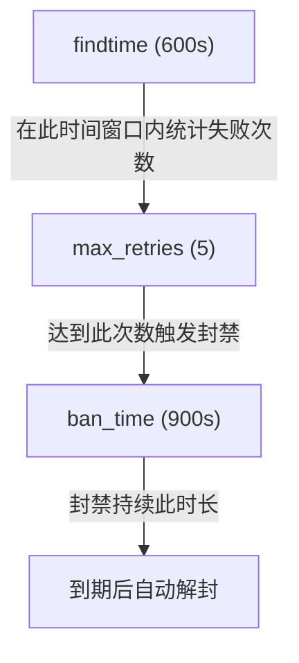
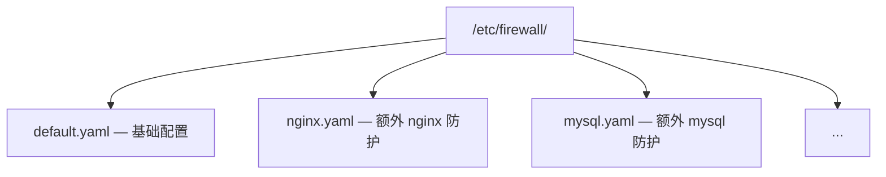

# YAML 配置详解

本文档详细介绍 `/etc/firewall/default.yaml` 配置文件的所有选项。

## 配置结构概览

当前配置采用**智能推断**设计：只需配置 `log_files` 和 `regexes`，其他参数使用合理默认值。

```yaml
# 全局默认值
defaults:
  max_retries: 3
  findtime: 600         # 10 分钟
  ban_time: 900         # 15 分钟
  interval: 1           # 检查间隔（秒）
  metrics_port: 9119    # Prometheus 指标端口

# Jail 定义
jails:
  sshd:
    enabled: true
    log_files:
      - /var/log/auth.log
    max_retries: 3
    findtime: 600
    ban_time: 1800
    regexes:
      failed_password:
        pattern: "Failed password for (?:invalid user )?.+ from ([0-9]{1,3}\\.[0-9]{1,3}\\.[0-9]{1,3}\\.[0-9]{1,3})"
```

## 全局默认值 (defaults)

`defaults` 区块定义所有 jail 的默认行为，单个 jail 可覆盖这些值。

```yaml
defaults:
  max_retries: 3
  findtime: 600         # 10 分钟
  ban_time: 900         # 15 分钟
  interval: 1           # 检查间隔（秒）
  metrics_port: 9119    # Prometheus 指标端口
```

| 参数 | 类型 | 默认值 | 范围 | 说明 |
|------|------|--------|------|------|
| `max_retries` | int | `3` | 1-100 | 最大失败次数，超过则封禁 |
| `findtime` | int | `600` | 1-3600 | 时间窗口（秒），在此时间内累积计数 |
| `ban_time` | int | `900` | 0 或 1-86400 | 封禁时长（秒），0 表示永久 |
| `interval` | int | `1` | 1-60 | 日志文件检查间隔（秒） |
| `metrics_port` | int | `9119` | 1024-65535 | Prometheus 指标暴露端口 |

### 时间参数关系



## Jail 配置

每个 jail 定义一个独立的日志监控和封禁规则。

### Jail 结构

```yaml
jails:
  sshd:                           # jail 名称（键名即名称）
    enabled: true                 # 是否启用
    log_files:                    # 监控的日志文件列表
      - /var/log/auth.log
      - /var/log/secure
    max_retries: 3                # 覆盖 defaults
    findtime: 600                 # 覆盖 defaults
    ban_time: 1800                # 覆盖 defaults
    regexes:                      # 命名正则集合
      failed_password:
        pattern: "..."
      invalid_user:
        pattern: "..."
```

### Jail 参数

| 参数 | 类型 | 必需 | 默认值 | 说明 |
|------|------|------|--------|------|
| `<name>` (键名) | string | 是 | - | Jail 名称，全局唯一 |
| `enabled` | bool | 否 | `true` | 是否启用该 jail |
| `log_files` | list | 是 | - | 要监控的日志文件路径列表 |
| `max_retries` | int | 否 | 继承 `defaults` | 最大失败次数 |
| `findtime` | int | 否 | 继承 `defaults` | 时间窗口（秒） |
| `ban_time` | int | 否 | 继承 `defaults` | 封禁时长（秒） |
| `regexes` | map | 是 | - | 命名正则表达式集合 |

### 正则表达式配置 (regexes)

```yaml
regexes:
  failed_password:                          # 正则模式名称
    pattern: "Failed password for (?:invalid user )?.+ from ([0-9]{1,3}\\.[0-9]{1,3}\\.[0-9]{1,3}\\.[0-9]{1,3})"
  invalid_user:
    pattern: "Invalid user [a-zA-Z0-9_.-]{1,64} from ([0-9]{1,3}\\.[0-9]{1,3}\\.[0-9]{1,3}\\.[0-9]{1,3})"
```

| 参数 | 类型 | 必需 | 说明 |
|------|------|------|------|
| `<name>` (键名) | string | 是 | 正则模式名称，用于日志标识 |
| `pattern` | string | 是 | 正则表达式，使用捕获组 `()` 提取 IP |

### 正则语法

当前版本**不再使用 `<HOST>` 占位符**，直接在 `pattern` 中编写完整正则。

| 特性 | 示例 | 说明 |
|------|------|------|
| 捕获组 | `([0-9]{1,3}\\.[0-9]{1,3}\\.[0-9]{1,3}\\.[0-9]{1,3})` | 提取 IP 地址 |
| 非捕获组 | `(?:pattern)` | 分组但不捕获 |
| 字符类 | `[a-zA-Z0-9_.-]` | 字符范围 |
| 量词 | `*`, `+`, `?`, `{n,m}` | 重复匹配 |
| 锚点 | `^`, `$` | 行首/行尾 |

> **YAML 转义注意**：在 YAML 中反斜杠需双写 `\\.` 而非 `\.`，或使用双引号包裹。

## 白名单配置 (whitelist)

```yaml
whitelist:
  - 127.0.0.1
  - 192.168.1.0/24
  - 10.0.0.1
  - 172.16.0.0/16
```

| 格式 | 示例 | 说明 |
|------|------|------|
| 单个 IP | `192.168.1.100` | 封禁时跳过该 IP |
| CIDR 网段 | `192.168.1.0/24` | 封禁时跳过该网段所有 IP |

> **限制**：白名单最多支持 64 个条目。超出部分将被忽略并记录警告。

### 内置白名单

以下 IP 始终被白名单保护，无需手动配置：

- `127.0.0.1` - 本地回环地址

## 可信 IP 白名单 (trusted_ips)

```yaml
trusted_ips:
  - 43.100.123.123          # FRP 服务器
  - 8.140.211.27            # 另一台服务器
  - 10.0.0.0/8              # 内网网段
```

| 格式 | 示例 | 说明 |
|------|------|------|
| 单个 IP | `43.100.123.123` | 自动添加 `/32` 前缀，写入内核白名单 |
| CIDR 网段 | `10.0.0.0/8` | 直接写入内核白名单 |

**功能说明**：

- **启动时自动写入**：daemon 启动时将 `trusted_ips` 列表写入内核白名单（`/proc/firewall/whitelist`）
- **防止误封**：确保关键基础设施（如 FRP 服务器、跳板机）不会被 DDoS 自动封禁误杀
- **热重载支持**：修改配置后发送 `SIGHUP` 信号，daemon 会自动对比新旧列表，增量添加/移除白名单条目
- **与 `whitelist` 的区别**：`whitelist` 是内核模块的静态白名单（需手动写入），`trusted_ips` 由 daemon 管理，支持配置化和热重载

> **注意**：`trusted_ips` 中的 IP 会标记为 `on manual`，与自动发现的网络接口白名单区分。

## DDoS 防护配置 (ddos)

```yaml
ddos:
  enabled: true
  per_ip_conn_rate: 50        # 单 IP 每秒最大连接数
  per_ip_fail_rate: 30        # 单 IP 每分钟最大失败次数
  global_conn_rate: 10000     # 全局每秒最大连接数
  auto_ban_duration: 3600     # 自动封禁时长（秒）
  auto_ban_threshold: 3       # 超阈值几次后封禁
  check_interval: 5           # 检测间隔（秒）
```

| 参数 | 类型 | 默认值 | 说明 |
|------|------|--------|------|
| `enabled` | bool | `true` | 是否启用 DDoS 检测 |
| `per_ip_conn_rate` | int | `50` | 单 IP 每秒最大新建连接数 |
| `per_ip_fail_rate` | int | `30` | 单 IP 每分钟最大失败连接数 |
| `global_conn_rate` | int | `10000` | 全局每秒最大新建连接数 |
| `auto_ban_duration` | int | `3600` | 触发自动封禁后的封禁时长（秒） |
| `auto_ban_threshold` | int | `3` | 超过阈值几次后触发封禁 |
| `check_interval` | int | `5` | 检测间隔（秒） |

**检测逻辑**：

1. 内核模块实时统计每个 IP 的连接速率
2. 超过 `per_ip_conn_rate` 或 `per_ip_fail_rate` 阈值时，计数器 +1
3. 计数器达到 `auto_ban_threshold` 时，自动封禁该 IP `auto_ban_duration` 秒
4. 全局连接速率超过 `global_conn_rate` 时，触发全局告警

> **建议**：将关键服务器 IP 添加到 `trusted_ips`，防止 DDoS 检测误封。

## Web UI 配置 (webui)

```yaml
webui:
  sse_push_interval: 1        # SSE 推送间隔（秒）
  rate_warning_pps: 1000      # 速率警告阈值（包/秒）
  rate_critical_pps: 10000    # 速率严重告警阈值（包/秒）
  rate_warning_syn: 100       # SYN 速率警告阈值（包/秒）
  rate_critical_syn: 1000     # SYN 速率严重告警阈值（包/秒）
```

| 参数 | 类型 | 默认值 | 说明 |
|------|------|--------|------|
| `sse_push_interval` | int | `1` | Server-Sent Events 推送间隔（秒） |
| `rate_warning_pps` | int | `1000` | 总速率警告阈值（包/秒） |
| `rate_critical_pps` | int | `10000` | 总速率严重告警阈值（包/秒） |
| `rate_warning_syn` | int | `100` | SYN 包速率警告阈值（包/秒） |
| `rate_critical_syn` | int | `1000` | SYN 包速率严重告警阈值（包/秒） |

**功能说明**：

- **SSE 推送**：Web UI 通过 Server-Sent Events 实时接收状态更新
- **速率告警**：当包速率超过阈值时，Web UI 显示警告/严重告警状态
- **SYN 告警**：专门针对 SYN Flood 攻击的告警阈值

## 陷阱 (Pitfalls)

YAML 配置在结构上容易写错，遇到"配置没生效"先看这一节。

### 字段必须放在 `defaults:` 下

所有 `defaults.*` 字段（包括 `log_level` / `metrics_port` 等）**必须**写在 `defaults:` 块内，**不允许**在顶层出现同名键。解析器只读取 `defaults:` 下的字段，顶层同名字段会被静默忽略，没有任何警告或错误。

**错误示例**（顶层字段）：

```yaml
defaults:
  max_retries: 3
  # ... 其他字段

jails:
  sshd: ...

# 顶层字段 —— 解析器会静默忽略
log_level: 2
```

启动后配置不会生效，但日志不会有任何报错。

**正确示例**：

```yaml
defaults:
  max_retries: 3
  # ... 其他字段
  log_level: 2

jails:
  sshd: ...
```

## 日志速率

`log_info!` / `log_warn!` / `log_error!` / `log_debug!` 宏已经**不再提供**带速率限制的变体（例如旧的 `log_warn_ratelimited!` / 全局 `RATELIMIT_STATE` 互斥锁 + 60 秒节流已被移除）。每次调用都会**直接发出**，不做合并或去重。如需降噪，请在配置中调整 `log_level`（`info` / `warn` / `error` / `debug`）。

## 完整配置示例

```yaml
# /etc/firewall/default.yaml

# ============================================================
# 全局默认值 - 应用于所有 jail，除非被覆盖
# ============================================================
defaults:
  max_retries: 3
  findtime: 600         # 10 分钟
  ban_time: 900         # 15 分钟
  interval: 1           # 检查间隔（秒）
  metrics_port: 9119    # Prometheus 指标端口

# ============================================================
# Jail 定义 - 每个服务独立监控
# ============================================================
jails:
  # SSH 服务防护
  sshd:
    enabled: true
    log_files:
      - /var/log/auth.log       # Debian/Ubuntu
      - /var/log/secure         # RHEL/CentOS
    max_retries: 3
    findtime: 600               # 10 分钟
    ban_time: 1800              # 30 分钟
    regexes:
      invalid_user:
        pattern: "Invalid user [a-zA-Z0-9_.-]{1,64} from ([0-9]{1,3}\\.[0-9]{1,3}\\.[0-9]{1,3}\\.[0-9]{1,3})"
      failed_password:
        pattern: "Failed password for (?:invalid user )?[a-zA-Z0-9_.-]{1,64} from ([0-9]{1,3}\\.[0-9]{1,3}\\.[0-9]{1,3}\\.[0-9]{1,3})"
      connection_closed:
        pattern: "Connection closed by invalid user [a-zA-Z0-9_.-]{1,64} from ([0-9]{1,3}\\.[0-9]{1,3}\\.[0-9]{1,3}\\.[0-9]{1,3})"

  # Nginx 认证防护
  nginx-auth:
    enabled: true
    log_files:
      - /var/log/nginx/error.log
    max_retries: 10
    findtime: 300               # 5 分钟
    ban_time: 1800              # 30 分钟
    regexes:
      no_auth:
        pattern: "no user/password was provided for basic authentication.*client: ([0-9]{1,3}\\.[0-9]{1,3}\\.[0-9]{1,3}\\.[0-9]{1,3})"
```

## 多配置文件加载

守护进程支持 `-C <dir>` 参数加载目录下所有 YAML：

```bash
sudo firewall-daemon -C /etc/firewall
```

加载顺序：

1. 按文件名**字母序**加载
2. 后加载的配置**累加** jail（不会覆盖）
3. 同名 jail 采用**后到优先**策略

示例目录结构：


