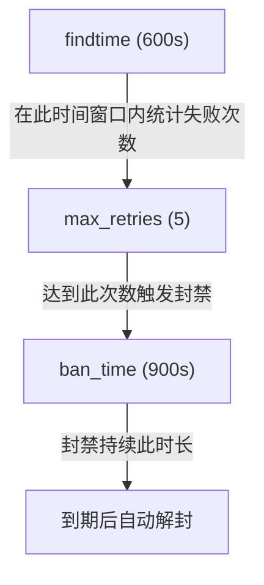
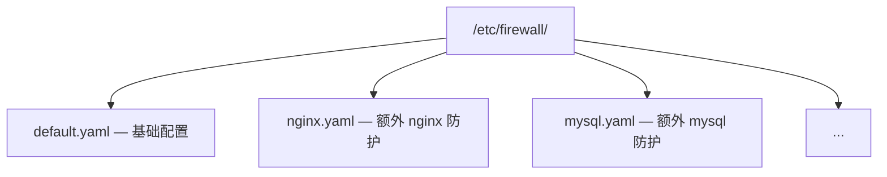

# YAML 配置详解

本文档详细介绍 `/etc/firewall/default.yaml` 配置文件的所有选项。

## 配置结构概览

当前配置采用**智能推断**设计：只需配置 `log_files` 和 `regexes`，其他参数使用合理默认值。

```yaml
# 全局默认值
defaults:
  max_retries: 5
  findtime: 600         # 10 分钟
  ban_time: 900         # 15 分钟
  interval: 1           # 检查间隔（秒）
  metrics_port: 9119    # Prometheus 指标端口
  # 永久黑名单字段必须放在 defaults 下，不要写在顶层
  permanent_db_path: "/var/lib/firewall/bans.db"
  permanent_ban_enabled: true   # 默认 false

# Jail 定义
jails:
  sshd:
    enabled: true
    log_files:
      - /var/log/auth.log
    max_retries: 3
    findtime: 600
    ban_time: 1800
    regexes:
      failed_password:
        pattern: "Failed password for (?:invalid user )?.+ from ([0-9]{1,3}\\.[0-9]{1,3}\\.[0-9]{1,3}\\.[0-9]{1,3})"
```

## 全局默认值 (defaults)

`defaults` 区块定义所有 jail 的默认行为，单个 jail 可覆盖这些值。

```yaml
defaults:
  max_retries: 5
  findtime: 600         # 10 分钟
  ban_time: 900         # 15 分钟
  interval: 1           # 检查间隔（秒）
  metrics_port: 9119    # Prometheus 指标端口
```

| 参数 | 类型 | 默认值 | 范围 | 说明 |
|------|------|--------|------|------|
| `max_retries` | int | `5` | 1-100 | 最大失败次数，超过则封禁 |
| `findtime` | int | `600` | 1-3600 | 时间窗口（秒），在此时间内累积计数 |
| `ban_time` | int | `900` | 0 或 1-86400 | 封禁时长（秒），0 表示永久 |
| `interval` | int | `1` | 1-60 | 日志文件检查间隔（秒） |
| `metrics_port` | int | `9119` | 1024-65535 | Prometheus 指标暴露端口 |

### 时间参数关系



## Jail 配置

每个 jail 定义一个独立的日志监控和封禁规则。

### Jail 结构

```yaml
jails:
  sshd:                           # jail 名称（键名即名称）
    enabled: true                 # 是否启用
    log_files:                    # 监控的日志文件列表
      - /var/log/auth.log
      - /var/log/secure
    max_retries: 3                # 覆盖 defaults
    findtime: 600                 # 覆盖 defaults
    ban_time: 1800                # 覆盖 defaults
    regexes:                      # 命名正则集合
      failed_password:
        pattern: "..."
      invalid_user:
        pattern: "..."
```

### Jail 参数

| 参数 | 类型 | 必需 | 默认值 | 说明 |
|------|------|------|--------|------|
| `<name>` (键名) | string | 是 | - | Jail 名称，全局唯一 |
| `enabled` | bool | 否 | `true` | 是否启用该 jail |
| `log_files` | list | 是 | - | 要监控的日志文件路径列表 |
| `max_retries` | int | 否 | 继承 `defaults` | 最大失败次数 |
| `findtime` | int | 否 | 继承 `defaults` | 时间窗口（秒） |
| `ban_time` | int | 否 | 继承 `defaults` | 封禁时长（秒） |
| `regexes` | map | 是 | - | 命名正则表达式集合 |

### 正则表达式配置 (regexes)

```yaml
regexes:
  failed_password:                          # 正则模式名称
    pattern: "Failed password for (?:invalid user )?.+ from ([0-9]{1,3}\\.[0-9]{1,3}\\.[0-9]{1,3}\\.[0-9]{1,3})"
  invalid_user:
    pattern: "Invalid user [a-zA-Z0-9_.-]{1,64} from ([0-9]{1,3}\\.[0-9]{1,3}\\.[0-9]{1,3}\\.[0-9]{1,3})"
```

| 参数 | 类型 | 必需 | 说明 |
|------|------|------|------|
| `<name>` (键名) | string | 是 | 正则模式名称，用于日志标识 |
| `pattern` | string | 是 | 正则表达式，使用捕获组 `()` 提取 IP |

### 正则语法

当前版本**不再使用 `<HOST>` 占位符**，直接在 `pattern` 中编写完整正则。

| 特性 | 示例 | 说明 |
|------|------|------|
| 捕获组 | `([0-9]{1,3}\\.[0-9]{1,3}\\.[0-9]{1,3}\\.[0-9]{1,3})` | 提取 IP 地址 |
| 非捕获组 | `(?:pattern)` | 分组但不捕获 |
| 字符类 | `[a-zA-Z0-9_.-]` | 字符范围 |
| 量词 | `*`, `+`, `?`, `{n,m}` | 重复匹配 |
| 锚点 | `^`, `$` | 行首/行尾 |

> **YAML 转义注意**：在 YAML 中反斜杠需双写 `\\.` 而非 `\.`，或使用双引号包裹。

## 白名单配置 (whitelist)

```yaml
whitelist:
  - 127.0.0.1
  - 192.168.1.0/24
  - 10.0.0.1
  - 172.16.0.0/16
```

| 格式 | 示例 | 说明 |
|------|------|------|
| 单个 IP | `192.168.1.100` | 封禁时跳过该 IP |
| CIDR 网段 | `192.168.1.0/24` | 封禁时跳过该网段所有 IP |

> **限制**：白名单最多支持 64 个条目。超出部分将被忽略并记录警告。

### 内置白名单

以下 IP 始终被白名单保护，无需手动配置：

- `127.0.0.1` - 本地回环地址

## 永久黑名单

`ban_time: 0` 的封禁（永久封禁）会被写入 SQLite 数据库，重启后自动恢复，进程崩溃也不丢失。

```yaml
defaults:
  # ... 其他字段
  permanent_db_path: "/var/lib/firewall/bans.db"
  permanent_ban_enabled: true   # 默认 false
```

| 参数 | 类型 | 默认值 | 说明 |
|------|------|--------|------|
| `permanent_db_path` | string | `/var/lib/firewall/bans.db` | SQLite 数据库路径 |
| `permanent_ban_enabled` | bool | `false` | 是否启用永久封禁持久化；设为 `true` 时 SQLite 才会被初始化和写入 |

> **关键**：`permanent_db_path` 和 `permanent_ban_enabled` **必须**放在 `defaults:` 块下，**不要**写在顶层（`jails:` 同级或之后）。这是 v2.2.1 修复的一个真实 bug —— 写在顶层时解析器会**静默忽略**，SQLite 永远不会初始化。详见下一节「陷阱」。

## 陷阱 (Pitfalls)

YAML 配置在结构上容易写错，遇到"配置没生效"先看这一节。

### 字段必须放在 `defaults:` 下

所有 `defaults.*` 字段（包括 `permanent_db_path` / `permanent_ban_enabled` / `log_level` 等）**必须**写在 `defaults:` 块内，**不允许**在顶层出现同名键。解析器只读取 `defaults:` 下的字段，顶层同名字段会被静默忽略，没有任何警告或错误。

**错误示例**（顶层 `permanent_*` —— v2.2.1 修复的真实 bug）：

```yaml
defaults:
  max_retries: 5
  # ... 没有 permanent_* 字段

jails:
  sshd: ...

# 顶层字段 —— 解析器会静默忽略
permanent_db_path: "/var/lib/firewall/bans.db"
permanent_ban_enabled: true
```

启动后 `/var/lib/firewall/bans.db` 不会被创建，永久封禁也"看起来没生效"，但日志不会有任何报错。

**正确示例**：

```yaml
defaults:
  max_retries: 5
  # ... 其他字段
  permanent_db_path: "/var/lib/firewall/bans.db"
  permanent_ban_enabled: true   # 默认 false

jails:
  sshd: ...
```

### 排查清单

如果启用了永久黑名单但没看到 SQLite 数据库被创建：

1. 用 `grep -n "permanent_" /etc/firewall/default.yaml` 确认字段在文件中
2. 检查缩进 —— 字段必须**与** `max_retries` / `findtime` 等**同级**，都在 `defaults:` 下
3. 用 `firewall-daemon -t` 跑一次 dry-run，看是否有 "DB initialized at ..." 日志
4. 看启动日志确认是否出现 "permanent ban persistence enabled" 字样

## 日志速率

`log_info!` / `log_warn!` / `log_error!` / `log_debug!` 宏已经**不再提供**带速率限制的变体（例如旧的 `log_warn_ratelimited!` / 全局 `RATELIMIT_STATE` 互斥锁 + 60 秒节流已被移除）。每次调用都会**直接发出**，不做合并或去重。如需降噪，请在配置中调整 `log_level`（`info` / `warn` / `error` / `debug`）。

## 完整配置示例

```yaml
# /etc/firewall/default.yaml

# ============================================================
# 全局默认值 - 应用于所有 jail，除非被覆盖
# ============================================================
defaults:
  max_retries: 5
  findtime: 600         # 10 分钟
  ban_time: 900         # 15 分钟
  interval: 1           # 检查间隔（秒）
  metrics_port: 9119    # Prometheus 指标端口
  # 永久封禁（SQLite 持久化）—— 必须放在 defaults 下
  permanent_db_path: "/var/lib/firewall/bans.db"
  permanent_ban_enabled: true   # 默认 false

# ============================================================
# Jail 定义 - 每个服务独立监控
# ============================================================
jails:
  # SSH 服务防护
  sshd:
    enabled: true
    log_files:
      - /var/log/auth.log       # Debian/Ubuntu
      - /var/log/secure         # RHEL/CentOS
    max_retries: 3
    findtime: 600               # 10 分钟
    ban_time: 1800              # 30 分钟
    regexes:
      invalid_user:
        pattern: "Invalid user [a-zA-Z0-9_.-]{1,64} from ([0-9]{1,3}\\.[0-9]{1,3}\\.[0-9]{1,3}\\.[0-9]{1,3})"
      failed_password:
        pattern: "Failed password for (?:invalid user )?[a-zA-Z0-9_.-]{1,64} from ([0-9]{1,3}\\.[0-9]{1,3}\\.[0-9]{1,3}\\.[0-9]{1,3})"
      connection_closed:
        pattern: "Connection closed by invalid user [a-zA-Z0-9_.-]{1,64} from ([0-9]{1,3}\\.[0-9]{1,3}\\.[0-9]{1,3}\\.[0-9]{1,3})"

  # Nginx 认证防护
  nginx-auth:
    enabled: true
    log_files:
      - /var/log/nginx/error.log
    max_retries: 10
    findtime: 300               # 5 分钟
    ban_time: 1800              # 30 分钟
    regexes:
      no_auth:
        pattern: "no user/password was provided for basic authentication.*client: ([0-9]{1,3}\\.[0-9]{1,3}\\.[0-9]{1,3}\\.[0-9]{1,3})"
```

## 多配置文件加载

守护进程支持 `-C <dir>` 参数加载目录下所有 YAML：

```bash
sudo firewall-daemon -C /etc/firewall
```

加载顺序：

1. 按文件名**字母序**加载
2. 后加载的配置**累加** jail（不会覆盖）
3. 同名 jail 采用**后到优先**策略

示例目录结构：


