# 开发指南

本章节介绍如何开发、构建和测试 Linux Firewall 内核模块。

## 开发环境

### 推荐配置

| 项目 | 要求 |
|------|------|
| OS | Ubuntu 22.04+ / Debian 12+ |
| GCC | 12+ |
| Make | 4.0+ |
| Git | 2.30+ |

### 安装开发依赖

```bash
# Ubuntu/Debian
sudo apt install -y \
    build-essential \
    linux-headers-$(uname -r) \
    libyaml-dev \
    libsqlite3-dev \
    libmicrohttpd-dev \
    libpcre2-dev \
    pkg-config \
    valgrind \
    clang \
    cmake
```

## 项目结构

```mermaid
graph TD
    ROOT["linux-firewall-kmod/"]
    MAKEFILE["Makefile 主 Makefile（all / kernel-module / daemon / test）"]

    subgraph SRC["src/"]
        subgraph KERNEL["kernel-module/ 内核模块源码"]
            K_MAIN["firewall-main.c 模块入口 / netfilter hook 注册"]
            K_BAN["ban-manager.c 哈希表封禁管理"]
            K_WL["whitelist.c 白名单（精确 + CIDR 两阶段匹配）"]
            K_NF["netfilter.c 包处理与封禁判定"]
            K_ND["netdev.c 网络设备辅助"]
            K_PF["procfs.c /proc/firewall/* 接口"]
            K_SP["state-persist.c 内核态状态保存/恢复"]
            K_CL["cleanup.c 模块退出清理"]
            K_H["firewall.h 公共头文件"]
        end
        subgraph DAEMON["daemon/ 用户态守护进程"]
            D_MAIN["firewall-daemon.c 守护进程入口"]
            D_CFG["config-parser.c YAML 配置解析（严格模式）"]
            D_MON["file-monitor.c inotify 日志监听"]
            D_TRK["failed-tracker.c Jail 失败计数"]
            D_BAN["ban-manager.c 封禁/解封调度"]
            D_MET["metrics.c Prometheus exporter"]
            D_H["*.h 对应头文件"]
        end
    end

    subgraph TESTS["tests/ 测试"]
        T_RUN["run_tests.sh"]
        T_FW["test_framework.sh"]
        T_CFG["test_config.sh"]
        T_SUITES["suites/ 测试套件"]
        T_RPT["reports/ 生成的报告"]
    end

    DOCS["docs/ HonKit 文档"]
    CONFIG["config/ 示例 YAML 配置"]
    SCRIPTS["scripts/ 辅助脚本（构建、验证、deb 打包）"]
    DEBIAN["debian/ Debian 打包元数据"]

    ROOT --> MAKEFILE
    ROOT --> SRC
    SRC --> KERNEL
    KERNEL --> K_MAIN
    KERNEL --> K_BAN
    KERNEL --> K_WL
    KERNEL --> K_NF
    KERNEL --> K_ND
    KERNEL --> K_PF
    KERNEL --> K_SP
    KERNEL --> K_CL
    KERNEL --> K_H
    SRC --> DAEMON
    DAEMON --> D_MAIN
    DAEMON --> D_CFG
    DAEMON --> D_MON
    DAEMON --> D_TRK
    DAEMON --> D_BAN
    DAEMON --> D_MET
    DAEMON --> D_H
    ROOT --> TESTS
    TESTS --> T_RUN
    TESTS --> T_FW
    TESTS --> T_CFG
    TESTS --> T_SUITES
    TESTS --> T_RPT
    ROOT --> DOCS
    ROOT --> CONFIG
    ROOT --> SCRIPTS
    ROOT --> DEBIAN
```



## 代码规范

### C 语言规范

- 使用 C99 标准
- 4 空格缩进
- 函数名使用 `snake_case`
- 常量使用 `UPPER_CASE`
- 结构体使用 `snake_case` 并以 `_t` 结尾

### 内核模块规范

- 遵循 Linux 内核编码风格
- 使用 `pr_*` 宏进行日志输出
- 使用 `__init` 和 `__exit` 标记初始化和退出函数
- 避免在原子上下文中睡眠

### 提交规范

```
<type>(<scope>): <description>

[optional body]

[optional footer]
```

| Type | 说明 |
|------|------|
| `feat` | 新功能 |
| `fix` | Bug 修复 |
| `docs` | 文档更新 |
| `style` | 代码格式 |
| `refactor` | 重构 |
| `perf` | 性能优化 |
| `test` | 测试相关 |
| `chore` | 构建/工具链 |

## 贡献流程

1. Fork 仓库
2. 创建特性分支 (`git checkout -b feat/amazing-feature`)
3. 提交更改 (`git commit -m 'feat: add amazing feature'`)
4. 运行测试 (`make test`)
5. 推送分支 (`git push origin feat/amazing-feature`)
6. 创建 Pull Request