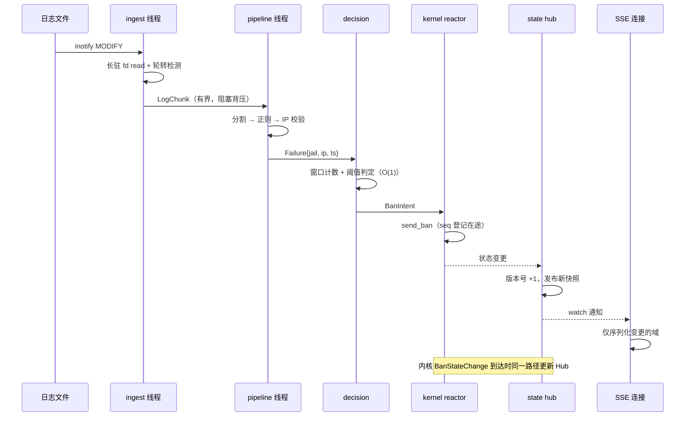

# 守护进程重写设计（Phase 2）

本文档是 `src/daemon/` 按新设计重写的唯一设计来源。三端重写的目标与分端口径见
[内核重写设计 § 范围与验收](kernel-rewrite-design.md#范围与验收)；内核侧热路径的实测数字见
[性能基线](perf-baseline.md)，本文档只引用不重复。

## 决策记录

| 项 | 结论 | 依据 |
|----|------|------|
| 实现语言 | **Rust**，按新设计重写 | 不变更工具链；netlink/procfs/HTTP 的既有生态成熟；本轮的改动对象是**结构**而非语言 |
| 旧代码复用 | **不复用** | 新代码不复用旧文件划分、旧数据结构与旧循环形态。旧实现只作为**行为证据与缺陷证据**的来源 |
| 并发模型 | **专用 OS 线程承载主链路 + tokio 只做网络边界** | 主链路是「阻塞 IO + CPU 正则」的形态，放进 async reactor 会让解析阻塞网络；反之把 HTTP 放进裸线程则要自造 SSE。按形态分工，各用其长 |
| 状态所有权 | **单所有者 + 消息传递**（取消全局服务定位器） | 现状 46 个全局 `OnceLock` 类静态 + 文档化的 6 步锁顺序协议，仓库自己已把它标注为「可观测性/可测性债务」（`runtime_status.rs`、`lib.rs`） |
| 契约地位 | 三份 `contract/*.fwidl` 是接口真相源 | 重写不得偏离生成物；需要改接口时**先改契约再改代码**。`netlink.fwidl` 本轮允许修订（见[契约修订清单](#契约修订清单)） |
| 本轮功能范围 | **只做主链路**，其余分批迁入 | 用户裁定：「先重写主链路，其余分批迁入」。主链路 = 日志解析 → 封禁决策 → netlink 事件 → SSE 直达前端 |
| 威胁模型 | **入站单向防守（外来）** | 用户裁定。不引入出站钩子、外发检测、外联行为分析 |

**为什么不是「全面 tokio 异步」**：主链路每读一批日志要做 open/metadata/seek/read + 正则匹配 +
滑动窗口计数，全是阻塞与 CPU 操作。放进 tokio 要么用 `spawn_blocking`（等于回到线程池，却多一层
调度与取消语义），要么让 reactor 被正则阻塞。而 HTTP/SSE 天然是 async 的：几千条空闲长连接用线程
承载是浪费。按形态分工而不是按技术一致性分工。

## 范围与验收

**改动范围**：`src/daemon/` 全部实现，以及它与外界的四条接口面（netlink、procfs、HTTP/SSE、YAML 配置）。

**本轮功能边界**（主链路）：

| 归属 | 内容 |
|------|------|
| **本轮实现** | 日志采集与轮转、行分割与正则解析、IP 提取与校验、失败计数与阈值判定、渐进式封禁、netlink 收发与请求-响应关联、活跃封禁状态、SSE 推送、HTTP 信封与认证、配置解析与热重载、优雅启停 |
| **后续批次迁入** | IP 信誉分、攻击预测、协同攻击检测、周期性攻击者识别、封禁时长/阈值推荐、SQLite 历史库与快照、Prometheus exporter、Web UI 分析类端点（热力图、包长分布、TTL 分布、UDP 端口/ICMP 类型分布、网络分布、回收率） |

后续批次的模块在本轮**不重写、不删除**，按原样编译保留；主链路接口按「后续批次可挂载」设计
（见[新模块划分](#新模块划分按数据所有权)中 `analysis/` 的占位说明）。这样分批迁入不需要二次改主链路。

**验收标准**：

1. **全量门禁**通过（见仓库根 `Makefile` / `.github/workflows/ci.yml` 定义的门禁目标）：
   `make format-check`、`cargo fmt --check`、`cargo clippy --release --lib -- -D warnings`、
   `cargo test --release --lib`、`make frontend-typecheck`。
2. **契约校验**：`bash scripts/check_contract.sh` 全绿；`http` / `netlink` / `procfs` 三份契约中
   每条 defect 要么被修复并同步改写契约，要么显式改判为「有意保留」。
3. **集成验收**：`tests/` 全部 pytest 用例通过，且[测试债务](#测试债务)中的空断言必须被替换为
   可失败的断言（不得再出现恒真判定）。
4. **主链路实时性**：用 `scripts/bench/` 的端到端探针测量「日志行写入 → SSE 收到对应事件」的
   延迟分布，给出 p50/p95/p99，并证明**该延迟不随事件吞吐上升而劣化**（周期维护不再与事件
   流量抢同一循环）。
5. **稳定性**：无界增长与无上限插入被消除；不再存在「静默丢弃」的写入路径；关闭顺序可证明
   无在途写落在已关闭的资源上。

判定以**内核与 daemon 的稳定性 + 性能**为主标准（用户口径）。

三项目标各自的落点：

- **实时性** —— 主链路端到端延迟分布与「事件吞吐 → 维护任务准时率」的不变量；
  消灭「解析阻塞事件」「周期任务被事件饿死」「读路径做写操作」三类结构问题。
- **稳定性** —— 消除静默丢弃（历史库写、netlink 未注册指令、整条响应丢弃）、
  消除无界增长（失败条目、轮转后偏移错位）、消除「发送成功 ≠ 执行成功」的隐式假设。
- **规范性** —— 接口以契约为准、三端一致；模块划分按数据所有权切分；
  消灭全局服务定位器；文档与实现不再互相矛盾（含 `docs/zh/architecture/daemon.md` 的重写）。

## 现状清点

### 主链路四段（重写前）

```
inotify 事件
  └─ process_new_lines(idx)            读文件新增字节（256 KB 批次）
      └─ process_lines_in_buffer       按 \n 分割
          └─ process_single_line       长度校验 → 正则/IP 提取
              └─ extract_and_validate_ip
                  └─ handle_failed_attempt_for_jail   滑动窗口 + 阈值
                      └─ ban_ip → send_ban            netlink 下发
                          └─ 内核封禁
                              └─ BanStateChange 事件回推
                                  └─ ACTIVE_BAN_CACHE 更新 + wake_sse_clients()
                                      └─ SSE tick 重新序列化 5 份完整载荷
```

四段的**全部环节都在同一条主线程上同步执行**（netlink 事件回推在接收线程，SSE 在 tokio）：

| 段 | 现实现位置 | 形态 |
|----|-----------|------|
| 日志解析 | `file_monitor/{processor,monitor_loop}.rs` + `line_processor.rs` + `log_parser/` | 与事件分发、周期维护同在一条 `poll` 循环 |
| 封禁决策 | `failed_tracker/tracking.rs` | 被解析路径直接同步调用，无队列 |
| netlink | `netlink/{mod,handlers,commands,responses,protocol}.rs` | 独立接收线程；发送走 `&NetlinkContext` 直调 |
| SSE | `web_ui/sse.rs` | tokio 任务；按间隔重序列化整份快照 |

### 已定位的结构问题（附证据）

**A. 事件流量会饿死周期维护。** 全部周期任务集中在 `handle_timeout`，而它只在
`poll()` 返回 0（超时）时执行（`monitor_loop.rs:110-171` 的三分支）。持续有 inotify 事件时
`poll` 恒返回 >0，60 s / 300 s / 2 s 三类任务全部延后。其中 2 s 的速率查询与基线下发
（`monitor_loop.rs:390-406`、`send_baseline_update`）承担「动态阈值收敛」，被饿死会直接影响
封禁判定质量。

**B. 每次事件重复做完整打开序列。** `process_new_lines` 每次调用都执行
open(`O_NOFOLLOW`) + `metadata()` + `seek()` + `vec![0u8; 256*1024]`
（`processor.rs:37`、`:73-120`、`:123`）。没有长驻 fd、没有复用缓冲。
单次 256 KB 分配在攻击流量下按事件频次重复发生。

**C. 文件身份用 `Vec` 下标表示。** `FILE_STATES` 是 `Vec<FileState>`，`process_new_lines(idx)` 的
`idx` 就是下标（`state.rs` 注释：`FILE_STATES` 索引 = `FileState.wd`）；而 jail 启用状态变化会
触发 `setup_inotify(cfg)` 重建**整个** `Vec`（`monitor_loop.rs:80-107`）。
重建后下标与实际 watch 的对应关系依赖重建顺序，是隐式契约。

**D. 46 个全局可变静态构成服务定位器。** `OnceLock|LazyLock|lazy_static` 命中
分布在 15 个文件；`lib.rs` 为此专门文档化了 6 步锁获取顺序并规定「禁止在持锁时执行 IO」；
`runtime_status.rs` 自述其存在是为了缓解「全局 OnceLock 服务定位器的可观测性/可测性债务」。
锁顺序协议靠约定维持，编译期无任何保障。

**E. 读路径里做写操作并改统计。** `get_active_bans()`（`ban_ops.rs:126`）在**读**路径里
做限流 `purge_expired`（`PURGE_INTERVAL_SECS = 5`），并且该 purge 会递增
`DAEMON_STATS.total_unbans` 并喂 `record_ban_duration`。读接口的副作用包含统计变更。

**F. SSE 每轮重序列化 5 份完整载荷。** `web_ui/sse.rs` 每个 tick 重新取
`stats` / `bans` / `jails` / `whitelist` / `rates` 并各自 `serde_json::to_string`，
与数据是否变化无关。封禁较多时 `bans` 载荷是主要成本，且每条连接重复做这件事。

**G. 持久化队列满时静默丢弃。** `enqueue_db_write` 用 `try_send`，队列满时记一条 warn 后
**丢弃该次写入**（`history_snapshot/mod.rs`：「历史库写队列繁忙，丢弃一次持久化」）。

**H. 两个空转周期任务。** `write_stats_snapshot(_cfg)` 只有一条 `debug!`
（`periodic_tasks.rs:18-27`）；`check_and_handle_ddos(_cfg)` 为 `// intentionally empty`
（`periodic_tasks.rs:155-159`）。两者仍占据 60 s / `check_interval` 两个超时档位。

**I. netlink 缺少请求-响应关联层。** 接收侧只看 `msg_type` 分派，`seq` 解析后丢弃
（`netlink/mod.rs`）；发送侧 `nlmsghdr.nlmsg_seq` 恒为 0；唯一的分页关联靠一个全局单槽
`PendingListBans`，两次并发 LIST（启动一次性 + 60 s 对账）会互相重置。

**J. 分页只做了三分之一，且失败方向是静默。**

| 响应 | 现状 | 后果 |
|------|------|------|
| `ListBansResponse` | 有分页（`offset`/`total`/续页） | 正常 |
| `ListWhitelistResponse` | 契约无 `offset`/`total`；daemon 解析上限写死 64 | 内核单页默认 256，超 64 条时**整条响应被丢弃**，`WHITELIST_CACHE` 不更新 |
| `ListRatesResponse` | 契约有 `total` 但 daemon 从不读；请求无 `offset`/`limit` | 速率表容量 4096，单页 256；>256 条时**静默截断且无感知** |

**K. 注册状态对 daemon 不可见。** `DAEMON_REGISTER` 只在启动时发一次；`DAEMON_REGISTER_ACK`
在 daemon 侧**无结构体、无解析分支**（落到「未知消息类型」分支）。内核拒绝指令时不回错误
（只 `pr_warn`），而 daemon 把 `sendto` 成功当作成功 —— 模块重载或注册被抢占后，daemon 会
持续「发送成功但无人执行」，除 BanIp 的 3 s ack 超时外无任何检测手段。

**L. 基线更新绕过配置下发的唯一入口。** `netlink/config_sync.rs` 自述「把『配置 → 内核』收敛为
唯一实现」，但 `send_baseline_update`（`monitor_loop.rs:456-462`）自建 `ConfigUpdate` 直接调用
`ctx.send_config_update`。

**M. 白名单 CIDR 键在两条写入路径上规则不同。** LIST 路径恒定
`format!("{}/{}", ip, prefix_len)`；事件路径在 `/32`、`/128`、`/0` 时不加前缀。
同一条目会生成两个 key，事件移除与 LIST 覆盖互不抵消。

### 全局可变状态清单（重写需消灭的耦合）

| 类别 | 代表 | 现状问题 |
|------|------|---------|
| 运行时开关 | `GLOBAL_RUNNING` / `GLOBAL_RELOAD` / `GLOBAL_ROLLBACK`（`signals.rs`） | 原子布尔 + `EINTR` 驱动循环退出；无 `SA_RESTART` 是有意设计 |
| 文件监控 | `FILE_STATES`、`INOTIFY_STATE`（`static`，非 `OnceLock`） | 下标即身份；`raw_fd` 与 `fd` 双份状态 |
| 封禁状态 | `ACTIVE_BAN_CACHE`、`BAN_HISTORY`、`PENDING_BAN_ACK`、`BAN_ACK_WAITERS` | ack 用 IP 字符串作 key |
| 统计/缓存 | `DAEMON_STATS`、`JAIL_STATS`、`RATE_CACHE`、`WHITELIST_CACHE`、`RATE_HISTORY`、`ANALYSIS_CACHE` | 读侧与写侧共享可变全局 |
| 配置 | `CONFIG_HISTORY`、`GLOBAL_TRUSTED_IPS`、`GLOBAL_CAPACITY`、`GLOBAL_JAILS_ENABLED`、`CONFIG_TARGET_PATH` | 配置快照/回滚的全局载体 |
| 服务定位 | `GLOBAL_NETLINK_CTX`、`GLOBAL_JAILS`、`get_global_*()` 家族 | `Arc` 存进永不 drop 的 `OnceLock`，`Drop` 事实上是死代码 |

### 线程与生命周期清单

现状共 **4 处**非主线程 spawn：

| 线程 | 位置 | 形态 |
|------|------|------|
| netlink 接收 | `netlink/mod.rs:119` | `thread::spawn` + `poll(100ms)` |
| netlink 统计轮询 | `main.rs:331` | 1 s `send_stats_query` + `send_analysis_query`；每 60 tick 一次全量 `send_list_bans_query` 对账 |
| 历史库写入 | `history_snapshot/mod.rs:265` | `history-db-writer` + `sync_channel` |
| HTTP | `http_exporter/lifecycle.rs:35` | tokio runtime |

主循环不 spawn（`monitor_loop` 在 main 线程）。清理顺序有一条硬不变量：
**必须在 netlink 接收线程停止并 join 之后再关历史库**，否则关闭窗口内的事件会写进已关闭的队列。

## 冻结面：必须逐字保持的对外行为

以下内容由契约与 `tests/` 承载。它们是**对外承诺**，不是「旧代码」。

### netlink（`contract/netlink.fwidl`）

- 协议号 `NETLINK_USERSOCK`；魔数 `0x46574C4E`；消息头 **12 字节**；全部结构 `packed`；
  全部多字节整数**大端**；地址为裸字节。
- **23 个消息类型**；各响应/事件定长约束与变长响应的分页上限（`ListBans` 696、
  `ListWhitelist` 1927、`ListRates` 779 条/页）不可改。
- 单守护进程互斥注册；活动超时 30 s；**未注册实例下发的指令必须被拒绝**。
- `ConfigFlags` 13 位、`DynThresholdFlags` 1 位的位序不可改。

本轮**允许**修订的部分见[契约修订清单](#契约修订清单)（分页参数、`seq` 关联、`RegisterAck` 解析）。
修订走「先改契约 → 再改代码 → `check_contract.sh` 校验」。

### procfs（`contract/procfs.fwidl`）

daemon 只读，不定义 procfs 格式；保持与内核侧的 12 个条目一致。daemon 对
`/proc/firewall`、`/proc/firewall/bans` 的存在性检查在启动期执行，这一行为保留。

### HTTP / SSE（`contract/http.fwidl`）

- **信封**：`{code, data, message}`，成功 `code=0` / `message=""`，失败 `data=null`；
  不得使用 `skip_serializing_if`。
- **两条 SSE 流的上限互相独立**：`/api/v1/events` = 10，`/api/v1/logs/stream` = 5。
- `/api/v1/events` 事件集固定为 `connected, stats, bans, jails, whitelist, rates`；
  keepalive 15 s。
- 认证：`/metrics`、`/api/v1/*` 需 Basic Auth；SPA 静态路由与 `/health`、`/healthz` 不需。

### YAML 配置

配置字段名与语义是用户可见接口。`http.fwidl` 中的 `WebuiConfig` / `WebuiConfigUpdate` 已反映
上限字段（`max_ban_entries`、`max_whitelist_entries`、`max_rate_entries`、`max_local_ip_cache`），
与内核侧新增模块参数对齐。

### 判定语义

白名单命中 ⇒ 永不封禁；`max_retries` 的有效阈值 = `max_retries × 高峰期(1.5) × 内网(2.0) × 信誉`；
渐进式时长 `0→base, 1→1800, 2→86400, ≥3→永久`；`ban_time < 0` ⇒ 永久。

## 新架构

### 运行时模型

**五类执行体，按数据形态分工：**

| 执行体 | 承载 | 阻塞性质 |
|--------|------|---------|
| `ingest` 线程 | inotify fd 所有权、`poll`、读新增字节、轮转检测 | 阻塞 IO |
| `pipeline` 线程组 | 行分割、正则匹配、IP 校验、失败计数、阈值判定 | CPU + 少量内存分配 |
| `kernel reactor` 线程 | netlink socket 唯一所有者：发命令、收事件、请求-响应关联 | 阻塞 IO |
| `scheduler` 线程 | 单调时钟定时器（维护任务、对账、速率查询） | 定时等待 |
| tokio runtime | HTTP 路由、SSE 长连接、认证、静态资源 | async |

**串联方式为有界 channel**，每段声明自己的背压策略：

```
inotify ──LogChunk{jail, source, bytes}──▶ parse ──Failure{jail, ip, ts}──▶ decide
                                                                              │
                                                                      BanIntent{ip, duration, reason}
                                                                              ▼
                                                     kernel reactor ──send_ban──▶ 内核
                                                              ▲                    │
                                                              └── BanStateChange ──┘
                                                                       │
                                                              state hub（版本化快照）
                                                                       │
                                                                  SSE / API
```

**背压与丢弃策略**（每条都必须显式，不允许静默）：

| 队列 | 满时行为 | 理由 |
|------|---------|------|
| ingest → parse | 阻塞 ingest（不丢字节） | 日志是**证据源**，丢行等于漏判；宁可让 read 变慢 |
| parse → decide | 阻塞 parse | 同上；且 decide 是纯内存 O(1)，不会成为瓶颈 |
| BanIntent → kernel | 有界队列 + 计数；满时**记录并拒绝**，不静默 | 封禁不能丢；但也不能无界堆积。拒绝要可见（计数器 + 日志），并驱动重试 |
| 事件 → 状态 hub | 覆盖式发布（最新快照语义） | SSE 只要最新状态，中间态可丢 |
| 状态 hub → 持久化 | 有界队列；满时**阻塞生产者**，不丢弃 | 修 F/G：历史是审计数据，不允许静默丢 |

**周期维护不再由事件驱动。** `scheduler` 使用单调时钟（`Instant`）而非
`SystemTime`，避免时钟回拨造成的定时器漂移；每个任务独立到期，与事件流量完全解耦。
这直接消灭结构问题 A。

`poll` 只负责一件事：等 inotify fd。信号走 `signalfd`（集成进同一 `poll` 的 fd 集合），
不再依赖 `EINTR` 打断 `poll` 的隐式协议。

### 新模块划分（按数据所有权）

每个模块**独占**自己的状态，跨模块只通过窄接口传消息或不可变快照。

| 模块 | 数据所有权 | 对外接口 |
|------|-----------|---------|
| `main.rs` | 无（组合根） | CLI 解析 → 装配依赖 → 启动 supervisor；不再持有业务逻辑 |
| `runtime/supervisor.rs` | 执行体生命周期、关停令牌 | `spawn_all()` / `shutdown(timeout)`，负责**按依赖顺序**停并 join |
| `runtime/timers.rs` | 单调时钟定时器表 | `Timer::every(Duration, Job)`、`Timer::at(Instant, Job)` |
| `ingest/watcher.rs` | inotify fd | `events()` 迭代器（不 `Drop` fd，不借出句柄） |
| `ingest/registry.rs` | `SourceId ↔ (path, inode, wd)` 映射 | `resolve(wd) -> SourceId`；`SourceId` 是**稳定标识**（修结构问题 C） |
| `ingest/reader.rs` | 每源的 fd、offset、复用缓冲 | `read_new(SourceId) -> Option<Chunk>`；长驻 fd + 复用缓冲（修 B） |
| `parse/splitter.rs` | 每源的 partial 行缓冲 | `lines(&[u8]) -> impl Iterator<Item = &str>` |
| `parse/rules.rs` | 每 jail 的编译正则（不可变，`Arc`） | `match_rule(&str) -> Option<IpAddr>`；编译期一次性，热路径只读 |
| `parse/extract.rs` | 无 | `extract_ip(&str) -> Option<IpAddr>`（纯函数） |
| `decision/window.rs` | 每 (jail, ip) 的失败时间戳窗口 | `observe(ip, ts) -> Verdict`；单所有者，无跨模块锁 |
| `decision/policy.rs` | 无（纯函数） | `effective_threshold(...)`、`progressive_duration(...)` |
| `pipeline/mod.rs` | 每 jail 规则/参数/失败窗口 + 每源行分割器（单一所有者） | `on_chunk(...)` → `Vec<BanIntent>`；`cleanup(now)` 由定时器驱动（修 A） |
| `kernel/codec.rs` | 无 | 直接消费 `contract/generated/netlink_contract.rs`（修「手抄结构体」） |
| `kernel/transport.rs` | netlink socket（唯一所有者） | `send(Frame)`；单写者，无需发送锁 |
| `kernel/reactor.rs` | 在途请求表（`seq → pending`） | `dispatch(msg)`；按 **type + seq** 路由（修 I/K） |
| `kernel/client.rs` | 无（`Arc<Transport>` 上的类型化 API） | `ban()` / `unban()` / `list_bans()` / `list_whitelist()` / `list_rates()` / `set_config()` |
| `kernel/lease.rs` | 注册租约状态 | `register()` → 等待 Ack；周期续约；失联可见（修 K） |
| `state/bans.rs` | 活跃封禁（唯一所有者） | `apply(Event)` / `snapshot() -> Arc<BanSnapshot>` |
| `state/whitelist.rs` | 白名单（唯一所有者） | `apply(Event)` / `snapshot()`；**单一 CIDR 规范化函数**（修 M） |
| `state/rates.rs` | 速率与 EWMA 基线 | `apply(Response)` / `snapshot()` / `baseline()` |
| `state/stats.rs` | 计数器（原子，只增） | `inc(Counter)` / `snapshot()` |
| `state/hub.rs` | 版本化快照发布 | `publish(Domain)` / `subscribe() -> watch::Receiver`；SSE 只订变更（修 F） |
| `api/routes/*.rs` | 无（薄适配层） | 从 `snapshot()` 取数并套信封；**读路径零副作用**（修 E） |
| `api/sse.rs` | 每条连接的订阅 | 订阅 hub，仅在版本变化时序列化 |
| `api/auth.rs` | 凭据（启动期注入） | `check(headers) -> Result<Principal>` |
| `persist/mod.rs` | SQLite 连接（唯一所有者） | 有界队列 + 背压；关停时先停 netlink 再 flush（修 G）。**本轮未新建该模块**：2.F 收窄后 G 就地修复于既有 `history_snapshot/mod.rs`，`persist/` 留待后续批次 |
| `config/mod.rs` | 配置 + 校验 | `load()` / `validate()`；热重载产出新不可变快照 |
| `config/reload.rs` | 重载与回滚事务 | `apply(new_snapshot)`；失败回滚保留旧快照 |
| `signal/mod.rs` | `signalfd` | `Signal::next()`；不再用原子布尔 + `EINTR` |
| `log/mod.rs` | 日志接收端（异步，有界） | `Logger::log(Record)` |
| `analysis/` | **占位** | 后续批次的信誉分/预测/协同检测挂载点；本轮不实现，但接口在此预留 |

**不保留的旧文件**：`file_monitor/`（拆入 `ingest/` + `parse/`）、`failed_tracker/`
（拆入 `decision/`）、`netlink/`（拆入 `kernel/`）、`web_ui/`（拆入 `api/` + `state/`）、
`ban/mod.rs` 的 procfs 副作用（移出读路径）。旧文件按职责打散重组，新文件不复用旧内容。

### 状态所有权

**取消全部服务定位器。** `OnceLock` 只允许出现在两处：`log` 的全局 logger（日志是所有模块的
横切关注点，且只写不读业务状态）、以及测试夹具。其余状态一律**构造期注入**：
`main.rs` 按依赖顺序 new 出各模块，把 `Arc` 句柄传给需要它的模块。

**锁顺序协议不再需要。** 每个模块独占自己的状态，跨模块传递的是**消息**或
`Arc<不可变快照>`。这从根上消除「6 步锁顺序」这类靠约定维持的隐式契约。

**快照语义**：写侧（`state/*`）是单所有者，读侧（`api/*`、SSE）拿 `Arc<Snapshot>`。
读侧永远看不到半个更新，因为发布是「构造完整新快照 → 原子替换 `Arc`」。

**生命周期**：`supervisor` 显式拥有每个执行体的 join 句柄与关停令牌。
关闭顺序是**依赖顺序的逆序**，且每一段都 await 完成：

```
stop HTTP 接入（不再有新请求）
  → 停 scheduler
  → 停 kernel reactor（先 flush 在途请求）
  → 停 pipeline（排空队列）
  → 停 ingest
  → flush persist（此时不可能再有新事件）
  → 写 PID 文件清理
```

「netlink 接收停止后才能在途事件写库」这条不变量由**顺序**保证，而不是靠注释提醒。

### 主链路数据流（新）



### SSE 重设计

- **订阅式而非轮询式**：`state/hub.rs` 是版本化发布点；SSE 连接持 `watch::Receiver`，
  只在版本变化时构造事件。
- **按域序列化**：`stats` / `bans` / `jails` / `whitelist` / `rates` 各自带版本；
  只有变化的域才重新 `serde_json::to_string`（修 F）。
- **上限与计数**：两条流各自独立的计数器，与契约一致；`sse-status` 报告
  **两条流**的状态（修 `HTTP_SSE_STATUS_INCOMPLETE`）。
- **背压**：单连接慢消费者不阻塞其他连接与写侧（每条连接独立任务 + 有界发送缓冲，
  慢消费者被断开而不是拖慢全局）。

### netlink 重设计

- **模型**：`Transport`（唯一 socket 所有者，单写者）+ `Reactor`（收 + 路由）+ `Client`
  （类型化 API）+ `Lease`（注册/续约）。
- **请求-响应关联**：`seq` 由 `Transport` 单调分配，登记进在途表；响应按
  **type + seq** 路由。list 类请求的分页状态挂在**该次请求**上，而非全局单槽（修 I）。
- **全部分页**：`list_whitelist` / `list_rates` 补 `offset`/`limit` 参数与续页循环，
  与 `list_bans` 一致；每页上限取自契约（修 J）。
- **注册可见**：`Lease` 解析 `DAEMON_REGISTER_ACK`，周期续约；
  失联（超时/被抢占）产生**显式状态**并在 API 与日志可见（修 K）。
- **发送结果语义**：`sendto` 成功只代表「已投递到内核」。需要执行确认的指令（ban）走
  ack 等待；`Client` 的返回类型区分「已投递」与「已确认」，不允许把前者当后者（修 K）。
- **配置下发唯一入口**：`client.set_config()` 是唯一路径，基线更新也经它（修 L）。
- **codec**：直接引入 `contract/generated/netlink_contract.rs`，删除手抄结构体，
  让契约与实现的一致性由编译器保证（修「手抄副本」缺陷）。

## 契约修订清单

重写允许改契约，但必须**先改契约再改代码**，并走 `contract/` 的校验。本轮需要以下修订：

| 契约位置 | 修订 | 原因 |
|----------|------|------|
| `netlink.fwidl` `ListWhitelistQuery` | 增加 `offset` / `limit` 字段 | 现状无分页参数，内核固定回第一页；补上才能分页（修 J） |
| `netlink.fwidl` `ListWhitelistResponse` | 增加 `offset` / `total` | 现状只有 `count` + `tail`，daemon 无法判断截断（修 J） |
| `netlink.fwidl` `ListRatesQuery` | 增加 `offset` / `limit` 字段 | 同上（修 J） |
| `netlink.fwidl` `seq` 语义 | 明确为「请求/响应配对序列号」，并规定未匹配响应必须可诊断 | 现状是装饰性字段；关联靠全局单槽，并发 LIST 互相重置（修 I） |
| `netlink.fwidl` `DaemonRegisterAck` | 定义「注册拒绝」的可观测契约（daemon 必须解析并暴露状态） | 现状 daemon 完全不解析，失联不可见（修 K） |
| `http.fwidl` `/api/v1/stats/sse-status` | 载荷增加日志流的上限与当前值 | 修 `HTTP_SSE_STATUS_INCOMPLETE`（两条流上限独立，诊断端点只反映一条） |
| `http.fwidl` `HTTP_BANS_DUAL_SHAPE` | 二选一：统一为单一形状，或显式定义两种形状的触发条件 | 现状「data 一定是对象」被裸数组 / 分页对象两种形状破坏 |
| `http.fwidl` `HTTP_RECIDIVISM_RATE_UNIT` | 统一单位（0–100 或 0–1） | 同名字段两种单位 |
| `http.fwidl` `HTTP_TODAY_BANS_EQUALS_TOTAL` | 明确 `today_bans` 的统计口径 | 与 `total_bans` 同值，语义未定义 |
| `http.fwidl` `HTTP_THRESHOLD_RECOMMENDATION_ZERO_AMBIGUOUS` | 定义 0 的含义（无推荐 / 推荐为 0） | 现状有歧义 |
| `http.fwidl` `HTTP_SERVICE_PROBE_NO_TOTAL` | 增加 `total` | 无法判断截断 |
| `http.fwidl` `HTTP_HEALTH_NOT_ENVELOPED` | 改成信封，或显式记录为「有意例外」 | 唯一以 HTTP 状态码承载语义的端点，前端用 `getRawJson` 特殊处理 |
| `http.fwidl` `HTTP_LOG_SSE_LIMIT_DOC_DRIFT` | 修正注释与实现一致 | 注释说「共享」而实现是两条独立计数器 |
| `http.fwidl` `HTTP_BAN_SORT_DOC_INCOMPLETE` | 补全排序字段文档 | 排序语义未文档化 |

后续批次的端点（预测/协同/热力图/分布类）在本轮不改契约，随各自批次迁入时一并处理。

## 缺陷处置

契约中的缺陷是**契约的一部分**，处置后契约必须同步。本轮涉及
`netlink.fwidl` 与 `http.fwidl` 的既有缺陷，以及本次新查出的 daemon 侧稳定性问题。

### 修复项与落地状态

| 缺陷 | 修法 | 落地状态 |
|------|------|---------|
| `HTTP_BANS_DUAL_SHAPE`（high） | 按契约修订结论统一形状；三端同步 | 已完成：`api/routes/bans.rs::handle_api_bans` 恒返回分页信封 |
| `HTTP_SSE_STATUS_INCOMPLETE`（medium） | `sse-status` 报告两条流（见[SSE 重设计](#sse-重设计)） | 已完成：`api/payloads.rs::SseStreamStatus` 按两条流各自计数上报 |
| `HTTP_LOG_SSE_LIMIT_DOC_DRIFT`（low） | 修正注释与实现一致 | 已完成：`log_viewer.rs` 模块注释改为「各自独立计数与上限」（10 / 5） |
| `HTTP_SSE_RESERIALIZES_EVERY_DOMAIN`（medium） | SSE 只序列化版本发生变化的域 | 已完成：`api/sse.rs::drive_events_stream` 按 `Versions` 差集推送 |
| `HTTP_RECIDIVISM_RATE_UNIT`（medium） | 统一单位并同步前端格式化 | 未修（`status` 仍 `open`） |
| 白名单解析上限 64 与内核单页 256 冲突 | 删除硬编码上限，改为按契约页上限；分页补齐（修 J） | 已完成 |
| 速率响应静默截断 | 补分页 + 读 `total` + 截断可见（修 J） | 已完成 |
| 历史库写队列满静默丢弃 | 队列满时阻塞生产者、不丢弃；关停先排空再关连接；队列深度越线告警（修 G） | 已完成：`history_snapshot/mod.rs` 队列改用 `runtime::channel` 的 `Backpressure::Block`，四条丢弃路径（满 / 未装配 / 写线程已退出 / 关停有在途项）全部可见，`close_history_db` 先 join 写线程排空再关连接；4 条反恒真单测锁定行为（见文末 2.F-1 证据） |
| 注册失联不可见 | 引入 `Lease` + 解析 `RegisterAck`（修 K） | 新侧已就位（`kernel/{client,lease}.rs`），但 `main.rs` 与各写入点仍走旧 `crate::netlink`，未接入生产 |
| 两条基线/配置下发路径 | 收敛到 `client.set_config()`（修 L） | 同上：`kernel/client.rs::set_config` 已就位，生产仍走旧 `crate::netlink::sync_protocol_thresholds` |
| 白名单 CIDR 键不一致 | 单一规范化函数（修 M） | 部分：`state/cidr.rs::CidrKey` 已就位、旧写路径已退役；旧函数 `ban/mod.rs::build_cidr_key` 仍在库中、`status` 仍 `open` |
| 读路径副作用（purge + 统计） | purge 改为显式方法，调度器独立任务调用；读路径只读（修 E） | 已完成：`state/compose.rs::purge_expired_bans` + `runtime/scheduler.rs` 周期调用 + `main.rs` 装配 `runtime::spawn_periodic`；`get_active_bans()` 的限流 purge 与其节流静态量已删，`status` 转 `fixed` |
| 两个空转周期任务 | `write_stats_snapshot` 与 `check_and_handle_ddos` 均改为空操作（只留调试日志） | 已完成 |
| `protocol.rs` 注释「20 字节」 | 随 codec 改用生成物而消失 | 未完成：新 `kernel/codec` 已不手写结构，但旧 `netlink/protocol.rs:94` 的「20 字节」注释仍在（旧模块未删） |

### 有意保留

| 项 | 理由 |
|----|------|
| 信号通过原子布尔暴露 | 保留「捕获最小、决策在主循环」的模式，但改为 `signalfd` 集成进 `poll`，不再依赖 `EINTR` |
| `HTTP_HEALTH_NOT_ENVELOPED` | 探针语义：`handle_health` 有意返回裸 JSON（由 `is_ready()` 决定 200 / 503），契约已显式标注为 `retained` 而非缺陷。前端 `useHealth` 用 `getRawJson` 直读，属有意例外 |

## 测试债务

现有 `tests/` 有若干**恒真断言**，不能作为验收依据，本轮必须替换：

| 位置 | 问题 |
|------|------|
| `tests/config.py` | `MAX_BAN_CAPACITY = 4096`、`MAX_WHITELIST_CAPACITY = 64` 是旧实现的常数 |
| `tests/test_11_resource_mgmt.py:49-55` | 写 200 条后断言 `<= 4096`，恒真 |
| `tests/test_04_whitelist.py:107-108` | 写 50 条后断言 `<= 64`，恒真 |
| `tests/test_19_netlink_comm.py` | 使用 `WEBUI_PORT = 8080` 与非版本化路径 `POST /api/bans`；断言全为 `>= 0` 或 skip 保护 |
| `tests/test_18_log_rotation.py` | 硬编码 `/etc/firewall/default.yaml` 与 `/var/log/firewall-test` |
| `tests/test_10_daemon_logparse.py` | 以 `pytest.skip` 为主 |

替换原则：断言必须能失败。容量类断言改为「写满到新上限，验证第 N+1 条被拒绝」；
路径类改为从配置读取；netlink 类改为断言实际事件字段。

## 分阶段实施与验收

每阶段独立可测、独立提交、独立回退。前置依赖为 0（与 Phase 1 的内核重写可并行）。

| 阶段 | 内容 | 验收 |
|------|------|------|
| **2.A** | 契约修订（netlink 分页参数 + `seq` 语义 + `RegisterAck`；http 的 sse-status 与缺陷条目） | `bash scripts/check_contract.sh` 全绿；门禁绿 |
| **2.B** | 运行时骨架：`runtime/supervisor` + `signal`（`signalfd`）+ `scheduler`（单调时钟）+ 有界 channel 契约 + 关停顺序 | 门禁绿；关停顺序有测试（先停 netlink 再 flush 库）；定时器不随事件吞吐漂移（含测试） |
| **2.C** | 主链路重写：`ingest` + `parse` + `decision` | 结构问题 A/B/C 消除（有测试）；`decision` 判定语义与旧实现逐案一致（对照测试） |
| **2.D** | `kernel` 层重写：`codec`（用生成物）+ `transport` + `reactor`（type+seq 路由）+ `client` + `lease`；全部分页 | 结构问题 I/J/K/L 消除；分页有 >1 页的用例；注册失联可见。**截至 2.E-4c：J 已消除；I 的新 reactor 已就位但生产仍走旧路由；K/L 同此**（`kernel/` 尚未接入 `main.rs`，见「修复项与落地状态」） |
| **2.E** | `state` 层：单所有者 + 快照 hub；`api` 薄适配层 + 读路径零副作用 | 结构问题 E/F/M 消除；SSE 按域序列化；慢消费者不拖慢全局。**截至 2.E-4c：E/F 已消除；M 的新侧已就位、旧函数未删**（`kernel/` 未接入生产故 M 的旧键规则仍在，见「修复项与落地状态」） |
| **2.F** | 持久化队列背压改造（就地修 `history_snapshot/mod.rs`，不新建 `persist/`）+ 测试债务替换 | 结构问题 G 消除（背压有测试）；恒真断言全部替换为可失败断言 |
| **2.G** | 文档重写：`docs/{zh,en}/architecture/daemon.md` 按新实现全量重写；`docs/{zh,en}/architecture/data-flow.md` 修正陈旧数字 | 文档与代码逐项对齐 |

`docs/zh/architecture/daemon.md` 目前与实现严重不符，2.G 必须处理：
端口写的是 `9119`；模块表含已不存在的 `ban/procfs.rs`；失败计数器写成
`FailureCounter { ip, count, first_seen, last_seen }`；轮转事件写成 `IN_MOVED_TO`；
含已不存在的 `<HOST>` 替换说明与旧 SQLite `bans` 表 schema；指标数写「24 个」；
主循环写成 `epoll`。`docs/*/architecture/data-flow.md` 同样陈旧（「满表（4096）」
「白名单（64）」「线性扫描」「~50ns/~100ns」以及旧函数名 `nf_hook_func_ipv4`）。

## 实施进展

| 阶段 | 状态 |
|------|------|
| 2.A 契约修订 | 已完成 |
| 2.B 运行时骨架 | 已完成 |
| 2.C 主链路重写 | 已完成 |
| 2.D `kernel` 层重写 | 已完成 |
| 2.E-1 `state/cidr.rs` + `state/hub.rs` | 已完成 |
| 2.E-2 `state/{bans,whitelist,rates,stats,mod}.rs` | 已完成 |
| 2.E-3 `api` 薄适配层 + SSE | 已完成 |
| 2.E-4a 组合根装配（`state::compose` 镜像 + `main.rs` 注入） | 已完成 |
| 2.E-4b-1 棘轮铺垫（E/F/M 记入契约 + `verify_http.py` 锚点 status-aware） | 已完成 |
| 2.E-4b-2 退役旧读路径 + 挂载新路由 + 按 `where` 存亡翻转四条缺陷 | 已完成（E 时留 `open`，见下） |
| 2.E-4c 接入 `runtime/`：调度器接管周期清理与计数器镜像 + `main.rs` 装配；E 转 `fixed` | 已完成 |
| 2.F-1 队列背压（`history_snapshot/mod.rs`，只修队列行为） | 已完成 |
| 2.F-2 测试债务替换（`tests/` 恒真断言） | 已完成 |
| 2.G 文档重写 | 未开始 |

### 2.A 落地明细

netlink 线格式三端（契约 / 内核 / daemon）同一步落地，布局经 `verify_layout.py` 比对：

| 结构 | 变更 | 布局 |
|------|------|------|
| `ListWhitelistQuery` | 增 `offset` / `limit` | 12 → 20 |
| `ListRatesQuery` | 增 `offset` / `limit` | 12 → 20 |
| `ListWhitelistResponse` | 增 `total` / `offset` | 定长 16 → 24（单页上限 1927 → 1926） |
| `ListRatesResponse` | 增 `offset` | 定长 36 → 40 |
| `MsgHdr.seq` / `DaemonRegisterAck` | 「配对语义」与「拒绝必须可观测」写成契约义务 | 无（仅注释） |

- 内核：分页响应回填 `total` / `offset`；`LIST_WHITELIST_QUERY` / `LIST_RATES_QUERY` 分支解析 `offset` / `limit`（此前硬编码 `0, 0`）。
- daemon：同步四个结构体，新增 `new_page` / `send_*_query_page`；白名单解析上限由「表容量 64」改为「单页上限 1926」。
- http：9 条缺陷写入 `resolution`（处置去向已锁定），`status` 仍为 `open`——`verify_http.py` 的机械断言是棘轮，修复必须与代码同一步落地，故 sse-status 载荷等 2.E。
- 门禁证据：`make build`、`make format-check`、`cargo clippy --release --lib -- -D warnings`、`cargo test --release --lib`（81 passed）、`make frontend-typecheck`、`bash scripts/check_contract.sh`、`bash scripts/verify_project.sh` 全绿。
- 遗留：`make format-check` 在 clang-format 失败时仍以 0 退出（`Makefile` 中 `exit 1` 落在子 shell，配方末条命令是 `echo`），已修（见 2.B）。

### 2.B 落地明细

本阶段只新增共享底座，尚未接入 `main.rs`（旧链路暂不动，按「保留编译、分批迁入」）。

| 文件 | 内容 | 消除的问题 |
|------|------|-----------|
| `runtime/shutdown.rs` | 协作式关停令牌（原子标志 + 条件变量）；`request()` 立即唤醒全部等待者；支持 `wait_until(deadline)` | 取代「全局原子布尔 + `EINTR` 隐式协议」，关停不再依赖轮询间隔 |
| `runtime/supervisor.rs` | 执行体登记 + **逐段串行**关停；每个执行体持**自己的**令牌 | 「netlink 停止后才 flush 库」由**顺序**保证 |
| `runtime/timers.rs` | 单调时钟（`Instant`）定时器表；`fire_due(now)` 是纯函数 | 结构问题 A：定时器不再随事件吞吐漂移 |
| `runtime/channel.rs` | 有界队列 + 背压策略入类型；`Block` / `Reject`（拒绝计数可见） | 「不允许静默丢弃」成为类型约束 |
| `signal/mod.rs` | `signalfd`；信号变成与 inotify 同池 `poll` 的普通 fd | 取代 `sigaction` + 异步处理器 + `EINTR` |

关键取舍：

- **逐段串行关停**。若一次性给所有执行体发停止信号再逐个 `join`，下游会与上游同时开始收尾，「上游已完全停止」不成立。故 `shutdown()` 按登记逆序**一段一段**停：对当前段 `request()` → `join` 到结束 → 才停下一段。登记顺序即依赖顺序（下游先登记）。这同时消除一类死锁：上游（先停）向队列投递时下游（后停）仍在消费。
- **定时器不补发欠账**。落后超过一个周期时跳到 `now + period`，避免长时间阻塞后突发一串回调。
- **`Makefile` 的 `format-check` 掩蔽失败已修**：`exit 1` 原在子 shell 中，配方末条 `echo` 使其以 0 退出；改为花括号组，并让 `yamllint` 的退出码同样透传。

门禁证据：`cargo test --release --lib`（106 passed）、`cargo clippy --release --lib --tests -- -D warnings`、`make build` / `make format-check` / `make frontend-typecheck`、`bash scripts/check_contract.sh`、`bash scripts/verify_project.sh` 全绿。

### 2.C 落地明细

本阶段重写主链路三层并装配成一个执行体，尚未接入 `main.rs`（旧链路暂不动，按「保留编译、分批迁入」）。四步各自独立提交：

| 提交 | 文件 | 内容 | 消除的问题 |
|------|------|------|-----------|
| 2.C-1 | `ingest/{watcher,registry,reader}.rs` | 监视 = fd + 读缓冲；登记表 = `SourceId ↔ (path, wd, inode)`；读取器 = 每源长驻 fd + 复用缓冲 | A（部分）/ B / C |
| 2.C-2 | `parse/{splitter,extract,rules}.rs` | 每源 partial 行缓冲；`extract_ip` 保留段判据单一实现；每 jail 编译正则（不可变，`Arc`） | M（保留段判据） |
| 2.C-3 | `decision/{policy,window}.rs` | 判定算式拆成纯函数；失败窗口归执行体独占、无锁 | 热路径锁争用（`Jail.failed_hash`） |
| 2.C-4 | `pipeline/mod.rs` | 三层装配：新增字节 → 行 → IP → 失败计数 → 封禁意图 | A（维护入口） |

关键取舍：

- **身份是显式类型而非索引**。`SourceId` 登记时一次性分配、此后再不变化，与 inotify `wd` 解耦：轮转换 `wd`、换 inode，重载增删源，同一路径的 `SourceId` 稳定。旧实现以 `FILE_STATES` 的 `Vec` 下标当身份，而 `setup_inotify` 在每次重载时把整个 `Vec` 重建——下标随之漂移，读取偏移与 partial 缓冲全部错位。
- **每事件只做一次 `symlink_metadata`**。旧实现每个事件都重复 open / `metadata` / `seek` / `vec![0u8; 256*1024]`；`SourceReader` 改为长驻 fd + 单个复用缓冲，轮转由一次廉价 stat 判定（inode 变化或 `size < offset`）。
- **partial 行缓冲从 jail 挪到源**。旧 `jail.partial_line_buffer` 被同一 jail 的多个日志文件共用，A 文件的半行会被追加上 B 文件的半行，且随重载被 `cleanup_partial_line_buffer` 整体清空。改为每源一个 `LineSplitter` 后，语义变成「每个文件的半行只与自己的后续字节拼接」，重载也不再丢弃。
- **超长行尾部确定性丢弃**。旧实现在「读块边界恰好落在何处」上存在不确定行为；新实现改为确定性丢弃并计入 `oversized`（行为修正）。
- **`register_jail` 保留失败窗口**。重载只替换规则集与参数，窗口是运行期观测、不属于配置——否则攻击者可用一次 SIGHUP 清零已积累的失败计数。
- **维护入口从 `poll()==0` 改为 `scheduler` 驱动**。`Pipeline::cleanup(now)` 由单调时钟定时器周期调用，不再挂在「本轮无事件」这一条件上（结构问题 A 的修法）。
- **对照测试可失败且随旧模块退役**。`extract_ip`、`RuleSet::parse`、`FailureWindow::observe`（对旧 `count_recent`）、以及封禁算式（对旧 `BanHistory::calculate_progressive_duration` 与内联的永久/过期算式）都与旧实现在同一批语料上逐案断言相等。其中一条真实分歧由对照测试发现：旧 `process_failed_timestamps` **仅在缓冲满员时**才淘汰过期前缀，而新实现初版每轮都以本次事件的时钟过滤——时钟回拨的乱序事件下会提前丢弃仍在窗口内的时间戳；已改为逐条对齐旧分支。

门禁证据：`cargo test --release --lib`（174 passed，其中 2.C 三层与装配共 68 条）、`cargo clippy --release --lib --tests -- -D warnings`、`cargo fmt --check`、`make build` / `make format-check` / `make frontend-typecheck`、`bash scripts/check_contract.sh`、`python3 contract/verify_layout.py`、`bash scripts/verify_project.sh` 全绿；`make test`（67 passed / 25 skipped）。

### 2.D 落地明细

本阶段重写内核 netlink 五层，旧 `crate::netlink` 暂留（仍被 `ban/`、`web_ui/`、
`config_reloader` 引用），按「保留编译、分批迁入」在 2.E 一并退役。五步各自独立提交：

| 提交 | 文件 | 内容 | 消除的问题 |
|------|------|------|-----------|
| 2.D-0 | `contract/netlink.fwidl` + `netlink_contract.rs` | 契约修订落地（分页参数、`seq` 配对语义、`DaemonRegisterAck`） | 2.A 的契约面 |
| 2.D-1 | `kernel/codec/{mod,messages}.rs` | 唯一转义层：字节 ↔ 语义类型，直接消费生成物 | 「手抄结构体」 |
| 2.D-2 | `kernel/codec/messages.rs`（分页尾部） | 三个 `List*Response` 的尾部解析与 `total`/`offset` 透传 | J（静默截断） |
| 2.D-3 | `kernel/{transport,reactor}.rs` | socket 单所有者 + `(type, seq)` 路由 | I / K（部分） |
| 2.D-4 | `kernel/{client,lease}.rs` | 类型化 API + 注册租约与失联状态 | I / J / K / L |
| 2.D-5 | `contract/verify_layout.py` | 重指向：内核与 daemon 两侧都已无手写结构体，比对改为「同一份生成物的 C 解析 vs Rust 解析」 | 校验器与实现同步 |

关键取舍：

- **「已投递」与「已执行」用类型分开**。`ban` / `unban` / 白名单增删在**成功**时没有任何回复，只有失败才单播 `CmdResult`，故 `deliver` 的返回值是 `Delivered` 而不是「成功」；有明确回复的请求才返回解好的结构体。旧实现把 `sendto` 成功直接当成执行成功，本条把它写成类型约束。
- **配对白名单必须窄，且理由在内核源码里**。内核有**两套**序号来源：`DaemonRegisterAck` / `ConfigAck` / `StatsResponse` / `AnalysisResponse` / 三个 `List*Response` 回显请求 `seq`；而 `DdosEvent` / `BanStateChange` / `WhitelistStateChange` / `ConfigChange` 用 `atomic_inc_return(&fw_nl_seq)`、`CmdResult` 亦用自增序号。两组取值必然碰撞，故只允许前一组参与 `(type, seq)` 配对——否则一条「封禁失败」通知会被吞成某次 LIST 请求的回复。`is_seq_echoed_reply()` 是这份白名单，测试的输入直接取自内核的发送函数清单。
- **重复登记是「拒绝」而不是「覆盖」**。同一个 `(type, seq)` 再登记时若覆盖，先到的那条回复就会投给后登记者，属于静默串台。拒绝同时计数（`seq_collisions`），并把三种登记失败映射成三种可辨错误：`Full` → 退避重试、`LinkDown` → 告警、`Duplicate` → 查逻辑 bug。
- **接收侧的死必须可观测，否则 `LinkDown` 是死状态**。`ReplyHandle` 与 `PendingTable` 共同持有回复通道，故 reactor 消失**不会**让通道断开，等待方只能空等到自己的超时。修法是 `LivenessGuard`（只由 `Reactor` 持有）+ `ReactorLiveness`（只读句柄）：置死标志同时清空在途表，使新登记立刻被拒、在途等待者立刻收到「已断开」。存活标志放在 `PendingTable` **内部**，使「判活」与「插入」在同一把锁内完成，消除「插进空表然后干等」的竞态。不能靠 `Arc` 引用计数判活：`Router` 被 `Client` 长期共享，计数永远到不了零。
- **分页的收尾信号是空页，不是 `total`**。契约里 `limit == 0` 表示「内核默认页大小（256）」而不是「不限量」；内核在 `offset >= total` 时直接回空页，且 `total` 是内核读表时另行取的值，与已收条数不保证一致。故 `drain()` 以空页为唯一可靠收尾，另加两条防御：本页起点未推进则停（防死循环）、已收齐 `total` 则停。请求一律用契约给出的单页上限，而不是 `limit = 0`。
- **速率快照取最后一页的全局值**。`global_pps` / `global_bps` 是「自上次查询以来的平均速率」，逐页累加会失真——每页都是同一个窗口的量。`RateSnapshot` 因此把「全局值 + 条目」放在一起返回，取值取最后一页。
- **注册必须等确认，租约必须续**。内核用 `DaemonRegisterAck.accepted` 明确回答接受/拒绝，旧实现既无该结构也无解析分支，被拒后每条指令都被内核静默丢弃而界面正常。租约上限即内核 `FW_NL_DAEMON_TIMEOUT = 30 * HZ`（`KERNEL_LEASE_TTL`），续约就是重发注册报文——内核把「收到该 portid 的报文」当作活跃信号。状态机为四态 `Idle`/`Held`/`Refused`/`Lost`，确认失败**一律转 `Lost`**，绝不继续假装持有；`Refused` 与 `Lost` 分开：前者是对方在正常拒绝，后者是链路不可判定。
- **租约状态机可脱离 socket 测试**。本机未加载内核模块（向 portid 0 发送即 `ECONNREFUSED`），故「发送与确认」抽成 `Registrar` trait：生产用 `Client`，测试用脚本化替身。同理，`client` 的配对测试一律走 `await_reply`（登记 + 等待，**不发送**），只对真实发送路径的错误映射单独断言。
- **校验器重指向后比的是什么**。两侧手写副本都消失后，「契约 ↔ 实现」已由编译器对齐；`verify_layout.py` 转为证明**同一份生成物在 C 与 Rust 下解析出同一套尺寸/偏移**（`IcmpTypeItem.type` 这类字段的打包行为必须一致），并断言映射覆盖生成物的全部 30 个结构——新报文若未纳入比对会直接失败。探针按原样编译 `kernel/codec/mod.rs` 并只补 `crate::contract`，顺带证明「codec 仅依赖契约」这一分层成立。过程中暴露一处真实坑：`type` 是 Rust 关键字但**不是** Python 关键字，探针必须按生成器的 `RUST_KEYWORDS` 清单补 `r#` 前缀，否则 `offset_of!` 直接编译失败。

门禁证据：`cargo test --release --lib`（257 passed，其中 `kernel::` 73 条）、`cargo clippy --release --lib --tests -- -D warnings`、`cargo fmt --check`、`make build` / `make format-check` / `make frontend-typecheck`、`bash scripts/check_contract.sh`、`python3 contract/verify_layout.py`、`bash scripts/verify_project.sh` 全绿；`make test`（67 passed / 25 skipped）。

### 2.E 落地明细

2.E 分七步落地，**退役与棘轮同一步**：2.E-1 ~ 2.E-3 与 2.E-4a 只新增 `state` / `api` 模块并
把新状态接上生产写入点，旧 `web_ui/` 与 `http_exporter/handler.rs` 暂不动（按「保留编译、
分批迁入」）；最后一步（2.E-4b）才删旧读路径，并与重写 `verify_http.py` 的棘轮断言**在同一
提交**内落地。2.E-4b 自身再切两刀：**先铺棘轮，再退役**——先把 E/F/M 三条缺陷与其 `where`
锚点写入契约、让 `verify_http.py` 按 `status` 分派核对（`open` 要求锚点仍在），再删代码并翻转
`status`。若把两件事塞进一个提交，`check_defect_claims()` 会在「缺陷被修掉」的瞬间因锚点消失
而门禁变红。

最后一步在动工前发现必须先切一刀：退役旧读路径要求**同步挂载新路由**（`build_router()`
只有一个调用点，且 axum 对重复 method+path 会 panic），而新路由的 18 条端点读的是
`Arc<state::State>`——**生产环境里没有任何东西构造或喂入它**。若直接退役，新路由会对外
提供空的封禁/白名单/速率/统计，SSE 也永不触发。故 2.E-4 拆成两个独立提交：

| 提交 | 文件 | 内容 | 消除的问题 |
|------|------|------|-----------|
| 2.E-1 | `state/{cidr,hub}.rs` | CIDR 唯一规范化实现；版本化快照发布点 | M（键规则）/ F（地基） |
| 2.E-2 | `state/{bans,whitelist,rates,stats,mod}.rs` | 四个数据所有者 + `State` 聚合，读路径零副作用 | E（读改状态）/ F（数据面） |
| 2.E-3 | `api/{envelope,payloads,ports,views,render,routes/*,sse,router,auth,adapters}.rs` | 薄适配层：统一信封与业务码、端口承接未迁入数据、SSE 只订变更域、慢消费者不阻塞全局 | F（读路径）/ E（读侧判据） |
| 2.E-4a | `state/compose.rs`（新）+ `state/{mod,stats,bans,hub}.rs` + `main.rs` + 各写入点 | 组合根装配：`main.rs` 构造 `State` 并注入；在既有写入点**镜像**进新状态，旧全局保留给未迁入读者 | 效果面（让 2.E-4b 退役后产品仍有真数据） |
| 2.E-4b-1 | `contract/http.fwidl` + `contract/gen.py` + `contract/verify_http.py` | 棘轮铺垫：E/F/M 记入契约并带 `where` 锚点；验证器按 `status` 分派核对（`fixed` 要求原锚点消失、新 `fix` 存在） | 让「退役」可被机械判定 |
| 2.E-4b-2 | 删 `web_ui/sse.rs` + `handler.rs` 的旧读路径与旧 SSE 引擎；`api/router.rs` 挂载新路由；按 `where` 存亡翻转四条缺陷 | 退役与棘轮同一步收口 | BANS_DUAL_SHAPE / SSE_STATUS_INCOMPLETE / LOG_SSE_LIMIT_DOC_DRIFT / SSE_RESERIALIZES_EVERY_DOMAIN（转 `fixed`）；F（路由收口）；**M 部分**（旧写路径已删，旧函数仍在）；E 见下 |
| 2.E-4c | `runtime/scheduler.rs`（新）+ `runtime/mod.rs` + `state/compose.rs` + `main.rs` + `file_monitor/monitor_loop.rs` + `web_ui/ban_ops.rs` + 契约 | 接入 `runtime/`：调度器接管周期清理与计数器镜像，`main.rs` 装配 supervisor + 关停；E 转 `fixed` | E（读路径副作用）；A（周期任务不再随事件吞吐漂移） |

2.E-4b-2 的翻转判据是「`where` 锚点是否真的从源码里消失」，不是「打算怎么修」——四条
转 `fixed` 的缺陷都是**旧实现整体被删除**（旧 `web_ui/sse.rs` 的逐域重序列化、`handler.rs`
里的双形状分支、`log_viewer.rs` 的误导性注释），故用新实现的正面锚点做 `fix` 即可。
2.E-4b-2 时 E 与 M 的原锚点**都还活着**，故 `status` 保持 `open`。2.E-4c 只解决 E：
`web_ui/ban_ops.rs::get_active_bans()` 的限流 purge 已删、周期清理改由调度器驱动，E 转
`fixed`。M 仍 `open`——`ban/mod.rs::build_cidr_key` 还在，因为 `kernel/` 未接入生产。
`HTTP_HEALTH_NOT_ENVELOPED` 是**有意例外**而非待修缺陷，转 `retained` 并附 `reason`。

#### 2.E-4c 落地明细：E 的三段式修法

E 的判据是「**读路径改状态**」。旧实现把限流 `purge_expired` 挂在
`web_ui/ban_ops.rs::get_active_bans()` 上，而 2.E-4b-2 删掉 `/api/v1/bans` 处理器后，这个
函数**已经没有挂载的调用方**——即 2.E-4b-2 顺手把旧缓存唯一的清理入口给孤立了。这不是
「E 还在」，而是「E 换了个形状」：过期条目只能靠内核 `FW_BAN_ACTION_UNBAN` 自愈，一旦事件
丢失就永久滞留，且 `total_unbans` / 封禁时长直方图在无事件路径上**不再记账**。

修法因此必须三段齐全，缺一段就退回旧偏差形状：

| 段 | 位置 | 作用 |
|----|------|------|
| 清理本体的**双清** | `state/compose.rs::purge_expired_bans(now)` | 同时清旧 `ACTIVE_BAN_CACHE` 与新 `Bans`：旧缓存仍被 Prometheus `active_bans` gauge、`/health`、`web_ui/stats.rs` 读，只清新侧则旧表只增不减 |
| **调度** | `runtime/scheduler.rs::spawn_periodic` | 1 s 基础节拍 + 子周期门控：按 `PURGE_INTERVAL`（5 s，与旧 `PURGE_INTERVAL_SECS` 同值）调清理；按 `webui.sse_push_interval` 调 `mirror_stats_tick` |
| **装配** | `main.rs` | `Supervisor::new()` + `runtime::spawn_periodic`，并把 `supervisor.shutdown()` 排在 `cleanup` 之前 |

棘轮的对应加强：`HTTP_READ_PATH_WRITES_STATE` 转 `fixed` 时，验证器**不只**要求旧锚点消失，
还额外要求「`main.rs` 装配了 `spawn_periodic`」且「调度器回调里真的调了 `purge_expired_bans`」。
只判锚点消失是不够的——那正是本条缺陷此前挂着的形状。三个条件齐了才算数，否则
「读路径不再清、也没人清」会把缺陷换个马甲接着存在。

为何是「一个基础节拍 + 各自门控」而非两条独立定时器：`TimerId` 的周期在登记时钉死、登记后
不可改，而 `stats` 镜像的周期取自**运行期可改**的 `webui.sse_push_interval`（1~60 s）。用两条
独立定时器意味着改配置要重启才生效；基础节拍 + 门控让改写下一轮即生效，与旧 `monitor_loop`
的语义一致。也正因 SSE 是纯版本驱动（`watch::Receiver::changed`），`stats` 镜像**必须**按
配置间隔门控——每轮都推进版本就等于把配置的推送间隔架空了。

行为保真：记账（`total_unbans` / 时长直方图）是**逐字搬家**，不是新发明；与解封事件路径的
记账重叠是**既有现象**（该路径的 `total_unbans` 累加是无条件的），谁先把条目删掉谁就赢了
时长直方图那一笔，本次改动不引入也不消除它。净效果严格优于旧行为：过去只有人读才清理，现在
每 5 s 无条件清理；而读者（Prometheus gauge、仪表盘、`/health`）看到的数据反而更新鲜。

**死代码取舍（用户裁定）**：只删 `get_active_bans()` 里的 purge 块与其节流静态量
（`LAST_PURGE_TIME` / `PURGE_INTERVAL_SECS`），**保留函数本身**。该函数现已无挂载调用方
（仅在 `web_ui/api.rs` 重导出），整函数删除留作后续独立改动。

#### 2.E-4a 落地明细：镜像桥的方向与时机

`state/compose.rs` 是一座**过渡桥**，不是新架构的一部分。迁入期两侧并存，桥只有三个方向，
且方向不对称：

| 方向 | 覆盖 | 时机 | 为什么必须存在 |
|------|------|------|----------------|
| 旧 → 新（镜像） | 封禁 / 白名单 / 速率 / 计数器 | 各写入点相邻；计数器走固定周期 | netlink 已是主链路写入权威，读数顺手搬进新状态，新 SSE 与 REST 立刻有真数据 |
| 新 → 旧（回写） | **只有**封禁对账 | `handle_list_bans_response` 完成时 | 旧 `reconcile_with_kernel` 只删「缓存有、内核无」，不回填；新状态才是这次对账的权威结果，不回写则旧 SPA 列表与内核长期不一致 |
| 外部 → 新（配置） | `sse_push_interval` | 启动期 + 每次配置重载 | `stats` 的推送周期属配置 owner，调度器每轮读它，改完即生效 |

- **计数器为什么走固定周期而不是逐写入点**。9 枚计数器的旧写入点分散在行处理热路径、正则
  匹配热路径与 netlink 接收线程上；逐个改会把热路径与「过渡期镜像」耦合，且每行日志、每个
  数据包都要多付一次原子写。周期镜像把这些写入点全部保持原样：代价固定为「每周期 9 次原子
  `load` + 9 次原子 `store`」，与流量无关；周期对齐 `sse_push_interval`，故前端看到的最坏陈旧
  度就是推送间隔本身——再多几次镜像也不会让屏幕更早更新。
- **必须用 `set_gauge` 而不是 `add`**。镜像要求逐项**等值**搬运（`mirror_stats_matches_legacy`
  钉死这条），`add` 会把同一段增量再计一次。为此 `Stats` 新增 `set_gauge`，并把
  `legacy_counter_value` ⇔ `DAEMON_STATS` 的位置对应关系写进测试：任一侧增删计数器都会变红。
- **`Domain::Stats` 之前从不发布**。新 `api/sse.rs` 完全由 `watch` 驱动、没有任何定时发射，
  而契约把 `stats` 定为 SSE 六事件之一。故 `Stats` 增加 `publish_tick`（推进一个空白版本），
  由 scheduler 的定时 tick 按 `push_interval_secs` 调用——`stats` 是**周期事件**而非变更事件：
  前端要的是「最新累计读数」，没有变化也要重发，否则安静时段屏幕上的数字会冻住。
- **`GLOBAL_STATE` 是 `OnceLock<Arc<State>>`，与 `set_global_netlink_ctx` 同一约定**（重复调用
  报错，让「谁先装配」的顺序错误在启动期暴露）。所有镜像函数都容忍未注入（返回 `None` 即空
  操作），故不经 `main` 的单元测试无需特判。
- **不可解析的 IP 一律跳过**，不回退到 `0.0.0.0`：新状态的键是 `IpAddr`，塞一个假键进去会污染
  封禁列表，且与「地址必须可解析」这一不变量相悖。
- **`main.rs` 的注入点必须在 netlink 接收线程启动之前**：启动期的封禁/白名单/统计查询响应会在
  接收线程里落进新状态，注入晚一步那批数据就丢。

关键取舍：

- **CIDR 规则取自内核，不是自拟**。`fw_addr_normalize`（`fw_types.h`）把白名单存成
  **网络地址**（主机位清零），`fw_wl_is_full_prefix` 定义主机条目的判据是 IPv4 `/32` /
  IPv6 `/128`。故键的形态定为「主机位清零 + 恒带 `/prefix`」——`10.0.0.5/24` 存为
  `10.0.0.0/24`，裸地址 `10.0.0.1` 存为 `10.0.0.1/32`。代价是界面上从 `10.0.0.1` 变为
  `10.0.0.1/32`（用户已确认，前端在 Phase 3 一并处理）。调查还发现 M 比原记录更重：
  旧实现有**三**套互不相同的规则（LIST 响应恒带 `/prefix`；事件路径对 `/32`・`/128`・`/0`
  存裸地址；`ban/mod.rs::build_cidr_key` 又把 IPv6 `/0` 归一成 `/128`）。且旧实现从不规范化
  主机位，于是 HTTP 写入的 `10.0.0.5/24` 永远匹配不上内核存的 `10.0.0.0/24`——这是文档
  未记录的第二个潜在缺陷。
- **M 的修法是让「未规范化的键」不可表达**。键的类型是 `CidrKey` 而非 `String`，两个构造
  入口（`new` 走结构路径、`parse` 走文本路径）都经同一套规范化，外部无法塞入裸键。这才是
  M 的根因；`the_two_old_write_paths_now_cancel_each_other` 直接断言「LIST 写入」与「事件
  移除」两条旧路径落到同一个键。`new` 对超限前缀**截断**、`parse` 对超限前缀**拒绝**——
  前者是内核给的内部值（退化行为可预期胜过不可匹配的键），后者是外部输入（必须校验）。
- **「读有缓存」与「读改状态」分开**。缺陷 E 的判据是「读改变了状态」，不是「读不能有缓存」。
  故 `snapshot()` 记忆化派生值（`Arc<BanSnapshot>`），只在**真实变更**时失效；而 purge 变成
  显式方法 `Bans::purge_expired(now)`，**返回**被清掉的条目让调用方自己决定统计——不再像旧
  `web_ui/ban_ops.rs::get_active_bans()` 那样在读路径里限流 purge 并顺手改
  `DAEMON_STATS.total_unbans`（SSE 每秒读一次，统计就每秒被读路径改写）。
  `reading_a_snapshot_does_not_purge_or_otherwise_mutate` 与
  `reading_every_snapshot_leaves_the_versions_untouched` 钉死这一条。
  新方法的**调用方**是 scheduler 的周期任务（`runtime/scheduler.rs::spawn_periodic`），已由
  `main.rs` 装配接入生产（2.E-4c）；旧的 `web_ui/ban_ops.rs::get_active_bans()` 读路径副作用
  随之删除，E 转 `fixed`。详见上文「2.E-4c 落地明细」。
- **发布顺序是「先放数据锁、再发版本」**。读侧是「先读版本、再取快照」，若写侧在持数据锁时
  去拿 hub 的锁，就与读侧构成锁序反转。`invalidate_and_publish()` 先释放数据锁再 `publish`，
  `hub.rs` 亦先更新版本再 `send_replace` 唤醒（订阅者醒来读到的版本必定 ≥ 通知里的版本）。
- **无变化的写入不推进版本**。内核会重复广播同一条 `BanStateChange`、每 60 s 全量对账一次
  白名单、每 1 s 推一次速率——数值没变时惊动 SSE 只是浪费。四个所有者都做「比对后再决定是否
  改动」：`Bans::insert`、`Whitelist::insert`/`replace_all`、`Rates::apply` 相同输入返回 `false`
  且不动版本。为此 `Bans::insert` 改为**先比对再插入**（旧写法先 `insert` 再回读，既多一次读，
  也在移动 `entry` 后越界借用）。
- **白名单数不再有第二份来源**。旧实现另有一枚 `whitelist_count`（程序内部维护的近似值），与
  白名单表迟早漂移。新 `Counter` 因此只有 **16** 项（去掉 `whitelist_count`），且白名单数只从
  `Whitelist` 所有者读；`start_time` 也从计数器数组里挪出成独立原子量。
- **速率是覆盖式、非排队式**。「内核速率响应 → 状态」允许中间样本丢失、最新样本必须到，
  与 `watch` 语义一致；排队只会让读侧看到过期速率。EWMA 基线的收敛分段（预热大 α / 长期小 α）
  与旧实现一致，但**首个样本直接作为起点**而非从 0 缓慢爬升；冻结后不再更新。
- **`watch` 而非广播通道做唤醒**。`watch` 只保留最新值，与「快照」语义吻合；`send_replace`
  在没有订阅者时也不失败，故版本推进与「有没有人看」无关
  （`publishing_without_any_subscriber_still_advances_the_versions`）。
- **顺序稳定**。`Versions::changed` 遍历 `Domain::ALL` 而非按推进顺序，快照里的条目按 IP /
  CIDR 升序——SSE 与测试都能依赖可复现的顺序。
- **没有服务定位器**。旧实现把状态放在 `OnceLock` / `LazyLock` 全局（`ACTIVE_BAN_CACHE`、
  `WHITELIST_CACHE`、`RATE_CACHE`、`DAEMON_STATS`…）并为此维护「6 步锁获取顺序」的文档约定。
  新 `State` 由组合根构造一次（`State::new() -> Arc<Self>`），跨模块只传**消息**或
  `Arc<不可变快照>`，锁顺序协议不再需要。`State: Send + Sync` 有测试钉死。

2.E-3 的取舍：

- **SSE 与 REST 共用同一份视图，不是各写一份**。域载荷全部由 `api::views` 的纯函数派生，
  `StateRenderer`（SSE）与 `routes/*`（REST）调的是同一批函数。旧实现里 `sse.rs` 与
  `handler.rs` 各写一套构造代码，两者迟早不一致；这里从结构上排除了这种可能——想改一个
  字段的显示方式，只有一处可改。
- **「只序列化变化的域」由版本差集决定，不靠缓存猜测**。连接持有上一次发出的
  `Versions`，每轮与当前版本求差集；新连接才发全部五域。`CountingRenderer` 直接数
  「每个域被渲染了几次」，故这条保证是**可失败断言**而不是阅读结论：连推三次 `Rates`
  只应渲染一次（`several_publishes_coalesce_into_one_render_of_the_latest_state`）。
- **慢消费者被断开，而不是让写侧等待**。写侧（`state::hub`）只做「推进版本 +
  `watch` 覆盖式通知」，从不等待订阅者；序列化与发送在**每条连接自己的任务**里，中间隔
  一个深度 32 的有界缓冲，溢出即判定过慢并结束该连接（`Disconnect::SlowConsumer`，
  带 `warn` 日志）。这是结构性的而非尽力而为：`watch` 只保留最新值、`send_replace` 不阻塞，
  所以「有多少条连接、其中几条卡住」对写侧完全不可见。
- **连接结束原因是显式类型**。`ConsumerGone` / `SlowConsumer` / `HubClosed` 三者分开：
  慢消费者断开是需要被看见的运行事件，混杂进「流结束」就再也分不出来。
- **连接位以原子 CAS 占用，随流归还**。`SseStatus` 为两条流各持一份计数（上限 10 / 5），
  `ConnectionGuard` 析构即 `fetch_sub`。用 `compare_exchange_weak` 循环而非「先读后写」，
  消除检查与递增之间的窗口。两条流上限**独立**——缺陷 `HTTP_SSE_STATUS_INCOMPLETE` 的
  成因正是「用一条流的上限推断另一条」，故 `/api/v1/stats/sse-status` 分别上报。
- **数据缺口用端口承接，而不是占位实现**。`api` 的载荷里有几类字段不由 `state` 决定
  （历史趋势与信誉、Jail 配置面、Web UI 配置、运行时就绪态、Prometheus 文本），其 owner
  尚未重写。若直接伸手够旧全局，2.E-4 之后 `api` 仍绑死在旧模块上，退役只能重写路由。
  故收成 `ConfigPort` / `RuntimePort` / `HistoryPort` / `ControlPort` 四个窄 trait，生产实现
  由组合根注入（现由 `api::adapters` 的 `Legacy*Port` 桥到旧 owner，逐个方法缩小直至删除），
  各 owner 重写时**换实现即可，路由代码不动**。刻意不写「先返回空」的占位：假数据无法与
  真数据区分，那种分支会留成永久行为；端口相反，缺口在**类型上**显式存在。
- **读路径的零副作用由测试钉死，不靠约定**。`reading_paths_do_not_mutate_any_state` 把全部
  「读」端点各调五遍，断言 hub 版本、统计快照、封禁表长度、白名单长度全不变——旧
  `get_active_bans()` 正是「读列表顺手限流 purge 并累加 `total_unbans`」，SSE 每秒读一次
  就每秒改写统计。`reading_does_not_purge_expired_bans` 另外钉住「过期条目在读路径上原样保留」。
- **分页形状唯一**。`GET /api/v1/bans` 恒为分页信封，没有裸数组分支——缺陷
  `HTTP_BANS_DUAL_SHAPE` 的处置结论是「统一为单一形状」，故 `data` 在任何参数组合下都是对象。
- **写指令不占 tokio worker**。封禁/解封/白名单增删要等内核确认（可能数百毫秒），一律走
  `spawn_blocking`，避免占住 worker 让其它 API 与 SSE 排队。端口返回「内核已确认」而不是
  「已投递」，与 `kernel::client` 的类型口径一致。
- **契约生成物被 `#[path]` 挂入后，`cargo fmt --check` 会沿 mod 树进入它**。netlink 侧早已
  用 `#[rustfmt::skip]` 保护 `impl` 块；本次挂载 `http_contract.rs` 暴露 `path` / `sse` 两个
  常量模块同样受行长启发式影响（六处换行由 rustfmt 版本决定）。修在**生成器**而非生成物：
  `gen.py` 给这两块加 skip，否则每次 `check_contract.sh` 重新生成都会把 `fmt` 弄红。

门禁证据：`cargo test --release --lib`（391 passed，其中 `api::` 55 条）、`cargo clippy --release --lib --tests -- -D warnings`、`cargo fmt --check`、`make build` / `make format-check`、`bash scripts/check_contract.sh`、`bash scripts/verify_project.sh` 全绿。

2.E-1 / 2.E-2 当时门禁证据：`cargo test --release --lib`（336 passed，其中 `state::` 79 条）、`cargo clippy --release --lib --tests -- -D warnings`、`cargo fmt --check`、`make build` / `make format-check`、`bash scripts/check_contract.sh`、`bash scripts/verify_project.sh` 全绿。

2.E-3 当时门禁证据见上一条（`api::` 55 条即本步新增的适配层用例）。

2.E-4a 当时门禁证据：`cargo test --release --lib`（399 passed，其中 `state::` 87 条）、`cargo clippy --release --lib --tests -- -D warnings`、`cargo fmt --all --check`、`cargo check --bins --lib`（无警告）、`bash scripts/check_contract.sh` 全绿。

2.E-4b-1 当时门禁证据：`bash scripts/check_contract.sh` 全绿；`verify_http.py` 报 12 条缺陷、15 个 `where/fix` 锚点按 status 分派核对通过，并自行提示新加的三条（E/F/M）当前仅有锚点核对、无机械断言——该缺口在 2.E-4b-2 翻转时闭合。

2.E-4b-2 门禁证据：`python3 contract/gen.py contract/http.fwidl` 报「缺陷记录 12 条（已修 4 / 有意保留 1 / 未修 7）」；`python3 contract/verify_http.py` 通过（19 个 `where/fix` 锚点、57 个载荷类型、51 个前端 interface、37 条前端路径对 50 条契约路径，`http_contract.rs` 编译 + `http_contract.ts` tsc 均 OK）；`cargo test --release --lib`（**400 passed / 0 failed**）、`cargo clippy --all-targets -- -D warnings`（exit 0）、`cargo fmt --all --check`（干净）、`make build`（`.ko` + daemon）、`make format-check`（通过；`config/default.yaml:80` 一条既有 yamllint comment-indentation 警告）、`make frontend-typecheck`（exit 0）、`bash scripts/check_contract.sh`（「契约门禁通过。」41 个锚点）、`bash scripts/verify_project.sh`（成功）、`python3 -m pytest tests/ -q`（67 passed / 25 skipped）全绿。

2.E-4c 门禁证据：`python3 contract/gen.py contract/http.fwidl` 报「缺陷记录 12 条（已修 5 / 有意保留 1 / 未修 6）」；`python3 contract/verify_http.py` 通过（**20** 个 `where/fix` 锚点、57 个载荷类型、51 个前端 interface、37 条前端路径对 50 条契约路径，`http_contract.rs` 编译 + `http_contract.ts` tsc 均 OK），并确认 E 的加强断言成立——「`get_active_bans` 读路径已无 purge，周期清理由 `main.rs` 装配的调度器驱动」；`cargo test --release --lib`（**400 passed / 0 failed**）、`cargo clippy --all-targets -- -D warnings`（exit 0）、`cargo fmt --all`、`make build`（`.ko` + daemon）、`make format-check`（通过；同一条既有 yamllint 警告）、`make frontend-typecheck`（exit 0）、`bash scripts/check_contract.sh`（契约门禁通过）、`bash scripts/verify_project.sh`（成功）全绿。

2.E-4c 的一次返工：首版 `runtime/scheduler.rs` 用了 `Option::is_none_or` 做门控，`cargo clippy --all-targets -- -D warnings` 因 `incompatible_msrv`（本仓库 MSRV 1.75.0，该 API 需 1.82.0）报两处错误。改用显式 `match` 并注明 MSRV 原因后重跑 clippy exit 0。记在这里是因为这类「更新更好的 API 越界 MSRV」在后续批次里还会反复出现。

### 2.F-1 落地明细：只修队列行为

2.F 按决策记录收窄为**只修队列行为**——不新建设计里点名的 `persist/`，也不动持久化路径以外的模块，故缺陷 **G** 就地落在既有的 `history_snapshot/mod.rs`。旧实现有四条丢弃路径，其中三条完全无声：

| 路径 | 旧行为 | 现行为 |
|------|-------|-------|
| 队列满 | `try_send` 记一条 warn 后**丢弃该次写入** | `Backpressure::Block`：生产者阻塞，一条不丢 |
| 未装配 / 已关停 | 静默 `return`，无任何日志 | 升沿打一次 warn（`DB_WRITE_ABSENT_LOGGED`） |
| 写线程已退出 | 发送错误被忽略 | 每次打一条 warn |
| 关停时队列仍有在途项 | `close_history_db` 发哨兵后**立刻**把连接置 `None`，写线程取到 `Some(None)` 便无日志跳过 | 丢弃发送端 → join 写线程排空 → **再**关连接 |

第四行是设计里从未记录的：承诺的「先停 netlink 再 flush」顺序此前并不成立，连接是在队列还有内容时被抽走的。

**背压选择**：持久化是审计数据，故生产者（netlink 接收线程与主 inotify/parse 循环）改为阻塞而非丢写；为避免阻塞变成无声停摆，队列深度可见——`note_queue_depth` 在深度越过高水位（`DB_WRITE_HIGH_WATER`，容量 1024 的 3/4）时打一条 warn，写库追上后重新武装。

**G 的棘轮是 Rust 单测**（它无契约锚点、无 `verify_*.py` 机械断言），全部落在 `history_snapshot::tests`：

| 单测 | 锁定行为 |
|------|---------|
| `saturated_queue_blocks_the_producer_and_loses_nothing` | 容量 4 压 200 条：断言 `stats.sent() >= 200`、`stats.rejected() == 0`，且 `ban_history` 中对应 IP 段行数 `== 200` |
| `close_drains_ops_queued_before_the_writer_started` | 先入队 50 条、后起写线程并**立即**关停：断言 50 条全落盘。确定性复现旧实现的静默丢弃，不依赖时序 |
| `enqueue_without_assembly_is_a_no_op_and_reports_once` | 未装配时入队为 no-op，且 `DB_WRITE_ABSENT_LOGGED` 只置位一次 |
| `depth_alarm_fires_on_the_rising_edge_only` | 水位告警只在升沿触发一次，回落重新武装 |

2.F-1 门禁证据：`cargo test --release --lib`（**404 passed / 0 failed**，较 2.E-4c 的 400 增加 4 条）、`cargo clippy --all-targets -- -D warnings`（exit 0）、`cargo fmt --all --check`（干净）、`make build`（`.ko` + daemon）、`make format-check`（通过；同一条既有 yamllint 警告）、`make frontend-typecheck`（exit 0）、`bash scripts/check_contract.sh`（契约门禁通过）、`bash scripts/verify_project.sh`（成功）全绿。

2.F-2（`tests/` 恒真断言替换为可失败断言）已完成，落在提交 `6d0bcb4`：8 个测试文件，替换后的每条断言都必须能失败（精确计数 / YAML 解析 / 真实 Prometheus 样本行 / 非零退出码 / 指标增量）。验证为串行 `python3 -m pytest tests/ -q -rA`（**67 passed / 25 skipped**），与改动前基线逐条一致——25 条 skip 按文件分布与原因完全相同，没有把断言降级成 skip。

至此 2.F 两片（2.F-1 队列背压 + 2.F-2 测试债务）均已落地。

## 判定纪律

- 实时性结论必须给出**端到端延迟分布**（p50/p95/p99）与测量方法，不接受单点数字。
- 「维护任务不再被饿死」必须用**高事件吞吐下的定时器准时率**证明，而不是靠代码阅读。
- 每阶段结束必须有可复查增量：门禁输出 + 契约校验结果 + 该阶段结构问题的对照测试。
- 后续批次迁入前，不得改动主链路已冻结的接口形状。
