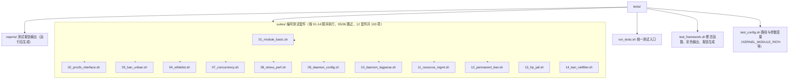

# 测试

本文档介绍 Linux Firewall 项目的测试框架和测试套件。

## 测试架构



> 早期版本按 `tests/{unit,integration,stress}/` 拆分；v1.5 起重构为
> 编号套件 + 共享框架，消除大量重复代码。

## 单元测试（Rust）

守护进程（v2.2.0 起）翻译为 Rust，单元测试用 `cargo test` 跑：

```bash
# 跑全部单元测试 + doctest
cargo test

# 仅 doctest
cargo test --doc

# 跑特定模块
cargo test config::
```

当前统计：**108 个单元测试 + 1 个 doctest**（doctest 真实执行，
不是 `no_run`）。

`cargo test` 跑守护进程内 `#[cfg(test)]` 模块；与 `tests/run_tests.sh`
的 13 套件集成测试是互补关系——单元测试在源码层验证逻辑，
集成测试在 shell 端验证端到端行为。

## 集成测试

### 运行测试

```bash
# 编译后运行全部套件
make test
# 实际命令：sudo ./tests/run_tests.sh
```

```bash
# 直接调用 run_tests.sh
./tests/run_tests.sh                    # 运行所有套件
./tests/run_tests.sh --suite 03         # 仅运行 03_ban_unban
./tests/run_tests.sh --category security   # 按类别过滤
./tests/run_tests.sh --report           # 生成报告到 tests/reports/
./tests/run_tests.sh --help             # 查看帮助
```

测试入口是 `tests/run_tests.sh`，统一调度 `suites/` 下编号套件。
当前 12 套件共 **103 项**断言。

### 在 sudo 下运行

`make test` 内部走 `sudo ./tests/run_tests.sh`，但 `make daemon` 在
`run_tests.sh` 入口**自动**做了 cargo 路径修复：

```bash
# tests/run_tests.sh 内部（行 ~134-139）
if [[ -f "$HOME/.cargo/env" ]]; then
    source "$HOME/.cargo/env"
fi
export PATH="$HOME/.cargo/bin:$PATH"
```

这是因为 `sudo` 默认 `secure_path` 不含 `~/.cargo/bin`
（rustup 用户级安装的默认位置），直接 `sudo make daemon` 会
失败：

```
sudo make daemon
make: cargo: 没有那个文件或目录
make: *** [Makefile:101: daemon] 错误 127
```

走 `make test` 不会遇到；但若手动 `sudo ./tests/run_tests.sh` 时
同样缺 cargo，提示 `make: cargo: 没有那个文件或目录`，先
`source ~/.cargo/env` 再 sudo 即可。

### 过滤器与输出

| 参数 | 用途 |
|------|------|
| `--suite NN` | 只跑编号 NN 的套件（`01`..`15`） |
| `--category X` | 按类别过滤（`security` / `performance` / `daemon` / `module`） |
| `--report` | 生成 Markdown 报告到 `tests/reports/` |
| `--parallel` | 并行执行（默认串行，避免共享状态竞争） |
| `--help` | 显示完整帮助 |

每条用例都会打印 pass / fail / warn 标记，套件结束后汇总：

```
Suite 03_ban_unban: passed 12, failed 0, warned 0, skipped 0
Suite 09_daemon_config: passed 8, failed 0, warned 0, skipped 0
...

Total: passed 113, failed 0, warned 2, skipped 0
```

加 `--report` 会写入 `tests/reports/<时间戳>.md`，包含每条断言
的通过/失败/输出/耗时，CI 上传为 artifact。

## 测试套件

| 编号 | 文件 | 覆盖范围 |
|------|------|----------|
| 01 | `01_module_basic.sh` | 模块加载/卸载、带参数加载、sysfs 参数可读 |
| 02 | `02_procfs_interface.sh` | `/proc/firewall/{bans,whitelist,config,stats}` 读写 |
| 03 | `03_ban_unban.sh` | 封禁、解封、临时/永久封禁、过期清理 |
| 04 | `04_whitelist.sh` | 白名单精确匹配、CIDR 子网匹配、容量上限 |
| 07 | `07_concurrency.sh` | 多进程并发读写、RCU 正确性 |
| 08 | `08_stress_perf.sh` | 4096 容量满表操作、延迟统计 |
| 09 | `09_daemon_config.sh` | YAML 配置加载、严格模式校验、jail 解析 |
| 10 | `10_daemon_logparse.sh` | 日志监听（inotify）、正则匹配、jail 触发 |
| 11 | `11_resource_mgmt.sh` | 内存、句柄、procfs 资源生命周期 |
| 12 | `12_permanent_ban.sh` | 永久封禁（内存中） |
| 13 | `13_frp_jail.sh` | FRP（Fail2ban-Recover-Pattern）jail 配置加载与触发 |
| 14 | `14_ban_netfilter.sh` | 黑名单 netfilter 链表条目格式与功能（真实可路由 IP） |
| 15 | `15_daemon_logfile.sh` | 守护进程独立日志系统（`log_file` / `log_destination` / `log_format` / `log_level`） |

> 编号不连续（05、06 缺失）：原对应旧测试套件，重构时已合并到
> 现有套件中。当前 13 套件共 **115 项**集成测试。

## 框架断言

测试用 `tests/test_framework.sh` 提供的函数：

| 函数 | 用途 |
|------|------|
| `fw_test_header` | 打印套件标题 |
| `fw_subsection` | 打印子节标题 |
| `fw_pass` / `fw_fail` | 单条用例通过/失败 |
| `assert_success <cmd> <msg>` | 断言命令退出码 0 |
| `assert_true <expr> <msg>` | 断言表达式为真 |
| `assert_file_exists <path>` | 断言文件存在 |
| `assert_dir_exists <path>` | 断言目录存在 |
| `warn_test <msg>` | 软警告（不计入失败） |

## 内核模块测试约束

部分套件需要内核模块可加载。GitHub Actions Azure VM 的内核与
host headers 常不匹配，模块加载会失败但不影响功能测试——runner
会自动跳过（详见 [ci.yml](../../../../.github/workflows/ci.yml)）。

## 内存安全检测（ASAN / Miri）

守护进程（Rust）含 20 处 `unsafe { }` 块，全部位于
`src/daemon/{ban,log,file_monitor,main}.rs`，每处都有 `// SAFETY:`
注释说明不变量与理由。以下检测工具可手动运行（CI 当前未集成）：

### AddressSanitizer

`make asan` 走 `[profile.asan]`（需 nightly toolchain）：

```bash
# 一次性安装 nightly（如未装）
rustup install nightly

# 编译 + 运行
make asan
sudo ./build/daemon/firewall-daemon-asan
```

ASan 输出任何 `ERROR:` 行即视为内存缺陷。`build/daemon/firewall-daemon-asan`
为 `make asan` 复制后的产物（保留 ASAN 运行时，体积比 release 大）。

### Valgrind

适用于二进制不变、只换分析器的场景（如对比 baseline）：

```bash
cargo build --profile dev-with-debug   # 32MB 含 DWARF
sudo valgrind --leak-check=full --show-leak-kinds=all \
    ./target/dev-with-debug/firewall-daemon -c config/default.yaml
```

> `dev-with-debug` profile 适合 Valgrind / `addr2line` / `perf`，
> 保留全部符号但优化与 release 相同。

### Miri（UB 检测）

Rust 解释器，可检测未定义行为（指针别名、对齐违规等）：

```bash
cargo +nightly miri test
```

Miri 解释执行，无需重建 std。CI 上以 nightly opt-in 跑（与 ASAN 共用
nightly toolchain）。

### Unsafe 块清单

`grep -rn "unsafe {" src/daemon/` 可列出全部 20 处，每处紧邻
`// SAFETY:` 注释说明不变量。新增 unsafe 必须**同时**补全
`// SAFETY:` 注释，否则 `cargo clippy` lint（仓库已配
`clippy.toml` 收紧规则）会拒绝合入。

## 编写新套件

新测试应放在 `tests/suites/`，文件名格式 `NN_description.sh`（NN 为
下一个可用编号）。每个套件 `source` 框架与配置后即可使用断言函数：

```bash
#!/bin/bash
# 13_my_feature.sh - 新功能测试

source ../test_framework.sh
source ../test_config.sh

fw_test_header "新功能测试"

fw_subsection "基本行为"
assert_true "[[ 1 -eq 1 ]]" "基本等式成立"

fw_subsection "边界条件"
assert_true "[[ -n \"$KERNEL_MODULE_PATH\" ]]" "KERNEL_MODULE_PATH 已设置"
```

## CI 集成

`.github/workflows/ci.yml` 共 **3 个 job**，全部通过才允许合入：

| Job | 检查项 | 失败处理 |
|-----|--------|----------|
| `lint` | rustfmt + clippy（`--all-targets --all-features`）+ yamllint + 内核模块 clang-format | 不通过则阻断 merge |
| `build` | 内核模块（`make kernel-module`）+ 守护进程（`make daemon`） | 编译失败阻断 merge |
| `test` | `sudo ./tests/run_tests.sh --report`，当前 **115 项**断言 | 任何 fail 阻断 merge |

测试编排细节（`test` job）：

1. 复用 `build` job 编译产物（`build/kernel-module/firewall.ko` + `build/daemon/firewall-daemon`）
2. 在 runner 上 `sudo ./tests/run_tests.sh --report`
3. 若内核模块不可加载（Azure VM 环境限制），自动跳过需要模块的套件
4. 报告上传为 artifact，保留 14 天

> `lint` 失败通常意味着 `// SAFETY:` 注释缺失 / 格式漂移
> / `unsafe` 块未论证。修复后重跑即可。
