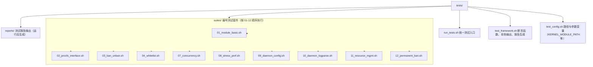

# 测试

本文档介绍 Linux Firewall 项目的测试框架和测试套件。

## 测试架构



> 早期版本按 `tests/{unit,integration,stress}/` 拆分；v1.5 起重构为
> 编号套件 + 共享框架，消除大量重复代码。

## 运行测试

```bash
# 编译后运行全部套件
make test
# 实际命令：sudo ./tests/run_tests.sh
```

```bash
# 直接调用 run_tests.sh
./tests/run_tests.sh                    # 运行所有套件
./tests/run_tests.sh --suite 03         # 仅运行 03_ban_unban
./tests/run_tests.sh --category security   # 按类别过滤
./tests/run_tests.sh --report           # 生成报告到 tests/reports/
./tests/run_tests.sh --help             # 查看帮助
```

## 测试套件

| 编号 | 文件 | 覆盖范围 |
|------|------|----------|
| 01 | `01_module_basic.sh` | 模块加载/卸载、带参数加载、sysfs 参数可读 |
| 02 | `02_procfs_interface.sh` | `/proc/firewall/{bans,whitelist,config,stats}` 读写 |
| 03 | `03_ban_unban.sh` | 封禁、解封、临时/永久封禁、过期清理 |
| 04 | `04_whitelist.sh` | 白名单精确匹配、CIDR 子网匹配、容量上限 |
| 07 | `07_concurrency.sh` | 多进程并发读写、RCU 正确性 |
| 08 | `08_stress_perf.sh` | 4096 容量满表操作、延迟统计 |
| 09 | `09_daemon_config.sh` | YAML 配置加载、严格模式校验、jail 解析 |
| 10 | `10_daemon_logparse.sh` | 日志监听（inotify）、PCRE2 匹配、jail 触发 |
| 11 | `11_resource_mgmt.sh` | 内存、句柄、procfs 资源生命周期 |
| 12 | `12_permanent_ban.sh` | SQLite 永久封禁、跨重启恢复 |

> 编号不连续（05、06 缺失）：原对应旧测试套件，重构时已合并到
> 现有套件中。

## 框架断言

测试用 `tests/test_framework.sh` 提供的函数：

| 函数 | 用途 |
|------|------|
| `fw_test_header` | 打印套件标题 |
| `fw_subsection` | 打印子节标题 |
| `fw_pass` / `fw_fail` | 单条用例通过/失败 |
| `assert_success <cmd> <msg>` | 断言命令退出码 0 |
| `assert_true <expr> <msg>` | 断言表达式为真 |
| `assert_file_exists <path>` | 断言文件存在 |
| `assert_dir_exists <path>` | 断言目录存在 |
| `warn_test <msg>` | 软警告（不计入失败） |

## 内核模块测试约束

部分套件需要内核模块可加载。GitHub Actions Azure VM 的内核与
host headers 常不匹配，模块加载会失败但不影响功能测试——runner
会自动跳过（详见 [ci.yml](../../../../.github/workflows/ci.yml)）。

## 内存检测

### Valgrind

```bash
make daemon CFLAGS="-g -O0"
sudo valgrind --leak-check=full --show-leak-kinds=all \
    ./firewall-daemon -c config/default.yaml
```

### AddressSanitizer

```bash
make asan
sudo ./build/daemon/firewall-daemon-asan
```

ASan 输出任何 `ERROR:` 行即视为内存缺陷。

## 编写新套件

新测试应放在 `tests/suites/`，文件名格式 `NN_description.sh`（NN 为
下一个可用编号）。每个套件 `source` 框架与配置后即可使用断言函数：

```bash
#!/bin/bash
# 13_my_feature.sh - 新功能测试

source ../test_framework.sh
source ../test_config.sh

fw_test_header "新功能测试"

fw_subsection "基本行为"
assert_true "[[ 1 -eq 1 ]]" "基本等式成立"

fw_subsection "边界条件"
assert_true "[[ -n \"$KERNEL_MODULE_PATH\" ]]" "KERNEL_MODULE_PATH 已设置"
```

## CI 集成

测试由 `.github/workflows/ci.yml` 的 `test` job 编排：

1. 复用 `build` job 编译产物
2. 在 runner 上 `sudo ./tests/run_tests.sh --report`
3. 若内核模块不可加载（Azure VM 环境限制），自动跳过需要模块的套件
4. 报告上传为 artifact
