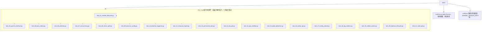

# 测试

本文档介绍 Linux Firewall 项目的测试框架和测试套件。

## 测试架构


```mermaid
graph TD
    ROOT["tests/"]
    CONF["conftest.py pytest fixtures、辅助函数、测试隔离"]
    CFG["config.py 路径与参数变量（KERNEL_MODULE_PATH 等）"]

    subgraph SUITES["test_*.py 编号测试套件（按编号顺序执行，个别编号跳过）"]
        S01["test_01_module_lifecycle.py"]
        S02["test_02_procfs_interface.py"]
        S03["test_03_ban_unban.py"]
        S04["test_04_whitelist.py"]
        S07["test_07_concurrency.py"]
        S08["test_08_stress_perf.py"]
        S09["test_09_daemon_config.py"]
        S10["test_10_daemon_logparse.py"]
        S11["test_11_resource_mgmt.py"]
        S12["test_12_permanent_ban.py"]
        S13["test_13_frp_jail.py"]
        S14["test_14_ban_netfilter.py"]
        S15["test_15_ddos_detection.py"]
        S16["test_16_webui_api.py"]
        S17["test_17_config_reload.py"]
        S18["test_18_log_rotation.py"]
        S19["test_19_netlink_comm.py"]
        S20["test_20_daemon_lifecycle.py"]
        S21["test_21_multi_jail.py"]
    end

    ROOT --> CONF
    ROOT --> CFG
    ROOT --> SUITES
    SUITES --> S01
    SUITES --> S02
    SUITES --> S03
    SUITES --> S04
    SUITES --> S07
    SUITES --> S08
    SUITES --> S09
    SUITES --> S10
    SUITES --> S11
    SUITES --> S12
```

> 早期版本按 `tests/{unit,integration,stress}/` 拆分；v1.5 起重构为
> 编号套件 + 共享 Bash 框架；v2.x 起迁移至 Python pytest，
> 消除大量重复代码并获得更好的断言、报告和过滤能力。

## 单元测试（Rust）

守护进程（v2.2.0 起）翻译为 Rust，单元测试用 `cargo test` 跑：

```bash
# 跑全部单元测试 + doctest
cargo test

# 仅 doctest
cargo test --doc

# 跑特定模块
cargo test config::
```

单元测试与 doctest 均真实执行（doctest 不是 `no_run`）；用例数以
`cargo test` 实时输出为准。

`cargo test` 跑守护进程内 `#[cfg(test)]` 模块；与 `tests/` 下的 pytest
集成测试是互补关系——单元测试在源码层验证逻辑，集成测试在 Python 端
验证端到端行为。

## 集成测试

### 运行测试

```bash
# 编译后运行全部套件
make test
# 实际命令：sudo python3 -m pytest tests/ -v
```

```bash
# 直接调用 pytest
sudo python3 -m pytest tests/ -v                    # 运行所有套件
sudo python3 -m pytest tests/test_03_ban_unban.py -v  # 仅运行 test_03_ban_unban
sudo python3 -m pytest tests/ -k "daemon" -v        # 按关键字过滤（匹配函数名/类名）
sudo python3 -m pytest tests/ --tb=short            # 简短回溯输出
sudo python3 -m pytest tests/ --html=report.html    # 生成 HTML 报告（需 pytest-html 插件）
sudo python3 -m pytest tests/ --collect-only        # 仅列出所有测试，不执行
```

测试框架是 Python pytest，入口为 `tests/conftest.py`（fixtures 与辅助函数）
和 `tests/config.py`（路径与参数配置）。

### 在 sudo 下运行

`make test` 内部走 `sudo python3 -m pytest tests/ -v`。测试需要 root
权限操作内核模块（insmod/rmmod）和 procfs 写入。

`sudo` 默认 `secure_path` 不含 `~/.cargo/bin`（rustup 用户级安装的
默认位置），直接 `sudo make daemon` 会失败：

```
sudo make daemon
make: cargo: 没有那个文件或目录
make: *** [Makefile:101: daemon] 错误 127
```

走 `make test` 不会遇到；但若手动 `sudo python3 -m pytest tests/ -v` 时
同样缺 cargo，提示 `make: cargo: 没有那个文件或目录`，先
`source ~/.cargo/env` 再 sudo 即可。

### 过滤器与输出

| 参数 | 用途 |
|------|------|
| `tests/test_03_ban_unban.py` | 只运行指定测试文件 |
| `-k "关键字"` | 按关键字过滤（匹配函数名、类名），如 `-k "daemon"` |
| `-m "标记"` | 按 pytest 标记过滤（如自定义标记） |
| `--tb=short` | 简短回溯输出 |
| `--html=report.html` | 生成 HTML 报告（需 `pip install pytest-html`） |
| `--collect-only` | 仅列出所有测试，不执行 |
| `-x` | 遇到第一个失败即停止 |
| `-v` | 详细输出（显示每个测试名称） |

pytest 输出示例：

```
tests/test_03_ban_unban.py::TestBanUnban::test_basic_ban PASSED
tests/test_03_ban_unban.py::TestBanUnban::test_unban PASSED
tests/test_09_daemon_config.py::TestDaemonConfig::test_yaml_load PASSED
...

========================= all passed in 45.32s =========================
```

加 `--html=report.html` 会生成包含每条测试通过/失败/输出/耗时的
HTML 报告，CI 上传为 artifact。

## 测试套件

| 编号 | 文件 | 覆盖范围 |
|------|------|----------|
| 01 | `test_01_module_lifecycle.py` | 模块加载/卸载、带参数加载、sysfs 参数可读 |
| 02 | `test_02_procfs_interface.py` | `/proc/firewall/{bans,whitelist,config,stats}` 读写 |
| 03 | `test_03_ban_unban.py` | 封禁、解封、临时/永久封禁、过期清理 |
| 04 | `test_04_whitelist.py` | 白名单精确匹配、CIDR 子网匹配、容量上限 |
| 07 | `test_07_concurrency.py` | 多进程并发读写、RCU 正确性 |
| 08 | `test_08_stress_perf.py` | 满表操作、延迟统计 |
| 09 | `test_09_daemon_config.py` | YAML 配置加载、严格模式校验、jail 解析 |
| 10 | `test_10_daemon_logparse.py` | 日志监听（inotify）、正则匹配、jail 触发 |
| 11 | `test_11_resource_mgmt.py` | 内存、句柄、procfs 资源生命周期 |
| 12 | `test_12_permanent_ban.py` | 永久封禁（内存中） |
| 13 | `test_13_frp_jail.py` | FRP（Fail2ban-Recover-Pattern）jail 配置加载与触发 |
| 14 | `test_14_ban_netfilter.py` | 黑名单 netfilter 链表条目格式与功能（真实可路由 IP） |
| 15 | `test_15_ddos_detection.py` | DDoS 检测（PPS/BPS/SYN/UDP/ICMP 速率违规） |
| 16 | `test_16_webui_api.py` | Web UI API 端点测试 |
| 17 | `test_17_config_reload.py` | 配置热重载（SIGHUP） |
| 18 | `test_18_log_rotation.py` | 日志轮转检测（inotify + inode 重连） |
| 19 | `test_19_netlink_comm.py` | Netlink 内核↔守护进程通信 |
| 20 | `test_20_daemon_lifecycle.py` | 守护进程启动/停止/重启生命周期 |
| 21 | `test_21_multi_jail.py` | 多 jail 并发、独立日志、隔离性 |

> 编号不连续（05、06 缺失）：原对应旧测试套件，重构时已合并到
> 现有套件中。

## 框架辅助函数

测试用 `tests/conftest.py` 提供的 fixtures 和辅助函数：

| 函数 / Fixture | 用途 |
|------|------|
| `ban_ip(ip)` | 封禁 IP |
| `ban_ip_with_time(ip, seconds)` | 封禁 IP 带时长 |
| `ban_ip_permanent(ip)` | 永久封禁 IP |
| `unban_ip(ip)` | 解封 IP |
| `ip_is_banned(ip)` | 检查 IP 是否在封禁列表中 |
| `whitelist_add(subnet)` | 添加白名单 |
| `whitelist_remove(subnet)` | 移除白名单 |
| `get_stat(name)` | 获取 procfs 统计值 |
| `count_bans()` | 获取封禁列表行数 |
| `count_whitelist()` | 获取白名单行数 |
| `reset_all_data()` | 重置所有测试数据 |
| `load_module()` / `unload_module()` | 加载/卸载内核模块 |
| `session_setup` (fixture) | 会话级设置：确保模块加载 |
| `test_isolation` (fixture) | 每个测试前后的数据隔离 |
| `clean_bans` (fixture) | 确保封禁列表为空 |
| `daemon_binary` (fixture) | 确保守护进程二进制存在 |
| `tmp_config` (fixture) | 创建临时配置目录 |

## 内核模块测试约束

部分套件需要内核模块可加载。GitHub Actions Azure VM 的内核与
host headers 常不匹配，模块加载会失败但不影响功能测试——runner
会自动跳过（详见 [ci.yml](../../../../.github/workflows/ci.yml)）。

## 内存安全检测（ASAN / Miri）

守护进程（Rust）的 `unsafe { }` 块集中在内核传输、信号、
守护进程化、线格式指针、syslog、IP 工具、inotify/poll 等处，
每处都有 `// SAFETY:` 注释说明不变量与理由（清单见
`grep -rn 'unsafe {' src/daemon/`）。以下检测工具可手动运行（CI 当前未集成）：

### AddressSanitizer

`make asan` 走 `[profile.asan]`（需 nightly toolchain）：

```bash
# 一次性安装 nightly（如未装）
rustup install nightly

# 编译 + 运行
make asan
sudo ./build/daemon/firewall-daemon-asan
```

ASan 输出任何 `ERROR:` 行即视为内存缺陷。`build/daemon/firewall-daemon-asan`
为 `make asan` 复制后的产物（保留 ASAN 运行时，体积比 release 大）。

### Valgrind

适用于二进制不变、只换分析器的场景（如对比 baseline）：

```bash
cargo build --profile dev-with-debug   # 含 DWARF
sudo valgrind --leak-check=full --show-leak-kinds=all \
    ./target/dev-with-debug/firewall-daemon -c config/default.yaml
```

> `dev-with-debug` profile 适合 Valgrind / `addr2line` / `perf`，
> 保留全部符号但优化与 release 相同。

### Miri（UB 检测）

Rust 解释器，可检测未定义行为（指针别名、对齐违规等）：

```bash
cargo +nightly miri test
```

Miri 解释执行，无需重建 std。

### Unsafe 块清单

`grep -rn "unsafe {" src/daemon/` 可列出全部 `unsafe` 块，每处紧邻
`// SAFETY:` 注释说明不变量。新增 unsafe 必须**同时**补全
`// SAFETY:` 注释，否则 `cargo clippy` lint（仓库已配
`clippy.toml` 收紧规则）会拒绝合入。

## 编写新测试

新测试应放在 `tests/` 目录，文件名格式 `test_NN_description.py`（NN 为
下一个可用编号）。使用 conftest.py 提供的 fixtures 和辅助函数：

```python
# test_22_my_feature.py - 新功能测试

from .conftest import ban_ip, ban_ip_with_time, unban_ip, ip_is_banned, get_stat


class TestMyFeature:
    """新功能测试"""

    def test_basic_behavior(self, clean_bans):
        """基本行为"""
        ban_ip("203.0.113.1")
        assert ip_is_banned("203.0.113.1")

    def test_boundary_condition(self, clean_bans):
        """边界条件"""
        ban_ip_with_time("203.0.113.2", 1)
        assert ip_is_banned("203.0.113.2")
```

## 浏览器端到端测试（E2E）

浏览器测试跑在真实守护进程的 Web UI 上（Playwright + Chromium），只做三类硬断言：

- **全量 hash 路由**：逐一访问每个页面路径，断言区块标题与顶栏标题；
- **写操作回环**：走通「封禁 → 解封」，界面 / 接口 / 内核三层状态同步翻转；
- **控制台洁净度**：整个用例期间无 `console.error` / `console.warn` / 未捕获异常。

用例与断言锚点全部在 `tests/e2e/`（`support.ts` 是共享夹具与鉴权，其余是用例）；
新增用例默认继承夹具里的控制台洁净度门槛，不需要各自重复断言。

`pwa-context.spec.ts` 另做一对**对照**：安全上下文（localhost）下 Service Worker 可注册，
非安全上下文（局域网 IP）下该 API 不存在但界面照常工作。后者由
`E2E_LAN_ORIGIN=http://<局域网IP>:<port>` 开启，不设置则显式跳过（CI 即如此）；
观察结果见 [Web 前端](../architecture/frontend.md) 的「验收记录：安全上下文边界」。

前置条件是**加载了内核模块的守护进程**：`main.rs` 启动即要求 `/proc/firewall` 存在，
且内核把单守护进程实现为 portid 独占 + 30 秒活动超时、无注销消息，因此整条夹具
（insmod → 生成临时配置 → 起守护进程 → 等 `/health` 就绪 → 收尾 rmmod）独立为
`scripts/e2e-daemon.sh`，本地与 CI 共用同一份逻辑：

```bash
# 1) 起夹具（需要 root）：insmod + 起守护进程 + 等 /health 就绪；同时打印连接参数
sudo bash scripts/e2e-daemon.sh start

# 2) 用夹具给出的参数跑用例（env 子命令纯打印，不需要 root）
eval "$(bash scripts/e2e-daemon.sh env)"
npm run test:e2e

# 3) 收尾：停守护进程并卸载模块，释放内核的 portid 租约（否则下次启动会被拒）
sudo bash scripts/e2e-daemon.sh stop
```

`scripts/e2e-daemon.sh probe` 只探测内核模块能否加载、不启动任何进程，供 CI 判定
本机是否具备运行条件。

## CI 集成

`.github/workflows/ci.yml` 的 job 全部通过才允许合入：

| Job | 检查项 | 失败处理 |
|-----|--------|----------|
| `lint` | rustfmt + clippy（`--all-targets --all-features`）+ yamllint + 内核模块 clang-format | 不通过则阻断 merge |
| `frontend` | 前端类型检查（`tsc --noEmit`）+ vite 构建 + 构建产物 / PWA 清单 / Service Worker 校验 | 不通过则阻断 merge |
| `build` | 内核模块（`make kernel-module`）+ 守护进程（`make daemon`） | 编译失败阻断 merge |
| `e2e` | 浏览器端到端（Playwright）：`scripts/e2e-daemon.sh` 起守护进程后 `npm run test:e2e` | 用例 fail 阻断 merge；本机内核不可加载时整段带注解跳过（同 `test` job 的约定） |
| `test` | `sudo python3 -m pytest tests/ -v` | 任何 fail 阻断 merge |

测试编排细节（`test` job）：

1. 复用 `build` job 编译产物（`build/kernel-module/firewall.ko` + `build/daemon/firewall-daemon`）
2. 在 runner 上 `sudo python3 -m pytest tests/ -v`
3. 若内核模块不可加载（Azure VM 环境限制），conftest.py 的 `session_setup` fixture 自动跳过需要模块的测试
4. 报告上传为 artifact，保留 14 天

`e2e` job 与 `test` job 同源：复用 `build` 的编译产物，先用 `scripts/e2e-daemon.sh probe`
判定本机能否加载内核模块，能则起守护进程并跑 Playwright（失败即阻断 merge），
不能则带 `::warning::` 注解跳过浏览器用例（环境限制，非代码问题）。
夹具与判定逻辑见上一节，不在 CI 里另写一份。

> `lint` 失败通常意味着 `// SAFETY:` 注释缺失 / 格式漂移
> / `unsafe` 块未论证。修复后重跑即可。
