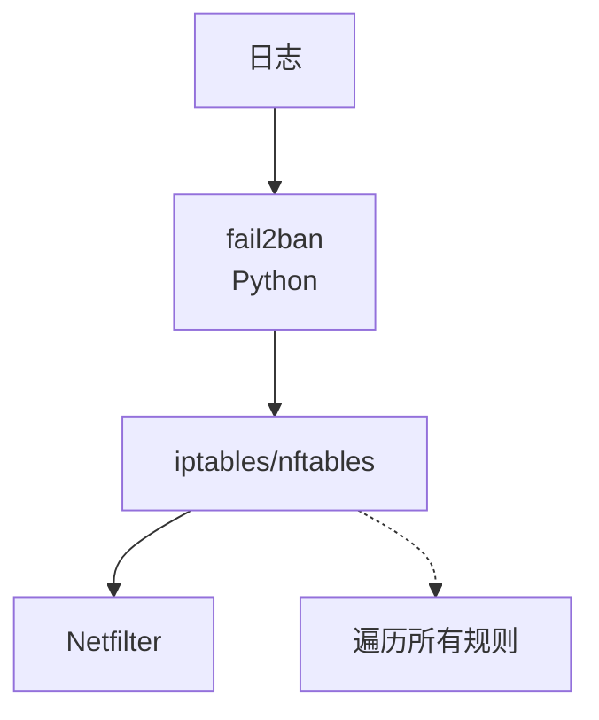

# 从 fail2ban 迁移

本文档指导如何将现有 fail2ban 配置迁移到 Linux Firewall 内核模块。

## 对比概览

| 特性 | fail2ban | Linux Firewall |
|------|----------|----------------|
| 封禁方式 | iptables/nftables 规则 | Netfilter Hook 内核拦截 |
| 性能 | 规则越多越慢 | O(1) 哈希查找，恒定性能 |
| 正则引擎 | Python re | Rust regex |
| 配置文件 | INI 格式 | YAML 格式 |
| 持久化 | 无（纯内存） | 无（纯内存） |
| 监控 | 无内置 | Prometheus 指标 |
| 语言 | Python | Rust（用户态）+ C（内核模块） |

## 架构差异

### fail2ban 架构



### Linux Firewall 架构

```mermaid
graph TB
    A[日志] --> B[firewall-daemon<br/>C]
    B --> C[/proc/firewall]
    C --> D[Netfilter Hook]
    C -.-> E[O(1) 哈希查找]
```

## 配置映射

### Jail 配置对照

| fail2ban (jail.local) | Linux Firewall (default.yaml) |
|----------------------|-------------------------------|
| `[sshd]` | `sshd:` (jail 键名) |
| `enabled = true` | `enabled: true` |
| `filter = sshd` | `regexes:\n  failed_password:\n    pattern: '...'` |
| `logpath = /var/log/auth.log` | `log_files:\n  - /var/log/auth.log` |
| `maxretry = 5` | `max_retries: 5` |
| `findtime = 600` | `findtime: 600` |
| `bantime = 3600` | `ban_time: 3600` |
| `port = ssh` | 不需要（通过正则提取 IP） |
| `protocol = tcp` | 不需要（通过正则提取 IP） |

### 过滤器配置对照

| fail2ban (filter.d/sshd.conf) | Linux Firewall |
|-------------------------------|----------------|
| `failregex = ^%(__prefix_line)sFailed password...` | `pattern: 'Failed password for .* from ([0-9]{1,3}\\...)'` |
| `<HOST>` 自动匹配 | 直接使用捕获组 `()` 提取 IP |
| `ignoreregex` | 在守护进程中处理（不匹配的正则忽略） |

## 迁移步骤

### 1. 备份现有配置

```bash
# 备份 fail2ban 配置
sudo cp -r /etc/fail2ban /etc/fail2ban.backup

# 导出当前封禁列表
sudo fail2ban-client status | grep "IP list" > /tmp/f2b-banned.txt
```

### 2. 安装 Linux Firewall

```bash
git clone https://github.com/SnowCore8/linux-firewall-kmod.git
cd linux-firewall-kmod
make
sudo make install
```

### 3. 转换配置文件

#### 原始 fail2ban 配置

```ini
# /etc/fail2ban/jail.local

[DEFAULT]
bantime = 3600
findtime = 600
maxretry = 5
ignoreip = 127.0.0.1/8 192.168.1.0/24

[sshd]
enabled = true
port = ssh
filter = sshd
logpath = /var/log/auth.log
maxretry = 3

[nginx-http-auth]
enabled = true
port = http,https
filter = nginx-http-auth
logpath = /var/log/nginx/error.log
maxretry = 5
```

#### 转换后的 Linux Firewall 配置

```yaml
# /etc/firewall/default.yaml

defaults:
  max_retries: 5
  findtime: 600
  ban_time: 900
  interval: 1
  metrics_port: 9119

whitelist:
  - 127.0.0.1/8
  - 192.168.1.0/24

jails:
  sshd:
    enabled: true
    log_files:
      - /var/log/auth.log
    max_retries: 3
    findtime: 600
    ban_time: 3600
    regexes:
      failed_password:
        pattern: "Failed password for (?:invalid user )?.+ from ([0-9]{1,3}\\.[0-9]{1,3}\\.[0-9]{1,3}\\.[0-9]{1,3})"

  nginx-http-auth:
    enabled: true
    log_files:
      - /var/log/nginx/error.log
    max_retries: 5
    findtime: 600
    ban_time: 3600
    regexes:
      no_auth:
        pattern: "no user/password was provided for basic authentication.*client: ([0-9]{1,3}\\.[0-9]{1,3}\\.[0-9]{1,3}\\.[0-9]{1,3})"
```

### 4. 转换过滤器

#### fail2ban 过滤器

```ini
# /etc/fail2ban/filter.d/sshd.conf

[Definition]
failregex = ^%(__prefix_line)sFailed password for (?:illegal user )?\S+ from <HOST> port \d+ ssh2$
            ^%(__prefix_line)sFailed password for <HOST>
```

#### Linux Firewall 正则

```yaml
regexes:
  failed_password:
    pattern: "Failed password for (?:illegal user )?\\S+ from ([0-9]{1,3}\\.[0-9]{1,3}\\.[0-9]{1,3}\\.[0-9]{1,3})"
```

> **注意**：移除 fail2ban 特有的 `%(__prefix_line)s` 前缀，简化正则。
> 当前版本不再使用 `<HOST>` 占位符，直接编写完整正则表达式。

### 5. 迁移白名单

```bash
# 从 fail2ban 提取白名单
grep -oP 'ignoreip\s*=\s*\K.*' /etc/fail2ban/jail.local | \
    tr ' ' '\n' | \
    sed 's/^/  - /' >> /etc/firewall/default.yaml
```

### 6. 恢复封禁状态（可选）

```bash
# 从 fail2ban 导出封禁 IP
sudo fail2ban-client status sshd | \
    grep -oP '\d+\.\d+\.\d+\.\d+' | \
    while read ip; do
        echo "$ip 3600" | sudo tee /proc/firewall/bans >/dev/null
    done
```

### 7. 停止 fail2ban

```bash
sudo systemctl stop fail2ban
sudo systemctl disable fail2ban
```

### 8. 启动 Linux Firewall

```bash
sudo modprobe firewall
sudo systemctl enable firewall-daemon
sudo systemctl start firewall-daemon
```

### 9. 验证

```bash
# 检查状态
cat /proc/firewall/config

# 查看封禁列表
cat /proc/firewall/bans

# 测试封禁
echo "1.2.3.4 60" | sudo tee /proc/firewall/bans
cat /proc/firewall/bans
echo "unban 1.2.3.4" | sudo tee /proc/firewall/bans
```

## 已知差异

### 不支持的功能

| fail2ban 功能 | Linux Firewall | 替代方案 |
|--------------|----------------|----------|
| 多 action | 单一封禁 | 通过 Netfilter Hook 实现 |
| mail whois | 无 | 通过 Prometheus + AlertManager |
| DNS 封禁 | 无 | 仅 IP 封禁 |
| banaction 自定义 | 无 | 固定 Netfilter Hook |
| Python action 脚本 | 无 | 仅内核封禁 |

### 行为差异

| 场景 | fail2ban | Linux Firewall |
|------|----------|----------------|
| 永久封禁 | `bantime = -1` | `ban_time: 0` |
| IPv6 支持 | 支持 | 暂不支持 |
| 动态端口 | 支持 | 需显式配置端口 |
| 协议检测 | 自动 | 需显式配置 |

## 回滚方案

如果遇到问题，可以快速回滚到 fail2ban：

```bash
# 停止 Linux Firewall
sudo systemctl stop firewall-daemon
sudo systemctl disable firewall-daemon
sudo rmmod firewall

# 恢复 fail2ban
sudo systemctl enable fail2ban
sudo systemctl start fail2ban

# 恢复配置
sudo rm -rf /etc/fail2ban
sudo mv /etc/fail2ban.backup /etc/fail2ban
sudo systemctl restart fail2ban
```

## 性能对比

### 基准测试

| 指标 | fail2ban | Linux Firewall |
|------|----------|----------------|
| 100 规则延迟 | ~5μs | ~0.15μs |
| 1000 规则延迟 | ~50μs | ~0.15μs |
| CPU 使用率 | 2-5% | <1% |
| 内存使用 | ~50MB | ~10MB |

### 大规模场景

| 场景 | fail2ban | Linux Firewall |
|------|----------|----------------|
| 1000 封禁 IP | 明显变慢 | 无影响 |
| 10000 封禁 IP | 不可用 | 不支持（上限 4096） |

## 常见问题

### Q: 需要同时运行两者吗？

不需要。迁移完成后应停止 fail2ban，避免冲突。

### Q: 可以迁移部分 jail 吗？

可以。可以先迁移部分 jail，验证无误后再迁移全部。

### Q: fail2ban 的数据库可以复用吗？

不能直接复用。封禁记录需要重新触发。

### Q: 如何监控迁移后的效果？

使用 Prometheus 指标对比迁移前后的封禁率和性能。